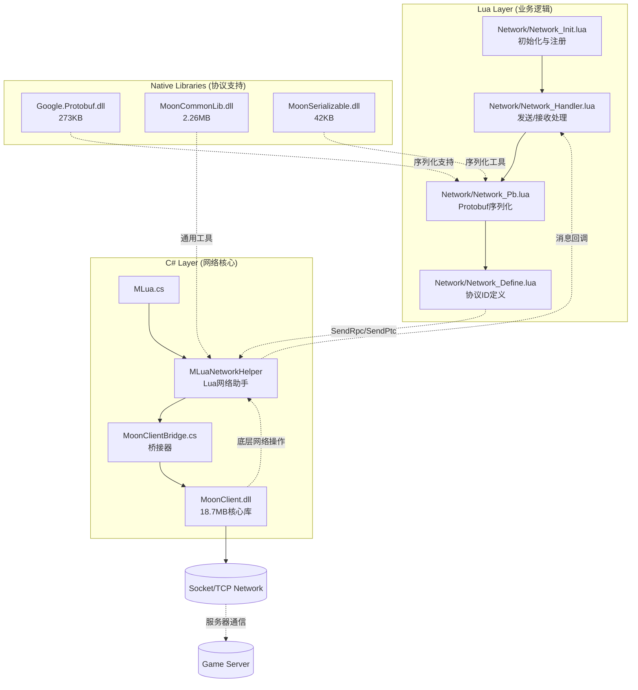
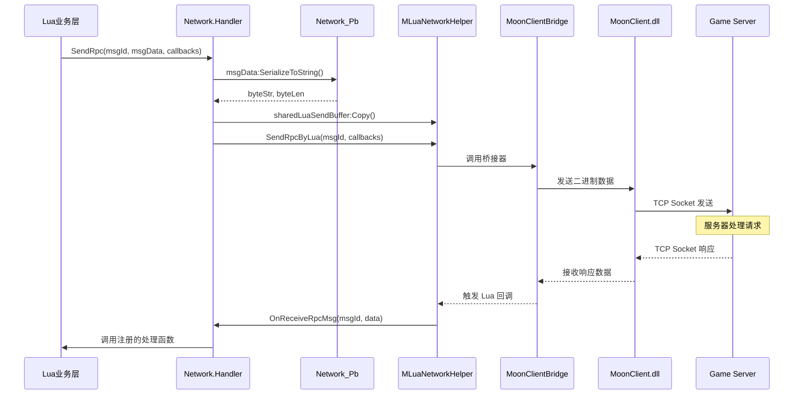
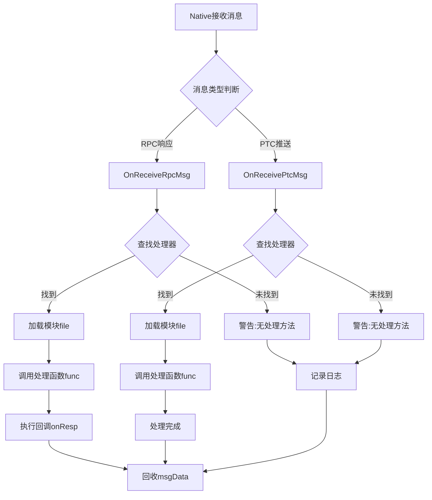
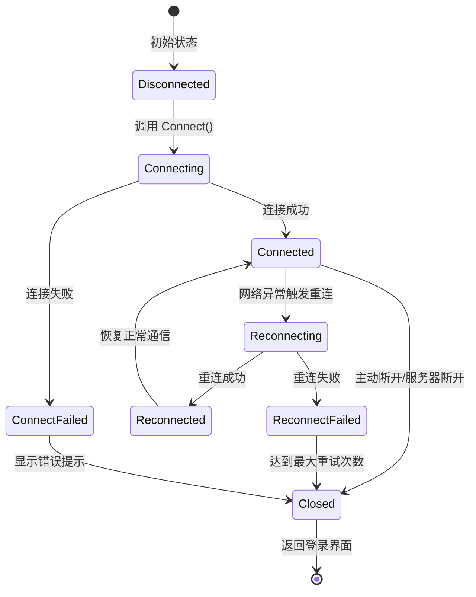
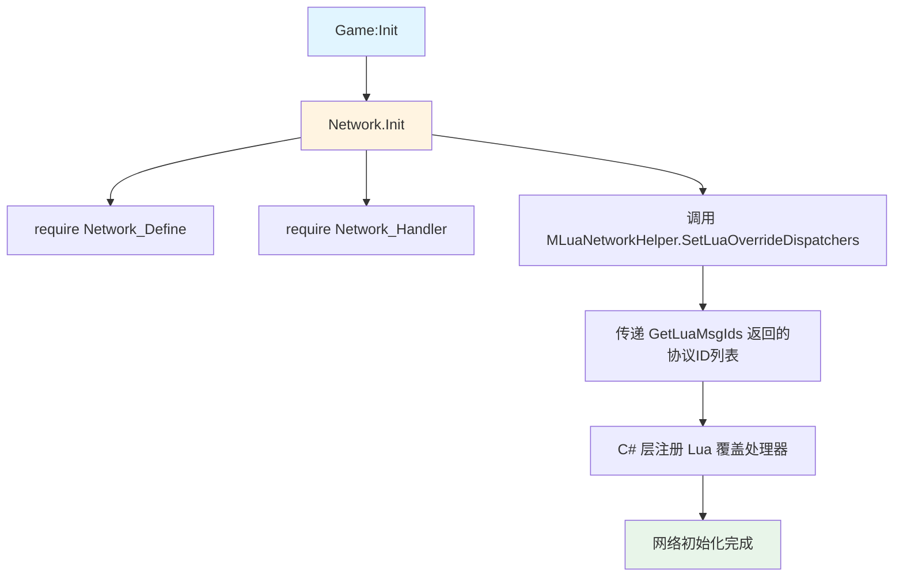

本页文档深入阐述 Unity3D RO 项目的网络层架构设计、消息处理机制以及 Protobuf 协议集成方案，涵盖 C# 与 Lua 混合开发环境下的网络通信实现细节。

## 核心架构概览

网络层采用**分层架构设计**，在 C# 原生层与 Lua 脚本层之间建立高效的通信桥梁。底层依托 MoonClient.dll 提供网络连接与传输能力，上层通过 MLuaNetworkHelper 接口将网络事件分发至 Lua 层处理，形成清晰的职责分离。



### 关键组件说明

**核心库文件**位于 `Plugins/GameLibs/` 目录：

- **MoonClient.dll** (18.7 MB): 主网络通信库，提供 `MNetClient`、`MNetClientBridge` 等核心类，负责 TCP 连接管理、消息收发、重连机制等底层功能
- **MoonCommonLib.dll** (2.26 MB): 通用功能库，包含 `MGameContext`、`MLuaCommonHelper`、`HttpTask` 等辅助类
- **Google.Protobuf.dll** (273 KB): Google Protocol Buffers 的 C# 实现，用于协议的二进制序列化与反序列化
- **SDKLib.dll** (581 KB): SDK 接口库，提供 `EDevicePermissionType`、`EDevicePermissionResult` 等枚举类型

**C# 桥接层**位于 `Scripts/` 目录：

- **MoonClientBridge.cs**: 通过 `MInterfaceMgr` 获取 `IMoonClientBridge` 接口实现，作为 Lua 调用 C# 网络功能的统一入口
- **MLua.cs**: Lua 虚拟机管理器，在初始化时通过 `IMLuaNetworkHelper` 接口获取网络助手实例，并注册 Lua 库

**Lua 网络层**位于 `Scripts/Lua/Network/` 目录，采用模块化设计，各司其职

Sources: [Scripts/Bridge/MoonClientBridge.cs](Scripts/Bridge/MoonClientBridge.cs#L1-L21), [Scripts/LuaEngine/MLua.cs](Scripts/LuaEngine/MLua.cs#L1-L100), [Scripts/Lua/Common/define.lua](Scripts/Lua/Common/define.lua#L1-L198)

## 消息类型与协议定义

项目采用**双向消息机制**，定义了 RPC（请求-响应）和 PTC（推送-通知）两种消息类型，所有协议 ID 使用 32 位整数编码，通过 `Network.Define` 模块集中管理。

### RPC 协议（Request-Response）

RPC 协议用于客户端主动发起请求并等待服务器响应，典型场景包括登录、任务操作、物品使用等。每个 RPC 请求必须指定协议 ID、消息数据，并可配置回调函数处理响应。

**典型 RPC 协议示例**：

| 协议名称 | 协议 ID | 功能描述 | Lua 处理函数 |
|---------|---------|---------|-------------|
| QueryGateIP | 1128914367 | 查询网关服务器 IP | `AuthMgr:OnQueryGateIP` |
| ClientLoginRequest | 1129625954 | 客户端登录请求 | `AuthMgr:OnLoginGateServer` |
| SelectRole | 1129200538 | 选择角色 | `SelectRoleMgr:OnSelectRole` |
| CreateRoleNew | 1129232997 | 创建新角色 | `SelectRoleMgr:OnCreateRoleNew` |
| UseItem | 1128773760 | 使用物品 | C# 默认处理 |
| EquipItem | 1128749880 | 装备物品 | C# 默认处理 |
| TaskAccept | 1128738439 | 接受任务 | C# 默认处理 |
| ChatMsgNtf | 1413693523 | 聊天消息 | C# 默认处理 |

**RPC 注册机制**通过 `Network_Init.lua` 中的 `l_rpcHandlers` 表实现，每个协议可配置：

- `func`: 消息处理函数，接收 Protobuf 反序列化后的数据表
- `override`: 是否覆盖 C# 层默认处理（`true` 为完全接管，`false` 为补充处理）
- `file`: 可选，指定处理函数所在的模块文件（按需加载）

Sources: [Scripts/Lua/Network/Network_Define.lua](Scripts/Lua/Network/Network_Define.lua#L1-L200), [Scripts/Lua/Network/Network_Init.lua](Scripts/Lua/Network/Network_Init.lua#L1-L200)

### PTC 协议（Push-Notification）

PTC 协议用于服务器主动推送消息至客户端，无需客户端请求，典型场景包括聊天消息、属性更新、系统通知等。PTC 消息通常触发游戏状态变更或 UI 更新。

**典型 PTC 协议示例**：

| 协议名称 | 协议 ID | 功能描述 | 推送时机 |
|---------|---------|---------|---------|
| EnterSceneNtf | 1195575234 | 进入场景通知 | 场景切换完成 |
| ChatMsgNtf | 1413693523 | 聊天消息推送 | 接收到其他玩家聊天 |
| ItemChangeNtf | 1195630403 | 物品变更通知 | 背包物品发生变化 |
| LevelChangeNtf | 1195603965 | 等级变更通知 | 角色升级 |
| TaskUpdate | 1195633975 | 任务更新通知 | 任务状态变更 |
| GuildKickOutNotify | 1296286225 | 被踢出公会通知 | 公会成员被踢 |
| RoleDeadNtf | 1195636943 | 角色死亡通知 | 角色血量归零 |

PTC 处理器同样在 `l_ptcHandlers` 表中注册，但无需 `override` 字段，因为 PTC 仅由服务器推送，不存在 C# 默认处理。

Sources: [Scripts/Lua/Network/Network_Define.lua](Scripts/Lua/Network/Network_Define.lua#L600-L700), [Scripts/Lua/Network/Network_Define.lua](Scripts/Lua/Network/Network_Define.lua#L1000-L1126)

## 消息发送与接收流程

### 发送流程

客户端发送消息遵循统一的序列化流程，支持 RPC 和 PTC 两种模式，通过 `MLuaNetworkHelper` 调用底层网络库。



**关键代码实现**：

```lua
-- Network/Network_Handler.lua
function SendRpc(msgId, msgData, customData, onResp, onErr, onTimeout, onSendSuccess)
    local l_byteStr, l_byteLen = nil, 0
    if msgData ~= nil then
        l_byteStr = msgData:SerializeToString()
        l_byteLen = string.len(l_byteStr)
    end
    onErr = onErr or OnReceiveRpcMsgErr
    onTimeout = onTimeout or OnReceiveRpcTimeout

    MLuaNetworkHelper.sharedLuaSendBuffer:Copy(l_byteStr, l_byteLen)
    return MLuaNetworkHelper.SendRpcByLua(msgId,
        function(msgId, receivedMsg, receivedMsgLen)
            OnReceiveRpcMsg(msgId, receivedMsg, receivedMsgLen, msgData, customData, onResp)
            RecycleProtoBuf(msgData)
        end,
        onErr, onTimeout, onSendSuccess)
end
```

**Protobuf 序列化优化**通过 `Network_Pb.lua` 实现对象池机制：

- `GetProtoBufSendTable(msgName)`: 从缓存池获取或创建新的 Protobuf 表对象
- `ParseProtoBufToTable(msgName, datas)`: 反序列化二进制数据为 Lua 表
- `RecycleProtoBuf(msgData)`: 回收已使用的 Protobuf 对象，清空字段并放回缓存池

这种设计显著减少了 GC 压力，特别是在高频消息场景下。

Sources: [Scripts/Lua/Network/Network_Handler.lua](Scripts/Lua/Network/Network_Handler.lua#L1-L50), [Scripts/Lua/Network/Network_Pb.lua](Scripts/Lua/Network/Network_Pb.lua#L1-L62)

### 接收流程

服务器消息到达后，系统根据消息类型自动路由至对应处理器，支持调试日志打印和错误处理。



**RPC 响应处理**：

```lua
function OnReceiveRpcMsg(msgId, receivedMsg, receivedMsgLen, sendArg, customData, onResp)
    receivedMsg = string.sub(receivedMsg, 1, receivedMsgLen)  -- 截取有效长度
    
    if g_Globals.DEBUG_NETWORK then
        MgrMgr:GetMgr("GmMgr").OnTestReceiveRpc(msgId, receivedMsg, receivedMsgLen)
    end
    
    if printRpc then
        for rpc, _msgId in pairs(Network.Define.Rpc) do
            if _msgId == msgId and _msgId ~= Network.Define.Rpc.SyncTime then
                logRed("Received Rpc: {0}", rpc)
            end
        end
    end
    
    local l_handler = RpcHandlers[msgId]
    if l_handler then
        if l_handler.file then
            require(l_handler.file)
        end
        if l_handler.func then
            l_handler.func(receivedMsg, sendArg, customData)
        end
    else
        logWarn("RPC:{0} has no handling method", msgId)
    end
    if onResp ~= nil then
        onResp(receivedMsg, sendArg, customData)
    end
end
```

**PTC 推送处理**：

```lua
function OnReceivePtcMsg(msgId, luaBuffer, msgLen)
    luaBuffer = string.sub(luaBuffer, 1, msgLen)  -- 必须截取，否则导致解析卡住
    
    if g_Globals.DEBUG_NETWORK then
        MgrMgr:GetMgr("GmMgr").OnTestReceivePtc(msgId, luaBuffer, msgLen)
    end
    
    if printPtc then
        for rpc, _msgId in pairs(Network.Define.Ptc) do
            if _msgId == msgId and _msgId ~= Network.Define.Ptc.ShowBubbleNotify then
                logRed("Received Ptc: {0}", rpc)
            end
        end
    end
    
    local l_handler = PtcHandlers[msgId]
    if l_handler then
        if l_handler.file then
            require(l_handler.file)
        end
        if l_handler.func then
            l_handler.func(luaBuffer, msgLen)
        end
    end
end
```

**关键注意事项**：

- **消息长度截取**: 必须调用 `string.sub(data, 1, msgLen)`，因为 Lua 缓冲区固定为 65536 字节，多余空字节会导致 Protobuf 解析卡死
- **模块按需加载**: 通过 `require(l_handler.file)` 实现模块懒加载，减少启动时间和内存占用
- **调试开关**: `g_Globals.DEBUG_NETWORK`、`printRpc`、`printPtc` 用于开发调试，生产环境应关闭

Sources: [Scripts/Lua/Network/Network_Handler.lua](Scripts/Lua/Network/Network_Handler.lua#L50-L100), [Scripts/Lua/Network/Network_Handler.lua](Scripts/Lua/Network/Network_Handler.lua#L100-L150)

## 连接生命周期管理

网络连接的生命周期由 `MNetClient` 单例管理，Lua 层通过回调函数响应各个阶段事件，实现统一的连接状态处理。

### 连接状态机



### 回调处理器

网络层定义了完整的回调处理器集合，覆盖连接生命周期的所有关键节点：

| 回调类型 | 处理器变量 | 触发时机 | 典型处理逻辑 |
|---------|-----------|---------|-------------|
| 连接成功 | `OnConnectedHandlers` | TCP 连接建立 | 根据当前 Stage 执行不同初始化逻辑 |
| 连接失败 | `OnConnectFailedHandlers` | 连接超时/拒绝 | 显示错误提示，返回登录界面 |
| 重连成功 | `OnReconnectedHandlers` | 重连后恢复通信 | 同步角色状态，恢复会话 |
| 重连失败 | `OnReconnectFailedHandlers` | 重连超限 | 提示用户网络异常，强制返回登录 |
| 连接关闭 | `OnClosedHandlers` | 连接断开 | 根据错误码和登录步骤处理 |
| 被踢下线 | `OnKickoutHandlers` | 服务器踢出 | 显示踢出原因，返回账号登录 |
| 场景切换失败 | `OnSwitchSceneFailedHandlers` | 进入场景失败 | 显示错误，返回游戏大厅 |

**连接成功处理示例**：

```lua
function OnConnected()
    local l_stage = StageMgr.current
    local l_handler = OnConnectedHandlers[l_stage]
    if l_handler then
        l_handler()  -- 执行对应 Stage 的连接成功逻辑
    end
end
```

**连接关闭处理示例**：

```lua
function OnClosed(errCode)
    if errCode == ENetErrCode.Net_NormalClose then
        return  -- 正常关闭，无需处理
    end
    
    local l_step = MNetClient.NetLoginStep
    local l_handler = OnClosedHandlers
    
    if l_handler then
        handler(l_step, errCode)  -- 根据登录步骤和错误码处理
    end
end
```

**被踢下线处理**：

```lua
function OnKickout(errorCode, banInfo)
    local l_handler = OnKickoutHandlers
    if l_handler then
        l_handler(errorCode, banInfo)
    end
end

-- 在 Network_Init.lua 中的具体实现
local l_onKickoutHandlers = function(errCode, banInfo)
    if errCode == KickType.KICK_REPEAT_LOGIN then
        game:GetAuthMgr():ShowImportantDialog(Lang("NET_KICKOUT_RELOGIN"), function()
            game:GetAuthMgr():LogoutToAccount()
        end)
    elseif errCode == KickType.KICK_SERVER_SHUTDOWN then
        game:GetAuthMgr():ShowImportantDialog(Lang("NET_CLOSED_BY_SERVER"), function()
            game:GetAuthMgr():LogoutToAccount()
        end)
    elseif errCode == ErrorCode.ERR_ROLE_BAN then
        if banInfo ~= nil and banInfo.endtime ~= nil then
            MgrMgr:GetMgr("PlayerGameStateMgr").ShowPlayerBanInfo(banInfo, true, function()
                game:GetAuthMgr():LogoutToAccount()
            end)
        end
    -- ... 其他错误码处理
    end
end
```

Sources: [Scripts/Lua/Network/Network_Handler.lua](Scripts/Lua/Network/Network_Handler.lua#L150-L215), [Scripts/Lua/Network/Network_Init.lua](Scripts/Lua/Network/Network_Init.lua#L6200-L6264), [Scripts/Lua/Common/define.lua](Scripts/Lua/Common/define.lua#L40-L60)

## 错误处理机制

网络层实现了完善的错误处理体系，涵盖缓冲区溢出、RPC 超时、消息解析错误等多种异常情况。

### 错误类型与处理

| 错误码 | 错误类型 | 触发条件 | 处理策略 |
|-------|---------|---------|---------|
| `MLuaErrEnum.BUFFER_OVERFLOW` | 缓冲区溢出 | 发送/接收数据超过缓冲区大小 | 显示提示"网络缓冲区溢出" |
| `MLuaErrEnum.RPC_PROCESSING` | RPC 处理中 | 同一 RPC 重复发送 | 显示提示"请等待前一个 RPC 处理完成" |
| 超时错误 | RPC 超时 | 服务器响应超时 | 记录日志"[LUA][OnReceiveRpcTimeout] processing rpc:{0} is timeout" |
| 解析错误 | Protobuf 解析失败 | 数据格式不匹配 | 记录错误日志和消息 ID |

**RPC 错误处理**：

```lua
function OnReceiveRpcMsgErr(msgId, errCode)
    msgId = tonumber(msgId) or 0
    if errCode == MLuaErrEnum.BUFFER_OVERFLOW then
        MgrMgr:GetMgr("TipsMgr").ShowNormalTips(Common.Utils.Lang("NET_BUFFER_OVERFLOW", msgId))
    elseif errCode == MLuaErrEnum.RPC_PROCESSING then
        logRed("[LUARPC]Please wait previous processing rpc:{0}", msgId)
    else
        logError("RPC response error(" .. tostring(errCode) .. "), msgId=" .. tostring(msgId))
    end
end

function OnReceiveRpcTimeout(msgId)
    logRed("[LUA][OnReceiveRpcTimeout]processing rpc:{0} is timeout", msgId)
end
```

**PTC 错误处理**：

```lua
function OnReceivePtcMsgErr(msgId, errCode)
    msgId = tonumber(msgId) or 0
    if errCode == MLuaErrEnum.BUFFER_OVERFLOW then
        MgrMgr:GetMgr("TipsMgr").ShowNormalTips(Common.Utils.Lang("NET_BUFFER_OVERFLOW", msgId))
    else
        logError("Ptc response error(" .. tostring(errCode) .. "), msgId=" .. tostring(msgId))
    end
end
```

### 重连机制

当网络异常断开时，系统自动触发重连流程，通过 `Network.Handler.Reconnect()` 函数调用底层 `MNetClient:Reconnect()` 实现。

**重连策略**：

- **自动重连**: 网络异常断开时自动触发，无需用户干预
- **重连上限**: 底层设置最大重试次数，避免无限重连消耗资源
- **状态恢复**: 重连成功后，通过 `OnReconnectedHandlers` 同步角色状态和场景信息
- **失败处理**: 超过重试次数后，通过 `OnReconnectFailedHandlers` 提示用户并返回登录界面

Sources: [Scripts/Lua/Network/Network_Handler.lua](Scripts/Lua/Network/Network_Handler.lua#L50-L80), [Scripts/Lua/Network/Network_Handler.lua](Scripts/Lua/Network/Network_Handler.lua#L180-L215)

## 网络初始化流程

游戏启动时，网络层通过 `Network.Init()` 完成初始化，注册所有协议处理器到 `MLuaNetworkHelper`。



**初始化代码**：

```lua
-- Network/Network_Init.lua
require("Network/Network_Define")
require("Network/Network_Handler")

function Init()
    MLuaNetworkHelper.SetLuaOverrideDispatchers(GetLuaMsgIds())
end

-- 获取所有需要 Lua 处理的协议 ID
function GetLuaMsgIds()
    local msgIds = {}
    for msgId, handler in pairs(l_rpcHandlers) do
        if handler.override then
            table.insert(msgIds, msgId)
        end
    end
    for msgId, _ in pairs(l_ptcHandlers) do
        table.insert(msgIds, msgId)
    end
    return msgIds
end
```

**游戏启动集成**：

```lua
-- Game.lua
function Game:Init()
    --初始化网络
    Network.Init()
    UIMgr:Init()
    MgrMgr:Init()
    DataMgr:Init()
    
    self.authMgr:OnInit()
    
    -- 注册Update事件
    UpdateBeat:Add(self.Update)
    logGreen("lua game inited")
end
```

Sources: [Scripts/Lua/Network/Network_Init.lua](Scripts/Lua/Network/Network_Init.lua#L1-L30), [Scripts/Lua/Game.lua](Scripts/Lua/Game.lua#L1-L30)

## 调试与优化

### 调试工具

网络层提供了丰富的调试开关，便于开发阶段问题排查：

| 调试开关 | 位置 | 功能 |
|---------|------|------|
| `g_Globals.DEBUG_NETWORK` | `define.lua` | 启用 GM 工具的协议调试 |
| `printRpc` | `Network_Handler.lua` | 打印所有接收到的 RPC 消息名称 |
| `printPtc` | `Network_Handler.lua` | 打印所有接收到的 PTC 消息名称 |

**GM 工具集成**：

```lua
if g_Globals.DEBUG_NETWORK then
    MgrMgr:GetMgr("GmMgr").OnTestReceiveRpc(msgId, receivedMsg, receivedMsgLen)
end

if g_Globals.DEBUG_NETWORK then
    MgrMgr:GetMgr("GmMgr").OnTestReceivePtc(msgId, luaBuffer, msgLen)
end
```

### 性能优化策略

**Protobuf 对象池**：

- 通过 `cache` 数组复用 Protobuf 表对象，避免频繁创建销毁
- `RecycleProtoBuf` 函数清空字段后放回缓存，而非直接丢弃
- `GetProtoBufSendTable` 优先从缓存获取，减少内存分配

**模块按需加载**：

- 协议处理函数支持 `file` 字段，首次接收消息时才 `require` 对应模块
- 大量协议处理器（如 6000+ 行的 `Network_Init.lua`）不会一次性全部加载到内存

**缓冲区复用**：

- `MLuaNetworkHelper.sharedLuaSendBuffer` 提供共享发送缓冲区
- 避免每次发送消息都创建新的缓冲区对象

**消息长度优化**：

- 接收消息时必须截取有效长度 `string.sub(data, 1, msgLen)`
- 避免传递 65536 字节完整缓冲区导致解析性能下降

Sources: [Scripts/Lua/Network/Network_Handler.lua](Scripts/Lua/Network/Network_Handler.lua#L10-L30), [Scripts/Lua/Network/Network_Pb.lua](Scripts/Lua/Network/Network_Pb.lua#L40-L62), [Scripts/Lua/Common/define.lua](Scripts/Lua/Common/define.lua#L130-L160)

## 最佳实践建议

### 协议注册规范

1. **RPC 协议**: 设置 `override = true` 完全接管处理，`override = false` 补充 C# 处理
2. **PTC 协议**: 必须注册处理器，否则会导致消息丢失和内存泄漏
3. **模块分离**: 复杂协议处理逻辑独立为模块文件，通过 `file` 字段按需加载
4. **错误处理**: 所有回调函数都应包含异常捕获，避免单条协议错误影响整体网络

### 性能优化建议

1. **启用对象池**: 所有 Protobuf 消息对象使用 `GetProtoBufSendTable` 获取，用完后调用 `RecycleProtoBuf` 回收
2. **避免高频 GC**: 不要在热路径创建临时表或闭包，复用已有数据结构
3. **消息批量处理**: 对于高频消息（如位置同步），考虑合并或降低频率
4. **调试开关关闭**: 生产环境必须关闭 `DEBUG_NETWORK`、`printRpc`、`printPtc`

### 错误处理建议

1. **超时设置**: 关键 RPC 设置合理的超时回调，避免无限等待
2. **重试策略**: 非关键协议失败时可自动重试，关键协议失败需提示用户
3. **日志记录**: 所有网络错误记录完整日志，包含消息 ID、错误码、上下文信息
4. **用户提示**: 可恢复错误显示友好提示，不可恢复错误引导用户返回登录

### 安全注意事项

1. **消息验证**: 接收消息后验证字段合法性，避免恶意数据导致崩溃
2. **频率限制**: 客户端限制高频协议发送频率，避免被服务器判定为异常行为
3. **加密通信**: 敏感数据（如支付）使用 HTTPS 或自定义加密通道
4. **防作弊**: 关键操作（如战斗结算）由服务器校验，客户端结果仅作展示

Sources: [Scripts/Lua/Network/Network_Init.lua](Scripts/Lua/Network/Network_Init.lua#L200-L400), [Scripts/Lua/Network/Network_Pb.lua](Scripts/Lua/Network/Network_Pb.lua#L1-L30)

## 相关文档

网络层架构与整个游戏系统紧密集成，建议结合以下文档深入理解：

- **[Lua虚拟机生命周期管理](8-luaxu-ni-ji-sheng-ming-zhou-qi-guan-li)**: 了解 MLua 初始化过程和网络助手的获取时机
- **[C#与Lua交互桥接](9-luayu-c-jiao-hu-qiao-jie)**: 深入理解 MoonClientBridge 的桥接机制
- **[项目架构总览](5-xiang-mu-jia-gou-zong-lan)**: 从全局视角理解网络层在整体架构中的位置
- **[UI框架设计](12-uikuang-jia-she-ji-ctrl-handler-panel-template)**: 了解网络消息如何驱动 UI 更新
- **[Protobuf协议集成](10-protobufxie-yi-ji-cheng)**: 学习 Protobuf 协议定义与代码生成流程