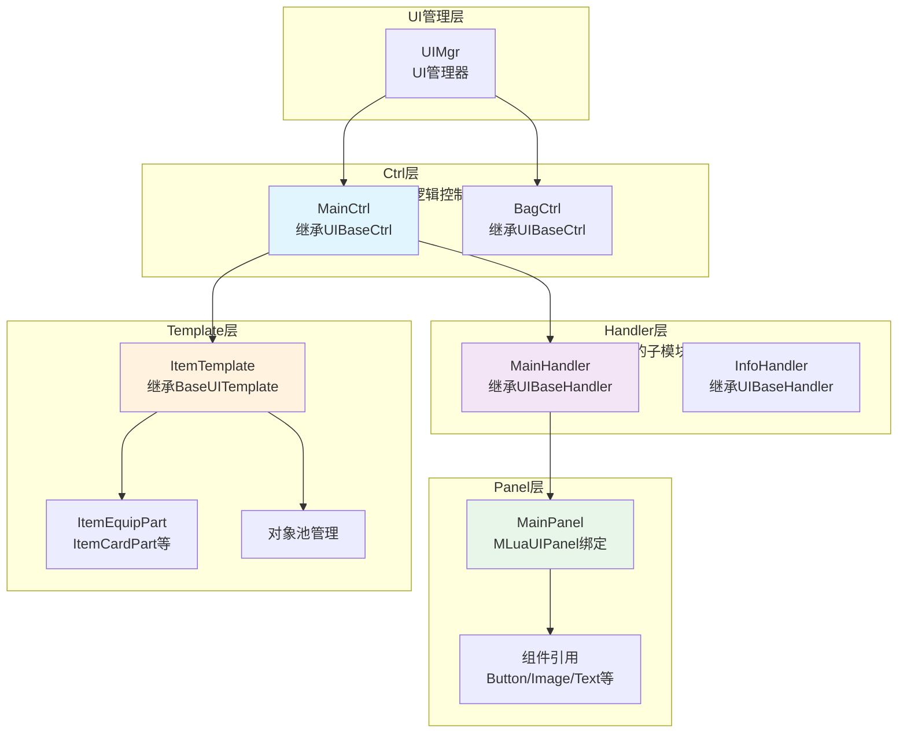

本项目采用基于Lua的四层架构UI框架，实现了逻辑分离、组件复用和统一生命周期管理。该框架将UI系统划分为**Ctrl（控制器）、Handler（处理器）、Panel（面板）和Template（模板）**四个核心层次，通过清晰的职责划分和约定优于配置的设计理念，支撑了项目中400+个UI界面的高效开发与维护。对于想要了解整体架构的开发者，建议先阅读[项目架构总览](5-xiang-mu-jia-gou-zong-lan)，然后结合本文深入理解UI系统的具体实现。

## 架构概览

UI框架采用经典的分层架构模式，每一层都有明确的职责边界。Ctrl层作为业务逻辑入口，负责协调Handler、Panel和Template之间的交互；Handler层作为可选的辅助处理器，管理具有独立Canvas的UI子模块；Panel层由代码自动生成，负责UI组件的绑定与引用；Template层提供可复用的UI组件，支持对象池管理。

整个框架建立在统一的基类体系之上，所有UI组件最终都继承自`UIBase`基类，从而确保了生命周期方法的一致性和可管理性。

Sources: [Scripts/Lua/UI/UIBase.lua](Scripts/Lua/UI/UIBase.lua#L5-L40), [Scripts/Lua/UI/UIConst.lua](Scripts/Lua/UI/UIConst.lua#L5-L40)

## 核心基类体系

UI框架的核心由四个基类构成，它们形成了完整的继承链条，每层都在父类基础上扩展特定的功能。`UIBase`作为最终的基类，定义了所有UI组件必须遵守的契约，包括生命周期方法、资源管理、事件绑定等基础能力。

**UIBase**是整个UI框架的根基，提供了统一的生命周期管理机制。每个UI组件都会经历从加载到销毁的完整生命周期，包括`Load`、`Init`、`Active`、`OnShow`、`OnHide`、`DeActive`、`Uninit`和`Destroy`等关键阶段。`UIBase`还管理着UI对象（uObj）、缓存级别（cacheGrade）、事件分发器（eventDispatchers）和UI模型（uiModels）等核心属性。特别值得注意的是，`UIBase`维护了两个重要的容器：`templates`数组用于存储Template实例，`templatePools`用于管理模板对象池，这为高性能的列表渲染提供了基础设施。

Sources: [Scripts/Lua/UI/UIBase.lua](Scripts/Lua/UI/UIBase.lua#L10-L50)

**UIBaseCtrl**继承自`UIBase`，专门为Controller层提供支持。它引入了层级管理系统，定义了5个UI层级：Normal（排序值20）、Function（40）、Tips（60）、Guiding（80）和Top（100），通过`UILayerSort`枚举明确各层的渲染顺序。`UIBaseCtrl`还定义了三种UI展现类型：Normal（正常显示，互不影响）、Exclusive（独占显示，关闭其他Exclusive和Normal类型的UI）和Standalone（独立显示）。遮罩管理也是`UIBaseCtrl`的重要功能，通过`GroupMaskType`控制是否显示遮罩，以及`BlockColor`定义遮罩颜色（如默认的55%半透明黑色）。此外，还集成了Tween动画支持，允许配置开闭动画的类型和时长。

Sources: [Scripts/Lua/UI/UIBaseCtrl.lua](Scripts/Lua/UI/BaseCtrl.lua#L10-L80)

**UIBaseHandler**同样继承自`UIBase`，是Handler层的基类。与Ctrl不同，Handler必须挂载Canvas组件，这是框架的强制要求。Handler通过`ctrlRef`属性绑定到对应的Controller，可以作为Controller的子模块存在，实现UI内容的动态切换。Handler的激活流程是：首先检查是否已激活，然后设置`ctrlRef`引用，加载资源后绑定事件，调用`OnActive`和`OnShow`方法，最后根据Controller的显示状态控制自身的可见性。这种设计允许一个Controller管理多个Handler，实现复杂的UI切换逻辑。

Sources: [Scripts/Lua/UI/UIBaseHandler.lua](Scripts/Lua/UI/BaseHandler.lua#L10-L70)

**BaseUITemplate**继承自`UIBase`，是Template层的基类。Template是可复用的UI组件，支持对象池机制以提升性能。Template可以通过`TemplatePrefab`（预制体）或`TemplatePath`（路径）两种方式创建，并且支持传入已实例化的GameObject。Template是数据驱动的，构造时可以传入`Data`参数，加载完成后会自动调用`SetData`方法进行数据绑定。每个Template都有`ShowIndex`属性，表示在列表中的位置索引。Template还支持额外的`Method`回调，允许在特定时机执行自定义逻辑。`BaseUITemplate`通过`ParentPanelClass`感知所属Panel的激活状态，从而优化渲染性能。

Sources: [Scripts/Lua/UI/BaseUITemplate.lua](Scripts/Lua/BaseUITemplate.lua#L10-L90)

## Ctrl层设计

Ctrl层是UI框架的业务逻辑控制中心，每个UI界面都有一个对应的Controller，继承自`UIBaseCtrl`。当前项目包含400多个Controller，涵盖了从主界面、背包、战斗到社交等所有游戏功能模块。Ctrl负责协调整个UI的生命周期、事件处理、数据更新以及与Handler和Template的交互。

Controller在构造时需要指定四个关键参数：`name`（UI名称，对应UIConst中定义的常量）、`groupContainerType`（UI层级，从UILayer枚举中选择）、`tweenType`（动画类型）和`activeType`（UI展现类型）。例如，`MainCtrl`的构造方式为`super.ctor(self, CtrlNames.Main, UILayer.Normal, nil, ActiveType.Normal)`，表示它是一个普通层级的正常类型UI。Controller还通过`cacheGrade`属性定义缓存策略，MainCtrl使用`EUICacheLv.VeryLow`表示低缓存优先级。

Sources: [Scripts/Lua/UI/Ctrl/MainCtrl.lua](Scripts/Lua/UI/Ctrl/MainCtrl.lua#L30-L45)

在`Init`方法中，Controller完成核心的初始化工作。首先通过`UI.MainPanel.Bind(self)`自动生成并绑定Panel，获取对UI组件的引用。然后调用父类的`Init`方法，最后获取各种游戏管理器（如AuthMgr、MainUIMgr、TeamMgr等）的引用，为后续的业务逻辑做准备。MainCtrl的Init方法还初始化了功能按钮列表、额外UI列表等业务数据结构，并配置了事件系统的相关参数，为UI交互做好准备。

Sources: [Scripts/Lua/UI/Ctrl/MainCtrl.lua](Scripts/Lua/UI/Ctrl/MainCtrl.lua#L50-L90)

Controller通过Panel的组件引用来绑定UI事件。MainCtrl展示了典型的事件绑定方式，使用`AddClick`方法为按钮添加点击回调。例如，`self.panel.BtnFunctionOpen:AddClick(function() ... end)`为功能按钮添加了点击事件，在回调中检查功能预览表并打开功能预览界面。对于需要传递上下文的事件，可以使用`AddClickWithLuaSelf`方法，如`self.panel.BtnInfo:AddClickWithLuaSelf(self._onInfoClick, self)`，这样在回调中可以通过`self`访问Controller实例。事件绑定应该在Init阶段完成，确保在UI显示前所有交互逻辑都已就绪。

Sources: [Scripts/Lua/UI/Ctrl/MainCtrl.lua](Scripts/Lua/UI/Ctrl/MainCtrl.lua#L95-L130)

Controller还需要管理UI的显示逻辑和动态内容更新。MainCtrl维护了`l_FunctionButtons`和`Buttons`两个数组，分别存储功能按钮和普通按钮，实现动态按钮的添加和移除。通过`initFunctionButton`方法初始化按钮系统，并在运行时根据游戏状态动态调整按钮的显示。Controller还负责响应游戏事件，如背包更新、任务完成、战斗状态变化等，通过事件系统或管理器回调更新UI显示。这种集中式的管理方式确保了UI状态与游戏逻辑的一致性。

Sources: [Scripts/Lua/UI/Ctrl/MainCtrl.lua](Scripts/Lua/UI/Ctrl/MainCtrl.lua#L135-L180)

## Handler层设计

Handler层是UI框架的辅助处理层，每个Handler继承自`UIBaseHandler`，必须挂载Canvas组件。Handler是可选的，主要用于管理具有独立Canvas的UI子模块，实现一个Controller下多个界面的切换。项目中包含40多个Handler，处理如成就详情、公会成员、设置面板等复杂UI场景。

Handler的构造函数相对简单，只需要传入`name`参数，其他属性在父类`UIBase`中初始化。Handler最关键的特征是维护了`ctrlRef`引用，指向所属的Controller，这使得Handler可以访问Controller的方法和数据，实现数据共享和逻辑协调。Handler通过`canvas`属性获取自身挂载的Canvas组件，这是框架强制要求的，如果没有找到Canvas组件会报错提示。

Sources: [Scripts/Lua/UI/UIBaseHandler.lua](Scripts/Lua/UI/UIBaseHandler.lua#L10-L30)

Handler的激活流程通过`Active`方法启动，该方法接收`ctrlRef`和`callback`两个参数。首先检查是否已经激活，避免重复激活。然后设置`ctrlRef`引用和激活状态标记。如果UI对象已加载，直接执行`_activeAfterLoaded`方法；否则调用`Load`方法异步加载资源，加载完成后在回调中执行`_activeAfterLoaded`。这种设计确保了Handler的激活流程是幂等的，无论资源是否已加载都能正确处理。

Sources: [Scripts/Lua/UI/UIBaseHandler.lua](Scripts/Lua/UI/UIBaseHandler.lua#L40-L60)

`_activeAfterLoaded`方法完成了Handler激活的核心逻辑。首先将UI对象的Transform设置为最后一个兄弟节点，确保显示在最上层。然后调用`_basePanelBindEvents`绑定事件，执行`OnActive`生命周期方法。如果传入了`callback`，在激活完成后调用。Handler还支持通过`SetActiveCallback`方法设置延迟回调，当Handler初始化完成后执行，解决了首次打开Handler时无法回调的问题。最后调用`OnShow`方法，并通知ControllerHandler已切换，根据显示状态控制UI的可见性。

Sources: [Scripts/Lua/UI/UIBaseHandler.lua](Scripts/Lua/UI/UIBaseHandler.lua#L65-L90)

Handler的典型使用场景是实现Tab切换或多页面管理。例如，一个公会Controller可以管理多个Handler（公会信息Handler、公会成员Handler、公会活动Handler），通过点击不同的Tab按钮激活对应的Handler，隐藏其他Handler。由于每个Handler都有独立的Canvas，可以实现更灵活的UI布局和动画效果。Handler通过`ctrlRef:OnHandlerSwitch(self.name)`通知Controller当前激活的Handler名称，Controller可以根据这个信息更新UI状态（如Tab按钮的高亮显示）。

Sources: [Scripts/Lua/UI/UIBaseHandler.lua](Scripts/Lua/UI/UIBaseHandler.lua#L85-L90)

## Panel层设计

Panel层由代码自动生成，是UI组件绑定的核心。每个Panel对应一个Lua表，存储了UI预制体上所有组件的引用。Panel通过`Bind`方法实现与Controller的绑定，该方法接收Controller实例作为参数，获取UI对象上的`MLuaUIPanel`组件，并调用`BindMLuaPanel`函数生成Panel表。

Panel文件的结构非常规范，使用注释定义了每个UI组件的类型。例如，MainPanel中定义了`TxtTaskNaving`的类型为`MoonClient.MLuaUICom`，表示这是一个文本组件；`BtnFunctionOpen`是一个按钮组件。对于复杂的嵌套UI，Panel还支持子Prefab的定义，如`MainButtonUpPrefab`和`MainButtonRightPrefab`，它们内部包含了多个子组件。这种结构化的定义使得IDE可以提供智能提示，减少开发时的错误。

Sources: [Scripts/Lua/UI/Panel/MainPanel.lua](Scripts/Lua/UI/Panel/MainPanel.lua#L10-L70)

`Bind`方法是Panel的核心功能，它完成了从GameObject到Lua表的转换。首先通过`ctrl.uObj:GetComponent("MLuaUIPanel")`获取MLuaUIPanel组件，这是C#侧实现的UI绑定组件。然后调用`ctrl:OnBindPanel(panelRef)`通知ControllerPanel已绑定，最后执行`BindMLuaPanel(panelRef)`生成Panel表并返回。这个过程是自动化的，开发者只需要在编辑器中配置好UI预制体和组件命名，对应的Panel文件会自动生成，大大减少了手动编写绑定代码的工作量。

Sources: [Scripts/Lua/UI/Panel/MainPanel.lua](Scripts/Lua/UI/Panel/MainPanel.lua#L75-L90)

Panel的使用非常简单，Controller通过`self.panel.xxx`访问UI组件。例如，MainCtrl中通过`self.panel.BtnFunctionOpen`访问功能按钮，通过`self.panel.TxtTaskNaving`访问任务导航文本。Panel组件提供了丰富的方法，如`AddClick`绑定点击事件、`SetText`设置文本内容、`SetActiveEx`控制显示状态等。这些方法封装了底层的Unity API调用，使得Lua代码更加简洁和安全。

Sources: [Scripts/Lua/UI/Ctrl/MainCtrl.lua](Scripts/Lua/UI/Ctrl/MainCtrl.lua#L95-L120)

Panel文件还包含了自定义脚本区域，开发者可以在`--lua custom scripts`和`--lua custom scripts end`之间添加自定义方法。这些方法可以扩展Panel的功能，实现特殊的UI逻辑。例如，可以添加一个`UpdateButtonState`方法来批量更新按钮状态，或者添加`PlayAnimation`方法来播放复杂的UI动画。这种自动生成与手动扩展相结合的设计，既保证了代码的规范性，又提供了足够的灵活性。

Sources: [Scripts/Lua/UI/Panel/MainPanel.lua](Scripts/Lua/UI/Panel/MainPanel.lua#L90-L93)

## Template层设计

Template层是UI框架的可复用组件层，每个Template继承自`BaseUITemplate`，代表一个可复用的UI子组件。项目包含500多个Template，覆盖了物品显示、列表项、聊天消息、排行榜等各种UI元素。Template通过对象池机制管理，显著提升了列表渲染的性能。

Template的构造函数接收一个`templateData`参数表，支持多种创建方式。可以通过`TemplatePrefab`直接传入预制体，或者通过`TemplatePath`指定资源路径，还可以传入已实例化的`TemplateInstanceGo`。`usePool`参数控制是否使用对象池，默认为true。`Data`参数支持数据驱动，加载完成后会自动调用`SetData`方法。`IsActive`参数控制初始显示状态，默认为true。`TemplateParent`指定父对象，`Method`参数可以传入自定义回调函数。这种灵活的构造方式使得Template可以适应各种使用场景。

Sources: [Scripts/Lua/UI/BaseUITemplate.lua](Scripts/Lua/UI/BaseUITemplate.lua#L30-L80)

ItemTemplate是Template的典型示例，它是一个通用的物品显示组件，继承自`BaseUITemplate`。ItemTemplate由多个子Template组成，包括`ItemEquipPartTemplate`（装备部分）、`ItemCardPartTemplate`（卡片部分）、`ItemFlagPartTemplate`（标志部分）、`ItemCostPartTemplate`（消耗部分）、`ItemCountdownPartTemplate`（倒计时部分）等。这种组合模式使得ItemTemplate可以显示各种类型的物品，从普通道具到装备、卡片、特殊物品等，通过不同的子Part组合实现差异化显示。

Sources: [Scripts/Lua/UI/Template/ItemTemplate.lua](Scripts/Lua/UI/Template/ItemTemplate.lua#L10-L40)

ItemTemplate的`Init`方法初始化了各种状态变量和子Part。它维护了`isShowCount`（是否显示数量）、`count`（数量值）、`propInfo`（物品信息）等核心数据。通过`ClearTemplate`方法清空所有子Part，确保每次显示时都是干净的状态。`SetData`方法通过`_mergeParams`合并参数，然后调用`showItem`方法显示物品。`OnDeActive`方法在停用时清空数据和事件绑定，避免内存泄漏。`OnDestroy`方法在销毁时重置Transform和尺寸，确保对象池复用时的正确性。

Sources: [Scripts/Lua/UI/Template/ItemTemplate.lua](Scripts/Lua/UI/Template/ItemTemplate.lua#L45-L80)

Template的生命周期管理与Panel和Ctrl类似，但更加轻量级。Template在`OnSetData`时更新UI显示，在`OnDeActive`时清理资源，在`OnDestroy`时重置状态。由于Template通常在列表中大量使用，其性能优化尤为重要。除了对象池机制外，Template还支持`ShowIndex`索引管理，允许父级根据索引进行批量更新。`_isSelect`属性用于标记选中状态，可以用于性能优化（如选中项才更新）。

Sources: [Scripts/Lua/UI/BaseUITemplate.lua](Scripts/Lua/UI/BaseUITemplate.lua#L85-L120)

## UI层级与显示管理

UI框架通过层级系统实现了有序的UI渲染和显示管理。`UILayer`枚举定义了5个UI层级，每个层级都有对应的`UILayerSort`值，决定了Canvas的sortingOrder。层级从低到高依次为：Normal（20）、Function（40）、Tips（60）、Guiding（80）、Top（100）。这种设计确保了重要UI（如提示、指引）始终显示在普通UI之上。

| 层级名称 | SortingOrder值 | 典型用途 | 示例UI |
|---------|---------------|---------|--------|
| Normal | 20 | 普通游戏UI | 主界面、背包、角色面板 |
| Function | 40 | 功能性UI | 系统设置、商城、任务面板 |
| Tips | 60 | 提示UI | 物品提示、对话框、确认弹窗 |
| Guiding | 80 | 新手指引 | 引导箭头、高亮遮罩 |
| Top | 100 | 顶层UI | 加载界面、全屏动画、错误提示 |

Sources: [Scripts/Lua/UI/UIBaseCtrl.lua](Scripts/Lua/UI/BaseCtrl.lua#L20-L40)

UI展现类型通过`ActiveType`枚举控制，定义了三种显示模式。Normal类型是默认模式，多个Normal类型的UI可以同时显示，互不影响。Exclusive类型是独占模式，打开Exclusive类型的UI时，会自动关闭所有其他Exclusive和Normal类型的UI，确保当前UI独占屏幕。Standalone类型是独立模式，完全独立显示，不受其他UI影响。MainCtrl使用的是Normal类型，而全屏剧情、战斗界面可能使用Exclusive类型，加载界面可能使用Standalone类型。

Sources: [Scripts/Lua/UI/UIBaseCtrl.lua](Scripts/Lua/UI/BaseCtrl.lua#L45-L60)

遮罩管理是UI框架的重要功能，通过`GroupMaskType`枚举控制。None表示没有遮罩，Show表示有遮罩，Default是默认模式，对于Exclusive类型且非全屏的界面自动添加遮罩。`BlockColor`定义了遮罩颜色，默认为黑色55%半透明（`Color.New(0, 0, 0, 180/255)`）。遮罩的作用是阻止用户点击底层UI，同时提供视觉上的聚焦效果。Exclusive类型的UI通常会添加遮罩，而Normal类型的UI通常不需要。

Sources: [Scripts/Lua/UI/UIBaseCtrl.lua](Scripts/Lua/UI/BaseCtrl.lua#L65-L75)

动画系统通过`UITweenType`集成到UI框架中，支持多种开闭动画效果。Controller可以在构造时指定`tweenType`参数，控制UI打开和关闭时的动画类型。动画时长通过`basePanelTweenTime`配置，默认为0.3秒。`basePanelTweenDelta`参数控制动画的幅度，根据不同的动画类型有不同的默认值。动画完成后会调用`basePanelTweenCallBack`回调，允许执行额外的逻辑。这种统一的动画管理使得所有UI都可以拥有一致且流畅的过渡效果。

Sources: [Scripts/Lua/UI/UIBaseCtrl.lua](Scripts/Lua/UI/BaseCtrl.lua#L80-L100)

## 对象池与性能优化

对象池是Template层性能优化的核心机制。`BaseUITemplate`支持通过对象池创建和销毁Template实例，减少频繁实例化和销毁带来的性能开销。`usePool`参数控制是否启用对象池，默认为true。`TemplatePool`属性引用了对象池实例，由外部管理器统一创建和分配。对象池的使用大大提升了列表滚动的流畅度，特别是对于包含大量Item的背包界面和排行榜界面。

Sources: [Scripts/Lua/UI/BaseUITemplate.lua](Scripts/Lua/UI/BaseUITemplate.lua#L50-L70)

Template的创建流程涉及对象池的交互。当需要创建新Template时，首先检查对象池是否有可用实例。如果有，从对象池获取并复用；如果没有，通过`TemplatePrefab`或`TemplatePath`创建新实例。创建完成后，调用`Init`方法初始化，然后调用`OnSetData`方法设置数据。如果传入了`LoadCallback`，在初始化完成后调用。这种延迟加载机制允许Template按需创建，减少初始化时的内存占用。

Sources: [Scripts/Lua/UI/BaseUITemplate.lua](Scripts/Lua/UI/BaseUITemplate.lua#L100-L130)

Template的销毁和回收也由对象池管理。当不再需要某个Template时，不是直接销毁GameObject，而是将其回收到对象池中供后续复用。在回收前，需要调用`OnDestroy`方法重置Template的状态，包括清空数据、移除事件绑定、重置Transform和尺寸等。ItemTemplate的`OnDestroy`方法展示了完整的重置流程：清空子Part、重置Transform位置和锚点、重置缩放、重置尺寸、清空按钮事件。这些操作确保了Template从对象池重新取出时处于干净的初始状态。

Sources: [Scripts/Lua/UI/Template/ItemTemplate.lua](Scripts/Lua/UI/Template/ItemTemplate.lua#L70-L100)

UI框架还提供了缓存级别的管理，通过`cacheGrade`属性控制UI资源的缓存策略。`EUICacheLv`枚举定义了6个缓存级别：None（-1）、VeryLow（0）、Low（1）、Middle（2）、High（3）、VeryHigh（4）。缓存级别决定了UI在关闭后是否保留资源以及保留的时间长度。VeryLow级别的UI（如MainCtrl）在关闭后会尽快卸载资源，而VeryHigh级别的UI（如主城界面）会长时间保留。这种分级缓存策略在内存使用和加载速度之间取得了平衡。

Sources: [Scripts/Lua/UI/UIBase.lua](Scripts/Lua/UI/UIBase.lua#L10-L30)

## 事件系统与数据流

UI框架内置了完整的事件系统，支持UI组件与游戏逻辑的交互。`UIBase`基类维护了`eventDispatchers`表，存储了所有注册的事件分发器。事件绑定通常在Init阶段完成，通过Panel组件提供的`AddClick`、`AddToggle`、`AddSlider`等方法快速绑定UI事件。对于复杂的事件逻辑，可以使用`AddClickWithLuaSelf`方法传递上下文对象。

Sources: [Scripts/Lua/UI/UIBase.lua](Scripts/Lua/UI/UIBase.lua#L30-L40)

事件处理流程遵循统一的模式。首先在Init阶段绑定UI组件到事件处理方法。事件处理方法可以是Controller的成员方法，接收相关参数并执行业务逻辑。例如，MainCtrl的`_onInfoClick`方法处理信息按钮点击，打开角色信息面板。事件处理中可能需要更新UI显示，调用管理器方法发送网络请求，或触发其他UI的打开/关闭。所有事件处理都应该在主线程执行，避免跨线程访问UI组件。

Sources: [Scripts/Lua/UI/Ctrl/MainCtrl.lua](Scripts/Lua/UI/Ctrl/MainCtrl.lua#L120-L140)

数据流在UI框架中是单向的，从数据模型流向UI显示。Controller通过管理器获取最新的数据模型，然后更新UI组件的显示。例如，背包Controller从BagModel获取物品列表，然后创建或更新ItemTemplate显示物品信息。数据更新通常在事件回调中触发，如收到网络消息、管理器通知或定时器触发。UI的修改不会直接修改数据模型，而是通过管理器方法发起请求，由服务器验证后更新数据，再通过事件通知UI刷新。

Sources: [Scripts/Lua/UI/Ctrl/MainCtrl.lua](Scripts/Lua/UI/Ctrl/MainCtrl.lua#L140-L160)

红点系统是UI框架的重要功能，通过`_redSignProcessors`表管理所有红点处理器。红点处理器负责检测某个功能是否有未读内容，并更新UI上的红点显示。红点系统通常与数据模型绑定，当数据变化时自动触发红点更新。例如，背包红点检测是否有新物品，任务红点检测是否有可领取的奖励。红点处理器可以注册到Controller中，在`OnShow`或数据更新时调用检查方法，确保红点状态的实时性。

Sources: [Scripts/Lua/UI/UIBase.lua](Scripts/Lua/UI/UIBase.lua#L35-L45)

## 开发流程与最佳实践

创建新的UI界面遵循标准的开发流程。首先在Unity编辑器中创建UI预制体，配置Canvas、按钮、文本等组件，并为每个需要访问的组件命名。然后使用代码生成工具自动生成Panel文件，生成对应的Lua绑定表。接着创建Controller文件，继承自UIBaseCtrl，在构造函数中指定UI名称、层级、动画类型和展现类型。在Init方法中绑定Panel、初始化数据、注册事件。最后在UIConst中添加UI名称常量，确保UI名称的一致性。

Sources: [Scripts/Lua/UI/UIConst.lua](Scripts/Lua/UI/UIConst.lua#L5-L30)

使用UI的最佳实践包括：始终在Init阶段完成事件绑定，避免在OnShow中重复绑定；在OnDeActive或OnDestroy中清理所有引用和事件，避免内存泄漏；使用对象池管理Template，特别是列表类UI；合理设置缓存级别，平衡内存和性能；遵循单向数据流原则，UI不直接修改数据模型。Controller应该保持精简，复杂的业务逻辑应该委托给管理器处理。UI相关的常量应该统一定义在UIConst或对应的Enum中，避免硬编码。

Sources: [Scripts/Lua/UI/UIBaseCtrl.lua](Scripts/Lua/UI/BaseCtrl.lua#L100-L120)

调试UI问题的常用方法包括：使用`logError`或`print`输出调试信息，跟踪UI的生命周期和事件触发；检查UI的isActive和isShowing状态，确认UI是否正确激活；使用Unity的Frame Debugger检查Canvas的sortingOrder和渲染顺序；使用Profiler分析UI的性能瓶颈，重点关注对象池的使用和GC分配。对于复杂的UI交互，可以绘制状态机图，梳理UI的打开、关闭、切换逻辑。

Sources: [Scripts/Lua/UI/UIBase.lua](Scripts/Lua/UI/UIBase.lua#L100-L150)

掌握了UI框架的基本使用后，建议进一步学习[UI界面管理器与堆栈机制](13-uijie-mian-guan-li-qi-yu-dui-zhan-ji-zhi)，了解UIMgr如何统一管理所有UI的打开、关闭和堆栈操作。对于需要热更新的游戏，还可以了解[资源打包与热更新流程](15-zi-yuan-da-bao-yu-re-geng-xin-liu-cheng)，学习如何将UI资源打包到AssetBundle中实现动态加载。