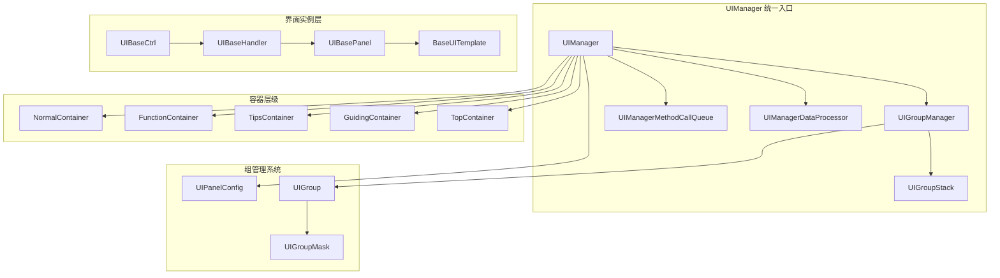
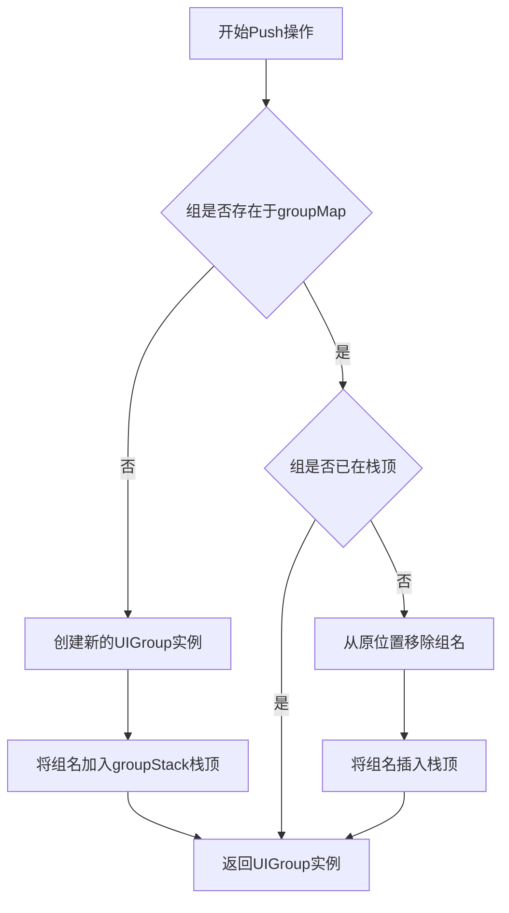
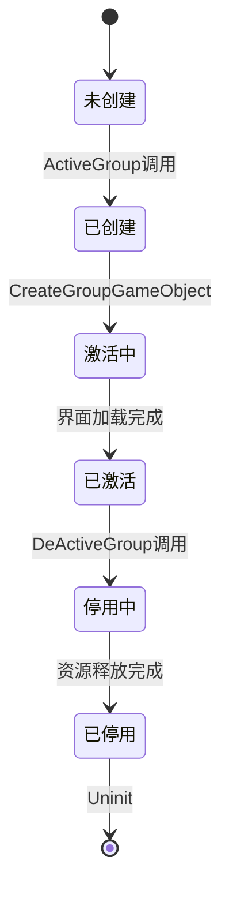
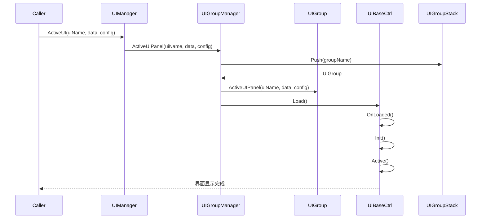
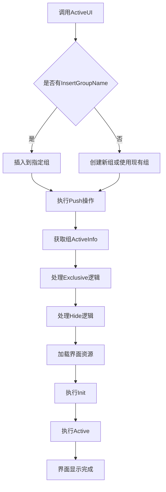

本页面深入解析Unity3D RO项目中基于Lua的UI管理架构，重点阐述UI堆栈机制、组管理系统以及完整的界面生命周期管理。此框架采用分层设计理念，通过Ctrl/Handler/Panel/Template模式实现了高度可复用和可维护的UI系统。

Sources: [UIManager.lua](Scripts/Lua/Framework/UIManager/UIManager.lua#L1-L50) | [UIGroupStack.lua](Scripts/Lua/Framework/UIManager/UIGroupStack.lua#L1-L30) | [UIBaseCtrl.lua](Scripts/Lua/UI/UIBaseCtrl.lua#L1-L50)

## 架构概览

UI框架采用**分层管理+堆栈导航**的设计模式，核心思想是将UI界面组织成逻辑组，通过组堆栈来管理界面的显示层级和导航逻辑。这种设计不仅解决了界面之间的互斥和依赖关系，还提供了灵活的界面切换机制。



### 核心组件职责

| 组件 | 职责 | 关键方法 |
|------|------|----------|
| UIManager | UI管理器的统一入口，协调各子系统 | ActiveUI, DeActiveUI, ActiveGroup |
| UIGroupManager | 管理UI组的创建、激活和停用逻辑 | ActiveGroupWithGroupDefine, GetActiveInfosWithGroup |
| UIGroupStack | 维护UI组的堆栈顺序，实现导航逻辑 | Push, GetTopGroupName, GetPreviousGroups |
| UIGroup | 单个UI组的管理，包含组内界面和遮罩 | CreateGroupGameObject, ActiveUIPanel |
| UIBaseCtrl | 所有UI控制器的基类，实现通用逻辑 | Init, Active, DeActive |
| UIPanelConfig | UI打开时的配置参数类 | SetExclusive, SetNeedShowMask |

Sources: [UIManager.lua](Scripts/Lua/Framework/UIManager/UIManager.lua#L20-L60) | [UIGroupManager.lua](Scripts/Lua/Framework/UIManager/UIGroupManager.lua#L1-L30)

## UI堆栈机制详解

堆栈机制是整个UI框架的核心，它通过维护一个组栈来控制界面的显示顺序和互斥关系。每个组在栈中只能存在一次，当重复打开同一组时，该组会移动到栈顶。

### 组栈数据结构

UIGroupStack使用Lua table实现栈操作，通过`groupMap`和`groupStack`两个数据结构协同工作：

- **groupMap**: 存储组名到UIGroup实例的映射，用于快速查找
- **groupStack**: 维护组名的数组，栈顶元素为当前活动的组

Sources: [UIGroupStack.lua](Scripts/Lua/Framework/UIManager/UIGroupStack.lua#L10-L25)

### Push操作流程

当一个界面或组被打开时，系统会执行Push操作：



这种设计确保了：
1. 每个组在栈中唯一
2. 最近访问的组总是在栈顶
3. 组的激活状态与堆栈顺序一致

Sources: [UIGroupStack.lua](Scripts/Lua/Framework/UIManager/UIGroupStack.lua#L30-L70) | [UIGroupManager.lua](Scripts/Lua/Framework/UIManager/UIGroupManager.lua#L35-L55)

### 栈顶组获取逻辑

系统在执行关闭或隐藏操作时，需要获取当前有效的栈顶组：

```lua
function UIGroupStack:GetTopGroupName()
    local groupCount = #self.groupStack
    if groupCount == 0 then
        return nil
    end
    -- 从栈顶向下查找第一个参与栈处理的组
    for i = #self.groupStack, 1, -1 do
        local groupName = self.groupStack[i]
        local group = self.groupMap[groupName]
        if group:IsTakePartInGroupStack() then
            return groupName
        end
    end
    return nil
end
```

这个设计允许某些组（如独立界面）不参与堆栈逻辑，同时保证正常的导航功能不受影响。

Sources: [UIGroupStack.lua](Scripts/Lua/Framework/UIManager/UIGroupStack.lua#L75-L90)

## UI组管理系统

### 组的配置定义

每个UI组在UIGroupDefineConfig中预定义，包含主界面列表和所有界面列表：

```lua
ShopGroup = {
    MainPanelNames = { UI.CtrlNames.Bag },
    UIPanelNames = { UI.CtrlNames.Bag, UI.CtrlNames.Shop, UI.CtrlNames.Currency }
}

ForgeGroup = {
    MainPanelNames = { UI.CtrlNames.Forge },
    UIPanelNames = { UI.CtrlNames.Forge, UI.CtrlNames.Currency }
}
```

- **MainPanelNames**: 定义组的核心界面，通常只有一个
- **UIPanelNames**: 包含组内所有相关界面，包括辅助界面（如货币显示）

Sources: [UIGroupDefine.lua](Scripts/Lua/Framework/UIManager/UIGroupDefine.lua#L1-L35)

### 组的生命周期

每个UIGroup实例管理自己的生命周期和组内界面：

1. **创建阶段**: 当组首次被激活时，创建组容器GameObject和遮罩
2. **激活阶段**: 根据配置加载组内界面，设置显示状态
3. **停用阶段**: 释放组内资源，隐藏组容器
4. **销毁阶段**: 彻底清理组对象和遮罩



Sources: [UIGroup.lua](Scripts/Lua/Framework/UIManager/UIGroup.lua#L50-L90) | [UIGroup.lua](Scripts/Lua/Framework/UIManager/UIGroup.lua#L95-L120)

### 组容器的层级管理

系统定义了5个UI层级容器，每个组根据配置挂载到对应容器：

| 容器名称 | 层级深度 | 用途 | SortingOrder |
|---------|---------|------|-------------|
| TopContainer | 100 | 最高优先级UI，如全屏CG、Loading | 5000+ |
| GuidingContainer | 80 | 新手引导相关UI | 4000-4999 |
| TipsContainer | 60 | 提示、弹窗类UI | 3000-3999 |
| FunctionContainer | 40 | 功能性界面（背包、商城） | 2000-2999 |
| NormalContainer | 20 | 常驻界面（主界面、聊天） | 1000-1999 |

Sources: [UIBaseCtrl.lua](Scripts/Lua/UI/UIBaseCtrl.lua#L30-L50)

## UI配置系统

UIPanelConfig提供了丰富的配置选项，控制界面的打开行为和显示特性：

### 核心配置参数

| 配置项 | 类型 | 默认值 | 说明 |
|--------|------|--------|------|
| isInsertCurrentGroup | boolean | false | 是否插入当前栈顶组 |
| insertGroupName | string | nil | 指定插入的目标组名 |
| isExclusive | boolean | false | 是否为独占型界面 |
| isStandalone | boolean | false | 是否为独立界面 |
| isNeedShowMask | boolean | false | 是否显示背景遮罩 |
| maskColor | Color | nil | 遮罩颜色 |
| closePanelNameOnClickMask | string | nil | 点击遮罩关闭的界面 |
| isTakePartInGroupStack | boolean | false | 是否参与组栈处理 |

Sources: [UIPanelConfig.lua](Scripts/Lua/Framework/UIManager/UIPanelConfig.lua#L1-L50)

### 界面类型详解

#### Normal类型（常规界面）

默认类型，支持正常的堆栈行为，可以被其他Exclusive类型界面隐藏。

```lua
-- 示例：打开普通背包界面
local config = UIPanelConfig.new()
config:SetInsertCurrentGroup(true)
UIMgr:ActiveUI(UI.CtrlNames.Bag, data, config)
```

#### Exclusive类型（独占界面）

打开时会隐藏所有其他Normal和Exclusive类型的界面，适用于全屏功能界面。

```lua
-- 示例：打开全屏商城界面
local config = UIPanelConfig.new()
config:SetExclusive(true)
config:SetNeedShowMask(true)
config:SetMaskColor(BlockColor.Dark)
UIMgr:ActiveUI(UI.CtrlNames.Shop, data, config)
```

#### Standalone类型（独立界面）

完全不参与堆栈逻辑，显示在其他所有UI之上，通常用于系统提示或强引导。

```lua
-- 示例：打开强引导提示
local config = UIPanelConfig.new()
config:SetStandalone(true)
UIMgr:ActiveUI(UI.CtrlNames.SystemNotice, data, config)
```

Sources: [UIBaseCtrl.lua](Scripts/Lua/UI/UIBaseCtrl.lua#L55-L75)

## 生命周期管理

### 界面完整生命周期

UIBaseCtrl定义了完整的生命周期方法，框架按既定顺序调用：



### 关键生命周期方法

#### Load / OnLoaded

资源加载阶段，异步加载UI预制体并实例化：

```lua
function UIBase:Load(callBack)
    if self:_isPanelLoading() then
        return
    end
    local l_location = "UI/Prefabs/" .. self.name
    self._basePanelAsyncLoadTaskId = MResLoader:CreateObjAsync(
        l_location, 
        function(uobj, sobj, taskId)
            self:OnLoaded(uobj, callBack)
        end, 
        self, 
        self.usePool
    )
end
```

Sources: [UIBase.lua](Scripts/Lua/UI/UIBase.lua#L50-L75)

#### Init / Uninit

初始化和销毁阶段，处理UI组件绑定、事件注册等：

```lua
function UIBaseCtrl:Init()
    super.Init(self)
    self.canvas = self.uObj:GetComponent("Canvas")
    if self.canvas == nil then
        logError("界面上的Canvas是空的，界面名字："..self.name)
    end
    self:SetupHandlers()  -- 设置页签处理器
end
```

Sources: [UIBaseCtrl.lua](Scripts/Lua/UI/UIBaseCtrl.lua#L110-L125)

#### Active / DeActive

激活和停用阶段，控制界面的可见性和交互性：

```lua
function UIBaseCtrl:Active(...)
    super.Active(self, ...)
    -- 播放打开动画
    if self.basePanelTweenType ~= UITweenType.None then
        self:PlayOpenTween()
    end
end

function UIBaseCtrl:DeActive(isPlayTween)
    -- 播放关闭动画
    if isPlayTween and self.basePanelTweenType ~= UITweenType.None then
        self:PlayCloseTween(function()
            super.DeActive(self, false)
        end)
    else
        super.DeActive(self, false)
    end
end
```

Sources: [UIBaseCtrl.lua](Scripts/Lua/UI/UIBaseCtrl.lua#L130-L150)

## 界面打开与关闭流程

### 打开界面的完整流程



### 关闭界面的逻辑

关闭界面时，系统会根据堆栈状态智能决定处理方式：

1. **组内单个界面关闭**: 仅关闭指定界面，不影响组内其他界面
2. **整组关闭**: 关闭组内所有界面，从栈中移除该组
3. **返回操作**: 关闭栈顶组，显示前一个组

Sources: [UIManager.lua](Scripts/Lua/Framework/UIManager/UIManager.lua#L70-L85) | [UIGroupManager.lua](Scripts/Lua/Framework/UIManager/UIGroupManager.lua#L200-L300)

### GoBack导航实现

```lua
function UIManager:_goBack(isPlayTween)
    local l_topGroupName = self.groupManager:GetTopGroupName()
    if l_topGroupName == nil then
        return
    end
    
    -- 获取栈顶组之前的所有组
    local l_previousGroups = self.groupManager.groupStack:GetPreviousGroups(l_topGroupName)
    
    -- 关闭栈顶组
    self:DeActiveGroup(l_topGroupName, isPlayTween)
    
    -- 显示前一个组
    local l_previousGroupName = l_previousGroups:Peek()
    if l_previousGroupName then
        self:ShowGroup(l_previousGroupName)
    end
end
```

Sources: [UIManager.lua](Scripts/Lua/Framework/UIManager/UIManager.lua#L95-L110) | [UIGroupStack.lua](Scripts/Lua/Framework/UIManager/UIGroupStack.lua#L110-L130)

## 缓存与性能优化

### 界面缓存等级

系统支持5个缓存级别，控制界面的卸载时机：

```lua
EUICacheLv = {
    None = -1,      -- 不缓存，立即卸载
    VeryLow = 0,    -- 极低优先级缓存
    Low = 1,        -- 低优先级缓存
    Middle = 2,     -- 中等优先级缓存
    High = 3,       -- 高优先级缓存
    VeryHigh = 4,   -- 极高优先级缓存，长时间保持
}
```

Sources: [UIBase.lua](Scripts/Lua/UI/UIBase.lua#L10-L20)

### 对象池机制

```lua
function UIBase:OnLoaded(obj, callBack)
    -- ...
    if self:IsCached() then
        -- 缓存的UI提前卸载Bundle，减少内存占用
        local l_location = "UI/Prefabs/" .. self.name
        MResLoader:RequestUnloadBundle(l_location, ".prefab")
    end
    -- ...
end
```

Sources: [UIBase.lua](Scripts/Lua/UI/UIBase.lua#L80-L90)

## 异步方法调用队列

为了确保UI操作的线程安全，框架实现了方法调用队列：

```lua
function UIManager:_callPanelProcessMethod(method, ...)
    -- 将方法调用加入队列
    self.methodCallQueue:Enqueue(method, ...)
    
    -- 如果没有正在处理的操作，立即执行
    if not self.isPanelOnProcessing then
        self:_processMethodCallQueue()
    end
end
```

这种设计确保了：
1. UI操作按顺序执行，避免竞态条件
2. 批量操作可以合并处理，提高性能
3. 提供了处理状态查询接口，便于调试

Sources: [UIManager.lua](Scripts/Lua/Framework/UIManager/UIManager.lua#L60-L70)

## 典型使用场景

### 场景1：打开背包商城组

```lua
-- 打开背包界面（自动创建ShopGroup）
local bagData = { selectedTab = 0 }
local config = UIPanelConfig.new()
config:SetInsertCurrentGroup(false)  -- 创建新组
UIMgr:ActiveUI(UI.CtrlNames.Bag, bagData, config)

-- 在背包界面中打开商城（插入到当前组）
local shopData = { shopId = 1001 }
UIMgr:ActiveUI(UI.CtrlNames.Shop, shopData, config)

-- 关闭商城（返回背包）
UIMgr:DeActiveUI(UI.CtrlNames.Shop)

-- 关闭整个组（返回主界面）
UIMgr:DeActiveUI(UI.CtrlNames.Bag)
```

### 场景2：独占型界面打开

```lua
-- 打开锻造界面（隐藏其他所有界面）
local config = UIPanelConfig.new()
config:SetExclusive(true)
config:SetNeedShowMask(true)
config:SetMaskColor(BlockColor.Dark)
config:SetMaskDelayClickTime(0.3)  -- 遮罩0.3秒后才可点击
UIMgr:ActiveUI(UI.CtrlNames.Forge, nil, config)
```

### 场景3：使用预定义组配置

```lua
-- 直接打开世界地图组（包含Map和WorldMap两个界面）
local groupDefine = UIGroupDefine:GetGroupDefine("WorldMap")
UIMgr:ActiveGroup(groupDefine, { mapId = 1001 }, nil)
```

Sources: [UIGroupDefine.lua](Scripts/Lua/Framework/UIManager/UIGroupDefine.lua#L40-L60) | [UIManager.lua](Scripts/Lua/Framework/UIManager/UIManager.lua#L90-L100)

## 调试与监控

### 栈状态调试

框架提供了栈状态的调试接口：

```lua
function UIGroupStack:DebugLogStack()
    if not Application.isEditor then
        return
    end
    logGreen("以下是打印UIGroupStack中的所有名字")
    for i = #self.groupStack, 1, -1 do
        local groupName = self.groupStack[i]
        local group = self.groupMap[groupName]
        if group then
            group:DebugLog()
        else
            logError("没有这个组数据:" .. groupName)
        end
    end
end
```

### 界面状态查询

```lua
-- 查询界面是否显示
local isShowing = UIMgr:IsPanelShowing(UI.CtrlNames.Bag)

-- 查询界面是否在激活状态
local isActive = UIMgr:IsPanelAtActiveStatus(UI.CtrlNames.Bag)
```

Sources: [UIManager.lua](Scripts/Lua/Framework/UIManager/UIManager.lua#L140-L160) | [UIGroupStack.lua](Scripts/Lua/Framework/UIManager/UIGroupStack.lua#L140-L200)

## 最佳实践建议

### 1. 合理设置界面类型

- **主界面、聊天框**: Normal类型，支持堆栈
- **功能界面（背包、商城）**: Exclusive类型，独占显示
- **系统提示、新手引导**: Standalone类型，不受堆栈影响
- **货币显示、状态栏**: 插入到当前组，跟随界面显示

### 2. 组配置原则

- 相关功能界面组织在同一组
- 辅助界面（如货币）包含在多个组中
- 避免组内界面数量过多，影响性能

### 3. 缓存策略

- **高频使用界面**: 设置High或VeryHigh缓存
- **中频使用界面**: 设置Middle缓存
- **低频使用界面**: 设置Low缓存或不缓存
- **大型活动界面**: 建议不缓存，及时释放资源

### 4. 性能优化建议

- 使用对象池减少实例化开销
- 及时卸载不再使用的Bundle资源
- 批量操作时使用方法队列
- 避免在界面关闭时保留大对象引用

## 相关文档

- [UI框架设计（Ctrl/Handler/Panel/Template）](12-uikuang-jia-she-ji-ctrl-handler-panel-template) - 了解UI架构的四层设计模式
- [C#与Lua混合开发模式](6-c-yu-luahun-he-kai-fa-mo-shi) - 理解Lua与Unity的交互机制
- [AssetBundle系统架构](14-assetbundlexi-tong-jia-gou) - 掌握UI资源的加载和卸载机制