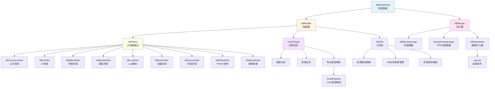
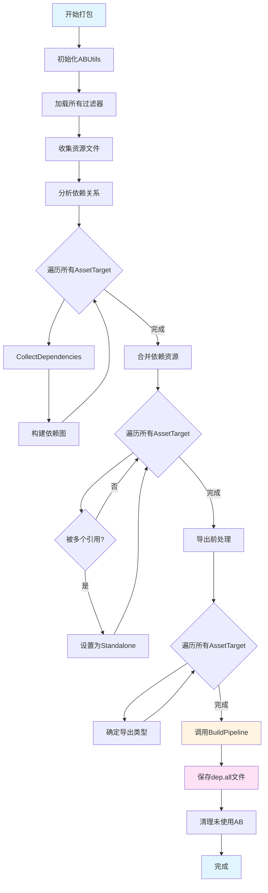

AssetBundle系统是本项目的核心资源管理模块，负责将Unity资源打包、管理和热更新。该系统采用基于过滤器的设计模式，支持多种资源类型的分类打包，并通过依赖关系分析和资源合并策略优化包体大小和加载性能。

## 系统架构总览

AssetBundle系统采用分层的模块化设计，包含资源过滤、依赖分析、打包构建、数据管理和资源合并等核心组件。系统通过过滤器模式将不同类型的资源进行分类处理，并通过依赖关系图确保资源加载的正确性。

## 核心组件详解

### ABBuilder构建器

ABBuilder是AssetBundle构建的核心控制器，负责协调整个打包流程。它执行四个关键阶段：分析（Analyze）、合并（Merge）、导出前处理（BeforeExport）和导出（Export）。在分析阶段，系统使用Unity的CollectDependencies API收集每个资源的所有依赖项，并建立依赖关系图。合并阶段通过分析依赖关系，将多个资源引用的同一依赖项合并，避免重复打包。导出前处理确定每个AssetTarget的最终导出类型，最后通过Unity的BuildPipeline.BuildAssetBundles方法完成实际的AssetBundle构建。Sources: [artres/Editor/ABSystem/ABBuilder.cs](artres/Editor/ABSystem/ABBuilder.cs#L23-L59)

### AssetTarget资源目标

AssetTarget是系统中表示单个AssetBundle打包单元的核心类，它维护了资源集合、导出类型、依赖关系和被依赖关系等关键信息。每个AssetTarget包含一个或多个Unity资源的路径引用，并通过ExportType属性决定其打包策略：Root类型表示根资源需要独立打包，Asset类型表示作为依赖资源，Standalone类型表示被多个资源引用需要独立打包。系统通过双向依赖关系图（_myDepends和_dependsOnMe）来管理资源间的引用关系，并支持深度遍历获取完整的依赖链。Sources: [artres/Editor/ABSystem/AssetTarget.cs](artres/Editor/ABSystem/AssetTarget.cs#L16-L100)

### ABFilters过滤器体系

过滤器体系是AssetBundle系统分类管理资源的基础，所有过滤器继承自ABBaseFilter抽象基类，并通过InitFilters方法定义各自的资源匹配规则。系统定义了四大类过滤器：Assetbundle过滤器（AB）、字节过滤器（Bytes）、拷贝过滤器（Copy）和Lua过滤器（LuaZip），每类过滤器负责处理特定类型的资源。每个过滤器包含一个或多个ABFilter配置，指定了资源搜索路径和文件类型匹配模式（如*.prefab、*.png等），并支持IsWrapped标志位标识是否需要将多个资源打包到同一个AB包中。Sources: [artres/Editor/ABSystem/ABFilters/ABBaseFilter.cs](artres/Editor/ABSystem/ABFilters/ABBaseFilter.cs#L18-L45)

## 资源分类与打包策略

### 资源类型分类表

系统通过不同的过滤器将资源按照功能和使用场景进行分类，每种类型采用不同的打包策略：

| 过滤器类型 | 资源目录 | 文件类型 | 打包模式 | 特殊处理 |
|-----------|---------|---------|---------|---------|
| ABCommonFilter | Resources/Shader | *.shader, *.mat, *.shadervariants | 公共AB | 强制打包在一起，全局共享 |
| ABUIFilter | Resources/UI | *.prefab, *.mat, *.ttf, *.png | 分类AB | 支持海外版本资源替换 |
| ABEffectFilter | Resources/Effects | *.prefab, *.asset | 分类AB | 支持海外版本纹理替换 |
| ABModelFilter | Resources/{Controller, Equipments, Materials, Prefabs, Textures} | *.controller, *.prefab, *.mat, *.tga, *.png | 分类AB | 包含角色模型、装备等 |
| ABLuaFilter | Resources/LuaSource | *.lua | Bytes | 加密后打包为.robytes |
| ABAnimFilter | Resources/Anims | *.anim, *.controller | 分类AB | 角色动画资源 |
| ABSceneFilter | Resources/Scenes | *.unity | 场景AB | 场景文件单独打包 |
| ABFModFilter | - | *.bank | Copy | FMOD音频库直接拷贝 |
| ABMovieFilter | - | *.mp4 | Copy | 视频文件直接拷贝 |

Sources: [artres/Editor/ABSystem/ABFilters/ABModelFitler.cs](artres/Editor/ABSystem/ABFilters/ABModelFitler.cs#L13-L25), [artres/Editor/ABSystem/ABFilters/ABUIFilter.cs](artres/Editor/ABSystem/ABFilters/ABUIFilter.cs#L13-L21), [artres/Editor/ABSystem/ABFilters/ABLuaFilter.cs](artres/Editor/ABSystem/ABFilters/ABLuaFilter.cs#L12-L20)

### 依赖关系管理

依赖关系管理是AssetBundle系统的核心机制，确保资源加载时能正确加载所有依赖项。系统在Analyze阶段通过EditorUtility.CollectDependencies收集每个资源的直接依赖，然后递归建立完整的依赖图。Merge阶段优化依赖关系，当多个AssetTarget引用同一个依赖资源时，系统会将其导出类型设置为Standalone，避免在多个AB包中重复打包同一资源。GetDependencies方法提供了深度优先遍历能力，能够获取一个AssetTarget的所有直接和间接依赖的AB包，用于运行时的资源加载和释放管理。Sources: [artres/Editor/ABSystem/AssetTarget.cs](artres/Editor/ABSystem/AssetTarget.cs#L104-L145)

## 打包流程详解

### 依赖分析阶段

依赖分析阶段通过递归遍历所有资源并使用Unity的CollectDependencies API建立完整的依赖关系图。对于每个AssetTarget，系统会忽略MonoScript脚本和Resources目录下的资源，因为这些资源不需要打包到AB中。分析完成后，每个AssetTarget都知道它依赖哪些其他资源（_myDepends集合）以及被哪些资源依赖（_dependsOnMe集合）。这个双向关系图是后续合并和导出决策的基础。Sources: [artres/Editor/ABSystem/AssetTarget.cs](artres/Editor/ABSystem/AssetTarget.cs#L104-L145)

### 资源合并阶段

资源合并阶段的主要目的是消除冗余依赖。当一个AssetTarget被多个其他AssetTarget依赖时（_dependsOnMe.Count > 1），系统会将其ExportType设置为Standalone，这意味着它需要独立打包成一个AB文件。合并阶段会遍历所有AssetTarget，对于那些被多个父资源引用的资源，系统会将其提升为独立打包单元，并将父资源的依赖关系重定向到这个新的独立AB包。这样既避免了资源重复打包，又确保了依赖关系的正确性。Sources: [artres/Editor/ABSystem/AssetTarget.cs](artres/150-L250)

### 构建与导出阶段

构建阶段使用Unity的BuildPipeline.BuildAssetBundles方法执行实际的打包操作，使用ChunkBasedCompression压缩选项以获得最佳的加载性能和包体大小平衡。对于每个需要独立打包的AssetTarget（NeedSelfExport为true），系统会创建一个AssetBundleBuild对象，设置assetBundleName和assetNames，并通过collectABTags方法递归收集所有非独立打包的依赖资源，将它们也包含到同一个AB包中。构建完成后，系统会删除未使用的AB文件，防止上次打包的残留文件影响本次打包结果。Sources: [artres/Editor/ABSystem/ABBuilder.cs](artres/Editor/ABSystem/ABBuilder.cs#L100-L150)

## 数据管理

### dep.all依赖文件

dep.all文件是AssetBundle系统运行时的核心元数据文件，记录了所有AB包的详细信息，包括资源路径、包名、导出类型和依赖关系。系统支持两种格式的dep.all文件：文本格式（ABDT标识）和二进制格式（ABDB标识）。文本格式使用可读的文本行存储，便于调试；二进制格式使用BinaryWriter写入，文件更小且加载更快。文件内容以AB数量开头，然后对每个AB包依次记录：资源路径列表（逗号分隔）、Bundle名称（或名称哈希）、导出类型、依赖数量和依赖包列表。Sources: [artres/Editor/ABSystem/ABDataWriter.cs](artres/Editor/ABSystem/ABDataWriter.cs#L8-L59), [artres/Editor/ABSystem/ABDataBinaryWriter.cs](artres/Editor/ABSystem/ABDataBinaryWriter.cs#L8-L52)

### AB名称哈希机制

系统使用32位哈希值（CRC32）作为AssetBundle的内部标识，通过MCommonFunctions.GetHash方法将资源路径转换为哈希值。这种设计有多个优点：首先，哈希值作为文件名的一部分可以避免长路径带来的文件系统限制；其次，哈希值在运行时查询和比较时比字符串更高效；最后，哈希值提供了一层简单的混淆保护。ABUtils维护了两个核心字典：_abName2Target（哈希到AssetTarget的映射）和_assetPath2AbName（资源路径到哈希的映射），实现了快速的双向查找。Sources: [artres/Editor/ABSystem/ABUtils.cs](artres/Editor/ABSystem/ABUtils.cs#L16-L80)

## 资源合并与块管理

### ABMerger合并器

ABMerger负责将不同过滤器生成的AB包合并到最终的发布目录，并根据配置选择不同的打包模式。系统支持两种AB打包模式：AB模式直接将AB文件拷贝到目标目录；BLOCK模式使用ABBlockManager将多个AB文件打包成大的块文件（Block），减少文件数量，提升IO性能。对于Bytes类型的资源（如Lua脚本），系统使用BytesBlockManager进行块打包。合并过程还支持ZIP压缩模式，可以将多个块文件打包成单个ZIP文件，进一步减少包体大小。Sources: [artres/Editor/ABSystem/EditorWindow/ABMerger.cs](artres/Editor/ABSystem/EditorWindow/ABMerger.cs#L18-L80)

### 海外版本资源替换

系统针对不同渠道和语言版本提供了资源替换机制。ABUIFilter和ABEffectFilter实现了BeforeBuildExtractCall回调，在打包前会检查海外版本专用目录（如overseas_artres/Korea/Resources/UI/Atlas/SourceReplace），如果存在替换资源，系统会拷贝这些资源到源目录并保持GUID不变，这样可以在不修改所有引用prefab的情况下实现资源替换。这种设计使得海外版本可以独立更新UI图集和特效纹理，而不需要重新打包整个项目。Sources: [artres/Editor/ABSystem/ABFilters/ABUIFilter.cs](artres/Editor/ABSystem/ABFilters/ABUIFilter.cs#L28-L147)

## 配置与参数

### config.json配置文件

config.json定义了AssetBundle系统的核心运行参数，包括打包模式（abMode）、压缩模式（zipMode）、渠道信息、版本号和服务器地址等。abMode参数控制AB的打包方式：1表示BLOCK模式，0表示AB模式。zipMode参数控制是否对资源进行ZIP压缩：2表示UNZIP（不压缩），其他值表示压缩。文件还定义了程序更新和热更新的服务器URL模板，支持渠道、版本、系统、设备ID等参数的动态替换。Sources: [Resources/config.json](Resources/config.json#L1-L33)

### ZipList.json文件列表

ZipList.json定义了需要特殊处理的文件列表，主要用于FMOD音频库和字节块资源。FmodBank部分列出了所有需要打包的FMOD bank文件（如MasterBank.bank、BGM.bank等），BytesBlock部分列出了所有字节块文件及其blockinfo文件。这些文件在合并阶段会被特殊处理，根据zipMode配置决定是否打包成ZIP文件。Sources: [Resources/ZipList.json](Resources/ZipList.json#L1-L23)

## 工具与调试

### ABChecker冗余检查工具

ABChecker提供了检查AB包冗余的功能，可以识别哪些资源在多个AB包中重复打包。工具通过遍历所有Block文件，加载每个AB包并收集其中包含的资源名称，统计每个资源出现的次数。对于出现次数大于1的资源，工具会输出警告信息，帮助开发者优化资源打包策略，减少包体冗余。这个功能对于发现和解决资源重复打包问题非常有用。Sources: [artres/Editor/ABSystem/ABChecker.cs](artres/Editor/ABSystem/ABChecker.cs#L1-L66)

### ABBuildPanel构建面板

ABBuildPanel是AssetBundle系统的用户界面，提供了可视化的打包配置选项。面板支持选择二进制/文本格式、OBB模式、自动合并开关、ZIP模式、AB打包模式、目标渠道和目标语言等参数。面板通过FilterDictAll字典管理所有过滤器的分类，方便执行不同类型的打包任务。用户可以通过面板界面选择性地执行Lua打包、Bytes打包、AB打包或Copy操作，灵活控制打包流程。Sources: [artres/Editor/ABSystem/EditorWindow/ABBuildPanel.cs](artres/Editor/ABSystem/EditorWindow/ABBuildPanel.cs#L38-L95)

## 最佳实践与注意事项

在AssetBundle打包过程中，开发者需要注意以下关键点：对于UI图集（Atlas）纹理，系统强制要求只能通过Material来引用，如果多个资源直接引用同一个图集纹理会导致冗余打包错误。FMOD音频库和视频文件采用Copy模式直接拷贝，不经过AssetBundle构建流程。Lua脚本会先经过加密处理，然后打包为.robytes文件。海外版本资源替换需要在打包前准备好SourceReplace目录，并确保替换资源与原始资源的GUID一致，以保证引用关系的正确性。调试时可以使用ABChecker工具检查资源冗余，使用文本格式的dep.all文件便于人工查看依赖关系。