本文档详细阐述了RO项目的AssetBundle资源打包机制与热更新系统架构，涵盖从资源分类、打包流程、依赖管理到版本控制与热更检查的完整技术链路。系统采用模块化设计，支持多种打包策略与更新方式，为大型MMO游戏的持续内容交付提供了灵活的基础设施。

## 系统架构概览

资源管理系统采用分层架构设计，核心包含**资源过滤层**、**打包执行层**、**资源合并层**和**热更新控制层**四个主要模块。系统通过配置驱动的方式管理不同类型资源的打包策略，并支持多渠道、多语言的差异化打包。

```mermaid
graph TB
    subgraph "资源过滤层"
        A[ABBaseFilter] --> B[ABAnimFilter]
        A --> C[ABEffectFilter]
        A --> D[ABModelFilter]
        A --> E[ABSceneFilter]
        A --> F[ABUIFilter]
        A --> G[ABLuaFilter]
        A --> H[ABBytesFilter]
    end
    
    subgraph "打包执行层"
        I[ABBuilder] --> J[资源分析]
        J --> K[依赖分析]
        K --> L[资源合并]
        L --> M[BuildAssetBundles]
    end
    
    subgraph "资源合并层"
        M --> N{EMABMode}
        N -->|AB模式| O[直接拷贝]
        N -->|BLOCK模式| P[ABBlockManager]
        P --> Q[生成Block文件]
        O --> R[生成dep.all]
        Q --> R
        R --> S{EMZipMode}
        S -->|UNZIP| T[生成Zip包]
        S -->|ZIP| U[保持原文件]
    end
    
    subgraph "热更新控制层"
        V[MPlatformConfig] --> W[版本管理]
        V --> X[渠道配置]
        V --> Y[更新地址]
        Z[MUpdater] --> AA[版本检查]
        AA --> AB[资源下载]
        AB --> AC[资源应用]
    end
    
    B & C & D & E & F & G & H --> I
    T & U --> Z
```



## 资源分类与过滤策略

系统通过Filter机制对Unity项目中的资源进行分类管理，每种Filter负责特定类型资源的收集与打包配置。所有Filter继承自`ABBaseFilter`基类，实现了统一的扩展接口。

### Filter类型定义

资源过滤器分为三大类型：AssetBundle类型、Bytes类型和Copy类型，分别对应不同的打包处理逻辑。从`ABBuildPanel.cs`可以看到系统定义了完整的Filter集合[artres/Editor/ABSystem/EditorWindow/ABBuildPanel.cs#L29-L54]：

```csharp
private static readonly List<ABBaseFilter> _luaFilter = new List<ABBaseFilter>()
{
    new ABLuaFilter()
};

private static readonly List<ABBaseFilter> _bytesFilter = new List<ABBaseFilter>()
{
    new ABBytesFilter()
};

private static readonly List<ABBaseFilter> _abFilter = new List<ABBaseFilter>()
{
    new ABAnimFilter(),
    new ABEffectFilter(),
    new ABModelFitler(),
    new ABSceneFilter(),
    new ABUIFilter(),
    new ABModelColorFilter(),
    new ABSceneEnviromentFilter(),
    new ABCutSceneFilter(),
    new ABTheaterFilter(),
};

private static readonly List<ABBaseFilter> _copyFilter = new List<ABBaseFilter>()
{
    new ABDllFilter(),
    new ABFModFilter(),
    new ABMovieFilter(),
    new ABOthersFilter(),
};
```

### Filter执行机制

每种Filter类型在打包时执行不同的处理流程。根据`ABBuildPanel._BuildBundlesByFilter`方法的实现，系统根据Filter的`AbType`属性选择相应的处理策略[artres/Editor/ABSystem/EditorWindow/ABBuildPanel.cs#L300-L316]：

- **AssetBundle类型**：调用`_DoBuildAB`进行标准AssetBundle打包
- **Bytes类型**：调用`_CopyBytesToROBytes`将文件转换为.robytes格式并打包为Block
- **Copy类型**：调用`_CopyIndependentFiles`直接拷贝文件到目标目录

## AssetBundle打包流程

### 核心打包器ABBuilder

`ABBuilder`类是资源打包的核心执行器，负责从资源收集到最终AssetBundle生成的完整流程。打包过程分为三个主要阶段：初始化、分析与导出[artres/Editor/ABSystem/ABBuilder.cs#L28-L68]：

```csharp
public void Begin()
{
    EditorUtility.DisplayProgressBar("Loading", "Loading...", 0.1f);
    ABUtils.Init();
}

public void Analyze()
{
    // 1. 分析依赖关系
    var all = ABUtils.GetAll();
    for (int i = 0; i < all.Count; i++)
    {
        all[i].Analyze();
    }
    
    // 2. 执行资源合并
    for (int i = 0; i < all.Count; i++)
    {
        all[i].Merge();
    }
    
    // 3. 导出前处理
    for (int i = 0; i < all.Count; i++)
    {
        all[i].BeforeExport();
    }
}

public void Export(string dir)
{
    _exportDir = dir;
    Analyze();
    
    // 构建AssetBundleBuild列表
    List<AssetBundleBuild> builds = new List<AssetBundleBuild>();
    for (int i = 0; i < all.Count; i++)
    {
        AssetTarget target = all[i];
        if (target.NeedSelfExport)
        {
            AssetBundleBuild build = new AssetBundleBuild();
            build.assetBundleName = target.BundleName;
            // ... 收集资源路径
            builds.Add(build);
        }
    }
    
    // 执行Unity打包
    BuildPipeline.BuildAssetBundles(bundleSavePath, builds.ToArray(),
        BuildAssetBundleOptions.ChunkBasedCompression,
        EditorUserBuildSettings.activeBuildTarget);
}
```

### 资源目标AssetTarget

`AssetTarget`类封装了单个AssetBundle的所有信息，包括包含的资源列表、依赖关系、导出类型等。每个AssetTarget维护两个关键的依赖集合[artres/Editor/ABSystem/AssetTarget.cs#L50-L65]：

- **MyDepends**：当前AssetBundle依赖的其他AssetBundle或资源
- **DependsOnMe**：依赖当前AssetBundle的其他AssetBundle

这种双向依赖关系使得系统能够准确计算资源的加载顺序和释放时机，避免内存泄漏和资源未释放问题。

### 依赖关系分析

依赖分析是打包流程的核心环节，系统通过Unity的`AssetDatabase.GetDependencies`API获取每个资源的直接依赖，然后构建完整的依赖图。`AssetTarget.CompositeType`属性根据依赖关系动态确定资源的导出类型[artres/Editor/ABSystem/AssetTarget.cs#L82-L90]：

- **Asset**：普通资源，不独立打包
- **Root**：根资源，独立打包但可能被其他资源依赖
- **RootAsset**：被其他资源依赖的根资源，需要特殊处理加载顺序

### 依赖文件dep.all生成

打包完成后，系统会生成`dep.all`文件记录所有AssetBundle的依赖关系。`ABDataWriter`类负责将依赖信息序列化为文本格式[artres/Editor/ABSystem/ABDataWriter.cs#L1-L59]：

```csharp
public virtual void Save(Stream stream, AssetTarget[] targets)
{
    StreamWriter sw = new StreamWriter(stream);
    sw.WriteLine("ABDT"); // 文件头标识
    
    sw.WriteLine(targets.Length.ToString());
    
    for (int i = 0; i < targets.Length; i++)
    {
        AssetTarget target = targets[i];
        HashSet<AssetTarget> deps = new HashSet<AssetTarget>();
        target.GetDependencies(deps);
        
        // 写入资源路径
        // 写入BundleName
        // 写入导出类型
        // 写入依赖项数量和名称
    }
}
```

运行时加载器通过解析`dep.all`文件可以预先加载所有必需的依赖资源，避免加载时的卡顿。

## 资源合并与Block机制

系统提供了两种AssetBundle组织模式：AB模式和BLOCK模式，通过`EMABMode`枚举进行配置。

### AB模式

AB模式下，所有AssetBundle以独立文件形式存在，运行时直接按需加载。这种方式实现简单，但文件数量较多，可能影响I/O性能。

### BLOCK模式

BLOCK模式将多个AssetBundle合并为几个大文件，通过索引机制实现按需读取。`ABMerger.MergeBundles`方法展示了BLOCK模式的实现[artres/Editor/ABSystem/EditorWindow/ABMerger.cs#L25-L45]：

```csharp
if (abMode == EMABMode.AB)
{
    // 包内ab模式直接做拷贝
    DirectoryEx.DirectoryCopy(srcPath, destPath, true, overrideFile: true);
}
else
{
    // ab打block
    ABBlockManager.singleton.WriteBlockFromDirectory(
        Directory.GetFiles(srcPath, "*.ab", SearchOption.AllDirectories).ToList(),
        destPath, ABBlockManager.singleton.BLOCK_FILE_NAME, buffer);
    // 拷贝dep.all
    File.Copy(DirectoryEx.Combine(srcPath, ABManager.DEP_FILE_NAME),
        Path.Combine(destPath, ABManager.DEP_FILE_NAME), true);
}
```

BLOCK模式的优点包括：
- 减少文件数量，降低文件系统压力
- 提高顺序读取性能
- 便于实现差分更新和增量下载

## Bytes资源与Zip打包

除了AssetBundle，系统还需要处理Lua脚本、配置文件等非Asset资源。这些资源通过BytesBlock机制进行打包。

### BytesBlock生成

Bytes资源（如Lua脚本）首先转换为`.robytes`格式，然后合并为Block文件。`ABMerger`中的Bytes处理流程如下[artres/Editor/ABSystem/EditorWindow/ABMerger.cs#L47-L65]：

```csharp
string bytesSrcPath = GetBundleSavePath();
string bytesDestPath = PathEx.GetStreamingAssetsFile("ZipFiles/", false, RuntimePlatform.WindowsEditor);

var bytes = Directory.GetFiles(bytesSrcPath, "*.robytes", SearchOption.AllDirectories).ToList();
BytesBlockManager.singleton.WriteBlockFromDirectory(bytes, bytesDestPath,
    BytesBlockManager.singleton.BLOCK_FILE_NAME, buffer);

if (zipMode == EMZipMode.UNZIP)
{
    // 生成Zip压缩包
    MResZip.MakeZip(bytesDestPath, DirectoryEx.Combine(bytesDestPath, "BytesBlock.zip"),
        new string[] {
            $"*{BytesBlockManager.singleton.BLOCK_INFO_SUFFIX}",
            $"*{BytesBlockManager.singleton.BLOCK_SUFFIX}"
        });
}
```

### ZipList.json生成

系统在打包完成后会生成`ZipList.json`文件，记录所有需要下载或加载的Zip包及其包含的文件列表。这是热更新系统的重要索引文件[artres/Editor/ABSystem/EditorWindow/ABMerger.cs#L140-L150]：

```json
{
    "fileNum": 15,
    "files": {
        "FmodBank": [
            "Action.bank",
            "AMB.bank",
            "BGM.bank",
            "MasterBank.bank",
            "MasterBank.strings.bank"
        ],
        "BytesBlock": [
            "BYTES_BLOCK/BYTES_BLOCK.blockinfo",
            "BYTES_BLOCK/BYTES_BLOCK1.block",
            "BYTES_BLOCK/BYTES_BLOCK2.block"
        ]
    }
}
```

## 热更新配置系统

热更新系统通过`MPlatformConfig`进行集中配置，该配置包含了版本信息、渠道设置、更新服务器地址等关键参数。

### 配置文件结构

`config.json`文件是运行时配置的核心，包含以下主要字段[Resources/config.json#L1-L33]：

| 配置项 | 类型 | 说明 |
|--------|------|------|
| bundleId | string | 应用包名标识 |
| channel | string | 渠道代码 |
| area | int | 地区代码（0=中国） |
| language | int | 语言代码（0=中文） |
| apiDomain | string | API域名 |
| mode | object | 打包模式配置 |
| version | object | 版本号信息 |
| programUpdate | object | 强制更新配置 |
| hotUpdate | object | 热更新配置 |
| fileServer | string | 文件服务器地址 |
| sign | string | 配置签名 |

### 版本号管理

版本号采用四段式结构：`ChannelVersion.ProgramVersion.InnerVersion.SourceVersion`。这种多版本设计支持灵活的灰度发布和回滚策略。

- **ChannelVersion**：渠道版本号，用于区分不同渠道包
- **ProgramVersion**：主程序版本号，对应APK/IPA版本
- **InnerVersion**：内部资源版本号，用于热更新
- **SourceVersion**：源代码版本号，用于版本追溯

### 打包模式配置

打包模式包含三个关键配置项，通过`EMZipMode`和`EMABMode`枚举定义：

| 模式 | 枚举值 | 说明 |
|------|--------|------|
| zipMode | UNZIP/ZIP | 是否对资源进行Zip压缩 |
| abMode | AB/BLOCK | AssetBundle组织方式 |
| packageMode | Bit flags | Debug/GM/Profiler等模式开关 |

## 热更新检查流程

热更新检查通过`MHotUpdateHelper.CheckVersion`方法触发，该方法会向服务器请求最新的版本信息，并与本地版本进行比对。

### 版本比对逻辑

版本比对遵循以下优先级：
1. 首先比较`ProgramVersion`，如果服务器版本更高，提示强制更新
2. 如果主程序版本一致，比较`InnerVersion`，检测资源热更新
3. 下载差异资源包并应用到本地

### 资源下载与应用

热更新资源下载遵循`ZipList.json`的索引，按需下载差异文件。下载完成后，系统会：
1. 验证文件完整性（通过MD5或大小校验）
2. 备份旧版本文件
3. 解压新资源到指定目录
4. 更新本地版本号配置
5. 重启游戏应用新资源

## 自动化构建集成

资源打包与游戏构建通过`AutoBuild`类进行集成，实现了从资源打包到最终APK/IPA生成的完整自动化流程。

### 构建模式定义

系统支持多种构建模式，通过`EPackageMode`枚举定义[Editor/AutoBuild/AutoBuild.cs#L20-L26]：

| 模式 | 用途 | 特点 |
|------|------|------|
| Debug | 开发调试 | 快速构建，包含调试信息 |
| Release | 正式发布 | 优化构建，移除调试代码 |
| Profiler | 性能分析 | 集成UWA性能工具 |
| Uwa | UWA测试 | 专门的测试构建 |
| Hdg | 远程调试 | 集成HdgRemoteDebug |

### 构建流程

完整构建流程包含以下关键步骤[Editor/AutoBuild/AutoBuild.cs#L201-L225]：

```csharp
private static void BuildClient(BuildTarget target)
{
    buildTarget = target;
    ResetParameters();
    
    CommonPipeline();
    SetKeystore();
    SetBundleVersion();
    SetProductName();
    
    // 处理启动视频
    AssetDatabaseDeleteAsset(GameLaunch.NotShowLaunchMovieAtStart == false
        ? @"Assets/StreamingAssets/Movie/launch.mp4"
        : @"Assets/Plugins/Android/res/raw/launch.mp4");
    
    // 执行Unity构建
    var errorReport = BuildPipeline.BuildPlayer(GetBuildScenes(), 
        strExportPath, buildTarget, GetBuildOptions());
    
    // 后处理：复制符号文件等
    OnPostProcessBuild(buildTarget, strExportPath);
}
```

### 渠道适配

系统支持多渠道打包，通过`MGameArea`枚举区分不同地区（中国、韩国等）。每个渠道可以有独立的资源配置、SDK配置和更新策略。从`AutoBuild.cs`可以看到不同渠道使用不同的keystore进行签名[Editor/AutoBuild/AutoBuild.cs#L120-L135]。

## 性能优化策略

### 资源依赖优化

系统通过`AssetTarget.Merge`方法合并不必要的独立AssetBundle，减少总文件数量。只有确实需要独立加载的资源才会生成单独的AB文件。

### 压缩策略选择

- **ChunkBasedCompression**：使用LZ4压缩，平衡压缩比和解压速度
- **Zip压缩**：对BytesBlock等非AB资源进行额外压缩，减少网络传输量
- **按需解压**：运行时按需解压到缓存目录，避免占用过多存储空间

### 增量更新

基于BLOCK模式的资源组织使得增量更新成为可能。系统只需下载变化的Block文件，而非整个资源包，大大减少了更新包大小。

## 常见问题与解决方案

| 问题 | 原因 | 解决方案 |
|------|------|----------|
| 资源加载失败 | 依赖关系未正确处理 | 检查`dep.all`文件，确保所有依赖都已加载 |
| 更新后版本回退 | 版本号未正确更新 | 验证`config.json`的保存和读取逻辑 |
| 打包内存溢出 | 同时处理过多资源 | 分批打包，使用`BuildPipeline.BuildAssetBundles`的分批API |
| Block索引错误 | BlockInfo文件损坏 | 重新生成ZipList.json和Block文件 |

## 最佳实践建议

1. **资源分类规范**：严格按照Filter类型分类资源，避免混用
2. **依赖最小化**：减少不必要的依赖关系，提高并行加载能力
3. **版本号管理**：遵循语义化版本规范，清晰记录每次更新的变更内容
4. **灰度发布**：通过渠道版本号实现灰度发布，降低全量更新风险
5. **回滚机制**：保留旧版本资源，确保更新失败时可以快速回滚

## 相关文档

资源打包与热更新系统与以下模块密切相关：

- [AssetBundle系统架构](14-assetbundlexi-tong-jia-gou)：深入了解AssetBundle的加载与卸载机制
- [自动化打包系统](24-zi-dong-hua-da-bao-xi-tong)：完整的CI/CD集成方案
- [Lua虚拟机生命周期管理](8-luaxu-ni-ji-sheng-ming-zhou-qi-guan-li)：Lua脚本的热更新实现