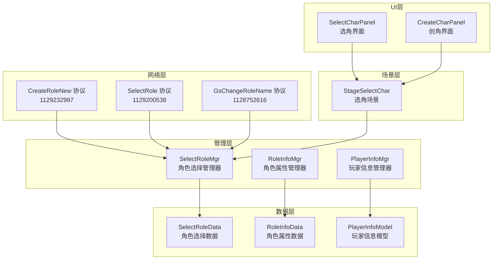
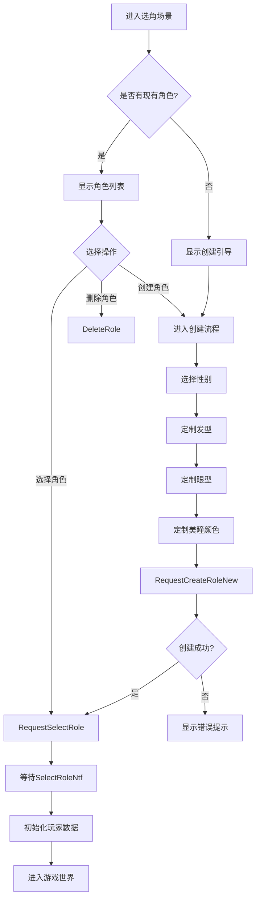

本页面详细阐述了Unity3D RO项目中角色创建与数据管理的完整架构，涵盖从角色创建、外观定制到数据持久化的全流程实现。该系统采用C#与Lua混合开发模式，通过网络协议与服务器进行数据同步，并通过本地数据管理器实现角色信息的高效存储与访问。

## 系统架构概览

角色创建与数据管理系统采用分层架构设计，包含数据层、管理层、场景层、UI层和网络层。系统核心职责包括：管理角色创建流程、处理角色外观定制数据、维护角色信息持久化以及实现与服务器的数据同步。整体架构通过事件驱动模式实现各层之间的解耦，确保系统的可维护性和扩展性。



## 核心数据结构

角色数据结构采用多层级设计，支持角色基本信息、外观定制信息、进度信息等多个维度的数据管理。所有角色数据通过`SelectRoleData`模块进行统一管理和缓存，确保数据的一致性和可访问性。

### 角色选择数据模型

`SelectRoleData`模块作为角色选择与创建的核心数据容器，维护了账号下所有角色的信息集合。该模块通过全局变量存储角色列表、创建状态和选择索引等关键信息，并提供了一系列数据访问和更新接口。

Sources: [Scripts/Lua/ModuleData/SelectRoleData.lua](Scripts/Lua/ModuleData/SelectRoleData.lua#L1-L50)

**核心数据字段**：

| 字段名 | 类型 | 说明 | 默认值 |
|--------|------|------|--------|
| `MALE` | int | 男性角色标识 | 0 |
| `FEMALE` | int | 女性角色标识 | 1 |
| `CreateCharCount` | int | 创角次数计数 | 0 |
| `RoleInfos` | table | 角色信息集合 | {} |
| `IsModifyStyle` | boolean | 是否正在修改造型 | false |
| `RoleSelectedIndex` | int | 当前选中角色索引 | 0 |
| `RegisterResult` | int | 注册结果状态 | 0 |
| `IsPreRegister` | boolean | 是否预注册成功 | false |

Sources: [Scripts/Lua/ModuleData/SelectRoleData.lua](Scripts/Lua/ModuleData/SelectRoleData.lua#L8-L30)

**角色信息结构**：

每个角色对象包含以下关键字段：

- `type` - 职业类型ID
- `roleID` - 角色唯一标识符
- `name` - 角色名称
- `level` - 基础等级
- `sex` - 性别（0=男，1=女）
- `outlook` - 外观定制数据
  - `hair_id` - 发型ID
  - `eye.eye_id` - 眼型ID
  - `eye.eye_style_id` - 美瞳颜色ID
- `role_index` - 角色在账号中的位置索引

Sources: [Scripts/Lua/ModuleData/SelectRoleData.lua](Scripts/Lua/ModuleData/SelectRoleData.lua#L200-L250)

### 角色属性数据模型

`RoleInfoData`模块负责管理角色的六维基础属性系统，包括力量（STR）、智力（INT）、敏捷（AGI）、灵巧（DEX）、体质（VIT）和幸运（LUK）。该模块实现了属性的多来源计算机制，支持基础属性、装备加成、Buff效果等多种属性来源的叠加计算。

Sources: [Scripts/Lua/ModuleData/RoleInfoData.lua](Scripts/Lua/ModuleData/RoleInfoData.lua#L1-L50)

**属性来源类型**：

| 类型ID | 类型名称 | 说明 |
|--------|----------|------|
| `ATTR_SOURCE_TYPE_INIT` | 0 | 初始基础属性 |
| `ATTR_SOURCE_TYPE_QUALITY_POINT` | 1 | 素质点加成 |
| `ATTR_SOURCE_TYPE_BUFF` | 2 | Buff效果加成 |
| `ATTR_SOURCE_TYPE_EQUIPMENT` | 3 | 装备加成 |

Sources: [Scripts/Lua/ModuleData/RoleInfoData.lua](Scripts/Lua/ModuleData/RoleInfoData.lua#L14-L20)

## 角色创建流程

角色创建流程采用双阶段设计，首先进入角色选择阶段，用户可以查看已有角色或选择创建新角色。在创建阶段，系统提供外观定制功能，允许用户调整发型、眼型和美瞳颜色等外观属性。创建流程通过网络协议与服务器交互，确保数据的合法性和持久化。



### 创建请求处理

创建角色的核心逻辑由`SelectRoleMgr`模块的`RequestCreateRoleNew`函数实现。该函数构建协议数据包，包含角色名称、性别、职业类型和外观定制信息，然后通过`Network.Handler.SendRpc`发送给服务器。系统通过`createCharWaitServerResponse`标志位防止重复提交请求，确保创建流程的幂等性。

Sources: [Scripts/Lua/ModuleMgr/SelectRoleMgr.lua](Scripts/Lua/ModuleMgr/SelectRoleMgr.lua#L200-L230)

**创建协议数据结构**：

```lua
CreateRoleArg {
    name: string,          -- 角色名称（初始使用默认名称）
    sex: int,              -- 性别（MALE=0, FEMALE=1）
    type: int,             -- 职业类型（固定为1000）
    hair_id: int,          -- 发型ID
    eye: {
        eye_id: int,       -- 眼型ID
        eye_style_id: int  -- 美瞳颜色ID
    }
}
```

Sources: [Scripts/Lua/ModuleMgr/SelectRoleMgr.lua](Scripts/Lua/ModuleMgr/SelectRoleMgr.lua#L207-L216)

### 创建响应处理

服务器返回的创建响应由`OnCreateRoleNew`函数处理。该函数首先检查响应结果码，针对不同的错误情况向用户展示相应的提示信息。如果创建成功，系统会将返回的角色数据添加到本地缓存，并立即发起选角请求以进入游戏。

Sources: [Scripts/Lua/ModuleMgr/SelectRoleMgr.lua](Scripts/Lua/ModuleMgr/SelectRoleMgr.lua#L232-L260)

**错误码处理**：

| 错误码 | 说明 | 提示信息键 |
|--------|------|------------|
| `ERR_NAME_EXIST` | 角色名已存在 | CREATE_ROLE_NAME_EXIST |
| `ERR_NAME_TOO_SHORT` | 角色名过短 | CREATE_ROLE_NAME_LENGTH |
| `ERR_NAME_TOO_LONG` | 角色名过长 | CREATE_ROLE_NAME_LENGTH |
| `ERR_INVALID_NAME` | 角色名非法 | CREATE_ROLE_NAME_ILLEGAL |
| `ERR_NAME_ALLNUM` | 角色名全为数字 | CREATE_ROLE_NAME_NUMBER |
| `ERR_CONTAIN_FORBID_WORD` | 角色名包含屏蔽词 | CREATE_ROLE_NAME_BLOCKWORD |

Sources: [Scripts/Lua/ModuleMgr/SelectRoleMgr.lua](Scripts/Lua/ModuleMgr/SelectRoleMgr.lua#L241-L252)

## 角色选择流程

角色选择流程允许用户在多个角色之间进行切换，或删除不再需要的角色。该流程通过`GetAccountRoleData`协议从服务器获取账号下所有角色信息，并在本地进行缓存管理。

### 账号角色数据获取

`GetAccountRoleData`函数负责向服务器请求账号下的角色列表数据。请求成功后，`OnGetAccountRoleData`回调函数会解析响应数据并更新本地的`RoleInfos`集合，同时刷新UI显示。

Sources: [Scripts/Lua/ModuleMgr/SelectRoleMgr.lua](Scripts/Lua/ModuleMgr/SelectRoleMgr.lua#L374-L399)

**账号数据结构**：

```lua
AccountData {
    register_result: int,        -- 注册结果状态
    select_role_index: int,      -- 当前选中的角色索引
    all_roles: [{
        role_index: int,         -- 角色索引
        roleID: uint64,          -- 角色UID
        name: string,            -- 角色名称
        level: int,              -- 角色等级
        sex: int,                -- 性别
        type: int,               -- 职业类型
        status: int              -- 角色状态
    }]
}
```

### 角色切换机制

游戏内角色切换通过`SwitchRoleInGame`函数实现，该函数发送`SwitchRole`协议请求切换到指定角色。切换成功后，系统会执行登出流程并重新登录，确保角色数据的完全重置。

Sources: [Scripts/Lua/ModuleMgr/SelectRoleMgr.lua](Scripts/Lua/ModuleMgr/SelectRoleMgr.lua#L277-L300)

### 角色删除与恢复

系统提供了角色删除和恢复功能，允许用户清理不再需要的角色或恢复误删的角色。删除和恢复操作分别通过`DeleteRole`和`ResumeRole`函数发起，服务器响应后会更新本地角色列表并触发数据变更事件。

Sources: [Scripts/Lua/ModuleMgr/SelectRoleMgr.lua](Scripts/Lua/ModuleMgr/SelectRoleMgr.lua#L342-L373)

## 外观定制系统

外观定制系统允许用户在角色创建或游戏过程中通过理发店、美容店等功能修改角色的外观。系统采用缓存机制保存用户的定制选择，支持发型、眼型、美瞳颜色等多个维度的定制。

### 外观数据缓存

`SelectRoleData`模块实现了外观定制数据的缓存功能。`GetCachedOrDefaultConfig`函数根据性别返回已缓存的外观配置或默认配置，`SaveCacheConfig`函数则用于保存用户的选择。这种设计确保了用户在不同操作之间的选择能够保持一致。

Sources: [Scripts/Lua/ModuleData/SelectRoleData.lua](Scripts/Lua/ModuleData/SelectRoleData.lua#L350-L390)

**外观配置结构**：

```lua
AppearanceConfig {
    BarberStyleID: int,   -- 发型样式ID
    Eye: int,             -- 眼型ID
    EyeColor: int         -- 美瞳颜色ID
}
```

### 默认配置生成

`getDefaultSelectCharConfig`函数负责生成基于职业表的默认外观配置。该函数通过查询职业表和默认装备表，获取对应性别和职业的初始发型、眼型和美瞳配置。

Sources: [Scripts/Lua/ModuleData/SelectRoleData.lua](Scripts/Lua/ModuleData/SelectRoleData.lua#L392-L459)

## 数据持久化与同步

角色数据的持久化通过服务器端存储实现，客户端主要负责数据的缓存和展示。系统采用事件驱动的方式确保数据的实时同步，当服务器数据发生变化时，会通过协议通知客户端进行相应更新。

### 选角成功处理

`OnSelectRoleNtf`函数是角色选角成功后的核心处理函数。该函数接收服务器发送的完整角色数据，包括基础信息、属性信息、背包数据等，并将这些数据分发到各个管理模块进行初始化。

Sources: [Scripts/Lua/ModuleMgr/SelectRoleMgr.lua](Scripts/Lua/ModuleMgr/SelectRoleMgr.lua#L57-L100)

**选角通知数据**：

```lua
SelectRoleNtfData {
    roleData: {
        brief: {
            roleid: uint64,
            name: string,
            type: int,
            level: int,
            job_level: int,
            sex: int,
            is_pre_register: bool,
            changenamecount: int
        },
        role_health: {
            bless_exp_list: [{
                base_exp: int,
                job_exp: int
            }],
            extra_fight_time: int
        }
    }
}
```

### 数据管理器通知机制

系统在选角成功后会通知一系列管理器进行数据初始化，这些管理器在`ESelectRoleNotify`枚举中定义，包括新手引导、角色信息、战斗、技能、背包、公会等三十余个模块。通过这种集中通知机制，确保了游戏各个系统能够在进入游戏世界前完成必要的数据准备。

Sources: [Scripts/Lua/ModuleData/SelectRoleData.lua](Scripts/Lua/ModuleData/SelectRoleData.lua#L16-L80)

## 事件系统

角色创建与数据管理系统使用事件分发器实现模块间的解耦通信。`SelectRoleMgr`模块定义了多个事件，用于通知UI层和场景层进行相应的状态更新。

### 核心事件列表

| 事件名称 | 触发时机 | 用途 |
|----------|----------|------|
| `ON_GET_RANDOM_NAME` | 获取随机名称成功 | 更新名称输入框 |
| `ON_SELECT_STEP_CHANGE_EVENT` | 选角步骤变更 | 刷新UI显示 |
| `ON_SELECT_MODEL_EVENT` | 选中角色模型 | 更新选中状态 |
| `ON_SELECT_TOG_EVENT` | 切换性别选项 | 刷新模型显示 |
| `SELECT_HAIR_STYLE_EVENT` | 更换发型 | 更新模型发型 |
| `SELECT_EYE_STYLE_EVENT` | 更换眼型 | 更新模型眼型 |
| `SHAKE_EVENT` | 震动效果触发 | 执行相机震动 |
| `ON_MODIFY_NAME` | 修改角色名 | 更新名称显示 |
| `CHANGE_ROLE` | 切换角色 | 刷新角色实体 |
| `ON_DATA_CHANGED` | 角色数据变更 | 更新UI列表 |

Sources: [Scripts/Lua/ModuleMgr/SelectRoleMgr.lua](Scripts/Lua/ModuleMgr/SelectRoleMgr.lua#L6-L30)

### 事件订阅示例

在`StageSelectChar`场景中，系统订阅了多个事件以响应管理器的状态变化：

```lua
l_mgr.EventDispatcher:Add(l_mgr.ON_SELECT_STEP_CHANGE_EVENT, function(self, step)
    self:RefreshStep(step)
end, self)

l_mgr.EventDispatcher:Add(l_mgr.SELECT_HAIR_STYLE_EVENT, function(self, hair)
    self:ChangeHairStyle(hair)
end, self)
```

Sources: [Scripts/Lua/Stage/StageSelectChar.lua](Scripts/Lua/Stage/StageSelectChar.lua#L44-L70)

## 网络协议注册

系统通过`Network_Init.lua`文件进行网络协议的注册和映射。所有角色相关的RPC协议都注册在`SelectRoleMgr`模块中，确保请求和响应能够正确路由到对应的处理函数。

### 协议注册表

| 协议名称 | 协议号 | 处理函数 | 文件 |
|----------|--------|----------|------|
| `SelectRole` | 1129200538 | `OnSelectRole` | SelectRoleMgr |
| `CreateRoleNew` | 1129232997 | `OnCreateRoleNew` | SelectRoleMgr |
| `GsChangeRoleName` | 1128752616 | `OnModifyName` | SelectRoleMgr |

Sources: [Scripts/Lua/Network/Network_Init.lua](Scripts/Lua/Network/Network_Init.lua#L100-L120)

### 协议发送示例

创建角色请求的发送方式：

```lua
local l_msgId = Network.Define.Rpc.CreateRoleNew
local l_sendInfo = GetProtoBufSendTable("CreateRoleArg")
l_sendInfo.name = Lang("PLAYER_INITIAL_NAME")
l_sendInfo.sex = l_data.SexSelected
l_sendInfo.type = 1000
l_sendInfo.hair_id = barberId
l_sendInfo.eye.eye_id = eyeId
l_sendInfo.eye.eye_style_id = eyeColorId
Network.Handler.SendRpc(l_msgId, l_sendInfo, nil, resetWaitState, resetWaitState, resetWaitState)
```

Sources: [Scripts/Lua/ModuleMgr/SelectRoleMgr.lua](Scripts/Lua/ModuleMgr/SelectRoleMgr.lua#L200-L220)

## 性能优化与注意事项

系统在实现过程中考虑了多个性能优化点，同时也存在一些需要注意的设计约束。

### 防重复提交机制

通过`createCharWaitServerResponse`标志位防止用户在网络延迟期间重复提交创角请求，避免创建重复角色。该标志位在请求发送前设置为true，在收到响应后重置为false。

Sources: [Scripts/Lua/ModuleMgr/SelectRoleMgr.lua](Scripts/Lua/ModuleMgr/SelectRoleMgr.lua#L18-L25)

### 数据缓存策略

外观配置数据通过`cachedCreateRoleConfig`进行缓存，避免重复查询配置表。该缓存按性别分别存储，确保男女性别的默认配置互不干扰。

Sources: [Scripts/Lua/ModuleData/SelectRoleData.lua](Scripts/Lua/ModuleData/SelectRoleData.lua#L350-L370)

### 注意事项

- 角色名称的最终修改发生在游戏内，创建时使用默认名称
- 外观数据的持久化需要通过游戏内的理发店、美容店等NPC实现
- 角色删除操作不可逆，需要用户确认
- 服务器等级数据会影响角色属性的加成效果
- 角色切换会触发完整的登出和登录流程

## 扩展阅读

理解角色创建与数据管理系统后，建议进一步学习以下相关主题：

- [装备与属性系统](17-zhuang-bei-yu-shu-xing-xi-tong) - 了解角色属性的计算和装备系统
- [技能系统实现](18-ji-neng-xi-tong-shi-xian) - 学习职业技能的获取和升级机制
- [UI框架设计](12-uikuang-jia-she-ji-ctrl-handler-panel-template) - 深入理解UI系统的架构设计
- [网络层架构与消息处理](11-wang-luo-ceng-jia-gou-yu-xiao-xi-chu-li) - 掌握网络协议的完整实现流程