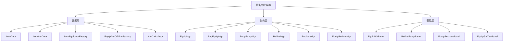

装备与属性系统是角色战斗力核心模块，负责管理角色的装备穿戴、属性计算、精炼、附魔、改造等深度养成功能。该系统通过C#与Lua混合架构实现，采用工厂模式构建装备数据，利用事件驱动机制实现属性变更的实时同步与界面更新。

## 系统架构概述

装备系统采用分层架构设计，从底层数据模型到上层UI表现形成完整链路。核心层包括属性计算引擎、装备数据工厂和状态管理器；业务层涵盖装备穿戴、精炼、附魔等功能模块；表现层提供丰富的UI交互界面。



Sources: [AttrCalculator.lua](Scripts/Lua/Common/AttrCalculator.lua#L1-L19)

## 核心数据模型

### ItemData 物品数据基类

ItemData是所有物品的基类，提供了物品ID、数量、类型等基础属性，同时支持属性数据的动态绑定。通过Lua的table机制实现灵活的属性存储和访问，支持从Protobuf数据、本地配置、RoItem等多种数据源创建实例。

Sources: [ItemData.lua](Scripts/Lua/Data/Model/ItemData.lua)

### ItemAttrData 属性数据容器

ItemAttrData专门用于存储装备的属性信息，包括基础属性、随机属性、精炼加成、附魔效果等多维度属性数据。该类支持属性的序列化与反序列化，确保数据在网络传输和本地持久化时的一致性。

Sources: [ItemAttrData.lua](Scripts/Lua/Data/Model/ItemAttrData.lua)

### 装备属性工厂模式

系统采用工厂模式创建装备属性数据，根据不同场景使用不同的工厂实现：

| 工厂类 | 用途 | 数据源 |
|--------|------|--------|
| ItemEquipAttrFactory | 在线装备属性创建 | 服务器Protobuf数据 |
| EquipAttrOffLineFactory | 离线装备属性创建 | 本地缓存数据 |
| ItemDataItemPBFactory | Protobuf物品数据创建 | 网络协议数据 |
| ItemDataRoItemFactory | RoItem数据创建 | 内部RoItem结构 |
| ItemDataLocalFactory | 本地物品数据创建 | 配置表数据 |

Sources: [ItemEquipAttrFactory.lua](Scripts/Lua/Data/Model/ItemEquipAttrFactory.lua), [EquipAttrOffLineFactory.lua](Scripts/Lua/Data/Model/EquipAttrOffLineFactory.lua)

## 属性计算系统

### AttrCalculator 属性计算器

AttrCalculator是属性计算的核心类，通过调用C#层的`AttributeCalculator.CalculateAttribute`方法实现高效的属性计算。该计算器支持：

- 基础属性累加：将装备的基础属性、随机属性、精炼属性等按规则累加
- 百分比加成处理：支持百分比形式的属性加成计算
- 套装效果计算：检测套装组合并应用套装属性加成
- 职业加成适配：根据角色职业应用不同的属性修正系数

```lua
function AttrCalculator:LuaGetAttr(key)
     return self[key] or 0
end

function AttrCalculator:LuaSetAttr(key, value)
	if value then
    	self[key] = math.floor(value)
    end
end

function AttrCalculator:CalculateAttribute()
	AttributeCalculator.CalculateAttribute(nil, self)
end
```

Sources: [AttrCalculator.lua](Scripts/Lua/Common/AttrCalculator.lua#L5-L16)

### FightAttr 战斗属性计算

FightAttr模块专门负责战斗相关属性的转换和计算，包括攻击力、防御力、生命值、暴击率、命中率等核心战斗属性的最终数值计算。

Sources: [FightAttr.lua](Scripts/Lua/Formula/FightAttr.lua)

## 装备管理模块

### EquipMgr 装备管理器

EquipMgr是装备系统的核心管理器，负责：

- 装备穿戴与脱下操作
- 装备槽位管理（武器、防具、饰品等10个槽位）
- 装备属性变更通知
- 套装状态检测与通知
- 装备耐久度管理

Sources: [EquipMgr.lua](Scripts/Lua/ModuleMgr/EquipMgr.lua)

### BagEquipMgr 背包装备管理

BagEquipMgr专门管理背包中的装备物品，提供装备的分类查询、筛选、排序功能，支持按装备类型、品质、职业等维度进行检索。

Sources: [BagEquipMgr.lua](Scripts/Lua/ModuleMgr/BagEquipMgr.lua)

### BodyEquipMgr 身体装备管理

BodyEquipMgr管理角色当前穿戴的装备，维护装备槽位状态，提供装备替换、装备对比等功能。

Sources: [BodyEquipMgr.lua](Scripts/Lua/ModuleMgr/BodyEquipMgr.lua)

## 装备强化系统

### RefineMgr 精炼管理器

RefineMgr负责装备的精炼强化功能，包括：

- 精炼等级提升与降级
- 精炼加成属性计算
- 精炼材料消耗验证
- 精炼成功率处理
- 精炼转移功能

Sources: [RefineMgr.lua](Scripts/Lua/ModuleMgr/RefineMgr.lua)

### RefineOrnamentMgr 饰品精炼管理

专门针对饰品类型装备的精炼管理，饰品精炼系统与普通装备精炼有不同的规则和属性加成算法。

Sources: [RefineOrnamentMgr.lua](Scripts/Lua/ModuleMgr/RefineOrnamentMgr.lua)

### RefineTransferMgr 精炼转移管理

支持将一件装备的精炼等级转移到另一件同类型装备上，保留精炼投入的价值。

Sources: [RefineTransferMgr.lua](Scripts/Lua/ModuleMgr/RefineTransferMgr.lua)

### RefineUnsealMgr 精炼解封管理

处理装备精炼等级的解封操作，解锁更高的精炼上限。

Sources: [RefineUnsealMgr.lua](Scripts/Lua/ModuleMgr/RefineUnsealMgr.lua)

## 装备附魔系统

### EnchantMgr 附魔管理器

EnchantMgr管理装备的附魔功能，包括：

- 附魔属性随机生成
- 附魔等级提升
- 附魔属性替换
- 附魔锁定机制
- 附魔材料消耗

Sources: [EnchantMgr.lua](Scripts/Lua/ModuleMgr/EnchantMgr.lua)

### EnchantInheritMgr 附魔继承管理

支持将旧装备的附魔效果继承到新装备上，保留附魔投入。

Sources: [EnchantInheritMgr.lua](Scripts/Lua/ModuleMgr/EnchantInheritMgr.lua)

### EnchantmentExtractMgr 附魔提取管理

提供从装备中提取附魔石的功能，将附魔效果转化为可交易的道具。

Sources: [EnchantmentExtractMgr.lua](Scripts/Lua/ModuleMgr/EnchantmentExtractMgr.lua)

## 装备改造系统

### EquipReformMgr 改造管理器

EquipReformMgr负责装备的高级改造功能，包括：

- 装备品质提升
- 改造属性随机
- 改造等级累积
- 特殊属性解锁
- 改造保护机制

Sources: [EquipReformMgr.lua](Scripts/Lua/ModuleMgr/EquipReformMgr.lua)

## 辅助功能模块

### EquipAssistantMgr 装备助手管理

提供智能装备推荐功能，根据角色职业、等级、战斗需求自动推荐最优装备组合。

Sources: [EquipAssistantMgr.lua](Scripts/Lua/ModuleMgr/EquipAssistantMgr.lua)

### EquipShardMgr 装备碎片管理

管理装备碎片的收集与合成，支持通过碎片兑换完整装备。

Sources: [EquipShardMgr.lua](Scripts/Lua/ModuleMgr/EquipShardMgr.lua)

### SuitMgr 套装管理器

SuitMgr负责套装系统的管理，包括：

- 套装组合检测
- 套装属性加成计算
- 套装激活状态管理
- 套装效果应用

Sources: [SuitMgr.lua](Scripts/Lua/ModuleMgr/SuitMgr.lua)

## UI界面系统

### 装备主界面

EquipBGPanel是装备系统的主界面，展示角色当前装备状态，提供装备穿戴、精炼、附魔等功能的入口。

Sources: [EquipBGPanel.lua](Scripts/Lua/UI/Panel/EquipBGPanel.lua)

### 精炼界面

RefineEquipPanel提供装备精炼操作界面，显示精炼等级、加成属性、成功率等信息。

Sources: [RefineEquipPanel.lua](Scripts/Lua/UI/Panel/RefineEquipPanel.lua)

### 附魔界面

EquipEnchantPanel提供装备附魔操作界面，支持附魔属性查看、附魔等级提升等功能。

Sources: [EquipEnchantPanel.lua](Scripts/Lua/UI/Panel/EquipEnchantPanel.lua)

### 改造界面

EquipGaiZaoPanel提供装备改造操作界面，展示改造效果和消耗材料。

Sources: [EquipGaiZaoPanel.lua](Scripts/Lua/UI/Panel/EquipGaiZaoPanel.lua)

## 属性工具类

### AttrUtilMgr 属性工具管理器

提供属性相关的工具方法，包括：

- 属性格式化显示
- 属性比较计算
- 属性加成解析
- 属性描述生成

Sources: [AttrUtilMgr.lua](Scripts/Lua/ModuleMgr/AttrUtilMgr.lua)

### AttrDescUtil 属性描述工具

专门负责属性文本的生成和格式化，提供符合游戏风格的属性描述。

Sources: [AttrDescUtil.lua](Scripts/Lua/ModuleMgr/AttrDescUtil.lua)

## 数据流与事件机制

装备系统采用事件驱动架构，当装备状态发生变化时，通过事件系统通知相关模块进行更新：

1. 装备穿戴/脱下 → 触发装备变更事件 → 重新计算角色属性 → 刷新UI显示
2. 精炼等级变化 → 触发精炼变更事件 → 更新装备属性 → 通知战斗模块
3. 附魔属性变化 → 触发附魔变更事件 → 重新计算战斗属性 → 更新属性面板

Sources: [EventConst.lua](Scripts/Lua/Event/EventConst.lua), [EventDispacher.lua](Scripts/Lua/Event/EventDispacher.lua)

## 下一步学习

理解装备与属性系统后，建议继续学习以下相关内容：

- [角色创建与数据管理](16-jiao-se-chuang-jian-yu-shu-ju-guan-li) - 了解角色数据管理的完整架构
- [技能系统实现](18-ji-neng-xi-tong-shi-xian) - 学习属性如何影响技能效果
- [战斗逻辑与数值计算](19-zhan-dou-luo-ji-yu-shu-zhi-ji-suan) - 深入了解战斗中属性的应用
- [物品与背包系统](22-wu-pin-yu-bei-bao-xi-tong) - 掌握物品系统的整体设计