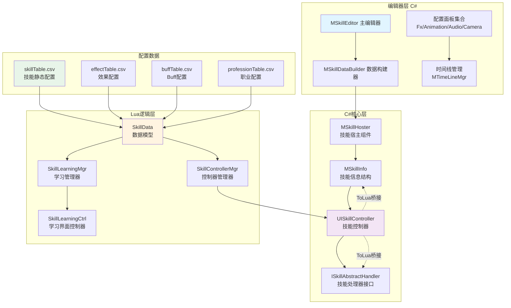
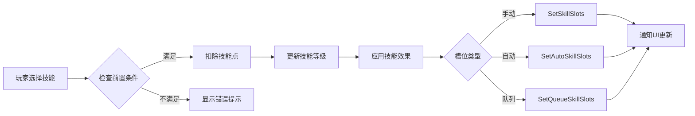

技能系统是战斗系统的核心组成部分，负责管理角色技能的学习、升级、配置以及执行。本系统采用C#核心层与Lua逻辑层的混合架构，通过ToLua框架实现跨语言交互，支持复杂的技能配置方案和时间线式特效管理。

## 系统架构概览

技能系统采用分层设计，从底层数据模型到上层UI表现形成完整的架构链条。核心组件包括数据模型层、逻辑管理层、UI表现层和编辑器工具层。



## 数据模型设计

### 核心数据结构

技能数据模型定义在 `ModuleData/SkillData.lua` 中，包含技能系统的全部静态配置和动态状态数据。

**静态数据表**：
- `skillTable` - 技能基础信息表，包含技能ID、职业、前置技能、升级消耗等
- `effectTable` - 技能效果表，定义技能的数值效果
- `passivityEffectTable` - 被动技能效果表
- `buffTable` - Buff效果配置表
- `professionTable` - 职业配置表，关联职业与可用技能
- `elementAttrTable` - 元素属性配置表
- `skillClassRecommandTable` - 技能职业推荐表

**动态状态数据**：
```lua
-- 技能方案系统
SkillPlans = {}              -- 玩家技能加点方案集合
PlanNames = {}               -- 方案名称列表
OpenPlanIds = {}             -- 已开启的技能方案页

-- 技能槽位管理
SlotCount = MGlobalConfig:GetInt("MaxSlotNum")  -- 单页技能槽数量
SkillQueueId = MGlobalConfig:GetInt("QueueSkillId")  -- 技能队列ID

-- 技能学习状态
chooseLv = 1                 -- 当前选择的技能等级
remainingPoint = 0           -- 剩余技能点
useMaxLevel = false          -- 是否使用最高等级

-- 职业系统
CurrentMaxProType = 3        -- 当前最高转职等级
JobAwardHasBeenTaked = {}    -- 已领取的职业奖励
```

### C#技能信息结构

`MoonClient.MSkillInfo` 定义了技能运行时的核心数据结构：

```lua
---@class MoonClient.MSkillInfo
---@field public id number              -- 技能ID
---@field public lv number              -- 技能等级
---@field public currentSkillId number  -- 当前技能ID
---@field public currentSkillLv number  -- 当前技能等级
---@field public effectId number        -- 效果ID
---@field public ReplaceSkillId number  -- 替换技能ID
---@field public ReplaceSkillLv number  -- 替换技能等级
```

Sources: [Scripts/Lua/UnityLuaAPI/MoonClient_MSkillInfo.lua](Scripts/Lua/UnityLuaAPI/MoonClient_MSkillInfo.lua#L1-L31)

## 技能学习系统

### 技能点应用机制

技能学习管理器 `SkillLearningMgr` 负责处理技能点的分配和应用。系统支持三种技能槽位模式：

| 槽位类型 | 说明 | 最大槽数 | 用途 |
|---------|------|---------|------|
| 手动槽 | 玩家手动触发的技能 | MaxManualSlot | 主战斗技能 |
| 自动槽 | 系统自动触发的技能 | MaxAutoSlot | 辅助技能、Buff技能 |
| 队列槽 | 按顺序执行的技能链 | MaxQueueSlot | 连招系统 |

技能点应用的核心流程：



Sources: [Scripts/Lua/ModuleMgr/SkillLearningMgr.lua](Scripts/Lua/ModuleMgr/SkillLearningMgr.lua#L66-L105)

### 技能方案系统

技能方案允许玩家保存多套技能配置，支持快速切换。方案数据结构包含多个槽位组：

```lua
-- 应用技能方案
function ApplySkillPlan(planId)
    local skillPlan = skillData.GetCurSkillPlan(planId)
    local mainSlot1 = {}   -- 主手动槽组1
    local mainSlot2 = {}   -- 主手动槽组2
    local autoSlot = {}    -- 自动槽组
    local queueSlot = {}   -- 队列槽组
    
    for i, v in ipairs(skillPlan.slots) do
        if v.type == 0 then
            mainSlot1 = v
        elseif v.type == 1 then
            mainSlot2 = v
        elseif v.type == 2 then
            autoSlot = v
        elseif v.type == 3 then
            queueSlot = v
        end
    end
    -- 应用到各槽位...
end
```

Sources: [Scripts/Lua/ModuleMgr/SkillLearningMgr.lua](Scripts/Lua/ModuleMgr/SkillLearningMgr.lua#L113-L150)

### 职业转职系统

技能系统与职业系统深度集成，支持多转职：

| 转职等级 | 标识 | 职业ID格式 | 说明 |
|---------|------|-----------|------|
| 初心者 | BASE_SKILL | 1000 | 所有玩家共有 |
| 一转 | PRO_ONE | x000 | 职业分化开始 |
| 二转 | PRO_TWO | xx01 | 职业进阶 |
| 二转进阶 | PRO_THREE | xx02 | 高级职业形态 |

转职条件通过全局配置表定义：
```lua
-- 玩家允许转职基础等级
BaseChangeLevel = string.ro_split(TableUtil.GetGlobalTable().GetRowByName("BaseChangeLevel").Value, "|")
-- 玩家允许转职职业等级  
JobChangeLevel = string.ro_split(TableUtil.GetGlobalTable().GetRowByName("JobChangeLevel").Value, "|")
```

Sources: [Scripts/Lua/ModuleData/SkillData.lua](Scripts/Lua/ModuleData/SkillData.lua#L73-L75)

## 技能控制器系统

### 控制器UI架构

技能控制器 `UISkillController` 是战斗中技能释放的核心UI组件，负责技能的显示、交互和状态管理。

**核心字段**：
```lua
---@class MoonClient.UISkillController : MoonClient.MBaseUI
---@field public Panel MoonClient.SkillControllerPanel  -- 控制器面板
---@field public SlotPage number                           -- 当前槽位页
---@field public CastingSkill MoonClient.MSkillCore       -- 当前释放中的技能
---@field public CastSlot MoonClient.MCsUICom             -- 释放槽位UI
---@field public CastSkillInfo MoonClient.MSkillInfo      -- 释放技能信息
---@field public SkillHandler MoonClient.ISkillAbstractHandler -- 技能处理器
```

**槽位分页系统**：
```lua
SLOT_PAGE_PLAYERPREFS = "SkillSlotPage"  -- 玩家偏好键名
SLOT_PAGE_COUNT = 3                       -- 总页数
MAX_SLOT_PAGE = 2                        -- 最大页索引
```

Sources: [Scripts/Lua/UnityLuaAPI/MoonClient_UISkillController.lua](Scripts/Lua/UnityLuaAPI/MoonClient_UISkillController.lua#L1-L69)

### 控制器管理器

`SkillControllerMgr` 提供控制器生命周期的统一管理：

```lua
-- 激活/停用控制器
function ActiveSkillController()
    UIMgr:ActiveUI(UI.CtrlNames.SkillControllerContainer)
end

function DeActiveSkillController()
    UIMgr:DeActiveUI(UI.CtrlNames.SkillControllerContainer)
end

-- 根据游戏状态刷新UI
function RefreshSkillUI()
    local player = MEntityMgr.PlayerEntity
    if player == nil then return end
    
    if player.IsFly or player.IsFishing then
        -- 飞行或垂钓时隐藏
        UIMgr:SetPanelForceHide(UI.CtrlNames.SkillControllerContainer)
    else
        -- 正常状态显示
        UIMgr:CancelPanelForceHide(UI.CtrlNames.SkillControllerContainer)
    end
end
```

Sources: [Scripts/Lua/ModuleMgr/SkillControllerMgr.lua](Scripts/Lua/ModuleMgr/SkillControllerMgr.lua#L1-L81)

## 编辑器工具系统

### 技能编辑器主窗口

`MSkillEditor` 是技能配置的核心编辑器工具，提供技能数据的可视化编辑界面。

**核心功能**：
- 创建新技能（快捷键 Ctrl+I）
- 生成所有技能字节数据
- 男性/女性技能数据互转（快捷键 Ctrl+Shift+I）
- 切换Bandpose和动画（快捷键 F1）

```csharp
[MenuItem(@"ROTools/SkillTools/Create Skill %i")]
static void CreateSkill()
{
    EditorWindow.GetWindow<SkillEditor>(@"Skill Editor");
}

[MenuItem(@"ROTools/SkillTools/Copy Male To Female %&i")]
static void CopyMaleToFemale()
{
    string dir = EditorUtility.OpenFolderPanel("Select skill dir", SKILL_DATA_DIR, "");
    if (!string.IsNullOrEmpty(dir))
    {
        // 执行性别转换逻辑
        DoCopyMaleToFemaleSkillData(srcDirName, desDirName);
    }
}
```

Sources: [artres/Editor/SkillTools/MSkillEditor.cs](artres/Editor/SkillTools/MSkillEditor.cs#L1-L200)

### 技能数据构建器

`MSkillDataBuilder` 负责将配置文件加载到可编辑的GameObject实例中：

```csharp
public static void ColdBuild(GameObject prefab, MConfigData conf)
{
    // 实例化角色预制体
    hoster = UnityEngine.Object.Instantiate(prefab, ...) as GameObject;
    
    // 添加技能宿主组件
    MSkillHoster component = hoster.AddComponent<MSkillHoster>();
    component.isRole = conf.isRole;
    component.atrr_id = conf.Player;
    component.isMale = conf.IsMale;
    
    // 反序列化技能数据
    component.SkillData = SerializeUtil.DeserializeXml<PbLocal.Xml.MSkillData>(file);
    
    // 初始化配置
    conf.OnDeserialization(component);
    component.init();
}
```

Sources: [artres/Editor/SkillTools/MSkillDataBuilder.cs](artres/Editor/SkillTools/MSkillDataBuilder.cs#L1-L150)

### 特效配置面板

`MSkillFxPanel` 提供技能特效的时间线配置，支持基于施法者或目标的特效类型：

| 特效类型 | 说明 | 可配置参数 |
|---------|------|-----------|
| FirerBased | 基于施法者 | Bone绑定、Offset、Scale、播放时间 |
| TargetBased | 基于目标 | 目标偏移、多目标支持、高度百分比 |

```csharp
public static void DrawOneFxData(int i, float SkillClipFrame, MSkillHoster hoster,
    ref List<PbLocal.Xml.MSkillFxData> FxList, 
    ref List<MFxDataExtra> ConfigFxList)
{
    // 特效类型选择
    FxList[i].Type = (PbLocal.Xml.ESkillFxType)EditorGUILayout.EnumPopup("Type Based on", FxList[i].Type);
    
    // 特效ID
    FxList[i].Fx = EditorGUILayout.IntField("Fx ID ", FxList[i].Fx);
    
    // 骨骼绑定
    if (FxList[i].Type == PbLocal.Xml.ESkillFxType.ESkillFxType_FirerBased)
    {
        ConfigFxList[i].BindTo = EditorGUILayout.ObjectField("Bone", ConfigFxList[i].BindTo, typeof(GameObject), true) as GameObject;
    }
    
    // 时间线配置
    float fx_at = (FxList[i].At / DrawSkillPanel.frame);
    ConfigFxList[i].Ratio = EditorGUILayout.Slider("Ratio", ConfigFxList[i].Ratio, beginRatio, 1);
}
```

Sources: [artres/Editor/SkillTools/SkillListPanel/MSkillFxPanel.cs](artres/Editor/SkillTools/SkillListPanel/MSkillFxPanel.cs#L1-L150)

## 技能UI交互系统

### 技能学习界面

`SkillLearningCtrl` 是技能学习的主界面控制器，采用模态独占模式：

```lua
function SkillLearningCtrl:ctor()
    super.ctor(self, CtrlNames.SkillLearning, UILayer.Function, 
                UITweenType.UpAlpha, ActiveType.Exclusive)
    self.isPreviewPanel = false
    self.cacheAddedSkillPoint = {}
    self.mgr = MgrMgr:GetMgr("SkillLearningMgr")
    self.data = DataMgr:GetData("SkillData")
end
```

**核心交互功能**：
- 职业切换Toggle组
- 技能点分配面板
- 技能预览功能
- 技能方案切换
- 重置技能点

Sources: [Scripts/Lua/UI/Ctrl/SkillLearningCtrl.lua](Scripts/Lua/UI/Ctrl/SkillLearningCtrl.lua#L1-L150)

### 拖拽系统实现

技能槽位支持拖拽交换功能：

```lua
-- 初始化拖拽相关变量
local l_eventSystem
local l_pointEventData
local l_dragOut = false
local l_dragStartPos = Vector2.zero
local l_dragItem

-- 槽位分组
SLOT_GROUP_ONE = 0     -- 手动槽组1
SLOT_GROUP_TWO = 1     -- 手动槽组2
SLOT_GROUP_AUTO = 2    -- 自动槽组
```

Sources: [Scripts/Lua/UI/Ctrl/SkillLearningCtrl.lua](Scripts/Lua/UI/Ctrl/SkillLearningCtrl.lua#L20-L35)

## 技能类型与配置

### 技能类型枚举

系统支持多种技能类型，通过不同的逻辑处理器实现：

- **普通技能** - 标准的主动技能
- **被动技能** - 自动生效的效果技能
- **引导技能** - 需要持续施法的技能
- **瞬发技能** - 无施法时间的技能
- **QTE技能** - 交互式技能
- **双重释放技能** - 可连击的技能

### 配置文件结构

技能数据以XML格式存储，包含以下主要配置段：

```xml
<MSkillData>
    <TypeToken>技能类型</TypeToken>
    <ClipName>动画剪辑名称</ClipName>
    <FxList>特效列表</FxList>
    <AudioList>音频列表</AudioList>
    <CameraEffectList>摄像机效果</CameraEffectList>
    <ResultList>伤害结果配置</ResultList>
    <ChannellingData>引导数据</ChannellingData>
</MSkillData>
```

## 扩展与集成

### 技能处理器接口

`ISkillAbstractHandler` 定义了技能处理的标准接口，允许不同技能类型实现自定义逻辑：

```lua
---@class MoonClient.ISkillAbstractHandler
function MoonClient.ISkillAbstractHandler:OnCast() end
function MoonClient.ISkillAbstractHandler:OnUpdate() end
function MoonClient.ISkillAbstractHandler:OnEnd() end
```

### 与Buff系统集成

技能效果可以添加Buff，Buff系统通过 `MBuffComponent` 和 `MBuff` 管理Buff的添加、移除和效果应用。

Sources: [Scripts/Lua/UnityLuaAPI/MoonClient_MBuff.lua](Scripts/Lua/UnityLuaAPI/MoonClient_MBuff.lua)

### 与特效系统集成

技能特效通过 `MFxMgr` 统一管理，支持特效的创建、销毁和生命周期控制。

Sources: [Scripts/Lua/UnityLuaAPI/MoonClient_MFxMgr.lua](Scripts/Lua/UnityLuaAPI/MoonClient_MFxMgr.lua)

## 性能优化策略

1. **对象池** - 技能特效使用 `MResGoPool` 进行对象池管理
2. **按需加载** - 技能数据在进入场景时按需加载
3. **时间线优化** - 特效播放时间按比例配置，减少精度计算
4. **UI层级管理** - 战斗中隐藏非必要UI减少Draw Call

## 调试与测试

编辑器工具提供丰富的调试功能：
- 技能数据验证
- 特效实时预览
- 时间线可视化编辑
- 性能分析集成

## 下一步学习

了解技能系统后，建议继续学习以下相关内容：

- [战斗逻辑与数值计算](19-zhan-dou-luo-ji-yu-shu-zhi-ji-suan) - 深入了解技能伤害计算和战斗结算
- [Buff系统](Scripts/Lua/UnityLuaAPI/MoonClient_MBuff.lua) - 掌握Buff的状态管理机制
- [UI框架设计](12-uikuang-jia-she-ji-ctrl-handler-panel-template) - 理解技能UI的架构模式
- [DOTween动画补间](35-dotweendong-hua-bu-jian) - 学习技能动画的补间实现
- [Cinemachine摄像机控制](34-cinemachineshe-xiang-ji-kong-zhi) - 了解技能释放时的摄像机特效