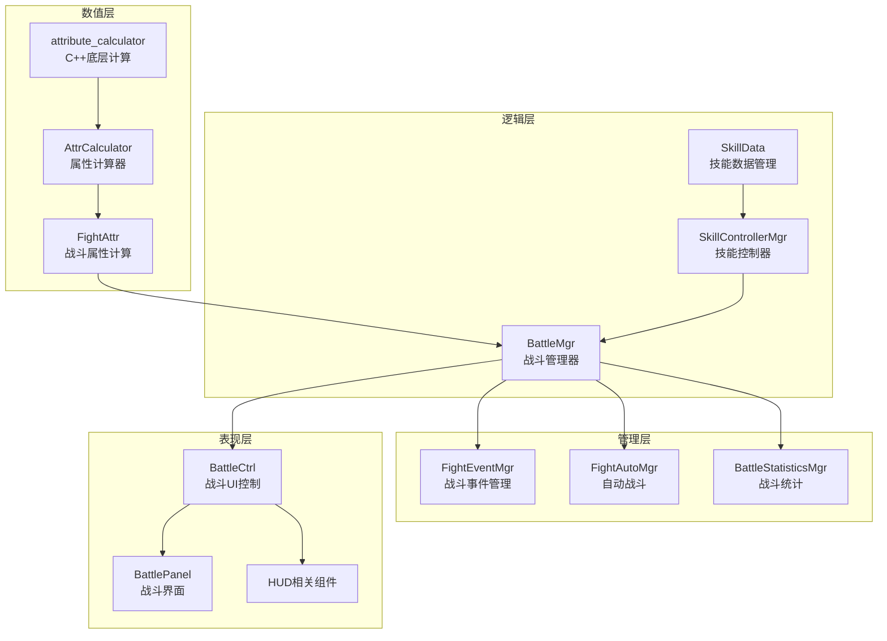
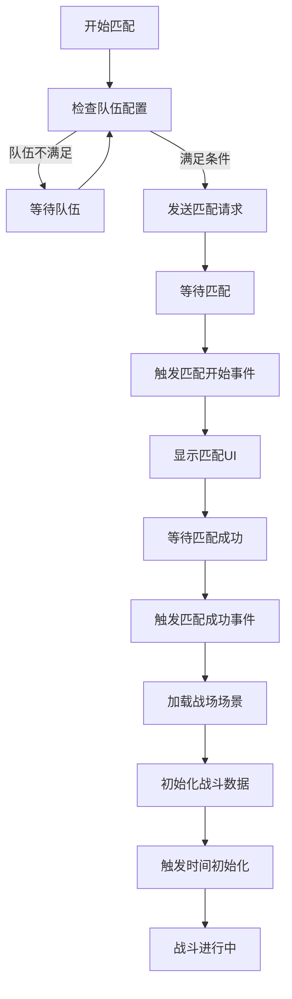

本文档深入剖析RO客户端的战斗系统架构，涵盖数值计算、技能逻辑、战斗流程管理及表现层协调等核心机制。

## 战斗系统架构概览

战斗系统采用分层架构设计，将数值计算、战斗逻辑、事件管理和表现呈现解耦，确保系统的可维护性和扩展性。核心架构由数值层、逻辑层、管理层和表现层四部分组成。



**架构特点**：

| 层级 | 职责 | 核心模块 |
|------|------|----------|
| 数值层 | 属性计算、公式应用、数值平衡 | FightAttr.lua, AttrCalculator.lua |
| 逻辑层 | 战斗流程、技能释放、状态管理 | BattleMgr.lua, SkillControllerMgr.lua |
| 管理层 | 事件分发、自动化、数据统计 | FightEventMgr.lua, FightAutoMgr.lua |
| 表现层 | UI更新、特效播放、HUD显示 | BattleCtrl.lua, BattlePanel.lua |

Sources: [FightAttr.lua](Scripts/Lua/Formula/FightAttr.lua#L1-L32), [AttrCalculator.lua](Scripts/Lua/Common/AttrCalculator.lua#L1-L19), [BattleMgr.lua](Scripts/Lua/ModuleMgr/BattleMgr.lua#L1-L100)

## 战斗数值计算系统

战斗数值计算是战斗系统的核心，负责处理角色属性、技能效果、伤害公式等数值运算。系统采用Lua与C++混合架构，确保计算效率和灵活性。

### 属性计算框架

属性计算器采用**基类+继承**的设计模式，通过Lua层接口封装底层C++计算逻辑。

**AttrCalculator基类实现**：

```lua
module("Common", package.seeall)
require "attribute_calculator"
AttrCalculator = class("AttrCalculator")

function AttrCalculator:LuaGetAttr(key)
     return self[key] or 0
end

function AttrCalculator:LuaSetAttr(key, value)
    if value then
        self[key] = math.floor(value)
    end
end

function AttrCalculator:CalculateAttribute()
    AttributeCalculator.CalculateAttribute(nil, self)
end
```

**设计要点**：
- **封装性**：Lua层提供统一的接口，隐藏底层实现细节
- **精度控制**：使用`math.floor`确保数值精度，避免浮点误差
- **委托模式**：实际计算委托给C++的`attribute_calculator`模块

Sources: [AttrCalculator.lua](Scripts/Lua/Common/AttrCalculator.lua#L1-L19)

### 战斗属性计算模块

FightAttr模块专注于战斗相关的属性计算，包括**吟唱时间**、**公共冷却**、**伤害计算**等。

**吟唱时间计算公式**：

```lua
function FightAttr.GetSingingTimeByAttr(effectDetail)
    local sfixedSingTime = effectDetail.PVEFixSingingTime      -- 技能固定吟唱时间
    local sVarSingTime = effectDetail.PVEFloatSingingTime     -- 技能可变吟唱时间
    local sPVEGroupCoolTime = effectDetail.PVEGroupCoolTime   -- 技能公共冷却时间

    -- 获取角色属性
    local fixedSingTime = MEntityMgr:GetMyPlayerAttr(AttrType.ATTR_BASIC_CT_FIXED_FINAL) / 10000
    local fixedSingTimePresent = MEntityMgr:GetMyPlayerAttr(AttrType.ATTR_PERCENT_CT_FIXED_FINAL) / 10000
    local varSingTime = MEntityMgr:GetMyPlayerAttr(AttrType.ATTR_BASIC_CT_CHANGE_FINAL) / 10000
    local varSingTimePresent = MEntityMgr:GetMyPlayerAttr(AttrType.ATTR_PERCENT_CT_CHANGE_FINAL) / 10000

    -- 计算最终吟唱时间
    return math.max(0, fixedSingTime + sfixedSingTime) * math.max(0, (1 + fixedSingTimePresent)),
           math.max(0, varSingTime + sVarSingTime) * math.max(0, (1 + varSingTimePresent)),
           math.max(0, sPVEGroupCoolTime)
end
```

**计算逻辑分解**：

| 计算项 | 公式 | 说明 |
|--------|------|------|
| 固定吟唱 | (角色基础固定 + 技能固定) × (1 + 角色固定百分比) | 基础值与技能值叠加后应用百分比修正 |
| 可变吟唱 | (角色基础可变 + 技能可变) × (1 + 角色可变百分比) | 同上，处理可变部分 |
| 公共冷却 | 技能配置值 | 直接使用技能配置的GCD |

**设计亮点**：
- **百分比常量**：使用10000作为百分比分母，避免浮点运算
- **防御式编程**：使用`math.max(0, ...)`确保结果非负
- **属性归一化**：通过枚举统一管理属性类型，便于维护

Sources: [FightAttr.lua](Scripts/Lua/Formula/FightAttr.lua#L11-L32)

## 战斗管理器

BattleMgr是战斗系统的核心管理器，负责战场状态管理、阵营协调、数据统计等全局功能。

### 战场阵营管理

系统支持**双阵营PVP**模式，通过枚举常量管理阵营标识。

**阵营定义**：

```lua
-- 通过ROGameLibs枚举获取阵营类型
g_fight1 = MLuaClientHelper.GetROGameLibsEnumValue(ROGameLibs.FightGroupType.kFightPVPCamp1)
g_fight2 = MLuaClientHelper.GetROGameLibsEnumValue(ROGameLibs.FightGroupType.kFightPVPCamp2)
```

**战场对象标识**：
```lua
-- 对象类型标识
m1 = 40001  -- 阵营1
m2 = 40002  -- 阵营2
s1 = 40003  -- 特殊对象1
s2 = 40004  -- 特殊对象2
p1 = 40005  -- 阵营1玩家
p2 = 40006  -- 阵营2玩家
```

**核心状态变量**：
- `l_playerFightGroup` - 玩家所在战斗阵营
- `l_myDoorId/l_targetDoorId` - 己方/敌方门禁ID
- `l_myStoneId/l_targetStoneId` - 己方/敌方据点ID
- `l_myFire/l_targetFire` - 己方/敌方火种ID
- `l_mySkill/l_targetSkill` - 己方/敌方技能ID
- `m_battleTime` - 战场总时长
- `m_passTime` - 战场已过时长
- `m_type` - 战场类型

Sources: [BattleMgr.lua](Scripts/Lua/ModuleMgr/BattleMgr.lua#L6-L25)

### 战斗数据统计系统

系统实现了完善的战斗数据统计，用于实时监控和结算展示。

**参数类型映射**：

```lua
C_PARAM_TYPE_NAME_MAP = {
    [MLuaClientHelper.GetROGameLibsEnumValue(ROGameLibs.PVPType.PVP_PLAYER_KILL_NUM)] = "Kill",
    [MLuaClientHelper.GetROGameLibsEnumValue(ROGameLibs.PVPType.PVP_PLAYER_BE_KILLED_NUM)] = "Death",
    [MLuaClientHelper.GetROGameLibsEnumValue(ROGameLibs.PVPType.PVP_PLAYER_ASSIST_NUM)] = "AssistKill",
}
```

**战斗标签系统**：

```lua
C_BATTLE_TAG_TYPE_CONFIG_KEY_MAP = {
    [GameEnum.EBattleFieldTagType.MostKill] = "BgMaxKillIcon",       -- 击杀之王
    [GameEnum.EBattleFieldTagType.MostDamage] = "BgMaxDamageIcon",   -- 伤害之王
    [GameEnum.EBattleFieldTagType.MostAssist] = "BgMaxAssistIcon",   -- 助攻之王
    [GameEnum.EBattleFieldTagType.MostHeal] = "BgMaxHealIcon",       -- 治疗之王
}
```

**数据存储结构**：
- `_battleFieldCampData` - 战场阵营数据，类型为`table<number, table<uint64, BattleFieldKDA>>`
- `_battleGuideData` - 战场引导数据，记录历史玩家账号
- `g_campInfo` - 战场结算数据包
- `g_result` - 战斗结果标志
- `g_dailyBattleCount` - 每日战斗次数统计

Sources: [BattleMgr.lua](Scripts/Lua/ModuleMgr/BattleMgr.lua#L28-L54)

### 事件系统

BattleMgr使用事件驱动模式，通过EventDispatcher分发战斗相关事件。

**核心事件定义**：

| 事件名称 | 触发时机 | 用途 |
|----------|----------|------|
| ON_UPDATE_HP | 生命值变化 | 更新UI血条 |
| ON_MONSTER_HP_UPDATE | 怪物生命变化 | 更新怪物血条 |
| ON_UPDATE_NUMBER | 数值更新 | 更新战斗数值显示 |
| ON_PI_PEI_SUCCESS | 匹配成功 | 进入战斗准备 |
| ON_PI_PEI_START | 匹配开始 | 显示匹配UI |
| ON_PI_PEI_STOP | 匹配停止 | 隐藏匹配UI |
| ON_FIGHT_GROUP_CHANGE | 阵营变化 | 更新阵营信息 |
| ON_INIT_TIME_INFO | 时间初始化 | 设置战斗倒计时 |

Sources: [BattleMgr.lua](Scripts/Lua/ModuleMgr/BattleMgr.lua#L67-L80)

## 技能系统实现

技能系统是战斗逻辑的核心组成部分，包含技能数据管理、控制器和编辑器工具。

### 技能数据管理

SkillData模块负责技能配置数据的加载、缓存和查询，是技能系统的数据基础。

**编辑器工具链**：

位于`artres/_Editor/Skill/`目录的技能编辑器提供了完整的可视化配置工具：

| 工具类 | 功能 |
|--------|------|
| MSkillEditorTableMgr | 技能表格管理器，处理Excel数据导入 |
| MSkillHoster | 技能宿主，管理技能实例生命周期 |
| MSkillRole | 角色技能配置，处理职业技能绑定 |
| MSkillScene | 场景技能配置，处理场景内特殊技能 |
| MSkillScript | 技能脚本，处理技能Lua脚本编辑 |
| MSkillShell | 技能外壳，提供技能运行时容器 |

**编辑器场景**：
- `SkillScene/skillEditor.unity` - 技能编辑器主场景

Sources: [Skill目录结构](artres/_Editor/Skill#L1-L20)

### 技能控制器

SkillControllerMgr模块负责技能的释放逻辑、冷却管理、目标选择等运行时行为。

**核心功能模块**：
- 技能释放判定（距离、范围、状态）
- 冷却时间管理（个人CD、公共CD）
- 目标选择逻辑（单体、范围、自动锁定）
- 技能链式触发（连招、组合技）

Sources: [SkillControllerMgr.lua](Scripts/Lua/ModuleMgr/SkillControllerMgr.lua)

## 战斗流程管理

战斗流程管理涵盖了从匹配开始到战斗结算的完整生命周期。

### 战斗匹配流程



**关键节点**：
1. **队伍检查**：通过`g_teamRequireNum`验证队伍规模
2. **UI反馈**：通过事件系统更新匹配界面
3. **数据初始化**：加载阵营、据点、火种等战场对象

Sources: [BattleMgr.lua](Scripts/Lua/ModuleMgr/BattleMgr.lua#L40-L54)

### 战斗进行阶段

战斗进行时，系统实时处理以下逻辑：

| 模块 | 职责 | 更新频率 |
|------|------|----------|
| FightEventMgr | 事件分发 | 每帧 |
| FightAutoMgr | 自动战斗 | 每秒 |
| BattleStatisticsMgr | 数据统计 | 事件驱动 |
| BattleCtrl | UI更新 | 事件驱动 |

**战斗循环逻辑**：
```
Update → 事件收集 → 数值计算 → 状态更新 → UI刷新 → 特效播放
```

Sources: [FightEventMgr.lua](Scripts/Lua/ModuleMgr/FightEventMgr.lua), [FightAutoMgr.lua](Scripts/Lua/ModuleMgr/FightAutoMgr.lua)

## 数值平衡与扩展

战斗系统的数值设计考虑了多维度平衡和扩展性。

### 属性系统设计

属性系统采用**基础值+百分比**的双层结构，确保数值调整的灵活性。

**属性分类**：
- **基础属性**：攻击力、防御力、生命值等
- **百分比属性**：攻击加成、防御加成、伤害加成等
- **特殊属性**：暴击率、暴击伤害、命中、闪避等

**计算优先级**：
```
最终值 = (基础值 + 装备加成 + Buff加成) × (1 + 百分比加成) + 固定加成
```

### 扩展点设计

系统预留了多个扩展点，便于后续功能开发：

| 扩展点 | 位置 | 扩展方式 |
|--------|------|----------|
| 新属性类型 | AttrType枚举 | 添加新枚举值 |
| 新技能效果 | SkillData模块 | 扩展EffectDetail结构 |
| 新战斗模式 | BattleMgr模块 | 添加新的m_type处理 |
| 新统计项 | BattleStatisticsMgr | 扩展C_PARAM_TYPE_NAME_MAP |

Sources: [FightAttr.lua](Scripts/Lua/Formula/FightAttr.lua#L11-L32), [BattleMgr.lua](Scripts/Lua/ModuleMgr/BattleMgr.lua#L28-L54)

## 性能优化策略

战斗系统在性能优化方面采用了多种策略，确保在复杂场景下的流畅运行。

**计算优化**：
- **批量计算**：属性计算采用批量模式，减少函数调用开销
- **缓存机制**：技能配置数据缓存，避免重复查询
- **数值预计算**：常用数值预先计算并存储

**事件优化**：
- **事件节流**：高频事件（如HP更新）采用节流处理
- **按需更新**：UI更新仅当数值真正变化时触发
- **异步处理**：非关键逻辑使用协程异步执行

**内存优化**：
- **对象池**：战斗对象使用对象池复用
- **数据压缩**：战斗数据采用紧凑存储格式
- **资源卸载**：战斗结束及时释放战斗资源

## 调试与测试

战斗系统提供了丰富的调试和测试工具，便于开发和平衡调整。

**调试工具**：
- **GM命令**：通过GM系统直接修改战斗参数
- **战斗日志**：记录关键战斗事件用于回溯
- **性能监控**：集成UWA性能分析工具

**测试支持**：
- **技能编辑器**：可视化编辑和预览技能
- **战斗模拟**：支持离线战斗模拟测试
- **数据导出**：战斗数据可导出用于平衡分析

Sources: [BattleMgr.lua](Scripts/Lua/ModuleMgr/BattleMgr.lua#L1-L100), [GM系统](Scripts/Lua/UI/Ctrl/GMCtrl.lua)

## 相关文档

战斗系统与其他系统紧密集成，建议结合以下文档全面理解：

- [技能系统实现](18-ji-neng-xi-tong-shi-xian) - 深入了解技能配置和释放机制
- [角色创建与数据管理](16-jiao-se-chuang-jian-yu-shu-ju-guan-li) - 理解角色属性系统
- [UI框架设计](12-uikuang-jia-she-ji-ctrl-handler-panel-template) - 掌握战斗UI的实现方式
- [网络层架构与消息处理](11-wang-luo-ceng-jia-gou-yu-xiao-xi-chu-li) - 了解战斗网络同步机制