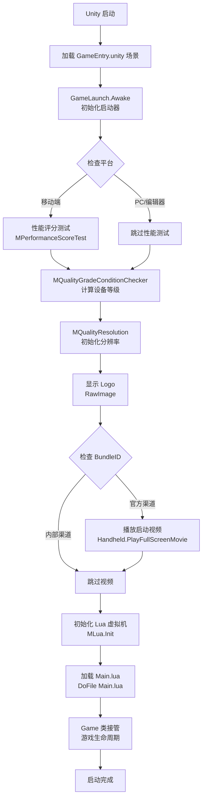

本指南将帮助您在5分钟内完成项目启动配置，让您快速进入开发状态。通过本指南，您将了解项目的启动流程、核心配置项以及如何运行第一个测试场景。

Sources: [GameEntry.unity](_Scenes/GameEntry.unity#L1-L50), [config.json](Resources/config.json#L1-L33)

## 项目启动架构概览

项目采用经典的**启动器模式**，通过统一的入口场景完成所有初始化流程。C# 层负责平台检测、性能评估和基础资源加载，Lua 层接管游戏逻辑和业务流程。这种设计确保了启动流程的可控性和可维护性。



Sources: [GameLaunch.cs](Scripts/Launch/GameLaunch.cs#L1-L160), [MLua.cs](Scripts/LuaEngine/MLua.cs#L1-L100), [Main.lua](Scripts/Lua/Main.lua#L1-L100)

## 快速启动步骤

按照以下步骤操作，即可快速启动项目并进入开发状态。

### 第一步：配置开发环境

确保您的开发环境满足以下最低要求：

| 环境组件 | 最低要求 | 推荐版本 | 用途 |
|---------|---------|---------|------|
| Unity 编辑器 | 2018.4.x | 2018.4.30f1 | 项目基于此版本构建 |
| Visual Studio | 2017+ | 2019/2022 | C# 脚本开发和调试 |
| Git | 2.x+ | 最新版 | 版本控制 |
| 操作系统 | Windows 10+ | Windows 10/11 | 开发和打包平台 |

Sources: [GameLaunch.cs](Scripts/Launch/GameLaunch.cs#L1-L50)

### 第二步：配置核心参数

修改 `Resources/config.json` 文件以适应您的开发环境：

```json
{
    "bundleId" : "com.joyyou.ro",
    "channel"  : "ro_inner",
    "area"     : 0,
    "language" : 0,
    "apiDomain" : "https://ro-client-api.huanle.com",
    "mode": {
        "packageMode" : 3,  // 资源包模式：3=开发模式
        "zipMode"     : 2,  // Zip模式：2=本地加载
        "abMode"      : 1   // AssetBundle模式：1=模拟加载
    }
}
```

**关键配置说明**：

- **bundleId**: 应用包标识符，开发环境建议使用 `com.joyyou.ro`
- **channel**: 渠道标识，`ro_inner` 为内部测试渠道
- **packageMode**: 资源包模式，开发模式建议设置为 `3`（直接使用 Resources 目录）
- **zipMode**: Zip 资源加载模式，开发时建议设置为 `2`（从本地文件系统加载）
- **abMode**: AssetBundle 模式，开发时建议设置为 `1`（使用模拟 AB 包）

Sources: [config.json](Resources/config.json#L1-L33)

### 第三步：配置启动场景

确保 `_Scenes/GameEntry.unity` 已添加到 Unity 的 Build Settings 中作为场景索引 0：

1. 打开 Unity 编辑器
2. 选择 `File > Build Settings...`
3. 确认 `Assets/_Scenes/GameEntry.unity` 在列表顶部（Index 0）
4. 如果不在，点击 `Add Open Scenes` 添加当前场景

Sources: [GameEntry.unity](_Scenes/GameEntry.unity#L1-L50)

### 第四步：配置 Lua 脚本路径

检查 `Scripts/LuaEngine/MLua.cs` 中的 Lua 脚本加载器配置：

```csharp
public void Init()
{
    _loader = MInterfaceMgr.singleton.GetInterface<IMLuaLoader>("MLuaLoader");
    _lua = new LuaState();
    
    // 绑定 C# 类型到 Lua
    LuaBinderOfMoonCommonLib.Bind(_lua);
    LuaBinderOfDefault.Bind(_lua);
    MoonClientBridge.Bridge.BindLua(_lua);
    
    // 打开第三方库
    this.OpenLibs();
    
    // 初始化加载器并启动 Lua 虚拟机
    _loader.Init(_lua);
    _lua.Start();
    
    // 加载主入口文件
    DoFile("Main.lua");
}
```

确保 `Main.lua` 位于 `Scripts/Lua/` 目录下，该文件是 Lua 层的入口点。

Sources: [MLua.cs](Scripts/LuaEngine/MLua.cs#L1-L100), [Main.lua](Scripts/Lua/Main.lua#L1-L100)

### 第五步：运行项目

完成以上配置后，即可运行项目：

1. 在 Unity 编辑器中点击 `Play` 按钮
2. 观察控制台日志，确认启动流程正常：
   - `GameLaunch.Awake` - 启动器初始化
   - `MPerformanceScoreTest` - 性能测试（移动端）
   - `MLua.Init` - Lua 虚拟机初始化
   - `Main.lua loaded` - Lua 入口加载成功
   - `Game.Start` - 游戏逻辑启动

Sources: [GameLaunch.cs](Scripts/Launch/GameLaunch.cs#L1-L160), [MLua.cs](Scripts/LuaEngine/MLua.cs#L1-L100)

## 启动流程详解

### C# 层初始化阶段

C# 层的 `GameLaunch` 类负责平台相关的初始化工作：

1. **日志过滤器设置**：非编辑器环境下过滤 Debug 和 Info 级别日志
2. **UWA 集成**：如果启用 `UWA_TEST` 宏，初始化 UWA 性能分析引擎
3. **性能评分**：移动端设备运行性能测试，确定设备等级
4. **分辨率初始化**：根据设备等级设置合适的渲染分辨率
5. **Logo 展示**：显示启动 Logo 2 秒
6. **视频播放**：根据 BundleID 决定是否播放启动视频

Sources: [GameLaunch.cs](Scripts/Launch/GameLaunch.cs#L1-L100)

### Lua 层接管阶段

Lua 层的 `Main.lua` 是整个游戏逻辑的起点：

1. **垃圾回收配置**：设置 Lua GC 参数以优化性能
2. **加载核心模块**：加载 Common、Framework、Network 等基础模块
3. **准备配置表**：加载游戏所需的配置表数据
4. **启动游戏**：创建 Game 实例并启动游戏循环

```lua
-- lua垃圾回收设置
collectgarbage("setpause", 100)
collectgarbage("setstepmul", 5000)

-- 加载核心模块
require "Common/define"
require "Common/Log"
require "Common/class"
require "Framework/Game"

-- 启动游戏
Game.Start()
```

Sources: [Main.lua](Scripts/Lua/Main.lua#L1-L100), [Game.lua](Scripts/Lua/Game.lua#L1-L100)

## 常见启动问题排查

### 问题 1：Lua 脚本加载失败

**症状**：控制台提示 "Cannot load file: Main.lua"

**解决方案**：
1. 检查 `Scripts/Lua/` 目录是否存在 `Main.lua` 文件
2. 确认 Lua 加载器路径配置正确
3. 检查 Lua 虚拟机是否成功初始化

Sources: [MLua.cs](Scripts/LuaEngine/MLua.cs#L1-L100), [Main.lua](Scripts/Lua/Main.lua#L1-L50)

### 问题 2：性能测试卡死

**症状**：启动时长时间停留在黑屏状态

**解决方案**：
1. 在编辑器中运行，性能测试会被自动跳过
2. 修改 `config.json` 中的 `bundleId` 为 `com.joyyou.ro` 可跳过性能测试
3. 检查 `MQualityGradeConditionChecker` 类的配置

Sources: [GameLaunch.cs](Scripts/Launch/GameLaunch.cs#L40-L60), [config.json](Resources/config.json#L1-L10)

### 问题 3：第三方 SDK 初始化失败

**症状**：提示 SDK 相关的错误信息

**解决方案**：
1. 检查 `Resources/SDKConfig/` 目录下的配置文件
2. 确认 `MPlatform.cs` 中的 SDK 初始化顺序
3. 查看对应 SDK 的日志输出

Sources: [MPlatform.cs](Scripts/MPlatform.cs#L1-L100), [SDKConfig 目录](Resources/SDKConfig)

## 项目目录快速索引

了解以下关键目录位置，有助于您快速定位开发所需的文件：

```
Assets/
├── _Scenes/
│   └── GameEntry.unity          # 启动入口场景
├── Scripts/
│   ├── Launch/
│   │   └── GameLaunch.cs        # 启动器逻辑
│   ├── LuaEngine/
│   │   └── MLua.cs              # Lua 虚拟机管理
│   ├── Bridge/
│   │   └── MoonClientBridge.cs  # C#-Lua 桥接
│   └── Lua/
│       ├── Main.lua             # Lua 入口文件
│       └── Game.lua             # 游戏主逻辑
├── Resources/
│   ├── config.json              # 主配置文件
│   └── SDKConfig/               # SDK 配置目录
└── artres/
    └── Resources/               # 游戏资源目录
```

Sources: [项目目录结构](.), [GameLaunch.cs](Scripts/Launch/GameLaunch.cs#L1-L50)

## 下一步学习路径

成功启动项目后，建议按照以下顺序深入学习：

1. **[项目概览](1-xiang-mu-gai-lan)** - 了解项目整体架构和技术栈
2. **[开发环境配置](3-kai-fa-huan-jing-pei-zhi)** - 详细的开发工具和依赖库安装说明
3. **[依赖库安装说明](4-yi-lai-ku-an-zhuang-shuo-ming)** - 学习如何配置和管理第三方依赖
4. **[项目架构总览](5-xiang-mu-jia-gou-zong-lan)** - 深入理解项目架构设计原则
5. **[C#与Lua混合开发模式](6-c-yu-luahun-he-kai-fa-mo-shi)** - 掌握跨语言交互的核心机制
6. **[ToLua框架配置与使用](7-toluakuang-jia-pei-zhi-yu-shi-yong)** - 学习 ToLua 框架的详细使用方法

Sources: [Main.lua](Scripts/Lua/Main.lua#L1-L100), [MLua.cs](Scripts/LuaEngine/MLua.cs#L1-L100)

## 开发环境验证清单

完成以下检查，确保您的开发环境已完全配置：

- [ ] Unity 编辑器版本正确（2018.4.x）
- [ ] GameEntry.unity 已添加到 Build Settings
- [ ] config.json 中的配置参数已根据开发需求修改
- [ ] Scripts/Lua/Main.lua 文件存在且可访问
- [ ] 能够成功运行项目并看到启动 Logo
- [ ] 控制台日志显示 Lua 虚拟机初始化成功
- [ ] Game.lua 启动成功，无报错信息