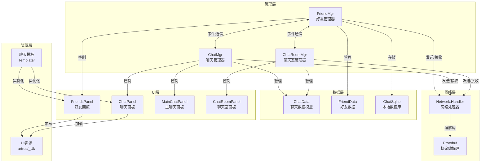
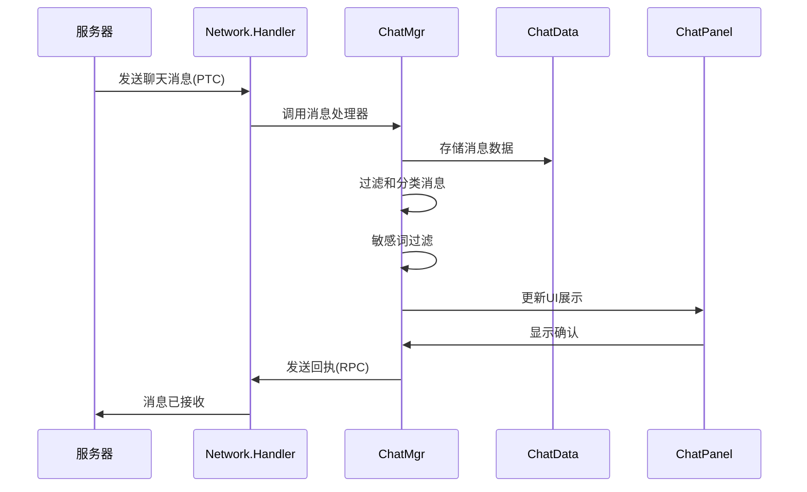

好友与聊天系统是游戏社交功能的核心模块，实现了玩家间的即时通讯、好友管理、聊天室互动等社交功能。系统采用基于事件驱动的架构设计，支持多种聊天频道、消息类型和富媒体内容，为玩家提供完整的社交互动体验。

## 系统架构

好友与聊天系统由多个相互协作的模块组成，采用分层架构设计，确保各模块职责清晰、耦合度低。系统核心包含好友管理器（FriendMgr）、聊天管理器（ChatMgr）、聊天室管理器（ChatRoomMgr）以及对应的数据模型和UI层。



系统采用经典的三层架构设计：管理层负责业务逻辑和数据协调，UI层负责用户交互和展示，网络层负责与服务器的通信。这种设计确保了系统的可维护性和可扩展性。

## 聊天频道系统

聊天系统支持多种频道，每种频道适用于不同的社交场景。频道通过枚举类型 `EChannel` 进行定义，系统根据频道类型对消息进行分类和过滤。

| 频道类型 | 枚举值 | 说明 | 消息范围 |
|---------|--------|------|---------|
| 队伍聊天 | TeamChat = 2 | 队伍成员间交流 | 当前队伍成员 |
| 工会聊天 | GuildChat = 3 | 工会成员间交流 | 当前工会成员 |
| 附近聊天 | CurSceneChat = 4 | 同场景玩家交流 | 当前场景内的玩家 |
| 世界聊天 | WorldChat = 5 | 全服玩家交流 | 服务器所有玩家 |
| 系统消息 | SystemChat = 6 | 系统通知和公告 | 所有人 |
| 职业聊天 | ProfessionChat = 7 | 同职业玩家交流 | 同职业玩家 |
| 聊天室 | ChatRoomChat = 10 | 私密聊天室 | 聊天室成员 |
| 观战聊天 | WatchChat = 11 | 观战者交流 | 观战中的玩家 |
| 好友私聊 | FriendChat = 20 | 好友间私密交流 | 好友关系双方 |
| 综合频道 | AllChat = 100 | 显示所有频道消息 | 所有类型 |

频道系统通过 `ChatMgr` 进行统一管理，支持频道的切换、消息过滤和显示控制。每个频道都有独立的消息队列和显示规则，确保消息的组织性和可读性。

Sources: [ChatData.lua](Scripts/Lua/ModuleData/ChatData.lua#L29-L45)

## 消息类型系统

聊天系统支持丰富的消息类型，从简单的文本消息到复杂的富媒体内容。消息类型通过 `EChatPrefabType` 枚举定义，每种类型对应不同的UI展示模板。

### 基础消息类型

| 消息类型 | 枚举值 | 说明 | UI模板 |
|---------|--------|------|--------|
| 自己发送 | Self = 1 | 玩家自己发送的消息 | ChatPlayerChatLinePrefab |
| 他人发送 | Other = 2 | 其他玩家发送的消息 | ChatOtherChatLinePrefab |
| 系统消息 | System = 3 | 系统通知消息 | ChatSystemChatLinePrefab |
| 时间间隔 | TimeSpace = 4 | 消息间的时间分隔符 | ChatLineTimePrefab |
| 提示信息 | Hint = 5 | 普通提示信息 | ChatHintChatLinePrefab |
| 盒子提示 | Box = 6 | 好友消息提示框 | ChatLineBoxPrefab |
| 时间显示 | Time = 7 | 好友消息时间戳 | ChatLineTimePrefab |

### 特殊消息类型

| 消息类型 | 枚举值 | 说明 | UI模板 |
|---------|--------|------|--------|
| 他人红包 | RedEnvelopeOther = 10 | 别人发送的红包 | ChatLineRedEnvelopeOther |
| 自己红包 | RedEnvelopeSelf = 11 | 自己发送的红包 | ChatLineRedEnvelopeSelf |
| 他人拍照 | TaskPhotoOther = 12 | 别人分享的拍照任务 | ChatLineTaskPhotoOther |
| 自己拍照 | TaskPhotoSelf = 13 | 自己分享的拍照任务 | ChatLineTaskPhotoSelf |
| 他人贴纸 | StickerShareOther = 14 | 别人分享的贴纸 | ChatLineStickerShareOther |
| 自己贴纸 | StickerShareSelf = 15 | 自己分享的贴纸 | ChatLineStickerShareSelf |
| 自己信笺 | MagicLetterSelf = 16 | 自己发送的魔法信笺 | ChatLineMagicLetterSelf |
| 他人信笺 | MagicLetterOther = 17 | 别人发送的魔法信笺 | ChatLineMagicLetterOther |

消息类型系统通过模板模式实现，每种消息类型都有对应的预制体（Prefab）和Lua脚本模板。这种设计使得新增消息类型非常方便，只需添加新的枚举值和对应的UI模板即可。

Sources: [ChatData.lua](Scripts/Lua/ModuleData/ChatData.lua#L47-L69)

## 好友管理系统

好友管理系统负责玩家的好友关系维护，包括好友列表管理、好友度系统、在线状态监控等功能。系统核心由 `FriendMgr` 管理器实现，提供完整的好友生命周期管理。

### 核心数据结构

好友管理器维护以下核心数据：

```lua
-- 好友数据
FriendDatas = {}              -- 所有好友数据
ContactsDatas = {}           -- 所有联系人数据
CurrentFriendChatDatas = {}  -- 当前聊天消息
UnReadData = {}              -- 未读消息
CurrentFriendData = {}       -- 当前选中的好友数据
```

好友数据包含玩家的基本信息、好友度、在线状态等属性。系统通过SQLite数据库持久化聊天记录，确保离线消息不丢失。

### 关键事件系统

好友管理器通过事件系统实现模块间的解耦通信：

| 事件名称 | 说明 | 触发时机 |
|---------|------|---------|
| ReceivePrivateChatEvent | 收到私聊消息 | 接收到好友发送的消息 |
| GetRecordChatDatasEvent | 获取历史记录 | 成功加载聊天历史 |
| ReadMessage | 消息已读 | 用户阅读消息后 |
| IntimacyDegreeChangeEvent | 好友度改变 | 好友关系升级 |
| AddFriendEvent | 添加好友 | 建立新的好友关系 |
| ChangeOnlineEvent | 在线状态改变 | 好友上线/下线 |
| ResetFriendInfoEvent | 重置好友信息 | 好友信息更新 |
| SelectContactEvent | 选择联系人 | 用户点击联系人 |

事件系统采用发布-订阅模式，其他模块通过注册事件监听器来响应好友系统的变化。这种设计确保了系统的灵活性和可扩展性。

Sources: [FriendMgr.lua](Scripts/Lua/ModuleMgr/FriendMgr.lua#L1-L100)

### 好友度系统

好友度是衡量玩家关系亲密度的重要指标，通过互动行为逐步积累。系统支持好友度的实时更新和查询，好友度达到一定阈值后可以解锁特殊功能。

好友度改变事件 `IntimacyDegreeChangeEvent` 会在以下情况触发：
- 完成好友相关任务
- 参与双人对战活动
- 互赠礼物或道具
- 连续互动一定天数

## 聊天管理器

聊天管理器（ChatMgr）是整个聊天系统的核心控制器，负责所有频道的消息收发、处理和展示。管理器采用单例模式，确保全局只有一个实例。

### 生命周期管理

聊天管理器实现了完整的生命周期管理：

```lua
function OnInit()
    -- 初始化计时器和事件注册
    l_luaStopWatchMgr.Start(l_luaStopWatchMgr.ELuaStopWatchType.LastHandleChatTime)
    gameEventMgr.Register(gameEventMgr.OnBagUpdate, _onItemUpdate)
    l_canReceiveChatMsg = true
end

function OnUnInit()
    -- 清理资源和事件
    chatDataMgr.HandleQuickTalkInfosOnLogout()
    stopHandleCacheChatMsgTimer()
    l_canReceiveChatMsg = false
end

function OnLogout()
    -- 登出处理
    StopTips()
    UIMgr:DeActiveUI(UI.CtrlNames.Chat)
    UIMgr:DeActiveUI(UI.CtrlNames.MainChat)
end
```

生命周期管理确保了资源的正确分配和释放，避免内存泄漏和资源浪费。

### 消息处理流程

聊天消息的处理遵循标准的接收-解析-展示流程：



消息处理流程包含多个关键步骤：协议解析、数据存储、内容过滤、UI更新。每个步骤都有明确的职责，确保消息能够正确、安全地展示给玩家。

Sources: [ChatMgr.lua](Scripts/Lua/ModuleMgr/ChatMgr.lua#L1-L100)

### 敏感词过滤

聊天系统集成了敏感词过滤功能，通过 `MUIBlackWordMgr` 进行实时过滤。系统支持自定义敏感词库，可以根据运营需求动态更新过滤规则。

## 聊天室系统

聊天室系统为玩家提供了更私密、更可控的交流空间。聊天室支持密码保护、成员管理、语音通话等高级功能。

### 聊天室数据结构

```lua
Room = {
    UID = nil,          -- 房间唯一标识
    Name = nil,         -- 房间名称
    Type = 0,           -- 房间类型
    MaxNum = 0,         -- 容量上限
    Code = nil,         -- 房间密码
    Captain = nil,      -- 房主信息
    CreatTime = nil,    -- 创建时间
    Members = {},       -- 成员列表
}
```

聊天室数据结构包含房间的所有关键信息，支持快速查询和更新。系统提供了便捷的成员查询方法和权限判断方法。

### 聊天室事件

聊天室管理器定义了完整的事件系统：

| 事件名称 | 说明 | 触发条件 |
|---------|------|---------|
| ResetData | 刷新所有数据 | 获取房间信息成功 |
| ResetSetting | 房间设置刷新 | 房主修改设置 |
| CaptainChange | 队长改变 | 房主转让 |
| MemberAdd | 增加组员 | 新成员加入 |
| MemberRemove | 移除组员 | 成员离开或被踢 |
| MemberState | 成员状态改变 | 成员上线/下线 |
| MemberChange | 成员信息改变 | 头像或昵称更新 |

聊天室事件系统实现了成员状态的实时同步，确保所有成员都能及时获知房间状态变化。

Sources: [ChatRoomMgr.lua](Scripts/Lua/ModuleMgr/ChatRoomMgr.lua#L1-L100)

## 网络通信

好友与聊天系统的网络通信基于Protobuf协议，通过统一的网络处理器进行消息的发送和接收。

### 协议处理

系统使用两种类型的网络协议：
- **RPC（Remote Procedure Call）**：请求-响应模式，需要服务器确认
- **PTC（Push to Client）**：服务器推送模式，无需响应

```lua
-- 发送RPC请求
function SendRpc(msgId, msgData, customData, onResp, onErr, onTimeout, onSendSuccess)
    local l_byteStr, l_byteLen = nil, 0
    if msgData ~= nil then
        l_byteStr = msgData:SerializeToString()
        l_byteLen = string.len(l_byteStr)
    end
    -- ... 发送逻辑
end

-- 发送PTC推送
function SendPtc(msgId, msgData, onSendSuccess)
    local l_byteStr, l_byteLen = nil, 0
    if msgData ~= nil then
        l_byteStr = msgData:SerializeToString()
        l_byteLen = string.len(l_byteStr)
    end
    -- ... 发送逻辑
end
```

网络层封装了底层的通信细节，为上层业务逻辑提供了简洁的接口。系统支持超时处理、错误重试等容错机制。

Sources: [Network_Handler.lua](Scripts/Lua/Network/Network_Handler.lua#L1-L100)

### 断线重连

系统支持断线重连功能，当网络连接恢复后会自动同步丢失的消息：

```lua
function OnReconnected(reconnectData)
    EventDispatcher:Dispatch(OnReconnectedEvent)
end
```

断线重连机制确保了用户不会因为网络波动而丢失重要消息。

## UI系统

好友与聊天系统的UI采用模块化设计，每个面板负责特定的功能展示。

### 好友面板

好友面板（FriendsPanel）提供完整的好友管理界面：
- 好友列表展示
- 最近联系人
- 好友度详情
- 聊天历史记录
- 添加好友功能

面板包含三个主要区域：联系人列表、聊天区域、操作按钮区域。联系人列表使用虚拟滚动技术优化性能，支持大量好友的流畅展示。

Sources: [FriendsPanel.lua](Scripts/Lua/UI/Panel/FriendsPanel.lua#L1-L117)

### 聊天面板

聊天面板（ChatPanel）是聊天系统的主要交互界面：
- 频道切换标签
- 消息展示区域
- 输入框和发送按钮
- 表情和语音按钮
- 设置和屏蔽功能

聊天面板支持多个频道的快速切换，每个频道独立维护消息历史。消息展示区域支持富文本、图片、语音等多种内容类型。

Sources: [ChatPanel.lua](Scripts/Lua/UI/Panel/ChatPanel.lua#L1-L119)

### UI模板系统

系统采用模板模式管理不同类型的聊天消息，每种消息类型都有独立的模板脚本：

- `ChatPlayerChatLinePrefab.lua` - 玩家聊天消息模板
- `ChatOtherChatLinePrefab.lua` - 其他人消息模板
- `ChatSystemChatLinePrefab.lua` - 系统消息模板
- `ChatHintChatLinePrefab.lua` - 提示消息模板
- `ChatLineTimePrefab.lua` - 时间分隔模板

模板系统通过对象池技术优化性能，避免频繁创建和销毁UI对象。

## 数据持久化

聊天系统使用SQLite数据库进行本地数据持久化，确保聊天历史和好友数据不会因为应用重启而丢失。

### 数据库管理

```lua
function GetChatSqlite()
    if ChatSqlite~=nil then
        return ChatSqlite
    end
    ChatSqlite = MoonClient.ChatDataMgr.New()
    -- ... 初始化逻辑
    return ChatSqlite
end
```

数据库管理器采用单例模式，确保全局只有一个数据库连接。系统在角色选择时初始化数据库，在登出时关闭连接。

### 存储内容

数据库主要存储以下内容：
- 聊天消息历史
- 好友关系数据
- 聊天室成员信息
- 未读消息标记
- 用户设置偏好

本地存储的数据会在下次登录时自动同步，确保用户体验的连续性。

## 性能优化

系统采用了多种性能优化技术，确保在大量消息和用户情况下仍能保持流畅。

### 消息缓存

系统实现了消息缓存机制，避免重复解析和处理相同的消息：

```lua
local l_perfomanceTestMsgTemplate = {}
local l_startStoreMsgPool = false
```

缓存池存储已解析的消息模板，当接收到相同类型的消息时直接复用，减少CPU和内存开销。

### 虚拟滚动

好友列表和聊天消息列表都采用虚拟滚动技术，只渲染可见区域内的元素。这种技术可以显著减少UI对象的创建数量，提升滚动性能。

### 对象池

UI模板使用对象池技术管理，避免频繁的创建和销毁操作：

```lua
require "Common/UI_TemplatePool"
```

对象池预分配一定数量的UI对象，需要时从池中获取，使用后归还，减少GC压力。

## 安全机制

聊天系统集成了多层安全机制，保护玩家免受不良信息和骚扰。

### 敏感词过滤

系统使用 `MUIBlackWordMgr` 进行实时敏感词过滤，支持：
- 文本敏感词检测
- 图片内容审核
- 链接安全检查
- 频率限制

### 屏蔽功能

玩家可以屏蔽特定玩家，系统会自动过滤被屏蔽玩家的所有消息：

```lua
ForbidPlayerInfosPanel -- 屏蔽玩家信息面板
```

屏蔽信息存储在服务器端，确保跨设备同步。

### 举报系统

系统支持举报功能，玩家可以举报不良行为，运营团队可以及时处理违规内容。

## 扩展功能

系统设计考虑了未来的扩展需求，预留了多种扩展接口。

### 消息类型扩展

新增消息类型只需：
1. 在 `EChatPrefabType` 添加枚举值
2. 创建对应的UI模板
3. 在 `ChatData.lua` 中注册模板
4. 实现消息解析逻辑

### 频道扩展

新增聊天频道只需：
1. 在 `EChannel` 添加枚举值
2. 在 `ChatMgr` 中添加频道处理逻辑
3. 在UI中添加频道标签
4. 配置频道权限规则

### 插件系统

系统支持功能插件，可以动态加载和卸载聊天功能模块，如：
- 翻译插件
- 语音转文字
- 消息加密
- 自定义表情包

## 最佳实践

开发好友与聊天相关功能时，建议遵循以下最佳实践：

1. **使用事件系统**：模块间通信优先使用事件系统，避免直接调用
2. **错误处理**：网络请求必须包含错误处理逻辑
3. **资源释放**：UI销毁时及时释放事件监听器和定时器
4. **数据验证**：所有用户输入必须经过验证和过滤
5. **性能监控**：关键操作添加性能监控，及时发现性能问题

## 相关文档

要深入了解系统相关技术，建议阅读以下文档：

- [Protobuf协议集成](10-protobufxie-yi-ji-cheng) - 了解网络协议的具体实现
- [UI框架设计](12-uikuang-jia-she-ji-ctrl-handler-panel-template) - 掌握UI系统的整体架构
- [网络层架构与消息处理](11-wang-luo-ceng-jia-gou-yu-xiao-xi-chu-li) - 理解网络通信的详细机制
- [C#与Lua混合开发模式](6-c-yu-luahun-he-kai-fa-mo-shi) - 了解混合开发的技术细节