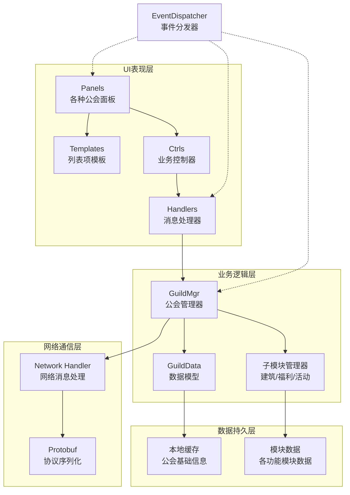
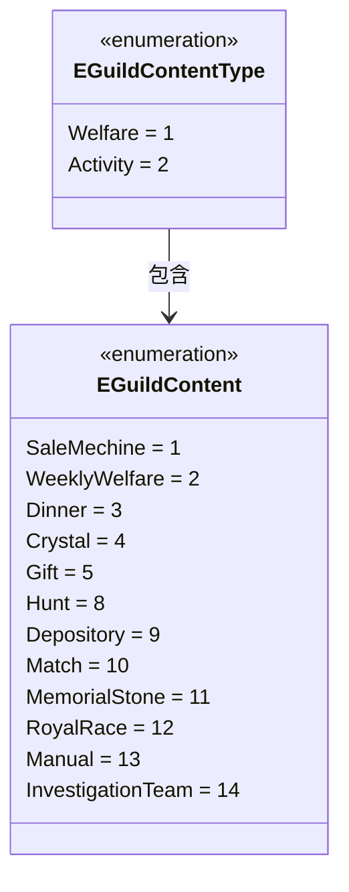
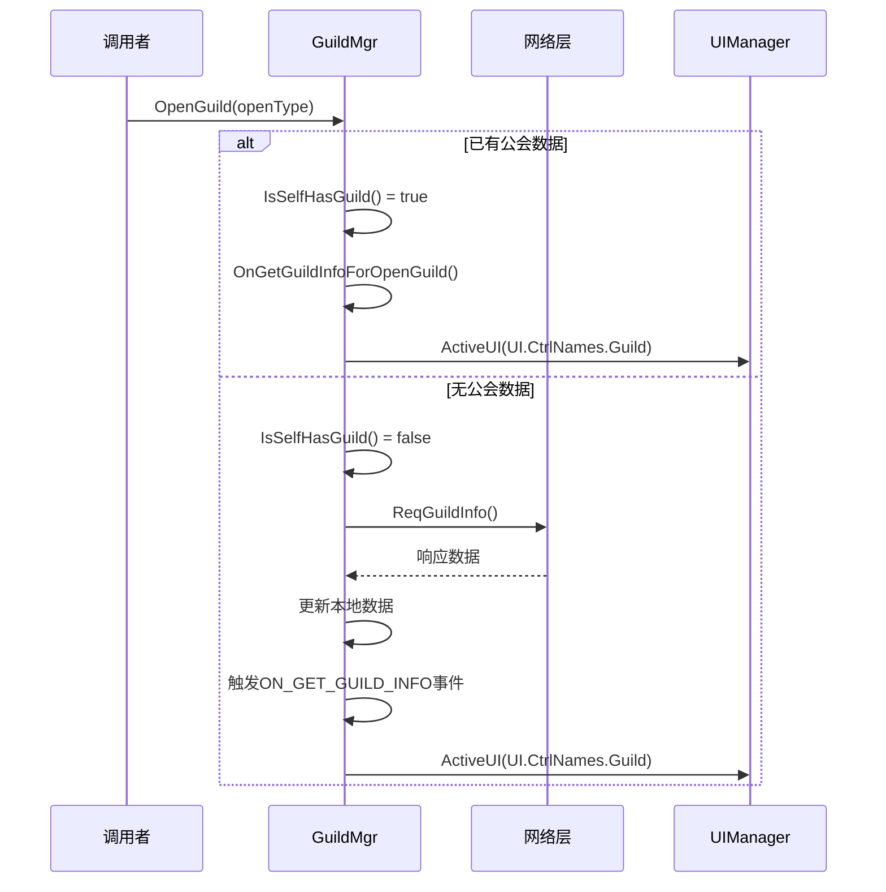
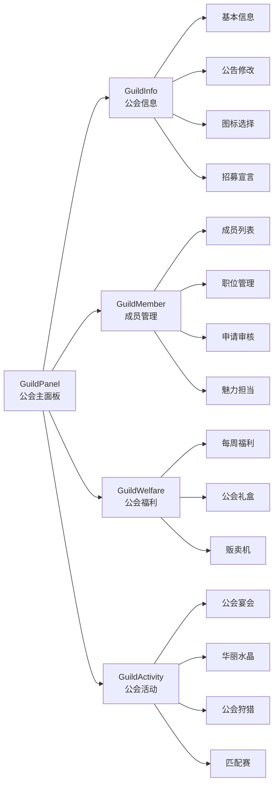
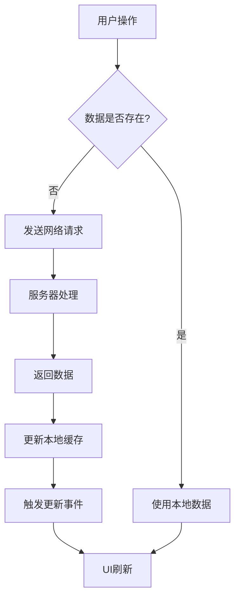

公会系统是游戏中的核心社交模块，负责管理玩家组织的创建、成员管理、权限控制、建筑升级、活动参与等社交功能。系统采用MVC分层架构，结合事件驱动机制，实现了数据与视图的解耦，确保了系统的可维护性和可扩展性。

## 系统架构概述

公会系统基于Lua层实现，与C#层通过网络层进行数据交互。整体架构分为数据层、业务逻辑层、UI表现层和网络通信层四个核心层次。

### 分层架构图

## 核心数据模型

公会系统的数据模型定义在 `GuildData.lua` 中，包含系统运行所需的各类枚举和数据结构定义。这些枚举为整个系统提供了类型安全的约束和统一的接口规范。

### 公会职位体系

公会采用等级分明的职位体系，从会长到普通成员共8个等级，每个等级对应不同的权限和功能。

| 职位 | 枚举值 | 权限范围 |
|------|--------|----------|
| 不在公会 | 0 | 无权限 |
| 会长 | 1 | 最高权限，可执行所有管理操作 |
| 副会长 | 2 | 高级管理权限，可任免副职以下 |
| 理事 | 3 | 中级管理权限，可管理执事及以下 |
| 执事 | 4 | 初级管理权限，可执行日常管理 |
| 魅力担当 | 5 | 特殊职位，负责对外展示 |
| 特殊成员1 | 6 | 自定义职位 |
| 特殊成员2 | 7 | 自定义职位 |
| 成员 | 8 | 基础成员权限 |

Sources: [GuildData.lua](Scripts/Lua/ModuleData/GuildData.lua#L68-L79)

### 公会内容分类

公会内容分为福利和活动两大类，每个类别下包含具体的功能模块。

Sources: [GuildData.lua](Scripts/Lua/ModuleData/GuildData.lua#L47-L66)

## 业务逻辑层

### 公会管理器 (GuildMgr)

`GuildMgr.lua` 是公会系统的核心管理器，负责协调各个子系统的工作。它采用事件驱动架构，通过EventDispatcher实现模块间的松耦合通信。

#### 事件体系

管理器定义了完整的事件体系，用于响应公会相关的各种状态变化和操作结果。事件包括但不限于：信息获取、创建/修改、成员管理、申请审核、权限变更等。

**核心事件类型：**

| 事件名称 | 触发时机 | 携带数据 |
|----------|----------|----------|
| ON_GET_GUILD_INFO | 获取公会信息成功 | 公会基础数据 |
| ON_GET_GUILD_INFO_CHANGE | 公会信息变更 | 变更字段信息 |
| ON_GUILD_CREATE_FAILED | 公会创建失败 | 失败原因 |
| ON_GUILD_KICKOUT | 成员被踢出公会 | 成员ID |
| ON_GUILD_LIST_SHOW | 公会列表加载完成 | 列表数据 |
| ON_GUILD_APPLY | 申请加入公会 | 申请结果 |
| ON_MEMBER_POSITION_MODIFY | 成员职位变更 | 成员ID和新职位 |
| ON_CHECK_APPLY | 申请审核完成 | 审核结果 |

Sources: [GuildMgr.lua](Scripts/Lua/ModuleMgr/GuildMgr.lua#L7-L61)

#### 关键流程

公会界面的打开流程展示了管理器的核心职责：

Sources: [GuildMgr.lua](Scripts/Lua/ModuleMgr/GuildMgr.lua#L63-L96)

### 子模块管理器

公会系统包含多个子功能模块，每个模块都有独立的管理器负责具体业务逻辑：

- **GuildBuildMgr** - 公会建筑管理（大厅、水晶、贩卖机、仓库等）
- **GuildCrystalMgr** - 华丽水晶系统
- **GuildDinnerMgr** - 公会宴会系统
- **GuildHuntMgr** - 公会狩猎活动
- **GuildMatchMgr** - 公会匹配赛
- **GuildWelfareMgr** - 公会福利管理
- **GuildDepositoryMgr** - 公会仓库管理

每个子模块管理器都遵循统一的设计模式：数据维护、网络通信、事件分发、UI交互。

Sources: [ModuleMgr目录结构](Scripts/Lua/ModuleMgr)

## UI表现层

### UI架构设计

UI层遵循Ctrl-Handler-Panel-Template四层架构模式，实现了清晰的职责分离：

| 层级 | 职责 | 示例文件 |
|------|------|----------|
| Panel | 面板生命周期和组件绑定 | GuildPanel.lua |
| Ctrl | 业务逻辑控制和用户交互 | GuildCtrl.lua |
| Handler | 网络消息处理 | GuildInforHandler.lua, GuildMemberHandler.lua |
| Template | 列表项模板和复用 | GuildMemberItemTemplate.lua, GuildBuildingItemTemplate.lua |

### 面板类型

公会系统包含多个功能面板，每个面板负责特定的功能展示：

- **GuildPanel** - 公会主面板（包含信息、成员、福利、活动四个页签）
- **GuildCreatePanel** - 公会创建面板
- **GuildApplyPanel** - 申请加入面板
- **GuildListPanel** - 公会列表面板
- **GuildMemberPanel** - 成员管理面板
- **GuildBanquetPanel** - 公会宴会面板
- **GuildCrystalPanel** - 华丽水晶面板
- **GuildDepositoryPanel** - 公会仓库面板
- **GuildWelfarePanel** - 公会福利面板
- **GuildActivityPanel** - 公会活动面板

Sources: [UI/Panel目录](Scripts/Lua/UI/Panel)

### UI页签结构

主面板采用页签式设计，整合了四大核心功能模块：

Sources: [GuildData.lua](Scripts/Lua/ModuleData/GuildData.lua#L30-L38)

## 网络通信层

### 消息处理机制

公会系统通过Handler层处理网络消息，每个Handler负责特定类型的协议处理：

- **GuildInforHandler** - 处理公会基本信息相关协议
- **GuildMemberHandler** - 处理成员管理相关协议
- **GuildActivityHandler** - 处理公会活动相关协议
- **GuildWelfareHandler** - 处理福利发放相关协议
- **GuildCrystalPrayHandler** - 处理水晶祈祷协议
- **GuildDepositoryAllHandler** - 处理仓库操作协议

Handler层负责协议解析、数据验证、错误处理和事件触发，确保网络通信的可靠性和数据的一致性。

Sources: [UI/Handler目录](Scripts/Lua/UI/Handler)

## 数据流与状态管理

### 数据获取流程

公会数据采用按需加载和主动推送相结合的策略：

### 状态同步机制

公会系统通过事件机制实现多端状态同步：

1. **本地操作**：用户执行操作后，立即更新本地UI，同时发送网络请求
2. **网络确认**：服务器返回操作结果后，触发相应事件
3. **事件广播**：EventDispatcher将事件广播给所有订阅者
4. **多界面更新**：订阅该事件的多个UI界面同时刷新

这种机制确保了数据的一致性和用户体验的流畅性。

## 扩展性设计

### 模块化设计

系统采用高度模块化的设计，新功能可以通过以下方式扩展：

1. **新增子模块**：参考现有模块（如GuildCrystalMgr）创建新的管理器
2. **新增UI面板**：创建Panel、Ctrl、Handler、Template四层结构
3. **新增枚举类型**：在GuildData.lua中添加新的枚举定义
4. **新增事件类型**：在GuildMgr.lua中注册新的事件

### 配置化设计

大量使用枚举和配置表，使得功能可以通过配置文件进行调整，无需修改核心代码。例如：

- 公会建筑类型配置
- 公会内容按钮文字类型
- 公会功能FunctionId映射

Sources: [GuildData.lua](Scripts/Lua/ModuleData/GuildData.lua#L81-L96)

## 推荐阅读路径

为了深入理解公会系统，建议按照以下顺序学习相关文档：

1. [项目架构总览](5-xiang-mu-jia-gou-zong-lan) - 了解整体项目架构
2. [UI框架设计](12-uikuang-jia-she-ji-ctrl-handler-panel-template) - 理解UI四层架构
3. [网络层架构与消息处理](11-wang-luo-ceng-jia-gou-yu-xiao-xi-chu-li) - 掌握网络通信机制
4. [Protobuf协议集成](10-protobufxie-yi-ji-cheng) - 了解协议序列化方案

通过系统性地学习这些内容，可以更好地理解公会系统在整个游戏客户端中的定位和作用。