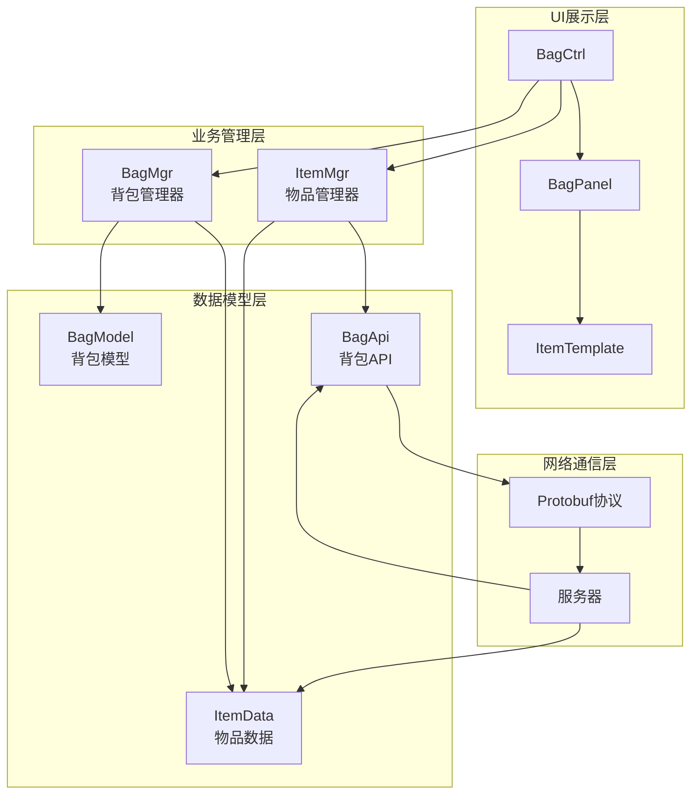
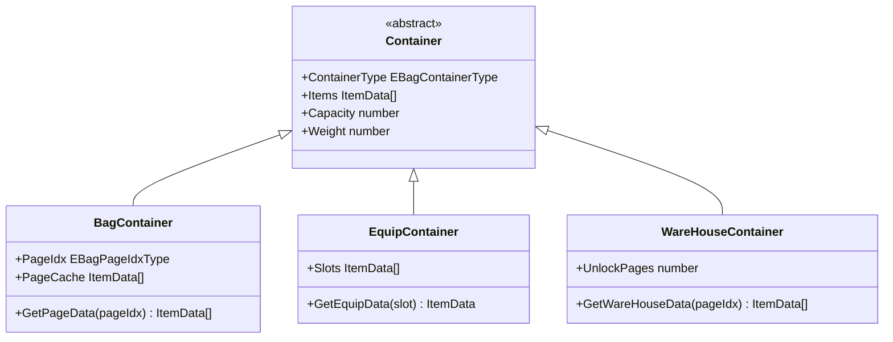
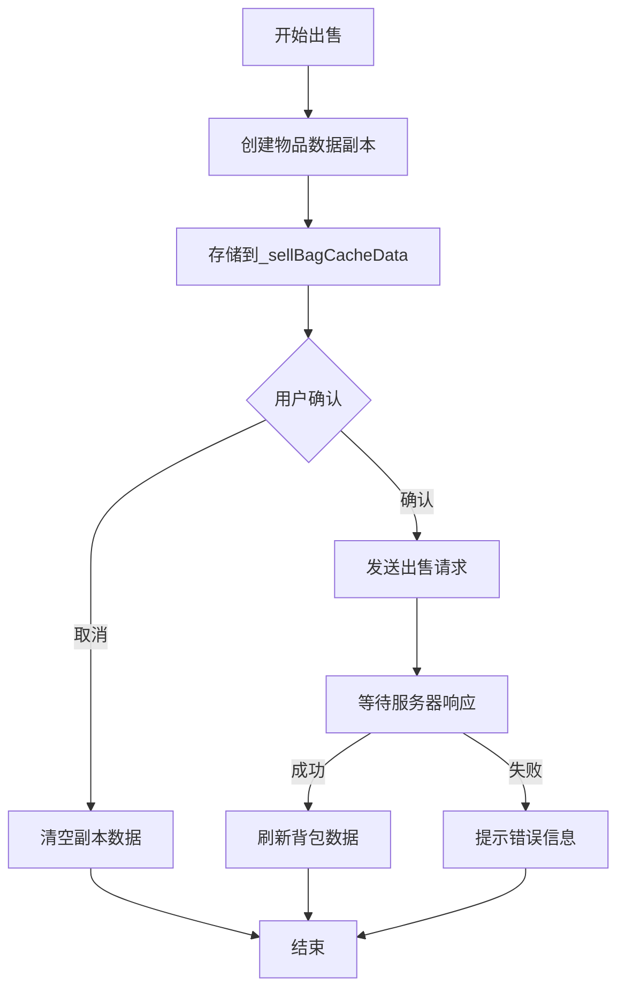
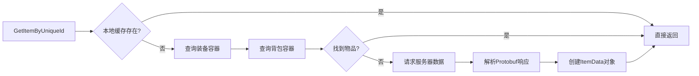

本系统负责游戏中所有物品的存储、管理和交互功能，包括物品数据模型、背包容器管理、物品操作逻辑以及UI展示。该系统采用Lua编写，通过Protobuf与服务器通信，支持多容器、多页签的物品管理架构。

## 系统架构概览

物品与背包系统采用分层架构设计，从数据层到展示层依次为：数据模型层、业务管理层、网络通信层、UI展示层。



系统通过事件驱动机制实现数据与UI的同步，当服务器数据变更时，通过`OnBagSync`和`OnBagUpdate`事件触发UI刷新[BagMgr.lua#L66-L68]。

## 核心组件

### 物品数据模型

**ItemData**是系统中物品的核心数据结构，采用Lua面向对象设计，通过元表机制限制非法字段的访问和修改[ItemData.lua#L12-L36]。

**核心属性**：

| 属性名 | 类型 | 说明 |
|--------|------|------|
| UID | number | 物品唯一标识符 |
| TID | number | 物品配置表ID |
| ItemCount | int64 | 物品数量 |
| Price | int64 | 平均价格 |
| EnchantGrade | number | 附魔等级 |
| RefineLv | number | 精炼等级 |
| EffectiveTime | number | 有效时间 |
| ItemCollapseBitMap | number | 叠加位图 |

**特殊属性**：
- `AttrSet`：装备属性集合，支持分页存储以应对多孔装备
- `ItemConfig`：物品配置表数据引用
- `EquipConfig`：装备专属配置数据引用

ItemData通过严格的字段验证机制，确保数据的一致性和安全性[ItemData.lua#L29-L55]。

### 背包管理器

**BagMgr**是背包系统的核心管理类，负责背包数据的缓存、页签管理和物品操作[BagMgr.lua#L5-L389]。

**核心功能模块**：

1. **页签系统**：背包页签与物品类型的映射关系
```lua
local C_PAGE_CONDITION_MAP = {
    [pageIdxType.Default] = itemType.None,
    [pageIdxType.Equip] = itemType.Equip,
    [pageIdxType.Consume] = itemType.Consume,
    [pageIdxType.Mat] = itemType.Mat,
    [pageIdxType.Card] = itemType.Card,
}
```
[BagMgr.lua#L15-L21]

2. **缓存机制**：系统维护多级缓存以优化性能
- `_bagPageCache`：背包页数据缓存
- `_shopPageCache`：商店数据缓存
- `_wareHousePageCache`：仓库数据缓存
- `_sellBagCacheData`：出售物品的临时副本数据[BagMgr.lua#L29-L63]

3. **脏标记系统**：通过脏标记判断是否需要重新加载数据
- `_dirty`：全局脏标记
- `_bagResetMap`：背包页脏标记映射
- `_shopResetMap`：商店页脏标记映射[BagMgr.lua#L33-L45]

### 物品管理器

**ItemMgr**负责物品数据的跨容器查询和服务器请求[ItemMgr.lua#L1-L231]。

**核心方法**：

| 方法名 | 功能 | 说明 |
|--------|------|------|
| GetItemByUniqueId | 通过UID获取物品 | 支持异步回调，避免重复请求 |
| GetSelfItemInfo | 获取自身装备信息 | 从装备和背包容器中查询 |
| GetItemText | 获取物品格式化文本 | 支持自定义样式配置 |

物品获取采用防重复请求机制，通过`RequestData`表管理待处理的请求队列[ItemMgr.lua#L11-L37]。

## 背包容器系统

系统支持多种容器类型，每个容器独立管理物品数据：



**容器类型枚举**：
- `EBagContainerType.Equip`：装备容器
- `EBagContainerType.Bag`：普通背包容器
- `EBagContainerType.WareHouse`：仓库容器
- `EBagContainerType.Cart`：购物车容器

## 物品操作流程

### 物品出售流程

物品出售采用副本数据机制，确保出售过程中的操作不会影响原始数据：



出售数据结构[BagMgr.lua#L96-L100]：
```lua
local newData = {
    propInfo = copiedItemData,
    count = count
}
```

### 物品获取流程

跨容器物品查询采用条件筛选机制：



跨容器查询实现[ItemMgr.lua#L65-L82]：
```lua
local types = {
    GameEnum.EBagContainerType.Equip,
    GameEnum.EBagContainerType.Bag
}
local condition = { Cond = itemFuncUtil.IsItemUID, Param = uid }
local ret = Data.BagApi:GetItemsByTypesAndConds(types, conditions)
```

## UI集成与交互

UI层采用Ctrl-Panel-Template三层架构，遵循项目统一的UI框架设计[UI框架设计](12-uikuang-jia-she-ji-ctrl-handler-panel-template)。

### 背包界面

**BagCtrl**：负责背包界面的业务逻辑，处理用户交互事件

**BagPanel**：背包面板的视觉呈现，包含：
- 页签切换组件
- 物品格子容器
- 筛选功能按钮
- 负重信息显示

**ItemTemplate**：物品格子模板，支持：
- 物品图标显示
- 数量标签
- 品质边框
- 选中状态

### 物品提示

物品提示系统通过`CommonItemTipsCtrl`实现，支持显示：
- 物品基本信息（名称、品质、类型）
- 物品属性（装备属性、附加属性）
- 物品描述
- 操作按钮（使用、装备、出售等）

## 性能优化策略

### 数据缓存机制

系统采用多级缓存策略减少重复计算和查询：

1. **页级缓存**：每个页签独立缓存物品列表
2. **脏标记优化**：只在数据变更时重新加载对应页签
3. **对象池技术**：复用ItemData对象减少GC压力

### 批量更新处理

当服务器推送大量物品变更时，通过`ItemUpdateProcessor`进行批量处理，避免频繁触发UI刷新[ItemUpdateCountProcessor.lua]。

## 扩展与维护

### 添加新物品类型

1. 在`GameEnum.EItemType`中添加新类型枚举
2. 在`C_PAGE_CONDITION_MAP`中配置页签映射
3. 更新物品配置表数据
4. 添加对应的UI图标资源

### 自定义物品行为

通过`ItemFunction`配置系统定义物品的特殊行为[BagModel.lua#L95-L100]：

```lua
BagModel.ItemFunction = {
    Buff = 1,           -- 增益效果
    RandomTrans = 2,    -- 随机传送
    ConstTrans = 3,     -- 固定传送
    OpenUI = 4,         -- 打开UI
    Gift = 5,           -- 礼包
    -- 添加新功能...
}
```

## 相关系统链接

物品与背包系统与以下系统紧密关联：

- [角色创建与数据管理](16-jiao-se-chuang-jian-yu-shu-ju-guan-li)：装备数据与角色属性关联
- [装备与属性系统](17-zhuang-bei-yu-shu-xing-xi-tong)：装备的精炼、附魔功能
- [商城与交易系统](23-shang-cheng-yu-jiao-yi-xi-tong)：物品购买和出售
- [UI框架设计](12-uikuang-jia-she-ji-ctrl-handler-panel-template)：UI架构基础

## 开发注意事项

1. **数据一致性**：修改物品数据后必须调用相应的刷新方法
2. **事件监听**：模块初始化时注册事件监听，注销时移除监听
3. **缓存管理**：长时间操作后及时清理缓存释放内存
4. **错误处理**：网络请求必须处理超时和错误情况
5. **性能考虑**：大量物品操作时使用批量接口