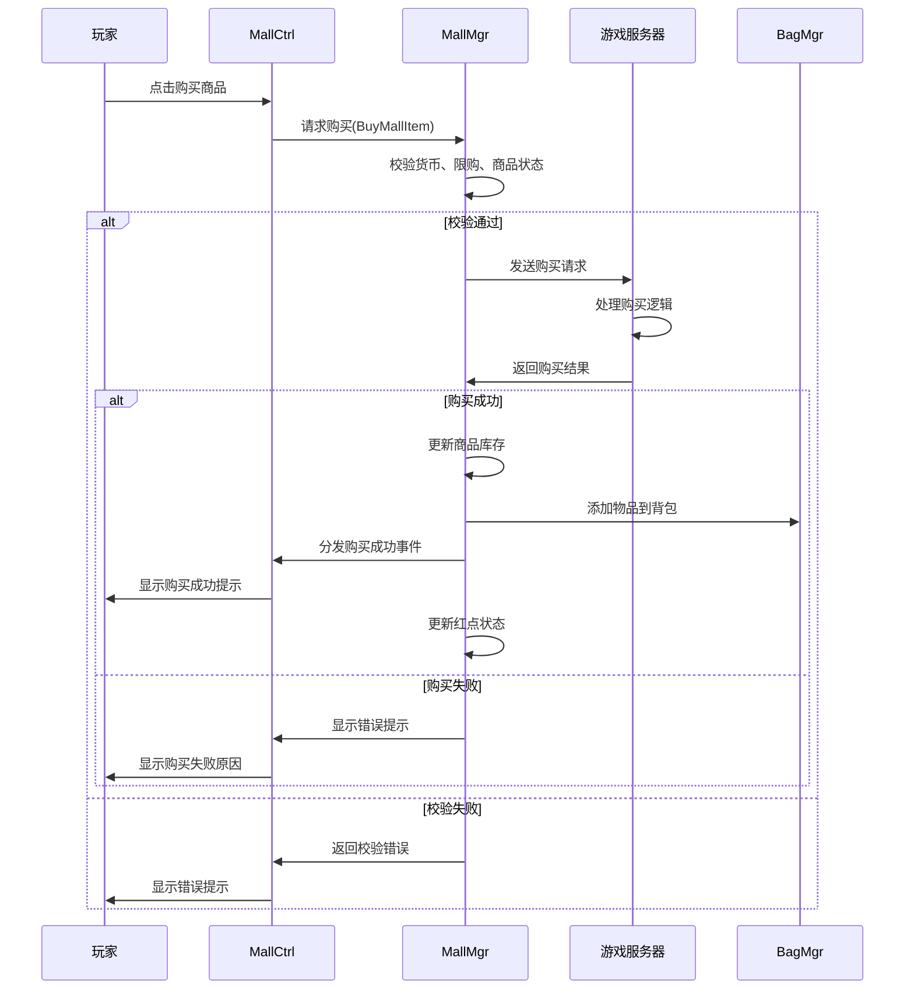
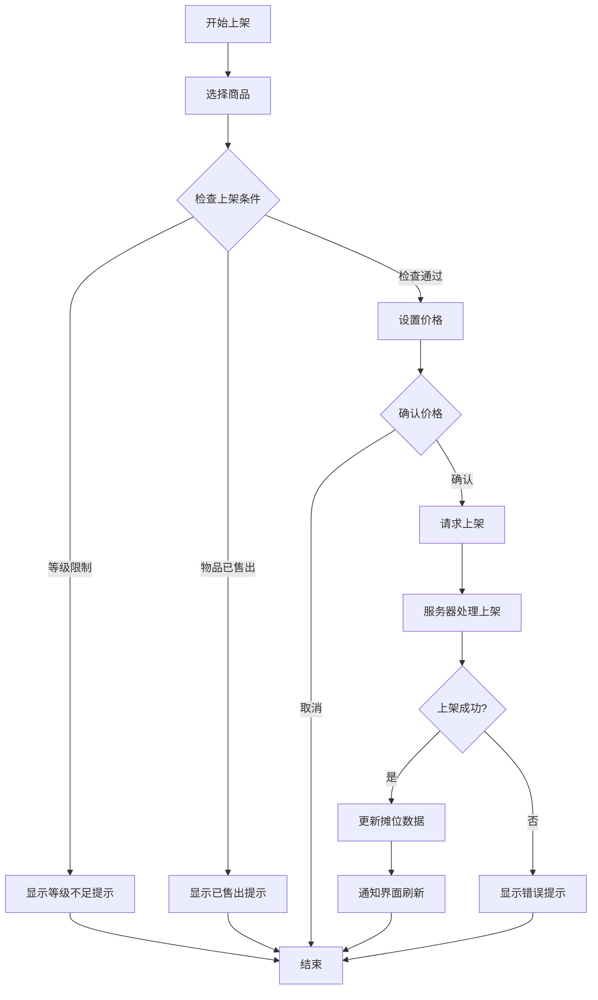
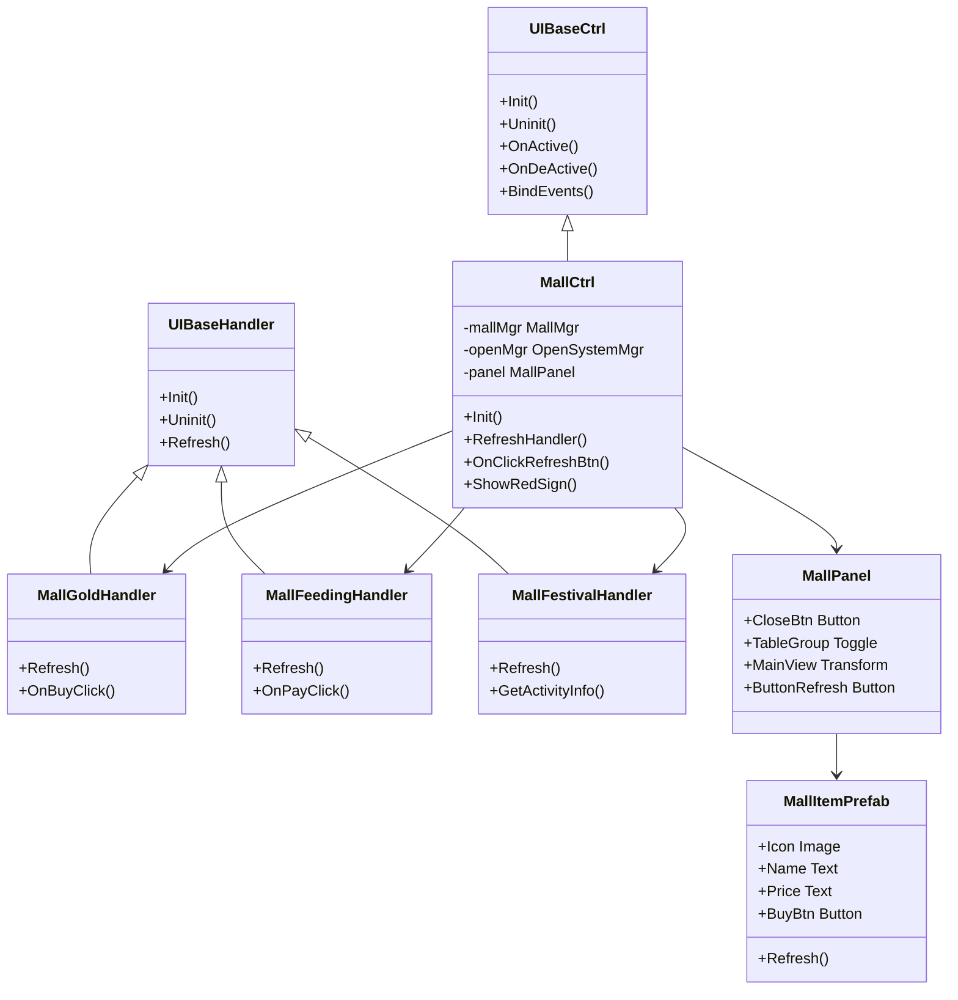

商城与交易系统是游戏经济体系的核心组成部分，涵盖了玩家与游戏服务器、玩家与玩家之间的物品交换功能。该系统采用模块化设计，包含商城管理、商会交易、个人摊位、拍卖行等多个子系统，通过统一的协议层与服务器通信，并实现了完整的UI展示与交互逻辑。

## 系统架构总览

商城与交易系统采用分层架构设计，从底层数据管理到上层UI展示形成了清晰的职责划分。核心管理器负责业务逻辑与协议处理，数据层维护本地状态，UI层负责用户交互与界面展示。系统通过事件驱动机制实现各模块间的松耦合通信，确保数据变更能够及时传播到相关界面。

```mermaid
graph TB
    subgraph "表现层 Presentation"
        MallCtrl[MallCtrl<br/>商城控制器]
        MallPanel[MallPanel<br/>商城面板]
        MallItem[MallItemPrefab<br/>商品模板]
        TradePanel[TradePanel<br/>交易面板]
        StallPanel[StallPanel<br/>摊位面板]
        AuctionPanel[AuctionPanel<br/>拍卖面板]
    end
    
    subgraph "业务逻辑层 Business Logic"
        MallMgr[MallMgr<br/>商城管理器]
        TradeMgr[TradeMgr<br/>商会管理器]
        StallMgr[StallMgr<br/>摊位管理器]
        AuctionMgr[AuctionMgr<br/>拍卖管理器]
        LimitBuyMgr[LimitBuyMgr<br/>限购管理器]
    end
    
    subgraph "数据层 Data Layer"
        MallData[MallData<br/>商城数据]
        TradeData[TradeData<br/>交易数据]
        AuctionData[AuctionData<br/>拍卖数据]
        StallData[StallData<br/>摊位数据]
    end
    
    subgraph "网络层 Network"
        GetMallInfo[GetMallInfo]
        BuyMallItem[BuyMallItem]
        GetTradeInfo[GetTradeInfo]
        TradeBuySell[TradeBuySell]
        GetAuctionInfo[GetAuctionInfo]
        AuctionBid[AuctionBid]
    end
    
    subgraph "配置层 Configuration"
        MallTable[商城配置表]
        CommoditTable[商品表]
        AuctionTable[拍卖表]
        StallDetailTable[摊位详情表]
    end
    
    MallCtrl --> MallPanel
    MallPanel --> MallItem
    MallCtrl --> MallMgr
    TradePanel --> TradeMgr
    StallPanel --> StallMgr
    AuctionPanel --> AuctionMgr
    
    MallMgr --> MallData
    TradeMgr --> TradeData
    StallMgr --> StallData
    AuctionMgr --> AuctionData
    
    MallMgr --> GetMallInfo
    MallMgr --> BuyMallItem
    TradeMgr --> GetTradeInfo
    TradeMgr --> TradeBuySell
    AuctionMgr --> GetAuctionInfo
    AuctionMgr --> AuctionBid
    
    MallMgr --> MallTable
    TradeMgr --> CommoditTable
    AuctionMgr --> AuctionTable
    StallMgr --> StallDetailTable
    
    style MallMgr fill:#e1f5ff
    style TradeMgr fill:#e1f5ff
    style StallMgr fill:#e1f5ff
    style AuctionMgr fill:#e1f5ff
```



Sources: [Scripts/Lua/ModuleMgr/MallMgr.lua](Scripts/Lua/ModuleMgr/MallMgr.lua#L1-L50), [Scripts/Lua/ModuleMgr/TradeMgr.lua](Scripts/Lua/ModuleMgr/TradeMgr.lua#L1-L50), [Scripts/Lua/ModuleMgr/StallMgr.lua](Scripts/Lua/ModuleMgr/StallMgr.lua#L1-L50), [Scripts/Lua/ModuleMgr/AuctionMgr.lua](Scripts/Lua/ModuleMgr/AuctionMgr.lua#L1-L50)

## 商城子系统

商城子系统是玩家获取游戏内物品和货币的主要途径，支持多种货币类型和商品类别。系统通过商城ID区分不同类型的商城，每种商城拥有独立的商品列表、刷新机制和购买规则。商城管理器负责统一处理所有商城相关的数据请求、状态管理和事件分发。

### 商城类型与配置

商城系统预定义了多种商城类型，每种类型对应不同的功能定位和货币体系。金币系列商城使用金币作为主要货币，万事屋商城则支持zeny和铜币交易，神秘商城提供特殊商品，充值商城处理玩家充值相关业务，回归商店为回归玩家提供专属商品，节日商店则根据活动动态配置商品内容。

| 商城ID | 商城名称 | 货币类型 | 功能说明 | 系统开关ID |
|--------|----------|----------|----------|------------|
| 101 | 金币-热销 | 金币 | 热门商品推荐 | MallGoldHot |
| 102 | 金币-礼包 | 金币 | 各类礼包商品 | MallGoldGift |
| 103 | 金币-外观 | 金币 | 外观道具 | MallGoldAppearance |
| 201 | 万事屋-zeny | Zeny | 高级物品交易 | MallMasterHouseZeny |
| 202 | 万事屋-铜币 | 铜币 | 基础物品交易 | MallMasterHouseCoin |
| 301 | 神秘商店 | 特殊货币 | 限时稀有商品 | MallMysteryShop |
| 401 | 充值 | 真实货币 | 喵喵果实充值 | MallFeeding |
| 801 | 回归商店-积分 | 回归积分 | 回归奖励兑换 | - |
| 901 | 新手商店 | - | 新手专属商品 | - |

Sources: [Scripts/Lua/ModuleMgr/MallMgr.lua](Scripts/Lua/ModuleMgr/MallMgr.lua#L15-L35)

### 商城数据管理

商城管理器维护了一个全局的数据列表`DataLis`，以商城ID为键存储对应的商品数据。每个商城的数据包含商品列表、刷新时间、手动刷新次数等关键信息。系统支持按需加载商城数据，当请求的数据不存在时自动发起网络请求，确保数据始终是最新的。

```lua
-- 商城数据结构示例
DataLis = {
    [101] = {  -- 金币热销
        items = {...},      -- 商品列表
        refresh_time = 0,   -- 下次刷新时间
        manual_count = 0    -- 手动刷新次数
    },
    [102] = {  -- 金币礼包
        ...
    }
}
```

### 商城刷新机制

商城支持两种刷新方式：定时自动刷新和玩家手动刷新。定时刷新根据服务器配置的时间间隔自动更新商品列表，手动刷新则允许玩家消耗特定货币主动刷新商品。系统记录每个商城的手动刷新次数，并在`OnSelectRoleNtf`时从服务器同步刷新记录，确保断线重连后状态一致。

Sources: [Scripts/Lua/ModuleMgr/MallMgr.lua](Scripts/Lua/ModuleMgr/MallMgr.lua#L40-L70)

### 购买流程

商城购买流程包含完整的校验与状态管理。购买请求会校验货币是否充足、限购数量是否达标、商品是否在售等条件。成功购买后，系统会更新商品库存、刷新界面显示，并通过事件通知相关模块更新红点提示。支付类型包括喵喵果实充值、月卡激活、普通返利月卡和超级返利月卡等多种形式。



Sources: [Scripts/Lua/ModuleMgr/MallMgr.lua](Scripts/Lua/ModuleMgr/MallMgr.lua#L200-L350)

## 商会交易子系统

商会交易子系统实现了玩家之间的物品交易平台，玩家可以发布商品供其他玩家购买，也可以浏览其他玩家发布的商品并进行购买。系统采用了完整的物品分类体系，支持按类别、子类别进行筛选，并提供了价格、库存、关注等多维度信息展示。

### 交易面板模式

商会系统提供两种操作模式：购买模式和出售模式。购买模式下玩家可以浏览所有在售商品、关注特定商品、查看价格趋势；出售模式下玩家可以查看自己的在售商品、调整价格、下架商品。系统通过`IsBuyPanel`标志位区分当前模式，并在切换时重新初始化界面状态。

Sources: [Scripts/Lua/ModuleMgr/TradeMgr.lua](Scripts/Lua/ModuleMgr/TradeMgr.lua#L20-L40)

### 物品分类体系

商会物品采用两级分类体系，主分类和子分类共同确定物品的展示位置。系统通过`GetIndexByItemId`方法根据物品ID获取其对应的分类信息，分类数据来源于配置表`CommoditTable`和`MerchantGuildTable`。主分类通常对应物品的大类（如装备、消耗品），子分类则进一步细分（如武器、防具）。

Sources: [Scripts/Lua/ModuleMgr/TradeMgr.lua](Scripts/Lua/ModuleMgr/TradeMgr.lua#L90-L120)

### 限购与公示系统

商会系统实现了完善的限购机制，通过`LimitBuyMgr`管理购买和出售的限购信息。系统区分普通交易和公示期交易，公示期商品在公示结束后才能购买，期间只能进行预购。限购信息包括每日限购数量、周期限购数量等多个维度，确保交易市场的稳定性和公平性。

| 限购类型 | 限购说明 | 配置键 |
|----------|----------|--------|
| TRADE_BUY | 普通购买限购 | l_buyType |
| TRADE_SELL | 普通出售限购 | l_sellType |
| TRADE_BUY_LIMIT | 公示期购买限购 | l_noticeBuyType |
| TRADE_SELL_LIMIT | 公示期出售限购 | l_noticeSellType |

Sources: [Scripts/Lua/ModuleMgr/TradeMgr.lua](Scripts/Lua/ModuleMgr/TradeMgr.lua#L40-L60), [Scripts/Lua/ModuleMgr/TradeMgr.lua](Scripts/Lua/ModuleMgr/TradeMgr.lua#L130-L160)

### 关注与价格更新

玩家可以关注特定的商会商品，关注后系统会在商品价格变化或库存变化时推送通知。`SetTradeInfo`方法用于更新商品信息，包括购买数量、出售数量、当前价格、基础价格、是否公示、是否关注等关键数据。更新完成后通过`ON_ITEM_INFO_UPDATE`事件通知界面刷新显示。

Sources: [Scripts/Lua/ModuleMgr/TradeMgr.lua](Scripts/Lua/ModuleMgr/TradeMgr.lua#L75-L95)

## 摊位子系统

摊位子系统提供了玩家自主经营的交易平台，玩家可以开设个人摊位，上架自己的物品，并设置合适的价格进行销售。摊位系统支持快速上架功能，允许玩家批量管理待售商品，并通过分类浏览方便其他玩家查找需要的物品。

### 摊位分类初始化

摊位系统在首次使用时需要初始化分类信息，`InitTable`方法负责从配置表`StallIndexTable`和`StallDetailTable`加载分类结构。分类采用树形结构，支持多级嵌套，每个分类节点可以包含子分类。系统通过`g_tableInfo`维护完整的分类映射关系，便于快速查找和展示。

```lua
-- 摊位分类数据结构
g_tableInfo = {
    [categoryId] = {
        id = categoryId,           -- 分类ID
        indexList = {...},         -- 二级目录ID集合
        secList = {
            [secId] = {
                detailIndexList = {...},  -- 详细商品ID列表
                limitIndexList = {...},   -- 限制索引列表
                target = itemId,          -- 当前等级适合的目标商品
                targetIndex = 0           -- 目标在列表中的位置
            }
        }
    }
}
```

Sources: [Scripts/Lua/ModuleMgr/StallMgr.lua](Scripts/Lua/ModuleMgr/StallMgr.lua#L70-L130)

### 摊位上架流程

玩家上架物品到摊位需要经过多个步骤：选择商品、设置价格、确认上架。系统支持快速上架功能，允许玩家从背包直接选择商品上架，简化了操作流程。上架成功后，商品会进入摊位的销售列表，其他玩家可以通过分类浏览找到该商品。



Sources: [Scripts/Lua/ModuleMgr/StallMgr.lua](Scripts/Lua/ModuleMgr/StallMgr.lua#L180-L250)

### 摊位购买与提现

玩家浏览摊位时可以购买其他玩家上架的商品，购买成功后商品会从摊位移除并添加到购买者的背包。摊位主可以查看销售记录和收益，并通过提现功能将收益提取到个人账户。系统维护`g_sellItemInfo`记录玩家的销售信息，包括已售商品、待提现金额等。

Sources: [Scripts/Lua/ModuleMgr/StallMgr.lua](Scripts/Lua/ModuleMgr/StallMgr.lua#L25-L60)

## 拍卖子系统

拍卖子系统提供了高端物品的竞价交易平台，玩家可以对心仪的物品进行竞价，最高出价者最终获得物品。拍卖系统包含完整的竞价流程、时间管理、出价记录和结算机制，确保拍卖过程的公平和透明。

### 拍卖物品获取

`GetAuctionInfo`方法用于从服务器获取当前的拍卖列表，包括所有在拍物品、已关注物品的详细信息。系统会清空本地旧数据，然后根据服务器返回的信息重建拍卖物品列表。每个拍卖物品包含唯一标识、拍卖ID、数量、当前竞价、我的出价、结束时间、结算状态等完整信息。

Sources: [Scripts/Lua/ModuleMgr/AuctionMgr.lua](Scripts/Lua/ModuleMgr/AuctionMgr.lua#L70-L100)

### 竞价与关注

玩家可以对拍卖物品进行出价，系统会校验出价是否高于当前价格以及玩家的货币是否充足。关注功能允许玩家跟踪感兴趣的拍卖物品，当价格变化或即将结束时系统会发送通知。`AuctionFollowItem`方法用于关注或取消关注拍卖物品，并通过事件通知界面更新。

Sources: [Scripts/Lua/ModuleMgr/AuctionMgr.lua](Scripts/Lua/ModuleMgr/AuctionMgr.lua#L110-L150)

### 拍卖结算

拍卖结束时系统会自动进行结算，最高出价者获得物品，其他出价者的货币会返还。结算状态包括进行中、已结束、已结算等多种状态。`OnAuctionItemChangeNotify`方法处理拍卖物品变化通知，包括新物品上架、价格更新、结算完成等情况，并根据变化类型分发不同的事件。

Sources: [Scripts/Lua/ModuleMgr/AuctionMgr.lua](Scripts/Lua/ModuleMgr/AuctionMgr.lua#L100-L130)

## 网络协议与数据同步

商城与交易系统通过标准化的协议与服务器进行通信，采用Protobuf序列化保证数据传输的高效和可靠。所有网络请求都通过`Network.Handler`统一发送，响应通过对应的回调方法处理，确保请求和响应的准确匹配。

### 协议定义

系统使用RPC（远程过程调用）协议实现请求-响应模式，使用PTC协议实现服务器主动推送。主要协议包括获取商城信息、购买商城物品、获取交易信息、交易买卖、获取拍卖信息、拍卖竞价等。

| 协议名称 | 协议类型 | 功能说明 |
|----------|----------|----------|
| GetMallInfo | RPC | 获取指定商城的商品列表 |
| BuyMallItem | RPC | 购买商城商品 |
| GetTradeInfo | RPC | 获取商会交易信息 |
| TradeBuySell | RPC | 商会买卖操作 |
| GetStallInfo | RPC | 获取摊位信息 |
| StallBuyItem | RPC | 购买摊位商品 |
| StallSellItem | RPC | 上架摊位商品 |
| GetAuctionInfo | RPC | 获取拍卖信息 |
| AuctionBid | RPC | 拍卖出价 |
| AuctionKeepAliveNotify | PTC | 拍卖心跳保持 |

Sources: [Scripts/Lua/ModuleMgr/MallMgr.lua](Scripts/Lua/ModuleMgr/MallMgr.lua#L140-L160), [Scripts/Lua/ModuleMgr/TradeMgr.lua](Scripts/Lua/ModuleMgr/TradeMgr.lua#L160-L190), [Scripts/Lua/ModuleMgr/AuctionMgr.lua](Scripts/Lua/ModuleMgr/AuctionMgr.lua#L60-L80)

### 数据同步策略

系统采用了主动请求和被动推送相结合的数据同步策略。商城数据主要采用主动请求方式，在打开商城界面时请求数据，支持按需加载减少网络流量。交易和拍卖数据则采用推送更新机制，服务器在数据变化时主动通知客户端，确保信息的实时性。断线重连时系统会重新请求关键数据，保证状态的一致性。

Sources: [Scripts/Lua/ModuleMgr/TradeMgr.lua](Scripts/Lua/ModuleMgr/TradeMgr.lua#L20-L30), [Scripts/Lua/ModuleMgr/MallMgr.lua](Scripts/Lua/ModuleMgr/MallMgr.lua#L45-L55)

## UI交互框架

商城与交易系统的UI采用统一的Ctrl-Handler-Panel-Template架构，确保代码的可维护性和扩展性。Ctrl负责整体逻辑控制，Handler处理特定子页面的业务逻辑，Panel管理界面布局，Template实现可复用的列表项模板。

### 商城UI架构

`MallCtrl`是商城系统的主控制器，负责商城界面的生命周期管理、事件绑定和整体逻辑协调。商城面板包含多个子页面，每个子页面由独立的Handler处理，如`MallGoldHandler`处理金币商城、`MallFeedingHandler`处理充值商城等。Handler通过统一的方式注册到Ctrl中，实现子页面的动态切换。



Sources: [Scripts/Lua/UI/Ctrl/MallCtrl.lua](Scripts/Lua/UI/Ctrl/MallCtrl.lua#L1-L80)

### 红点提示系统

商城系统集成了完整的红点提示功能，通过红点引导玩家关注可交互的商城内容。红点处理器与商城数据绑定，当有可购买商品、可领取奖励、限时优惠等情况时自动显示红点。系统通过`eRedSignKey`定义各种红点类型，并通过红点管理器统一调度显示。

Sources: [Scripts/Lua/UI/Ctrl/MallCtrl.lua](Scripts/Lua/UI/Ctrl/MallCtrl.lua#L60-L90)

## 配置数据管理

商城与交易系统依赖大量的配置数据，包括商品信息、价格配置、分类规则、限购设置等。配置数据通过表加载器在游戏启动时预加载，运行时通过`TableUtil`快速查询，避免频繁的文件I/O操作。

### 关键配置表

系统使用的配置表包括商城配置表、商品配置表、拍卖配置表、摊位配置表等。商城配置表定义了商城的基本属性，如货币类型、刷新时间、商品列表等。商品配置表包含物品的详细信息，如名称、图标、描述、价格等。分类配置表定义了商品的分类层级结构，支持多级分类。

Sources: [Scripts/Lua/ModuleMgr/MallMgr.lua](Scripts/Lua/ModuleMgr/MallMgr.lua#L20-L30), [Scripts/Lua/ModuleMgr/StallMgr.lua](Scripts/Lua/ModuleMgr/StallMgr.lua#L70-L100)

## 错误处理与异常管理

商城与交易系统实现了完善的错误处理机制，确保在各种异常情况下都能提供友好的用户体验。网络请求失败、校验不通过、服务器返回错误等情况都会被捕获并转换为可读的错误提示展示给玩家。

### 错误码处理

系统使用统一的错误码系统，所有网络请求都会检查返回的错误码。`OnGetMallInfo`方法展示了完整的错误处理流程，当请求失败时会根据错误码类型进行不同处理，如角色不存在时定时重发，其他错误时直接显示提示信息。

Sources: [Scripts/Lua/ModuleMgr/MallMgr.lua](Scripts/Lua/ModuleMgr/MallMgr.lua#L150-L190)

## 性能优化

商城与交易系统在实现完整功能的同时也考虑了性能优化，通过多种技术手段降低内存占用和CPU消耗，提升用户体验。

### 数据缓存与延迟加载

商城数据采用延迟加载策略，只在需要时才请求数据，并在本地缓存结果避免重复请求。`GetMallData`方法实现了按需加载逻辑，当数据不存在时发起请求，存在时直接返回缓存。系统还维护了`MallManualRefreshCount`记录手动刷新次数，避免重复刷新浪费资源。

Sources: [Scripts/Lua/ModuleMgr/MallMgr.lua](Scripts/Lua/ModuleMgr/MallMgr.lua#L95-L110)

### 事件驱动更新

系统采用事件驱动机制更新界面，避免轮询检查带来的性能开销。当数据发生变化时，通过`EventDispatcher`分发事件，相关界面监听事件并更新显示。这种方式确保了界面更新的及时性，同时减少了不必要的计算。

Sources: [Scripts/Lua/ModuleMgr/TradeMgr.lua](Scripts/Lua/ModuleMgr/TradeMgr.lua#L80-L95)

## 扩展性与维护性

商城与交易系统采用模块化设计，各子系统相互独立，通过标准接口交互。新增商城类型或交易功能时，只需添加对应的管理器和Handler，无需修改现有代码。配置化的设计使得调整商品、价格、分类等只需修改配置表，无需重新编译代码，极大提高了系统的可维护性。

系统的代码组织清晰，按照功能模块划分文件，每个管理器负责独立的业务领域。统一的命名规范和代码风格使得团队协作更加高效。完善的错误处理和日志记录机制便于问题排查和系统维护。

## 相关文档

要深入了解商城与交易系统的相关技术，可以参考以下文档：

- [UI框架设计（Ctrl/Handler/Panel/Template）](12-uikuang-jia-she-ji-ctrl-handler-panel-template) - 了解UI架构的设计思想和实现细节
- [网络层架构与消息处理](11-wang-luo-ceng-jia-gou-yu-xiao-xi-chu-li) - 深入理解网络通信机制和协议定义
- [Protobuf协议集成](10-protobufxie-yi-ji-cheng) - 学习Protobuf在项目中的使用方法和最佳实践
- [物品与背包系统](22-wu-pin-yu-bei-bao-xi-tong) - 了解物品数据管理和背包操作的相关逻辑