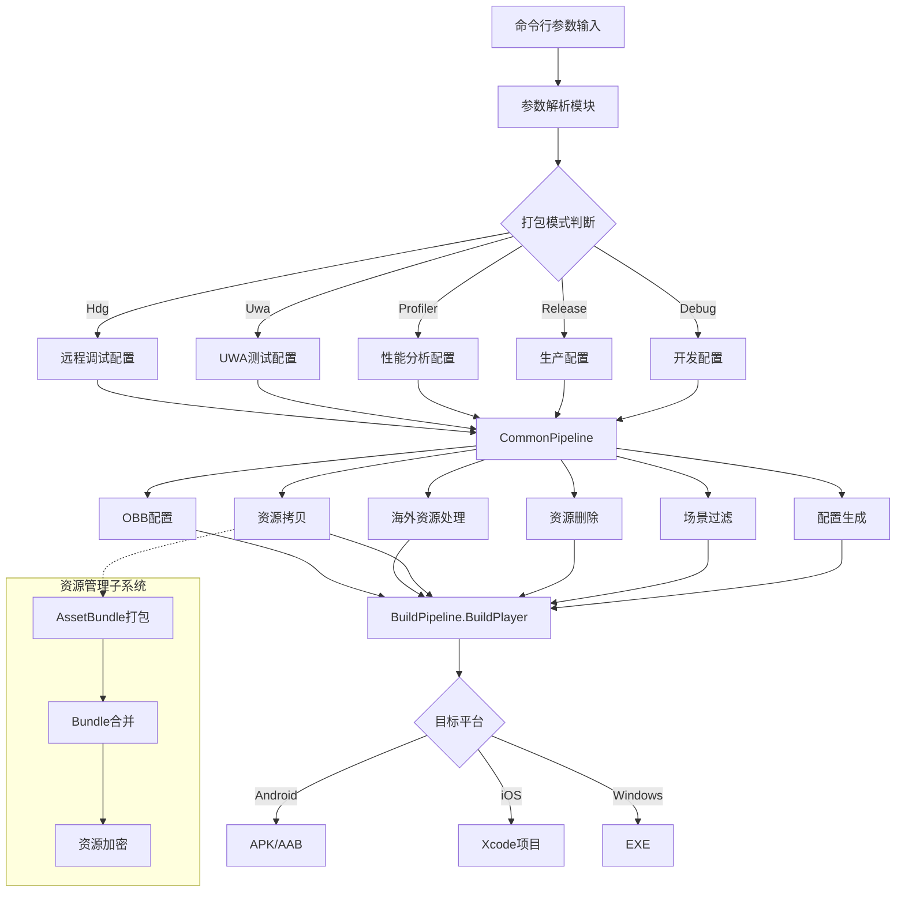
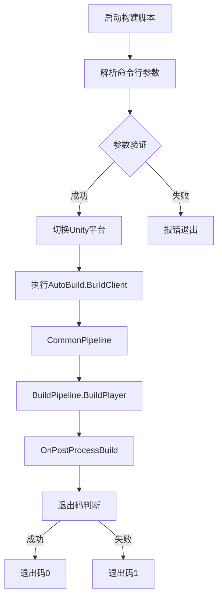

自动化打包系统是项目的核心构建基础设施，支持多平台、多区域、多配置的自动化构建流程。该系统通过命令行参数驱动，实现从配置解析、资源处理到最终产物输出的完整自动化流程，有效提升构建效率并降低人为错误。

## 系统架构概述

自动化打包系统采用模块化设计，核心架构由配置管理、资源处理、平台适配、产物生成四个主要模块组成。系统支持Android、iOS、Windows三大平台，可配置Debug、Release、Profiler、Uwa、Hdg五种打包模式，满足开发、测试、性能分析、海外发布等不同场景需求。



系统通过[AutoBuild.cs](Editor/AutoBuild/AutoBuild.cs#L38-L53)中的`EPackageMode`枚举定义打包模式，每种模式对应不同的编译选项、日志级别和性能配置。[artres/Editor/AutoBuild/AutoBuild.cs](artres/Editor/AutoBuild/AutoBuild.cs#L26-L26)作为资源管理模块的partial类扩展，负责AssetBundle的打包和合并流程。

## 打包模式详解

系统提供五种打包模式，每种模式针对不同的使用场景进行优化：

| 打包模式 | 编译选项 | 日志级别 | 典型用途 | 内部Profiler |
|---------|---------|---------|---------|-------------|
| Debug | Mono2x, Development | 完整Log | 日常开发调试 | 关闭 |
| Release | IL2CPP, Release | Error/Warning | 正式发布版本 | 关闭 |
| Profiler | IL2CPP, Development | 完整Log | 性能分析 | 开启 |
| Uwa | IL2CPP, Development | 关闭Log | UWA性能测试 | 开启 |
| Hdg | IL2CPP, Development | 完整Log | 远程调试 | 关闭 |

打包模式通过[AutoBuild.cs](Editor/AutoBuild/AutoBuild.cs#L45-L53)的`EPackageMode`枚举定义，并在[GeneratePlayerSettings](Editor/AutoBuild/AutoBuild.cs#L903-L994)方法中应用对应的编译选项。例如，Profiler模式会启用`BuildOptions.Development`和`BuildOptions.ConnectWithProfiler`选项，同时开启Unity内部Profiler。

## 核心构建流程

自动化打包的核心执行流程由[CommonPipeline](Editor/AutoBuild/AutoBuild.cs#L1365-L1375)方法统一管理，该方法按顺序执行六个关键步骤，确保构建过程的可预测性和一致性。

### 参数解析

[AnalysisParameters](Editor/AutoBuild/AutoBuild.cs#L335-L599)方法负责解析命令行参数，支持超过20种配置参数。参数解析采用统一的`key=value`格式，主要参数包括：

- `build_out_path`：输出路径
- `build_mode`：打包模式（0-4对应EPackageMode）
- `type_version`、`main_version`、`inner_version`：版本号
- `bundle_id`：应用包名
- `target_area`：目标区域（0-中国，1-韩国等）
- `target_language`：目标语言
- `SDK_LIST`：SDK启用列表（逗号分隔的7个值）
- `program_type`、`hotfix_type`：强更和热更类型
- `zip_mode`、`ab_mode`：资源压缩和AB模式

参数解析完成后，系统会将配置同步到[GetPlatformConfig](Editor/AutoBuild/AutoBuild.cs#L996-L1016)方法生成的平台配置文件中，确保配置的一致性。

### 资源处理流程

资源处理包含四个关键步骤：

1. **场景过滤**：[FilterUnusedScene](Editor/AutoBuild/AutoBuild.cs#L1021-L1034)方法根据打包模式过滤不需要的场景文件。例如，Hdg模式只保留`GameEntryHdg.unity`场景，其他模式则删除该场景。

2. **资源删除**：[DeleteAsset](Editor/AutoBuild/AutoBuild.cs#L1036-L1051)方法根据模式删除不需要的资源文件：
   - 非Uwa模式删除UWA相关资源
   - 非Hdg模式删除远程调试资源
   - 非AutoTest模式删除Poco-SDK资源
   - 根据打包模式删除对应的FMOD库文件

3. **资源拷贝**：[CopyFromFullProject](Editor/AutoBuild/AutoBuild.cs#L1137-L1158)方法从完整工程拷贝StreamingAssets资源和ZipList.json配置文件，如果启用DLL热更则会调用[EnableDllHotfix](Editor/AutoBuild/AutoBuild.cs#L170-L178)将`MoonClient.dll`转换为`MoonClient.bytes`。

4. **海外资源处理**：[CopyOverSeaResources](Editor/AutoBuild/AutoBuild.cs#L1254-L1302)方法针对非主渠道项目，自动拷贝海外专属资源，支持`__Android`和`__IOS`特殊文件夹以区分平台资源。

### 配置生成

[GeneratePlayerSettings](Editor/AutoBuild/AutoBuild.cs#L903-L994)方法根据解析的参数动态配置PlayerSettings：

- **编译后端**：Android平台在IL2CPP模式下支持ARMv7和ARM64架构，Mono2x模式额外支持X86架构
- **脚本符号**：根据模式添加或移除`DEBUG`、`UWA_TEST`、`HDG_TEST`、`TRACE_LOG`、`ENABLE_AUTOTEST`等编译符号
- **应用标识**：通过`bundleId`参数设置`PlayerSettings.applicationIdentifier`
- **日志级别**：Release模式关闭Log和Warning的StackTrace，UWA模式完全禁用Log

### 版本管理

[SetBundleVersion](Editor/AutoBuild/AutoBuild.cs#L1332-L1360)方法负责版本号配置：

- **版本格式**：采用三段式版本号（type_version.main_version.inner_version）
- **Android**：设置`bundleVersionCode`和`minSdkVersion`，中国版最低API 16，韩国版最低API 23
- **iOS**：设置`buildNumber`字符串，并配置iPad启动屏幕类型

[SetProductName](Editor/AutoBuild/AutoBuild.cs#L1307-L1327)方法根据`bundleId`自动设置产品名称，支持中文、韩文等不同语言。

## SDK集成管理

系统通过条件编译符号实现多SDK的灵活集成。核心SDK定义在[AutoBuild.cs](Editor/AutoBuild/AutoBuild.cs#L105-L111)中：

```csharp
public static string msdkSymbol = "ENABLE_MSDK";
public static string gcloudSymbol = "ENABLE_GCLOUD";
public static string buglySymbol = "ENABLE_BUGLY";
public static string midashiSymbol = "ENABLE_MIDASHIPAY";
public static string lebianSymbol = "ENABLE_LEBIAN";
public static string koreasdkSymbol = "ENABLE_KOREASDK";
public static string adjustSymbol = "ENABLE_ADJUST";
```

[AddSdkSymbol](Editor/AutoBuild/AutoBuild.cs#L279-L311)方法根据`SDK_LIST`命令行参数动态添加编译符号，每个SDK对应一个开关（0关闭，1启用）。这种方式确保了不同渠道和地区的包只包含必要的SDK，减少包体大小。

SDK的Lua绑定配置在[DefaultExportSettings.cs](Editor/Custom/DefaultExportSettings.cs#L41-L49)中，使用条件编译指令`#if ENABLE_MSDK`确保只有启用的SDK才会生成对应的Lua Wrap代码。

## AssetBundle资源管理

AssetBundle打包系统是自动化构建的重要组成部分，由[artres/Editor/AutoBuild/AutoBuild.cs](artres/Editor/AutoBuild/AutoBuild.cs)负责实现。系统支持两种打包模式：

- **带AB打包**：调用`ABBuildPanel.BuildAllByPackage`生成完整的AssetBundle
- **无AB打包**：调用`ABBuildPanel.BuildAllWithoutAB`跳过AB生成步骤

打包参数通过[AnalysisBundleParameters](artres/Editor/AutoBuild/AutoBuild.cs#L34-L116)方法解析，支持以下参数：

- `-withbundle`：是否打包AB（0否，1是）
- `-target_area`：目标区域
- `-target_language`：目标语言
- `zip_mode`：压缩模式（0-UNZIP，1-PACKAGE）
- `ab_mode`：AB模式（0-BLOCK）
- `obb`：是否使用OBB扩展文件

打包完成后，系统通过[MergeIOSBundle](artres/Editor/AutoBuild/AutoBuild.cs#L167-L171)和[MergeAndroidBundle](artres/Editor/AutoBuild/AutoBuild.cs#L173-L177)方法执行Bundle合并，调用`ABMerger.MergeBundles`将多个Bundle合并为单个文件，减少网络请求次数。

## Android平台特性

Android平台打包包含多个特殊配置：

### 签名管理

[SetKeystore](Editor/AutoBuild/AutoBuild.cs#L187-L214)方法根据`bundleId`自动选择对应的签名配置：

| Bundle ID | Key Alias | 用途 |
|-----------|-----------|------|
| com.tencent.ro / com.joyyou.ro | ro-rexue | 中国正式版 |
| com.gravity.ragnarokorigin.aos | korea-ro-rexue | 韩国正式版 |
| com.gravity.roo.cbt.aos | korea-cbt-ro-rexue | 韩国CBT版 |
| com.gravity.ragnarokorigin.one | korea-ones-ro-rexue | 韩国ONE版 |

签名文件路径为`Assets/Plugins/Android/roandroid.keystore`，密码和别名密码在代码中硬编码定义。

### OBB扩展文件

当启用`useObb`参数时，[GenerateObbConfig](Editor/AutoBuild/AutoBuild.cs#L1377-L1393)方法配置OBB扩展文件，并通过`PlayerSettings.SetPreloadedAssets`预加载关键资源，确保OBB模式下的资源可用性。

### 后处理钩子

[OnPostProcessBuild](Editor/AutoBuild/AutoBuild.cs#L248-L277)方法在Android打包完成后自动复制符号文件到SDK工具目录，支持崩溃分析和符号化堆栈。

## iOS平台特性

iOS平台打包包含以下特殊处理：

### Xcode项目修改

[UpdateGameLibsXcodeProj](Editor/AutoBuild/AutoBuild.cs#L129-L155)方法修改GameLibs的Xcode项目配置：

- 关闭Bitcode支持（`ENABLE_BITCODE = NO`）
- 设置库搜索路径
- 添加`libluajit.a`链接库

### 平台切换

[SwitchIOS](Editor/AutoBuild/AutoBuild.cs#L158-L162)方法提供平台切换功能，通过`EditorUserBuildSettings.SwitchActiveBuildTarget`切换到iOS平台并退出编辑器，方便CI/CD流程调用。

## 海外多区域支持

系统通过`target_area`和`target_language`参数实现多区域支持。区域和语言信息存储在[MPlatformConfig](Editor/AutoBuild/AutoBuild.cs#L996-L1016)中，影响以下方面：

1. **资源路径**：通过`PathEx.GetChannelArtPathEx`和`PathEx.GetChannelProjPathEx`获取渠道专属资源路径
2. **FMOD音频**：[asyncFModResource](Editor/AutoBuild/AutoBuild.cs#L1160-L1181)方法根据渠道加载对应的音频Bank
3. **产品名称**：[SetProductName](Editor/AutoBuild/AutoBuild.cs#L1307-L1327)方法根据区域设置不同语言的产品名称

海外资源支持`__Android`和`__IOS`特殊文件夹，实现平台差异化资源管理。

## 强更与热更配置

系统支持两种更新机制：

### 强更（Program Update）

通过`program_type`和`program_address`参数配置强更类型和服务器地址：

| 类型 | 枚举值 | 说明 |
|-----|-------|------|
| None | 1 | 不启用强更 |
| Internal | 2 | 内部强更服务器 |
| Dolphin | 3 | 海豚平台 |
| LeBian | 4 | 乐边平台 |

### 热更（Hot Update）

通过`hotfix_type`和`hotfix_address`参数配置热更机制，支持与强更相同的四种类型。配置信息写入[MPlatformConfig](Editor/AutoBuild/AutoBuild.cs#L1006-L1012)并保存到本地，运行时由游戏逻辑读取。

## 数据预处理

[StringToBytes](artres/Editor/AutoBuild/StringToBytes.cs)模块负责将文本配置转换为二进制格式，提升运行时加载效率：

- **BuildPreloadInfoBytes**：将`preload.txt`转换为`preload.bytes`，存储预加载资源信息
- **BuildAnimInfoBytes**：将`animInfo.txt`转换为`animInfo.bytes`，存储动画片段长度和循环信息
- **BuildHeadInfoBytes**：将`head.txt`转换为`head.bytes`，存储头像数据

这些二进制文件在游戏启动时加载，避免JSON解析开销。

## 命令行调用示例



典型Android打包命令：

```
Unity.exe -quit -batchmode -nographics \
  -projectPath /path/to/project \
  -executeMethod AutoBuild.BuildAndroid \
  build_out_path=/output/app.apk \
  build_mode=1 \
  type_version=1 \
  main_version=0 \
  inner_version=0 \
  build_number=100 \
  bundle_id=com.joyyou.ro \
  target_area=0 \
  target_language=0 \
  SDK_LIST=1,1,0,1,0,0,0 \
  zip_mode=0 \
  ab_mode=0
```

## 错误处理与日志

系统使用[MDebug](Editor/AutoBuild/AutoBuild.cs#L194-L195)统一记录构建日志，关键步骤都会输出日志信息。构建错误通过[PrintErrorLog](Editor/AutoBuild/AutoBuild.cs#L1399-L1406)方法处理，非零退出码表示构建失败。

打包脚本在构建完成后会调用`EditorApplication.Exit(ret ? 0 : 1)`返回退出码，CI/CD系统可根据退出码判断构建是否成功。

## 下一步学习

了解了自动化打包系统的整体架构后，建议继续学习以下相关内容：

- **资源管理**：深入了解[AssetBundle系统架构](14-assetbundlexi-tong-jia-gou)，理解资源打包和加载机制
- **性能优化**：学习[UWA性能分析集成](27-uwaxing-neng-fen-xi-ji-cheng)，掌握性能测试和优化方法
- **平台适配**：研究[Android平台特性与适配](29-androidping-tai-te-xing-yu-gua-pei)和[iOS平台特性与适配](30-iosping-tai-te-xing-yu-gua-pei)，了解平台差异化处理