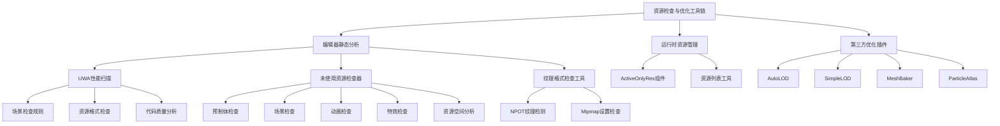
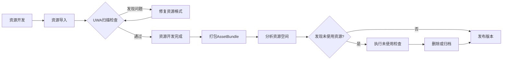

本文档介绍项目中的资源检查与优化工具链，帮助开发者识别未使用资源、优化资源格式、分析资源占用，并通过第三方工具实现性能优化。这些工具集成了UWA性能扫描、自定义资源检查器、纹理格式验证和运行时资源管理等功能，为项目构建提供了完整的资源管理解决方案。

## 工具架构概览

项目的资源检查与优化工具采用多层次架构设计，包含编辑器静态分析工具、运行时资源管理工具和第三方优化插件三个核心层次。通过`[Editor/uwascan_ruleconfig.json](Editor/uwascan_ruleconfig.json#L1-L64)`配置文件统一管理UWA扫描规则，覆盖场景检查、项目资源检查、代码分析等多个维度。

工具链各层次通过Unity Editor菜单系统集成，提供统一的操作入口，支持批量处理和自动化检查。

## UWA性能扫描工具

UWA（Unity Web Asset）扫描工具通过`[Editor/uwascan_ruleconfig.json](Editor/uwascan_ruleconfig.json#L1-L64)`配置文件定义了60+条扫描规则，涵盖了场景配置、资源格式、材质优化、动画压缩等多个维度的性能检查。

### 扫描规则分类

| 检查类别 | 规则示例 | 检查目标 |
|---------|---------|---------|
| 场景检查 | Scene_MultipleAudioListeners, Scene_ShadowResolution, Scene_StaticRigidBody | 场景性能问题 |
| 纹理检查 | Texture_AlphaAllOne, Texture_CompressionFormat, Texture_PureColor, Texture_Resolution | 纹理格式优化 |
| 材质检查 | Mat_EmptyTex, Mat_UselessTex, Mat_EqualTex, Mat_PureColorTex | 材质冗余检测 |
| 网格检查 | Mesh_RW, Mesh_Tangent, Mesh_Normal, Mesh_TriangleLimit | 网格数据优化 |
| 动画检查 | AnimationClip_FloatFormat, AnimationClip_ScaleCurve, AnimationClip_Compression | 动画压缩优化 |
| UI检查 | UIImage_Tiled, UIImage_Unvisible, UIText_Outline, UIRawImage_DefaultTexture | UI性能优化 |
| 代码分析 | TagCompare, EmptyBodyUpdate, OnGUIUsage | 代码质量分析 |

配置文件采用JSON格式，每个规则键值对控制一条检查规则的启用状态。扫描模式配置支持两种模式：场景扫描模式（`scan_scene_mode`）设置为"all"表示扫描所有场景，资源扫描模式（`scan_asset_mode`）设置为"targetonly"表示仅扫描指定目录（Assets）。Sources: [Editor/uwascan_ruleconfig.json](Editor/uwascan_ruleconfig.json#L1-L10)

### 运行时性能分析

UWA提供运行时性能分析能力，通过`[UWA/Libs/UWA_Launcher.cs](UWA/Libs/UWA_Launcher.cs#L17-L145)`中的`UWAEngine`类实现性能采样和标记。该类支持四种分析模式：Overview（概览）、Mono（Mono堆内存）、Assets（资源）、Lua（Lua脚本），可通过`PushSample`和`PopSample`方法记录函数执行时间，通过`LogValue`方法记录自定义数值。Sources: [UWA/Libs/UWA_Launcher.cs](UWA/Libs/UWA_Launcher.cs#L41-L95)

## 未使用资源检查器

未使用资源检查器位于`[artres/Editor/UnusedChecker/](artres/Editor/UnusedChecker/)`目录，提供了一套完整的资源引用分析系统，能够检测未使用的预制体、场景、动画和特效资源。该系统通过分析资源依赖关系、配表引用和代码引用来识别未使用资源。

### 预制体检查器

`[UnusedPrefabChecker.cs](artres/Editor/UnusedChecker/UnusedPrefabChecker.cs#L1-L340)`实现模型预制体的未使用检查。检查流程包括以下步骤：

1. 资源依赖分析：通过`AssetDatabase.GetDependencies`收集所有ScriptableObject、Asset、TimelineAsset、Prefab、Scene资源对预制体的引用关系
2. 配表引用检查：检查PresentTable、DefaultEquipTable、EquipTable、CarryItemTable等多个配表是否引用该预制体
3. 代码引用检查：遍历C#和Lua源文件，搜索预制体名称字符串
4. 生成报告：输出所有未引用的预制体路径列表

检查器通过`[MenuItem("ROTools/废资源检查/检查模型")](artres/Editor/UnusedChecker/UnusedPrefabChecker.cs#L34-L35)`注册到Unity Editor菜单，用户选择保存路径后自动执行检查并生成报告文件。Sources: [artres/Editor/UnusedChecker/UnusedPrefabChecker.cs](artres/Editor/UnusedChecker/UnusedPrefabChecker.cs#L34-L68)

### 场景检查器

`[UnusedSceneChecker.cs](artres/Editor/UnusedChecker/UnusedSceneChecker.cs#L1-L119)`提供场景和小地图资源的未使用检查。场景检查器通过`[MenuItem("ROTools/废资源检查/检查场景")](artres/Editor/UnusedChecker/UnusedSceneChecker.cs#L13-L14)`触发，遍历发布目录下的所有场景文件，然后检查SceneTable配表中的`SceneUnityFile`字段是否引用该场景。小地图检查器通过`[MenuItem("ROTools/废资源检查/检查小地图")](artres/Editor/UnusedChecker/UnusedSceneChecker.cs#L43-L44)`触发，检查UI发布目录下Texture/Map子目录中的纹理资源是否被SceneTable配表的`MapName`字段引用。Sources: [artres/Editor/UnusedChecker/UnusedSceneChecker.cs](artres/Editor/UnusedChecker/UnusedSceneChecker.cs#L13-L82)

### 动画检查器

`[UnusedAnimChecker.cs](artres/Editor/UnusedChecker/UnusedAnimChecker.cs#L1-L542)`实现动画剪辑的未使用检查。检查器采用多层次引用分析：

1. 资源依赖分析：检查动画是否被其他资源直接引用
2. CutScene引用检查：检查过场动画数据是否引用该动画
3. 配表引用检查：检查AnimationTable、VehicleTable、ClimbAnimTable、BarrowTable、FashionTable、HeroChallengeTable、MvpTable、CarryItemTable等多个配表
4. 代码引用检查：遍历C#和Lua源文件

动画检查器通过`[MenuItem("ROTools/废资源检查/检查动画")](artres/Editor/UnusedChecker/UnusedAnimChecker.cs#L43-L44)`触发，支持配置递归检查深度和排除目录。Sources: [artres/Editor/UnusedChecker/UnusedAnimChecker.cs](artres/Editor/UnusedChecker/UnusedAnimChecker.cs#L43-L85)

### 特效检查器

`[UnusedFxChecker.cs](artres/Editor/UnusedChecker/UnusedFxChecker.cs#L1-L315)`提供特效预制体的未使用检查。特效检查器通过`[MenuItem("ROTools/废资源检查/检查特效")](artres/Editor/UnusedChecker/UnusedFxChecker.cs#L45-L46)`触发，检查流程包括：

1. 资源依赖分析：收集所有资源对特效预制体的引用
2. 配表引用检查：检查EffectTable、GlobalTable、HSFxConfigTable、MvpTable、RedDotIndex、SceneObjTable等配表
3. 代码引用检查：遍历技能编辑器数据、场景编辑器输出、C#代码、Lua代码等目录

特效检查器在分析依赖时会过滤掉非特效目录的引用，只关注`PathUtils.EFFECT_PREFAB_PATH`路径下的资源。Sources: [artres/Editor/UnusedChecker/UnusedFxChecker.cs](artres/Editor/UnusedChecker/UnusedFxChecker.cs#L45-L88)

### 资源空间分析工具

`[AnalyzeDepInfo.cs](artres/Editor/UnusedChecker/AnalyzeDepInfo.cs#L1-L167)`提供AssetBundle打包后的资源空间占比分析。该工具通过`[MenuItem("ROTools/废资源检查/分析资源空间占比")](artres/Editor/UnusedChecker/AnalyzeDepInfo.cs#L45-L46)`打开分析窗口，用户选择包含dep.all文件的AB打包输出目录后，工具会读取依赖信息并构建目录树结构，统计每个目录的资源总大小。目录树使用`ABDataDir`类递归构建，支持折叠展开，每个节点显示目录名称和总文件大小（自动转换为GB/MB/KB/bytes格式）。Sources: [artres/Editor/UnusedChecker/AnalyzeDepInfo.cs](artres/Editor/UnusedChecker/AnalyzeDepInfo.cs#L48-L113)

## 纹理格式检查工具

纹理格式检查工具位于`[artres/Editor/TextureFormat/TextureFormatCheckTool.cs](artres/Editor/TextureFormat/TextureFormatCheckTool.cs#L1-L184)`，提供纹理格式验证和批量修改功能。

### 工具功能

纹理格式检查工具通过`[MenuItem("ROTools/TextureFormatSet/TextureFormat 检查工具")](artres/Editor/TextureFormat/TextureFormatCheckTool.cs#L13-L14)`和`[MenuItem("Assets/TextureFormatSet/TextureFormat 检查工具")](artres/Editor/TextureFormat/TextureFormatCheckTool.cs#L15-L16)`注册到Unity Editor菜单和Assets上下文菜单，支持右键选中目录直接打开检查窗口。工具提供以下检查功能：

| 检查项 | 检查方法 | 说明 |
|-------|---------|------|
| NPOT纹理 | `CheckImgNPOT` | 检查长或宽不是4的倍数的纹理 |
| Mipmap设置 | `CheckImgMipmapOpen` | 检查开启了Mipmap的纹理 |

检查结果以可折叠列表形式显示，点击列表项可直接选中对应资源。工具还提供批量修改功能，支持批量关闭Mipmap设置，其他批量功能待开发。Sources: [artres/Editor/TextureFormat/TextureFormatCheckTool.cs](artres/Editor/TextureFormat/TextureFormatCheckTool.cs#L18-L73)

### 批量处理机制

批量处理通过`BatChangeSetting`方法实现，接受文件路径列表和操作委托作为参数。处理过程中显示可取消的进度条，用户随时可中断操作。纹理修改通过`TextureImporter.SaveAndReimport`触发资源重新导入，确保修改生效。Sources: [artres/Editor/TextureFormat/TextureFormatCheckTool.cs](artres/Editor/TextureFormat/TextureFormatCheckTool.cs#L95-L107)

## 运行时资源管理工具

运行时资源管理工具位于`[Scripts/Tools/](Scripts/Tools/)`目录，提供资源激活控制和资源信息查询功能。

### 激活独占资源组件

`[ActiveOnlyRes.cs](Scripts/Tools/ActiveOnlyRes.cs#L1-L18)`实现资源的条件激活控制。该组件在`Start`方法中检查`MGameContext.singleton.IsGameEditorMode`标志，根据标志值控制GameObject的激活状态。如果资源在编辑器模式下不应激活，则自动禁用，反之则启用。该机制允许开发时保留调试资源，运行时自动隐藏，避免不必要的资源加载和渲染开销。Sources: [Scripts/Tools/ActiveOnlyRes.cs](Scripts/Tools/ActiveOnlyRes.cs#L9-L17)

### 资源列表工具

`[ListMeshParticle.cs](Scripts/Tools/ListMeshParticle.cs#L1-L12)`提供Mesh和粒子系统资源的列表存储。该ScriptableObject包含一个字符串列表`pathes`，用于存储资源路径信息，可作为编辑器工具的数据容器。Sources: [Scripts/Tools/ListMeshParticle.cs](Scripts/Tools/ListMeshParticle.cs#L8-L12)

### 编辑器标题更新工具

`[UpdateUnityEditorAssetHandler.cs](Scripts/Tools/UpdateUnityEditorAssetHandler.cs#L1-L147)`在Unity Editor窗口标题中显示当前工程路径。该工具通过Windows API（`GetWindowText`、`SetWindowText`）获取和设置窗口标题，每2秒更新一次，避免频繁调用。工具通过`[OnOpenAssetAttribute(1)]`标记在资源打开时更新标题，通过`EditorApplication.hierarchyWindowItemOnGUI`在层次面板GUI绘制时触发更新。该功能仅支持Windows平台（`#if UNITY_EDITOR_WIN`）。Sources: [Scripts/Tools/UpdateUnityEditorAssetHandler.cs](Scripts/Tools/UpdateUnityEditorAssetHandler.cs#L14-L48)

## 第三方优化插件

项目集成了多个第三方资源优化插件，位于`[artres/ThirdParty/](artres/ThirdParty/)`目录，提供专业级的资源优化功能。

### LOD（Level of Detail）优化

| 插件 | 功能描述 | 适用场景 |
|-----|---------|---------|
| AutoLOD | 自动生成多级LOD模型，支持LOD组自动配置 | 大场景植被、建筑群 |
| SimpleLOD | 简单的网格简化工具，支持合并相同材质网格 | 静态物体优化 |

AutoLOD和SimpleLOD通过减少远距离物体的网格面数来降低渲染负载，特别适用于场景中大量重复的植被和建筑对象。Sources: [artres/ThirdParty/AutoLOD](artres/ThirdParty/AutoLOD), [artres/ThirdParty/SimpleLOD](artres/ThirdParty/SimpleLOD)

### 网格合并工具

MeshBaker插件提供网格合并功能，将多个静态物体合并为单个Mesh，减少Draw Call数量。该插件适用于场景中不动的建筑群、地形装饰等静态物体。合并后的网格共享材质，可显著提升渲染性能。Sources: [artres/ThirdParty/MeshBaker](artres/ThirdParty/MeshBaker)

### 粒子图集工具

ParticleAtlas插件提供粒子纹理图集合并功能，将多个粒子系统使用的纹理合并到一张大图集中，减少纹理切换和内存占用。该工具包含多个辅助类：`BaseSprite`、`MeshSprite`、`ParticleSprite`、`ParticleAtlas`、`ParticleAtlasAssembler`、`ParticleSpriteAssembler`，支持不同类型粒子的图集打包。Sources: [artres/ThirdParty/ParticleAtlas](artres/ThirdParty/ParticleAtlas)

## 使用工作流

资源检查与优化工具提供完整的工作流支持，从资源开发到最终优化的全过程管理。

### 日常开发流程

在资源开发过程中，开发者应定期运行UWA扫描检查，确保新导入的资源符合项目规范。纹理资源需通过TextureFormat检查工具验证NPOT和Mipmap设置，避免不必要的性能开销。特效和预制体完成后，通过未使用资源检查器验证引用关系，确保资源能被正确加载。

### 版本发布前检查

版本发布前，应执行完整的资源检查流程：

1. 运行UWA扫描，修复所有高优先级问题
2. 执行未使用资源检查，清理废弃资源
3. 使用第三方LOD工具优化场景物体
4. 分析资源空间占比，识别占用过大的资源包
5. 使用MeshBaker合并静态网格
6. 使用ParticleAtlas优化粒子纹理

### 性能监控与持续优化

通过UWA运行时分析工具监控实际游戏性能，结合资源空间分析报告持续优化资源配置。建议建立资源使用规范文档，明确各类型资源的格式要求和性能目标。

## 最佳实践

使用资源检查与优化工具时应遵循以下最佳实践：

1. **定期检查**：每周至少执行一次UWA完整扫描，及时发现资源问题
2. **配表优先**：新增配表引用的资源会自动通过检查，避免硬编码资源路径
3. **分层优化**：优先优化高频使用的资源，如UI纹理、特效预制体
4. **版本控制**：删除资源前先备份，确认无误后再提交
5. **文档记录**：记录优化前后性能数据，评估优化效果

## 相关资源

资源检查与优化工具与项目其他系统紧密协作，形成完整的性能优化生态：

- [AssetBundle系统架构](14-assetbundlexi-tong-jia-gou) - 了解资源打包机制和依赖关系
- [UWA性能分析集成](27-uwaxing-neng-fen-xi-ji-cheng) - 深入学习UWA运行时分析功能
- [内存管理与优化策略](28-nei-cun-guan-li-yu-you-hua-ce-lue) - 掌握内存优化技巧
- [自动化打包系统](24-zi-dong-hua-da-bao-xi-tong) - 集成资源检查到打包流程

通过系统性地使用这些工具和遵循最佳实践，项目可以持续保持资源使用效率，为玩家提供流畅的游戏体验。