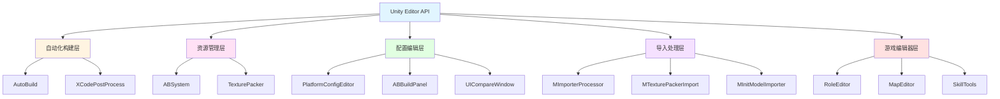
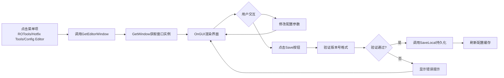
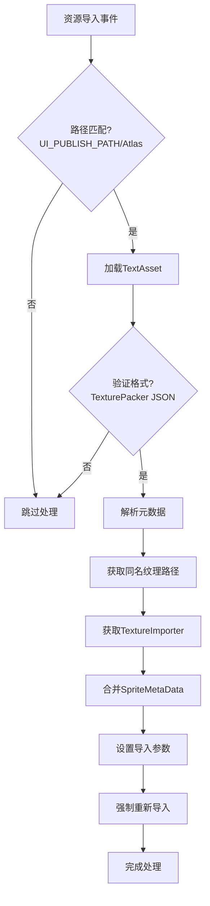
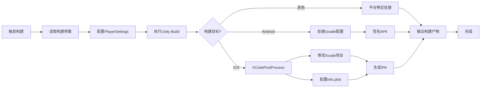

自定义编辑器扩展是提升Unity开发效率的核心手段，本项目构建了完整的编辑器工具链体系，覆盖了自动化构建、资源管理、配置编辑、导入处理等多个维度。本文档深入解析项目中的编辑器扩展架构设计、核心实现模式及最佳实践，为高级开发者提供可复用的技术方案。

## 编辑器扩展架构概览

本项目的编辑器扩展采用分层架构设计，通过模块化组织实现功能解耦。底层复用Unity原生Editor API，上层构建业务抽象层，形成统一的工具生态。编辑器扩展按功能划分为自动化构建系统、资源管理工具、配置编辑器窗口、资产导入处理器、游戏专用编辑器等五大类，各类工具通过统一的命名空间和目录结构进行组织管理。

Sources: [Editor/AutoBuild/AutoBuild.cs](Editor/AutoBuild/AutoBuild.cs#L1-L100), [artres/Editor/](artres/Editor/)



编辑器扩展的目录结构遵循明确的组织原则：`Editor/`目录存放核心框架级扩展，`artres/Editor/`目录存放游戏业务相关扩展。这种分离确保了框架工具的可复用性，同时便于不同团队维护各自的业务工具。所有编辑器脚本都置于`Editor`命名文件夹下，确保仅在编辑器环境下编译，不会打包到最终产品中。

Sources: [Editor/](Editor/), [artres/Editor/](artres/Editor/)

## 自定义编辑器窗口

自定义编辑器窗口是扩展Unity编辑器最直接的方式，本项目通过`EditorWindow`基类实现了多个功能窗口。窗口的创建遵循标准模式：使用`[MenuItem]`特性注册菜单项，通过`GetWindow<T>()`获取或创建窗口实例，在`OnGUI()`中实现界面绘制逻辑。

**PlatformConfigEditorWindow**展示了配置编辑窗口的标准实现模式，该窗口用于管理平台配置参数。窗口继承自`EditorWindow`，通过静态方法`GetEditorWindow()`暴露创建入口，使用`EditorGUILayout`控件实现表单界面，配置数据通过`MPlatformConfig`对象进行管理，支持Debug模式、GM开关、zip模式、AB打包模式、版本号、文件服务器地址等核心配置项的编辑与持久化。

Sources: [Editor/Hotfix/PlatformConfigEditorWindow.cs](Editor/Hotfix/PlatformConfigEditorWindow.cs#L1-L51)



**UICompareWindow**实现了UI对比预览功能，展示了更复杂的窗口交互逻辑。该窗口通过`InitGameObject()`动态查找场景中的摄像机和UI组件，实现了缩放、透明度调节、纹理窗口拖拽等交互功能。窗口使用`BeginWindows()`/`EndWindows()` API创建可拖拽的子窗口区域，通过`Update()`方法持续重绘保持界面同步，这是实现实时预览类编辑器的标准模式。

Sources: [artres/Editor/UIEditor/UICompareWindow.cs](artres/Editor/UIEditor/UICompareWindow.cs#L1-L100)

**ABBuildPanel**是AssetBundle打包系统的主界面窗口，展示了大型工具窗口的架构设计。该窗口定义了多个资源过滤器列表（Lua、字节流、AB包、复制文件），通过`FilterDictAll`字典统一管理所有过滤器类型。窗口界面包含打包模式切换、zip模式选择、目标渠道和语言配置等选项，通过枚举下拉框和复选框实现参数配置。窗口还处理了渠道和语言切换时的`AssetDatabase.Refresh()`操作，确保资源数据库与配置同步。

Sources: [artres/Editor/ABSystem/EditorWindow/ABBuildPanel.cs](artres/Editor/ABSystem/EditorWindow/ABBuildPanel.cs#L1-L150)

自定义编辑器窗口的最佳实践包括：使用`EditorGUILayout`而非`GUILayout`以保持布局一致性；在`OnEnable()`中初始化状态，在`OnDisable()`中清理资源；对于耗时操作使用`EditorUtility.DisplayProgressBar()`显示进度；通过`EditorPrefs`或`PlayerPrefs`持久化窗口状态；实现窗口大小限制以适应不同屏幕分辨率。

Sources: [artres/Editor/ABSystem/EditorWindow/ABBuildPanel.cs](artres/Editor/ABSystem/EditorWindow/ABBuildPanel.cs#L1-L150)

## 自定义Inspector编辑器

自定义Inspector允许为特定组件提供专用的编辑界面，本项目通过`[CustomEditor]`特性和`Editor`基类实现了多个自定义Inspector。**MPlatformEditor**为`MPlatform`组件提供了扩展的Inspector界面，展示了标准实现模式。

Sources: [Editor/Platform/MPlatformEditor.cs](Editor/Platform/MPlatformEditor.cs#L1-L100)

MPlatformEditor在基础Inspector之上添加了多项功能：DLL版本号折叠面板，遍历`Plugins/GameLibs`目录下的所有DLL文件并显示文件名和哈希值；CutScene和翻译Debug的开关控制，通过`PlayerPrefs`持久化状态；缓存文件清理功能，删除热更目录和配置缓存文件；PlayerPrefs清理按钮，重置所有本地存储的键值对；游戏地区和语言的枚举选择，修改后自动保存配置并刷新资源数据库。

Sources: [Editor/Platform/MPlatformEditor.cs](Editor/Platform/MPlatformEditor.cs#L1-L100)

```csharp
[CustomEditor(typeof(MPlatform))]
public class MPlatformEditor : Editor
{
    private bool dllversionFold = false;
    
    public override void OnInspectorGUI()
    {
        // 自定义UI绘制
        dllversionFold = EditorGUILayout.Foldout(dllversionFold, "dll列表");
        if (dllversionFold)
        {
            // DLL哈希值展示逻辑
        }
        
        // 调用基类方法绘制默认Inspector
        base.OnInspectorGUI();
        
        // 自定义按钮和控件
        if (GUILayout.Button("清除缓存文件"))
        {
            // 清理逻辑
        }
    }
}
```

自定义Inspector的核心要点：使用`target`属性访问被编辑的组件对象；在`OnEnable()`中初始化状态，读取持久化数据；使用`EditorGUILayout`绘制控件以保持编辑器风格统一；通过`EditorUtility.SetDirty(target)`标记对象已修改，触发序列化；对于复杂逻辑，考虑将实现提取到独立类中，保持Inspector代码简洁。

Sources: [Editor/Platform/MPlatformEditor.cs](Editor/Platform/MPlatformEditor.cs#L1-L100)

## 资产导入处理器

资产导入处理器（AssetPostprocessor）允许在资源导入过程中自动执行预处理或后处理逻辑，本项目通过继承`AssetPostprocessor`类实现了多个自动化导入工具。**MImporterProcessor**是全局导入处理器的典型实现，监听所有资源的导入、删除、移动事件。

Sources: [artres/Editor/Importer/MImporterProcessor.cs](artres/Editor/Importer/MImporterProcessor.cs#L1-L83)

MImporterProcessor实现了Shader自动重导入机制：当检测到`Assets/artres/Resources/Shader/RO`目录下的Shader文件发生变化时，会在120秒的冷却时间后触发Shader的递归强制重新导入。这种机制解决了Shader依赖关系变更时的编译问题，通过时间戳和路径判断避免重复导入。处理器使用`EditorTools.AvoidReimport`标志位控制是否跳过处理，避免递归导入导致的无限循环。

Sources: [artres/Editor/Importer/MImporterProcessor.cs](artres/Editor/Importer/MImporterProcessor.cs#L1-L83)

**MTexturePackerImport**专门处理TexturePacker图集数据的自动导入，展示了特定资源类型的处理模式。当检测到UI发布路径（`PathUtils.UI_PUBLISH_PATH + "Atlas"`）下的JSON文件导入时，自动解析TexturePacker格式的元数据，提取精灵切片信息，并应用到对应的纹理导入设置上。处理器会自动设置纹理类型为Sprite，导入模式为Multiple，禁用可读性和mipmap，确保图集资源符合项目规范。

Sources: [artres/Editor/Importer/MTexturePackerImport.cs](artres/Editor/Importer/MTexturePackerImport.cs#L1-L100)



资产导入处理器的开发要点：处理方法必须是静态的；使用路径前缀匹配过滤目标资源；通过`AssetImporter.GetAtPath()`获取导入器实例；修改导入设置后调用`AssetDatabase.ImportAsset()`强制重新导入；使用标志位避免处理过程中的递归导入；对于耗时操作，添加进度条提示。

Sources: [artres/Editor/Importer/MImporterProcessor.cs](artres/Editor/Importer/MImporterProcessor.cs#L1-L83), [artres/Editor/Importer/MTexturePackerImport.cs](artres/Editor/Importer/MTexturePackerImport.cs#L1-L100)

## 自动化构建系统

自动化构建系统是编辑器扩展中最复杂且价值最高的模块，**AutoBuild**类实现了完整的跨平台打包流程。该系统定义了打包模式枚举（Debug、Release、Profiler、Uwa、Hdg），支持多平台构建目标，集成了版本管理、渠道配置、热更配置、DLL热修复、自动化测试等多种功能。

Sources: [Editor/AutoBuild/AutoBuild.cs](Editor/AutoBuild/AutoBuild.cs#L1-L100)

AutoBuild系统管理Android和iOS的签名配置，包含keystore路径、别名名称、密码等敏感信息。系统支持多种更新策略配置（强更和热更），允许配置更新类型、服务器地址和渠道号。构建参数包括IL2CPP开关、BundleID、GM开关、SDK符号、GooglePlay集成、zip模式、AB模式等，通过静态字段统一管理，在构建流程中被读取和使用。

Sources: [Editor/AutoBuild/AutoBuild.cs](Editor/AutoBuild/AutoBuild.cs#L1-L100)

XUPorter子系统实现了iOS工程的自动化修改，通过`XCodePostProcess`类在构建后自动修改Xcode项目文件。该系统包含PBX工程编辑器（PBX Editor）、Plist文件处理器、构建配置修改器（XCBuildConfiguration）等模块，能够自动添加SDK、修改权限配置、调整构建设置。这种方式避免了每次打包后手动修改Xcode项目的繁琐操作，确保了打包流程的完整性和一致性。

Sources: [Editor/XUPorter/XCodePostProcess.cs](Editor/XUPorter/XCodePostProcess.cs#L1-L50)



自动化构建系统的设计原则：参数集中管理，通过枚举和静态字段配置；分阶段处理，使用进度条反馈构建状态；错误处理完善，捕获并记录异常信息；支持多平台，通过`#if UNITY_XXX`条件编译隔离平台代码；集成第三方工具，如UWA性能分析、远程调试等；版本号自动管理，支持主版本、次版本、内部版本和构建号的多级版本控制。

Sources: [Editor/AutoBuild/AutoBuild.cs](Editor/AutoBuild/AutoBuild.cs#L1-L100), [Editor/XUPorter/](Editor/XUPorter/)

## 代码生成工具

代码生成工具能够自动化生成样板代码，减少重复劳动并降低出错率。**EmmyLuaAPIMaker**实现了Lua API文档的自动生成，为ToLua框架导出的类型生成EmmyLua类型注解文件，提升Lua代码的IDE支持。

Sources: [artres/Editor/EmmyLuaAPIMaker.cs](artres/Editor/EmmyLuaAPIMaker.cs#L1-L100)

EmmyLuaAPIMaker通过反射收集所有需要导出的类型，包括ToMenu的基础类型、丢弃类型以及各个ExportSettings中配置的自定义类型。生成器会遍历类型的公共成员，生成符合EmmyLua语法的注解文件，输出到`Scripts/Lua/UnityLuaAPI`目录。生成的文件包含类定义、方法签名、属性类型等信息，支持Lua代码的自动补全和类型检查。

Sources: [artres/Editor/EmmyLuaAPIMaker.cs](artres/Editor/EmmyLuaAPIMaker.cs#L1-L100)

**DllToLuaLib**工具将C# DLL转换为Lua库文件，生成对应Lua的元信息文件。该工具通过反射分析mscorlib、UnityEngine、Assembly-CSharp、MoonClient、MoonCommonLib等程序集中的所有类型，为每个类型生成Lua对应的元数据文件，包含类、方法、属性的注释信息。生成的文件支持Lua开发时的代码提示和类型检查，是混合开发模式的重要基础设施。

Sources: [artres/Editor/DllToLuaLib.cs](artres/Editor/DllToLuaLib.cs#L1-L100)

**GenStripCodeUtil**实现了代码裁剪保护文件的自动生成，通过扫描Resources目录下的所有Prefab，收集其组件类型，生成`KeepCodeFromStrip.cs`文件。该工具使用Unity代码裁剪特性，确保运行时动态加载的类型不会被Unity的代码裁剪优化误删。工具遍历所有Prefab，提取组件类型，过滤掉项目程序集（MoonClient）中的类型，生成完整的类型保护列表。

Sources: [artres/Editor/GenStripCodeUtil.cs](artres/Editor/GenStripCodeUtil.cs#L1-L100)

代码生成工具的核心模式：使用反射分析元数据；通过模板生成标准化代码；输出路径集中管理；支持增量生成，避免覆盖手动修改的内容；生成前清空目标目录；使用EditorUtility显示处理进度；捕获并记录生成过程中的异常。

Sources: [artres/Editor/EmmyLuaAPIMaker.cs](artres/Editor/EmmyLuaAPIMaker.cs#L1-L100), [artres/Editor/DllToLuaLib.cs](artres/Editor/DllToLuaLib.cs#L1-L100), [artres/Editor/GenStripCodeUtil.cs](artres/Editor/GenStripCodeUtil.cs#L1-L100)

## 编辑器工具最佳实践

基于项目实践，总结出编辑器扩展开发的核心原则和模式。**代码组织**方面，编辑器脚本应严格放置在Editor命名文件夹下，框架级工具放在`Editor/`目录，业务级工具放在`artres/Editor/`目录，通过命名空间进一步区分模块。所有编辑器类都应添加明确的文档注释，说明功能、作者、创建日期和修改历史。

Sources: [Editor/AutoBuild/AutoBuild.cs](Editor/AutoBuild/AutoBuild.cs#L1-L20), [artres/Editor/ABSystem/ABBuilder.cs](artres/Editor/ABSystem/ABBuilder.cs#L1-L20)

**用户界面**方面，优先使用`EditorGUILayout`系列控件而非`GUILayout`，以保持与Unity编辑器风格的一致性。对于复杂的表单，考虑使用`SerializedObject`和`SerializedProperty`系统，自动处理Undo/Redo和脏标记。窗口布局应使用`EditorGUIUtility.GetControlSize()`获取标准控件尺寸，确保跨主题兼容。对于大型工具，使用`EditorGUILayout.BeginVertical()`/`EndVertical()`进行区域分组，使用`EditorGUILayout.Space()`添加间距。

Sources: [Editor/Hotfix/PlatformConfigEditorWindow.cs](Editor/Hotfix/PlatformConfigEditorWindow.cs#L1-L51)

**性能优化**方面，避免在`OnGUI()`中执行耗时操作，将重计算缓存到字段中，在`OnEnable()`中初始化。对于循环绘制，使用`EditorGUI.BeginChangeCheck()`/`EndChangeCheck()`检测变化，仅在值改变时执行逻辑。大量对象处理时，使用`EditorUtility.DisplayProgressBar()`显示进度，处理完成后调用`EditorUtility.ClearProgressBar()`清理。频繁的文件操作应批量化处理，减少`AssetDatabase.Refresh()`调用次数。

Sources: [artres/Editor/ABSystem/ABBuilder.cs](artres/Editor/ABSystem/ABBuilder.cs#L1-L100), [artres/Editor/GenStripCodeUtil.cs](artres/Editor/GenStripCodeUtil.cs#L1-L100)

**错误处理**方面，使用`try-catch`包裹可能失败的操作，通过`Debug.LogError()`记录异常信息。对于用户输入验证，使用`EditorGUILayout.HelpBox()`显示错误提示，阻止无效操作。文件操作前应检查路径有效性，使用`Directory.Exists()`和`File.Exists()`避免异常。使用`EditorUtility.DisplayDialog()`在关键操作前显示确认对话框，防止误操作。

Sources: [Editor/Hotfix/PlatformConfigEditorWindow.cs](Editor/Hotfix/PlatformConfigEditorWindow.cs#L1-L51)

**持久化存储**方面，配置数据优先使用ScriptableObject或MonoBehaviour资源序列化，复杂配置使用JSON或XML文件存储。用户偏好使用`EditorPrefs`存储，确保跨会话保持。游戏运行时需要的配置使用`PlayerPrefs`，与游戏逻辑共享。敏感信息（如密码、密钥）应加密存储或询问用户输入，避免明文保存在代码中。

Sources: [Editor/Platform/MPlatformEditor.cs](Editor/Platform/MPlatformEditor.cs#L1-L100), [Editor/Hotfix/PlatformConfigEditorWindow.cs](Editor/Hotfix/PlatformConfigEditorWindow.cs#L1-L51)

**平台适配**方面，使用`#if UNITY_XXX`条件编译隔离平台特定代码，避免不必要的引用。iOS相关的扩展放在`Editor/XUPorter/`目录，Android相关的处理放在`Editor/AutoBuild/`中。平台判断使用`EditorUserBuildSettings.activeBuildTarget`而非`Application.platform`，确保在编辑器环境下正确识别目标平台。

Sources: [Editor/AutoBuild/AutoBuild.cs](Editor/AutoBuild/AutoBuild.cs#L1-L100), [Editor/XUPorter/](Editor/XUPorter/)

## 扩展开发工作流

开发自定义编辑器扩展遵循标准工作流：首先确定扩展类型（窗口、Inspector、导入处理器等），在适当的目录创建脚本文件。实现基础功能后，在`OnGUI()`或处理方法中添加业务逻辑。对于复杂工具，先实现数据模型，再构建UI界面。使用`[MenuItem]`注册菜单项，通过菜单触发功能测试。功能完善后，添加错误处理、进度显示、用户提示等优化。最后编写文档，说明工具使用方法和注意事项。

Sources: [Editor/Hotfix/PlatformConfigEditorWindow.cs](Editor/Hotfix/PlatformConfigEditorWindow.cs#L1-L51), [artres/Editor/UIEditor/UICompareWindow.cs](artres/Editor/UIEditor/UICompareWindow.cs#L1-L100)

调试编辑器脚本使用`Debug.Log()`输出日志，在Unity控制台查看。对于窗口类，可以在`OnGUI()`中添加临时的调试信息显示。使用`Debugger.Break()`在特定条件下中断执行，便于断点调试。复杂逻辑可以提取到非Editor类中，在运行时模式下测试核心算法。AssetPostprocessor的调试需要导入资源触发，可以使用`AssetDatabase.ImportAsset()`手动触发导入流程。

Sources: [Editor/AutoBuild/AutoBuild.cs](Editor/AutoBuild/AutoBuild.cs#L1-L100), [artres/Editor/Importer/MImporterProcessor.cs](artres/Editor/Importer/MImporterProcessor.cs#L1-L83)

编辑器扩展的性能影响需要关注：避免在`OnGUI()`中分配内存，减少GC压力。使用静态缓存避免重复计算。对于大型资源集合，考虑分页或延迟加载。导入处理器应快速返回，耗时操作移到独立线程或协程中。工具完成后释放资源，避免内存泄漏。

Sources: [artres/Editor/ABSystem/ABBuilder.cs](artres/Editor/ABSystem/ABBuilder.cs#L1-L100), [artres/Editor/GenStripCodeUtil.cs](artres/Editor/GenStripCodeUtil.cs#L1-L100)

## 常见扩展模式

本项目总结了多种可复用的编辑器扩展模式，供新工具开发参考。**资源查找模式**使用`AssetDatabase.FindAssets()`和`AssetDatabase.GUIDToAssetPath()`按类型和标签查找资源，配合`AssetDatabase.LoadAssetAtPath<T>()`加载目标对象。遍历Resources目录下的Prefab是常见需求，使用LINQ过滤`.EndsWith("prefab")`的路径，加载后提取组件信息。

Sources: [artres/Editor/GenStripCodeUtil.cs](artres/Editor/GenStripCodeUtil.cs#L1-L100)

**批量操作模式**先收集目标对象列表，使用`EditorUtility.DisplayProgressBar()`显示进度，在循环中逐个处理对象，完成后清理进度条并调用`AssetDatabase.SaveAssets()`保存修改。ABBuilder展示了完整的批量处理流程：收集资源、分析依赖、合并配置、标记Bundle名称、执行打包。

Sources: [artres/Editor/ABSystem/ABBuilder.cs](artres/Editor/ABSystem/ABBuilder.cs#L1-L100)

**配置管理模式**将配置数据封装在可序列化类中，使用`[SerializeField]`标记字段，通过`ScriptableObject`或JSON持久化。PlatformConfigEditorWindow展示了配置编辑的完整流程：加载配置、绑定到UI控件、验证输入、保存到本地、刷新缓存。

Sources: [Editor/Hotfix/PlatformConfigEditorWindow.cs](Editor/Hotfix/PlatformConfigEditorWindow.cs#L1-L51)

**工具链集成模式**将多个工具组合成完整的工作流。ABBuildPanel集成了多种资源过滤器，通过统一的界面触发不同的打包流程。AutoBuild集成了构建、签名、热更配置、平台适配等多个环节，形成一键打包的完整解决方案。

Sources: [artres/Editor/ABSystem/EditorWindow/ABBuildPanel.cs](artres/Editor/ABSystem/EditorWindow/ABBuildPanel.cs#L1-L150), [Editor/AutoBuild/AutoBuild.cs](Editor/AutoBuild/AutoBuild.cs#L1-L100)

通过掌握这些扩展模式和最佳实践，开发者能够高效地构建符合项目规范的编辑器工具，显著提升开发效率和产品质量。编辑器扩展是Unity开发的重要生产力工具，值得投入时间深入学习和实践。