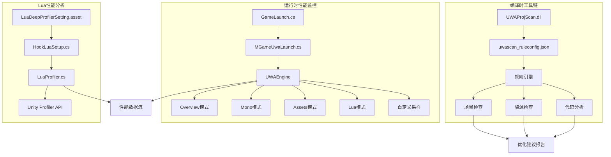
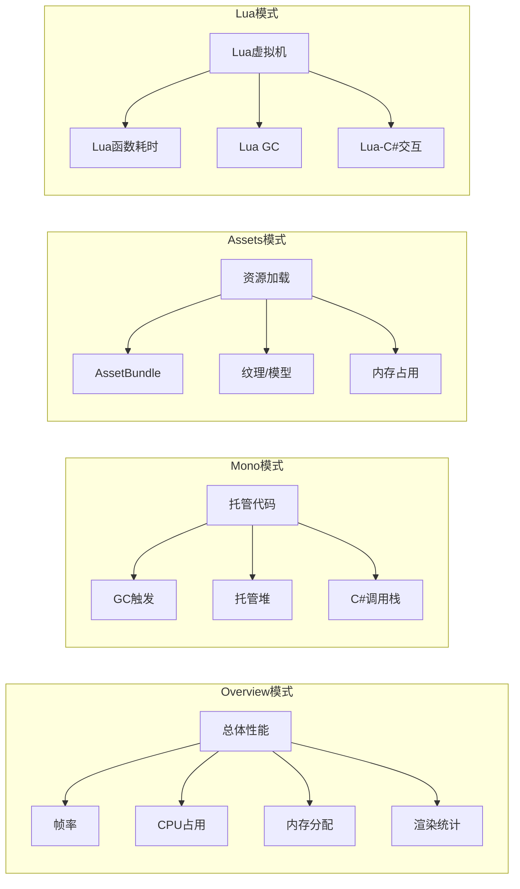
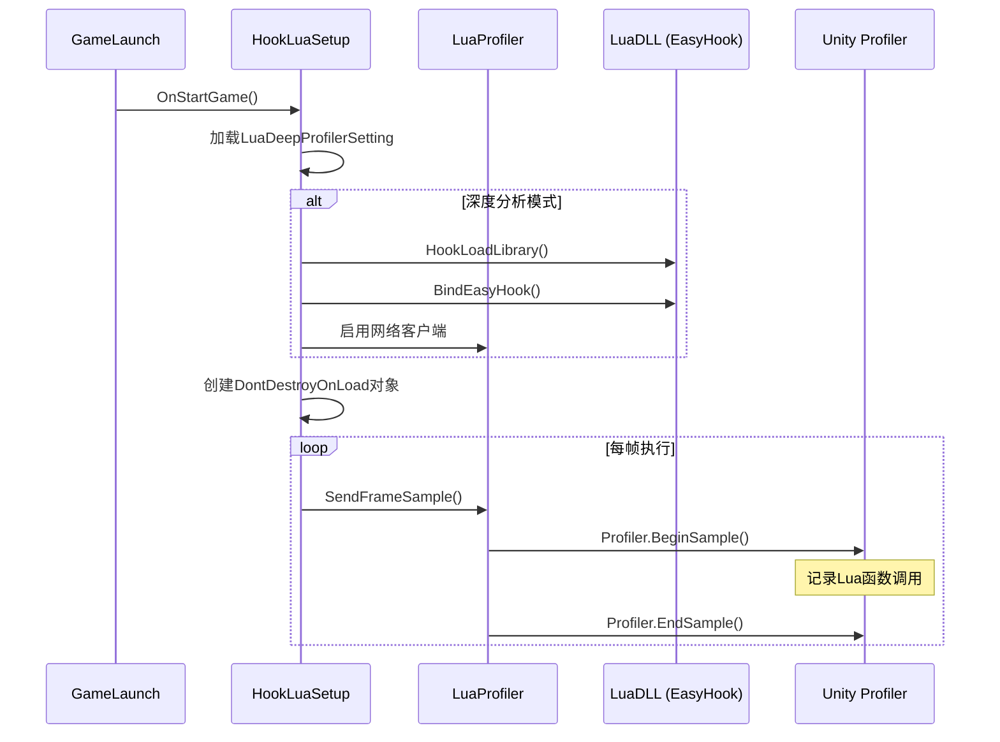

本文档详细说明了UWA（Unity WebGL Analyzer）性能分析工具在本项目中的集成架构、配置方式及使用方法。UWA提供了全面的性能分析能力，包括CPU、内存、渲染、资源加载等多维度性能监控，特别针对Unity项目的Lua混合开发模式进行了深度优化。

## 集成架构概述

项目采用双层架构集成UWA性能分析工具：编译时通过UWAProjScan进行资源扫描与优化建议，运行时通过UWAEngine进行实时性能数据采集。这种设计既保障了开发阶段的资源质量控制，又支持生产环境的深度性能分析。



Sources: [UWA_Launcher.cs](UWA/Libs/UWA_Launcher.cs#L1-L145), [uwascan_ruleconfig.json](Editor/uwascan_ruleconfig.json#L1-L64), [MGameUwaLaunch.cs](Scripts/Launch/MGameUwaLaunch.cs#L1-L14)

## 核心组件分析

### UWAEngine 静态类

UWAEngine作为性能分析的核心入口，提供了完整的API接口支持多种分析模式。该类通过条件编译`#if UWA_TEST`和`[Conditional("ENABLE_PROFILER")]`特性实现零开销的发布版本构建，确保生产环境性能不受影响。

**核心功能模块**：

| 功能分类 | API方法 | 说明 | 适用场景 |
|---------|---------|------|---------|
| 初始化控制 | `StaticInit()` | 静态初始化UWA SDK | 替代拖拽Prefab方式 |
| 生命周期控制 | `Start(Mode)` | 启动指定模式分析 | 自动化测试场景 |
| | `Stop()` | 停止分析 | 手动控制采集周期 |
| 代码采样 | `PushSample(name)` | 压入采样标记 | 自定义代码块分析 |
| | `PopSample()` | 弹出采样标记 | 必须与Push成对调用 |
| 值记录 | `LogValue(name, value)` | 记录自定义数值 | 关键指标监控 |
| 事件标记 | `AddMarker(name)` | 添加时间标记 | 关键事件定位 |
| Lua配置 | `SetOverrideLuaLib()` | 覆盖默认Lua库名 | 自定义Lua构建 |

Sources: [UWA_Launcher.cs](UWA/Libs/UWA_Launcher.cs#L31-L145)

### 性能分析模式详解

UWAEngine支持四种预定义的分析模式，每种模式针对不同的性能瓶颈提供专门的分析视角。



Sources: [UWA_Launcher.cs](UWA/Libs/UWA_Launcher.cs#L45-L54)

## 项目扫描与规则配置

UWAProjScan提供了全面的静态代码和资源分析能力，通过配置文件`uwascan_ruleconfig.json`实现灵活的规则管理。

### 扫描规则分类

**场景检查规则**（SceneCheck）：
- `Editor_MobileFog`：移动端雾效配置检查
- `Scene_UndifinedTag`：未定义Tag检测
- `Scene_MultipleAudioListeners`：多AudioListener检测
- `Scene_ShadowResolution`：阴影分辨率配置
- `Scene_MeshCollider`：Mesh碰撞体使用评估
- `Scene_CanvasChildren`：Canvas子节点数量
- `Scene_UIOutside`：UI元素超出屏幕检测

**资源检查规则**（ProjectAssets）：

| 资源类型 | 检查项 | 优化目标 |
|---------|--------|---------|
| Texture2D | AlphaAllOne, CompressionFormat, FilterMode, Resolution | 纹理内存优化 |
| Shader | TextureNumber | Shader复杂度控制 |
| Prefab | Animator_OptimizeGameObjects, PS_TextureCount, PS_MeshSize | 预制体性能 |
| Mesh | RW, OptimizeMesh, Tangent, Normal, Color, UV2, TriangleLimit | 网格优化 |
| Material | EmptyTex, UselessTex, EqualTex, PureColorTex | 材质冗余检测 |
| AudioClip | Streaming, FormatPCM | 音频压缩优化 |
| Animation | FloatFormat, ScaleCurve, Compression | 动画压缩 |

**代码分析规则**（CodeAnalysis）：
- `TagCompare`：Tag字符串比较优化建议
- `EmptyBodyUpdate`：空的Update方法检测
- `OnGUIUsage`：OnGUI性能使用警告

Sources: [uwascan_ruleconfig.json](Editor/uwascan_ruleconfig.json#L1-L64)

## Lua性能分析集成

项目集成了深度Lua性能分析器，通过EasyHook实现Lua虚拟机的函数级采样，特别适用于Lua重度开发项目。

### 集成架构

Lua性能分析通过三个关键组件协同工作：配置管理、Hook机制和数据采集。



Sources: [LuaHookSetup.cs](artres/LuaProfiler/Core/LuaHookSetup.cs#L59-L98), [LuaProfiler.cs](Scripts/LuaEngine/LuaProfiler.cs#L1-L51)

### LuaDeepProfiler 配置

`LuaDeepProfilerSetting.asset`定义了Lua性能分析器的运行参数，提供了灵活的配置选项。

| 配置项 | 类型 | 默认值 | 说明 |
|-------|------|--------|------|
| `m_isDeepMonoProfiler` | int | 0 | 启用Mono托管代码深度分析 |
| `m_isDeepLuaProfiler` | int | 0 | 启用Lua虚拟机深度分析 |
| `m_isCleanMode` | int | 0 | 清理模式（预编译Lua脚本） |
| `m_captureLuaGC` | int | 51200 | Lua GC捕获阈值 |
| `m_captureMonoGC` | int | 51200 | Mono GC捕获阈值 |
| `m_captureFrameRate` | int | 30 | 采样帧率 |
| `m_ip` | string | 127.0.0.1 | 分析服务器IP |
| `m_port` | int | 2333 | 分析服务器端口 |
| `m_discardInvalid` | int | 1 | 丢弃无效数据 |

Sources: [LuaDeepProfilerSetting.asset](LuaDeepProfilerSetting.asset#L1-L29)

### Lua采样API

项目提供了轻量级的Lua采样API，通过条件编译实现零开销的发布版本。

```csharp
// 基础采样（通过ID）
LuaProfiler.BeginSample(id);
// ... 代码逻辑 ...
LuaProfiler.EndSample();

// 命名采样（通过ID和名称）
LuaProfiler.BeginSample(id, "FunctionName");
// ... 代码逻辑 ...
LuaProfiler.EndSample();

// 内部采样（字符串名称）
LuaProfiler.BeginSample("CustomSection");
// ... 代码逻辑 ...
LuaProfiler.EndSample();
```

采样深度计数器确保了BeginSample/EndSample的成对调用，防止嵌套错误导致的性能数据污染。

Sources: [LuaProfiler.cs](Scripts/LuaEngine/LuaProfiler.cs#L1-L51)

## 集成与使用流程

### 编译时配置

UWA集成通过编译符号控制，提供了灵活的构建选项。

| 编译符号 | 作用 | 推荐使用场景 |
|---------|------|-------------|
| `UWA_TEST` | 启用UWA功能总开关 | 性能测试版本 |
| `ENABLE_PROFILER` | 启用Unity Profiler支持 | 编辑器调试 |
| `USE_LUA_PROFILER` | 启用Lua深度分析 | Lua性能优化 |
| `UNITY_EDITOR_WIN` | Windows编辑器环境 | PC端调试 |

在`GameLaunch.cs`中，UWA初始化与Lua库配置协同工作：

```csharp
#if (UWA_TEST)
    UWAEngine.SetOverrideLuaLib(LuaInterface.LuaDLL.LUADLL);
#endif
```

这确保了UWA能够正确识别并分析项目使用的ToLua框架。

Sources: [GameLaunch.cs](Scripts/Launch/GameLaunch.cs#L54-L56), [MGameUwaLaunch.cs](Scripts/Launch/MGameUwaLaunch.cs#L7-L12)

### 运行时初始化

UWA的运行时初始化通过`MGameUwaLaunch`组件实现，该组件通过`Awake`方法调用`UWAEngine.StaticInit()`完成SDK初始化。这种设计允许通过预制体或代码两种方式启动UWA分析。

初始化流程：
1. `MGameUwaLaunch.Awake()`检测`UWA_TEST`编译符号
2. 调用`UWAEngine.StaticInit()`初始化UWA平台包装器
3. 根据目标平台加载相应的平台特定实现（iOS/Android/Windows）

Sources: [MGameUwaLaunch.cs](Scripts/Launch/MGameUwaLaunch.cs#L6-L12), [UWA_Launcher.cs](UWA/Libs/UWA_Launcher.cs#L1-L145)

### 性能数据采集模式

项目支持多种性能数据采集模式，开发者可以根据需求选择：

**模式一：Prefab方式**
将`UWA_Launcher.prefab`或`UWA_Android.prefab`拖入场景，运行时通过GUI面板手动启动/停止分析。

**模式二：代码控制方式**
使用`UWAEngine.Start(Mode)`和`UWAEngine.Stop()`实现自动化测试流程。

**模式三：自定义采样**
通过`PushSample`/`PopSample`API在关键代码段插入性能标记，实现细粒度分析。

**模式四：Lua深度分析**
启用`LuaDeepProfilerSetting`的深度分析选项，结合EasyHook实现Lua函数级性能追踪。

Sources: [UWA_Launcher.cs](UWA/Libs/UWA_Launcher.cs#L31-L68), [LuaHookSetup.cs](artres/LuaProfiler/Core/LuaHookSetup.cs#L59-L98)

## 类型保持与代码裁剪

为了防止Unity的代码裁剪（Code Stripping）功能移除UWA分析所需的类型引用，项目使用了`TypeHolder`类进行类型保持。

TypeHolder通过一个永远不会被调用的`Hold()`方法，引用了所有Unity核心类型和UWA分析所需的API：

```csharp
public class TypeHolder {
    public void Hold() {
        Resources.Load("");
        AssetBundle ab = null;
        Animator at = null;
        // ... 其他类型引用
        Profiler.BeginSample("");
        Profiler.EndSample();
        Profiler.GetRuntimeMemorySize(null);
    }
}
```

这种设计确保了即使在激进的代码裁剪设置下，UWA分析所需的所有类型和方法都保留在最终构建中。

Sources: [TypeHolder.cs](UWA/Libs/TypeHolder.cs#L1-L102)

## 性能分析最佳实践

### 代码采样规范

在使用PushSample/PopSample API时，应遵循以下规范：

1. **成对调用**：确保每个PushSample都有对应的PopSample
2. **嵌套支持**：支持递归嵌套调用，但需注意性能开销
3. **命名规范**：使用有意义的名称便于数据解读
4. **条件编译**：仅在测试版本中启用采样代码

```csharp
#if UWA_TEST
UWAEngine.PushSample("PlayerUpdate");
try {
    // 游戏逻辑
} finally {
    UWAEngine.PopSample();
}
#endif
```

### Lua性能优化建议

基于项目配置和Lua分析器特性，建议：

1. **GC优化**：设置合理的`m_captureLuaGC`阈值（默认51200字节）
2. **采样频率**：根据设备性能调整`m_captureFrameRate`（建议30-60帧）
3. **清理模式**：在开发阶段启用`m_isCleanMode`预编译Lua脚本
4. **网络传输**：本地开发使用默认IP（127.0.0.1），远程设备需配置服务器IP

### 资源优化检查清单

基于UWAProjScan规则，建议在资源导入和场景构建时检查：

- **纹理**：检查Alpha通道、压缩格式、分辨率、过滤模式
- **模型**：优化网格三角面数、移除不必要的切线/UV2通道
- **材质**：清理空纹理引用、合并相同纹理的材质
- **音频**：使用流式加载大文件，避免PCM格式
- **预制体**：优化动画控制器、减少粒子系统资源

Sources: [uwascan_ruleconfig.json](Editor/uwascan_ruleconfig.json#L1-L64)

## 与其他系统集成

### 与Unity Profiler集成

Lua性能分析器通过`Profiler.BeginSample()`和`Profiler.EndSample()`与Unity原生Profiler集成，使得Lua函数调用可以直接在Unity Profiler中查看。这种无缝集成允许开发者在统一的视图中分析C#和Lua的性能瓶颈。

Sources: [LuaProfiler.cs](Scripts/LuaEngine/LuaProfiler.cs#L1-L51)

### 与ToLua框架集成

项目使用ToLua作为C#与Lua的桥接框架，UWA通过`SetOverrideLuaLib`API配置Lua库名称，确保Lua性能分析器能够正确挂接到ToLua的虚拟机实例。

```csharp
#if (UWA_TEST)
    UWAEngine.SetOverrideLuaLib(LuaInterface.LuaDLL.LUADLL);
#endif
```

Sources: [GameLaunch.cs](Scripts/Launch/GameLaunch.cs#L54-L56)

### 与自动化测试集成

UWA支持通过代码API进行自动化性能测试，可以结合项目的MPerformanceScoreTest系统实现自动化的性能评分：

1. 启动特定模式的UWA分析
2. 执行预定义的游戏流程
3. 停止分析并获取性能数据
4. 生成性能报告或评分

Sources: [GameLaunch.cs](Scripts/Launch/GameLaunch.cs#L46-L77)

## 故障排查

### 常见问题

**问题1：UWA分析器未启动**
- 检查是否定义了`UWA_TEST`编译符号
- 确认`MGameUwaLaunch`组件已添加到场景
- 验证`ENABLE_PROFILER`编译符号已启用

**问题2：Lua分析数据为空**
- 确认`USE_LUA_PROFILER`或`UNITY_EDITOR_WIN`符号已定义
- 检查`LuaDeepProfilerSetting.asset`中的`m_isDeepLuaProfiler`设置为1
- 验证EasyHook相关DLL文件正确导入

**问题3：项目扫描工具无法运行**
- 确认`Editor/UwaProjScan.dll`文件存在
- 检查`uwascan_ruleconfig.json`格式正确
- 验证Unity Editor版本与UWA工具兼容性

### 调试技巧

启用Lua分析器的调试菜单：
- 移动端：四指同时触摸屏幕
- PC端：按Delete键
- 调试菜单提供实时FPS、PSS内存、电量等信息