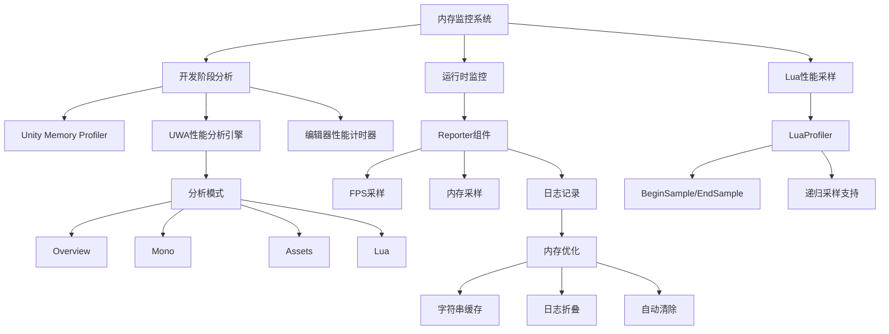
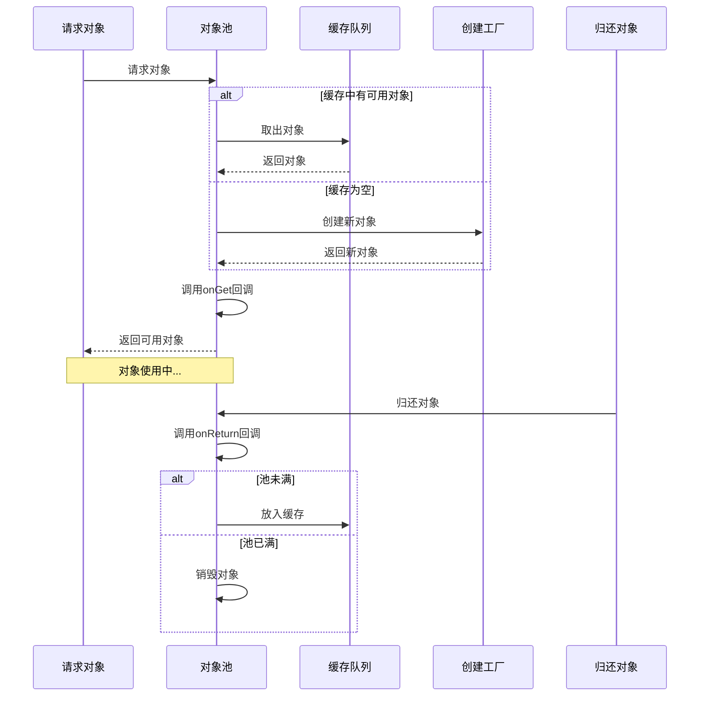
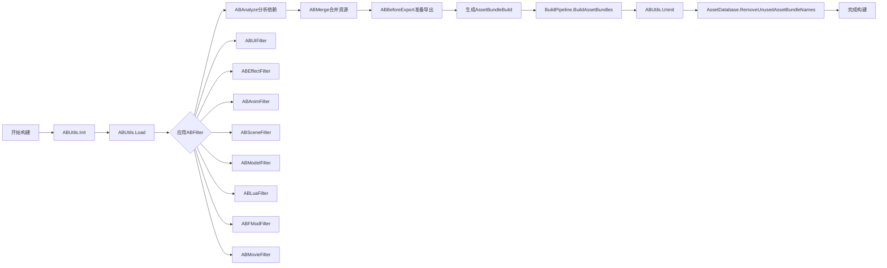

本文档详细介绍了RO客户端项目中的内存管理体系，包括内存分析工具、对象池系统、资源管理策略以及Lua内存优化，为高级开发人员提供完整的内存管理最佳实践。

## 内存分析工具链

项目集成了多层次的内存分析工具，覆盖从开发阶段到运行时的全生命周期监控，为内存优化提供精准的数据支持。

### Unity Memory Profiler

内置的Unity内存分析器提供了完整的托管堆和原生堆快照功能。MemoryProfilerWindow支持拍摄内存快照、保存和加载分析数据，通过TreeMapView可视化展示内存占用分布，帮助开发者快速定位内存热点和泄漏源。该工具通过PackedMemorySnapshotUtility序列化快照数据，支持离线分析和对比分析。Sources: [MemoryProfilerWindow.cs](artres/Editor/Memoryprofiler/MemoryProfilerWindow.cs#L1-L100)

### UWA性能分析引擎

UWA（Unity性能优化引擎）提供了四种分析模式，针对不同层面的内存问题进行深度分析。Overview模式提供整体性能概览，Mono模式专注于托管堆内存分析，Assets模式追踪资源内存占用，Lua模式专门分析Lua虚拟机内存使用。UWA引擎支持通过PushSample/PopSample接口对关键代码段进行性能标记，使用LogValue记录自定义数值指标，并通过AddMarker添加性能标记点。这些数据可以导出到UWA平台进行深度分析和对比。Sources: [UWA_Launcher.cs](UWA/Libs/UWA_Launcher.cs#L1-L145)

### Reporter运行时监控

Reporter组件在运行时实时监控内存使用情况、FPS和日志信息。它每帧采样内存数据和FPS，记录在Sample列表中，支持显示总内存使用量、GC总内存和Lua总内存。Reporter提供了图形化界面展示性能趋势，支持按日志类型筛选、折叠日志、自动清除场景切换日志等功能。其缓存字符串机制通过Dictionary<string, string>减少重复字符串的内存占用，这对于大量日志场景尤其重要。Sources: [Reporter.cs](Unity-Logs-Viewer/Reporter/Reporter.cs#L100-L200)

### Lua性能采样器

LuaProfiler为Lua代码提供了轻量级的性能采样接口，通过Unity Profiler的BeginSample/EndSample机制实现。支持按ID采样和按名称采样两种方式，使用Dictionary<int, string>缓存采样名称，支持递归采样调用。该工具仅在编辑器环境下生效（Conditional("UNITY_EDITOR")），不会影响发布版本的性能。Sources: [LuaProfiler.cs](Scripts/LuaEngine/LuaProfiler.cs#L1-L51)

### 编辑器性能计时器

ProfilerEditor提供了简单易用的编辑器性能计时工具，通过BeginSample/EndSample接口记录代码执行时间。支持按名称管理的多个计时器，使用Dictionary<string, long>存储开始时间戳，输出精确到100纳秒的时间差。这对于优化编辑器脚本性能、识别性能瓶颈非常有用。Sources: [Profiler.cs](artres/Editor/Profiler.cs#L1-L51)

## 内存监控架构

## 对象池系统

项目实现了多层次的对象池系统，从C#核心层到Lua业务层，有效减少了GC压力和对象创建开销。

### UUIDObjectPool（C#）

UUIDObjectPool是项目核心的对象池实现，每个池化的对象类型都维护countAll（总数）、countActive（活跃数）和countInactive（非活跃数）三个关键指标。该对象池支持UUID标识，便于调试和追踪。ObjectPoolDebugger提供了可视化调试界面，通过菜单"ROTools/Debugger/Open UUIDObjectPool Debugger"打开，实时显示所有对象池的状态，帮助开发者监控对象池的使用情况和潜在的内存泄漏。Sources: [ObjectPoolDebugger.cs](artres/Editor/ObjectPool/ObjectPoolDebugger.cs#L1-L64)

### Lua对象池

Lua层的ObjectPool提供了简洁的通用对象池接口，支持自定义创建、获取和归还回调。通过onCreate回调处理对象初始化，onGet回调处理对象获取后的配置，onReturn回调处理对象归还时的清理，这种设计使得对象池能够适应不同的使用场景。Lua对象池与C# UUIDObjectPool协同工作，实现了跨语言的对象复用策略。Sources: [ObejectPool.lua](Scripts/Lua/Common/ObejectPool.lua#L1-L14)

### UI模板池系统

UI模板池是项目中最复杂的对象池应用，针对UI列表场景进行了深度优化。UI_BaseTemplatePool作为基类，支持分帧创建和分帧设置数据，通过CreateTemplateRate和SetDataRate参数控制每帧创建和设置的对象数量，避免一次性加载大量UI对象导致的卡顿。模板池支持三种实现：UI_TemplatePoolCommon（通用模板池）、UI_TemplatePoolScrollRect（滚动视图模板池）和UI_TemplatePoolMultipleTemplate（多模板池），根据不同场景自动选择最优实现。模板池通过MResLoader异步加载模板资源，支持最大显示数和最小显示数限制，有效控制了UI对象的内存占用。Sources: [UI_BaseTemplatePool.lua](Scripts/Lua/Common/UI_BaseTemplatePool.lua#L1-L200)

## 对象池工作流程

## 资源管理系统

AssetBundle系统是项目资源管理的核心，通过精细化的资源打包策略和依赖分析，实现了资源的高效加载和内存优化。

### AssetBundle构建系统

ABBuilder负责AssetBundle的构建流程，包含分析（Analyze）、合并（Merge）和导出（Export）三个主要阶段。分析阶段通过Analyze方法计算资源依赖关系，合并阶段通过Merge方法优化资源打包，导出阶段通过BeforeExport准备资源并最终生成AssetBundle。ABUtils提供了工具方法，包括资源路径转换、AssetTarget加载、过滤器应用等，支持通过ABFilter按类型（UI、特效、动画、场景等）分类处理资源。系统使用哈希值作为AB名称，确保资源唯一性和加载效率。Sources: [ABBuilder.cs](artres/Editor/ABSystem/ABBuilder.cs#L1-L100)

### AB过滤器系统

项目定义了多种AB过滤器，按资源类型和用途进行分类打包。ABUIFilter处理UI资源，ABEffectFilter处理特效资源，ABAnimFilter处理动画资源，ABSceneFilter处理场景资源，ABModelFilter处理模型资源，ABLuaFilter处理Lua脚本，ABFModFilter处理FMOD音频资源，ABMovieFilter处理视频资源等。这种分类打包策略使得相关资源可以一起加载和卸载，优化了内存使用和加载性能。Sources: [ABUtils.cs](artres/Editor/ABSystem/ABUtils.cs#L1-L100)

### FreshData工具

FreshData工具集提供了资源刷新和验证功能，包括FreshDoubleAnim（双倍动画刷新）、FreshRaycaster（射线检测刷新）、FreshScenePrefab（场景预制体刷新）、FreshSkillAnim（技能动画刷新）、FreshStoryAnim（剧情动画刷新）和FreshUI（UI刷新）。这些工具确保资源变更后能够正确更新，避免使用过期资源导致的内存泄漏和显示异常。Sources: [FreshData目录](artres/Editor/FreshData)

### 资源加载策略

UI_BaseTemplatePool通过MResLoader实现资源的异步加载，使用GetSharedAssetAsync方法加载共享资源。加载过程通过回调机制通知完成状态，避免阻塞主线程。模板资源加载完成后缓存到_cacheGameObjectAsset中，后续请求可以直接复用，减少重复加载。资源路径支持直接传入TemplatePrefab对象或TemplatePath字符串，提供了灵活的资源引用方式。Sources: [UI_BaseTemplatePool.lua](Scripts/Lua/Common/UI_BaseTemplatePool.lua#L200-L300)

## AssetBundle构建流程

## Lua内存管理

Lua作为项目的核心脚本语言，其内存管理对于整体性能至关重要。项目通过MLua组件实现了Lua虚拟机的生命周期管理和内存监控。

### Lua虚拟机管理

MLua是Lua虚拟机的C#封装，实现了IMLua接口。通过Init方法初始化Lua虚拟机，注册LuaBinder绑定C#类型到Lua，使用LuaLooper协程调度器管理协程执行。MLua提供了GetMemorySize方法获取Lua内存使用情况，这为Lua内存监控提供了基础支持。虚拟机启动时自动执行Main.lua，加载第三方库包括protobuf、lpeg、bit、cjson和socket等，提供了丰富的Lua生态支持。Sources: [MLua.cs](Scripts/LuaEngine/MLua.cs#L1-L150)

### Lua库集成

项目集成了多个Lua扩展库，通过OpenLibs方法注册到Lua虚拟机。protobuf库（luaopen_pb及其子模块）用于协议序列化，lpeg库（luaopen_lpeg）提供模式匹配功能，bit库（luaopen_bit）提供位操作支持，cjson库（luaopen_cjson和luaopen_cjson_safe）提供JSON解析功能，socket库（luaopen_socket_core和luaopen_mime_core）提供网络通信支持。这些库的集成需要合理管理内存，避免长期持有大对象导致内存泄漏。Sources: [MLua.cs](Scripts/LuaEngine/MLua.cs#L150-L300)

### Lua与C#交互

Lua与C#通过ToLua框架进行交互，MLua提供了SendMessageToLua和SendEventToLua系列方法支持多参数传递。这些方法最终通过CallTableFunc或InvokeTableFunc调用Lua函数，使用LuaTable和LuaFunction对象。为避免内存泄漏，这些对象使用后需要手动Dispose。项目通过LuaBinderOfDefault和LuaBinderOfMoonCommonLib绑定常用类型，使用DelegateFactory管理委托，减少了重复绑定的开销。Sources: [MLua.cs](Scripts/LuaEngine/MLua.cs#L150-L300)

### Lua内存监控

Lua内存通过MLua.GetMemorySize()方法获取，Reporter组件也记录了luaTotalMemory字段用于显示。UWA引擎的Lua模式专门分析Lua内存使用，可以识别Lua表的内存占用、字符串内存、闭包内存等。LuaProfiler通过Profiler.BeginSample/EndSample对Lua代码进行性能采样，帮助识别Lua层的性能瓶颈。Sources: [Reporter.cs](Unity-Logs-Viewer/Reporter/Reporter.cs#L100-L200)

## Lua内存优化策略

| 优化策略 | 实现方式 | 效果 |
|---------|---------|------|
| 字符串 intern | 使用缓存字符串减少重复创建 | 减少字符串内存占用 |
| 表预分配 | 预先分配表大小避免频繁扩容 | 减少内存碎片和GC |
| 闭包复用 | 将闭包存储为变量避免重复创建 | 减少闭包对象数量 |
| 协程池 | 使用协程池复用协程对象 | 减少协程创建开销 |
| 定时清理 | 定期调用collectgarbage("collect") | 及时释放无用内存 |

## UI内存管理

项目采用Ctrl/Handler/Panel/Template四层架构设计UI系统，配合UIManager的面板管理器，实现了高效的UI内存管理。

### UIManager系统

UIManager位于Scripts/Lua/Framework/UIManager目录，提供了完整的UI面板生命周期管理。UIGroupManager管理UI分组，UIGroupStack管理面板堆栈，UIPanelActiveInfo和UIPanelDeActiveInfo记录面板激活和停用状态。UIManager支持面板的打开、关闭、切换、隐藏等操作，通过堆栈机制管理面板显示顺序，确保内存中只保留必要的面板。UIManagerDebuger提供了调试界面，可以查看当前加载的面板和面板状态。Sources: [UIManager目录](Scripts/Lua/Framework/UIManager)

### UI组件层次结构

项目包含数百个UI组件，分为Ctrl（控制器）、Handler（处理器）、Panel（面板）和Template（模板）四层。Ctrl层负责UI逻辑控制，Handler层负责数据处理，Panel层负责UI布局和显示，Template层负责可复用的UI元素。这种分层设计使得每个层都有明确的职责，便于内存管理和优化。Ctrl数量最多（数百个），Template次之，Panel和Handler相对较少，反映了项目中大量使用了可复用的模板和控制器。Sources: [UI目录结构](Scripts/Lua/UI)

### UI模板池优化

UI_BaseTemplatePool通过分帧加载和分帧设置数据优化了UI列表的内存使用。CreateTemplateRate控制每帧创建的模板对象数量，SetDataRate控制每帧设置数据的模板对象数量。支持最大显示数和最小显示数限制，避免创建过多的UI对象。模板对象复用机制确保只有可见的UI对象被激活和设置数据，不可见的对象被停用或回收，大大减少了UI内存占用。Sources: [UI_BaseTemplatePool.lua](Scripts/Lua/Common/UI_BaseTemplatePool.lua#L1-L200)

### UI资源卸载

UIManager在关闭面板时会自动卸载相关资源，通过UIGroupDeActiveInfo记录面板停用状态。AssetBundle系统支持按需加载和卸载，ABFilters确保相关资源一起加载和卸载。FreshUI工具可以刷新UI资源，确保资源变更后正确更新。Reporter监控UI相关的日志和错误，帮助识别UI内存泄漏问题。Sources: [FreshData目录](artres/Editor/FreshData)

## 内存优化最佳实践

### 监控与诊断

定期使用Unity Memory Profiler拍摄内存快照，对比不同场景的内存占用，识别内存增长异常。使用UWA引擎进行深度分析，重点关注Mono堆、Assets和Lua内存。Reporter在运行时持续监控内存和FPS，发现内存泄漏或性能下降时及时分析。LuaProfiler采样关键Lua函数，识别Lua层的热点。Sources: [MemoryProfilerWindow.cs](artres/Editor/Memoryprofiler/MemoryProfilerWindow.cs#L1-L100)

### 对象池使用

对于频繁创建和销毁的对象（如UI元素、特效、子弹等），优先使用对象池。设置合理的对象池大小，避免池过大浪费内存或池过小频繁创建。定期检查对象池状态，通过ObjectPoolDebugger监控countAll、countActive和countInactive指标，识别对象池泄漏或不合理使用。Sources: [ObjectPoolDebugger.cs](artres/Editor/ObjectPool/ObjectPoolDebugger.cs#L1-L64)

### 资源加载优化

使用AssetBundle按需加载资源，避免一次性加载所有资源。通过ABFilters合理分类资源，相关资源打包在一起。使用异步加载避免阻塞主线程，设置合适的优先级。不使用的资源及时卸载，通过AssetBundle.Unload(true/false)控制卸载策略。FreshData工具确保资源变更后正确刷新，避免使用过期资源。Sources: [ABBuilder.cs](artres/Editor/ABSystem/ABBuilder.cs#L1-L100)

### Lua内存优化

避免在Lua中创建大量临时表和字符串，使用表预分配和字符串缓存。复用闭包和协程，避免重复创建。定期调用collectgarbage("collect")清理无用内存，但避免频繁调用影响性能。使用LuaProfiler采样关键代码，识别Lua层的性能瓶颈。MLua.GetMemorySize()监控Lua内存使用，及时发现内存泄漏。Sources: [MLua.cs](Scripts/LuaEngine/MLua.cs#L1-L150)

### UI内存优化

使用UI模板池管理列表项，避免创建过多的UI对象。通过分帧加载和分帧设置数据避免卡顿。设置合理的最大显示数和最小显示数，控制UI对象数量。UIManager正确管理面板生命周期，及时关闭不用的面板。Reporter监控UI相关日志，识别UI内存泄漏。Sources: [UI_BaseTemplatePool.lua](Scripts/Lua/Common/UI_BaseTemplatePool.lua#L1-L200)

## 常见内存问题与解决方案

| 问题类型 | 症状 | 诊断方法 | 解决方案 |
|---------|------|---------|---------|
| 对象池泄漏 | 内存持续增长，对象池countAll不断增大 | ObjectPoolDebugger查看对象池状态 | 检查对象归还逻辑，确保所有对象正确归还 |
| 资源未卸载 | 切换场景后内存不下降 | Unity Profiler查看资源引用 | 检查AssetBundle.Unload调用，移除资源引用 |
| Lua内存泄漏 | Lua内存持续增长 | MLua.GetMemorySize()监控 | 检查表和闭包引用，避免全局变量长期持有对象 |
| UI内存泄漏 | 关闭面板后UI对象未释放 | Reporter查看UI对象数量 | 检查UIManager面板管理逻辑，确保正确调用关闭方法 |
| 字符串重复 | 内存中存在大量重复字符串 | Unity Profiler查看字符串内存 | 使用字符串缓存或intern机制 |
| 事件监听未移除 | 对象销毁后仍被事件引用 | Unity Profiler查看对象引用树 | 确保对象销毁时移除所有事件监听 |

## 下一步学习

建议继续阅读以下相关文档，深入了解项目的其他技术架构：

- [AssetBundle系统架构](14-assetbundlexi-tong-jia-gou) - 详细了解资源打包与加载机制
- [UI框架设计](12-uikuang-jia-she-ji-ctrl-handler-panel-template) - 深入学习UI系统架构
- [ToLua框架配置与使用](7-toluakuang-jia-pei-zhi-yu-shi-yong) - 掌握Lua与C#交互桥接
- [UWA性能分析集成](27-uwaxing-neng-fen-xi-ji-cheng) - 学习性能分析工具的深入使用