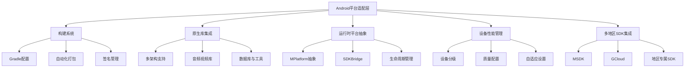

本页面详细说明了项目在Android平台上的特性实现、适配策略以及构建配置，为高级开发者提供完整的Android平台集成指南。

## 架构概览

Android平台适配采用了多层次架构设计，从构建系统到运行时平台抽象，确保不同Android设备和地区的兼容性。核心架构包括：Gradle构建配置、原生库集成、资源管理系统、设备性能分级、以及多地区SDK集成。

Sources: [mainTemplate.gradle](Plugins/Android/mainTemplate.gradle#L1-L72)

## Gradle构建配置

项目使用自定义Gradle模板实现灵活的Android构建配置，支持不同SDK版本、混淆规则和资源压缩策略。

### 核心配置项

**编译配置**：Gradle模板使用变量占位符，在打包时由Unity自动替换为实际值。支持Android Gradle Plugin 3.4.0，配置了jcenter和google两个代码仓库，并添加本地libs目录支持。

**依赖管理**：通过`implementation fileTree(dir: 'libs', include: ['*.jar'])`自动加载所有JAR依赖，结合`**DEPS**`占位符支持动态添加编译时依赖。

**SDK版本控制**：支持动态配置compileSdkVersion、buildToolsVersion、minSdkVersion、targetSdkVersion，以及通过abiFilters指定CPU架构。中国版最低API级别为16（Android 4.1），韩国版最低API级别为23（Android 6.0）。

**混淆与优化**：Debug和Release构建配置分别支持ProGuard，使用proguard-android.txt、proguard-unity.txt和proguard-user.txt三层规则文件，并通过abortOnError false配置防止构建因警告失败。

Sources: [mainTemplate.gradle](Plugins/Android/mainTemplate.gradle#L1-L72), [AutoBuild.cs](Editor/AutoBuild/AutoBuild.cs#L1335-L1353)

### 资源压缩规则

aaptOptions配置了不压缩的文件扩展名列表，包括`.unity3d`、`.ress`、`.resource`、`.obb`、`.block`、`.bank`（FMOD音频）、`.ab`（AssetBundle）、`.zip`、`.mp4`、`.png`等，确保这些资源在运行时能够高效加载。

Sources: [mainTemplate.gradle](Plugins/Android/mainTemplate.gradle#L36-L37)

## 原生库集成

项目集成了多个原生库以支持视频播放、音频处理、数据持久化和性能分析功能，采用多架构支持策略确保设备兼容性。

### CPU架构支持

**架构选择策略**：根据脚本后端和构建模式动态选择目标架构。IL2CPP模式下支持ARMv7和ARM64（Debug模式小包除外），Mono2x模式下增加x86架构支持。这种策略在保证性能的同时兼顾了开发调试需求。

**原生库分布**：不同架构的.so文件分别部署在Plugins/Android/libs目录下的arm64-v8a、armeabi-v7a、x86子目录中。arm64-v8a目录为空，armeabi-v7a目录包含完整库文件。

Sources: [AutoBuild.cs](Editor/AutoBuild/AutoBuild.cs#L920-L933)

### 核心原生库

**音视频库**：libAVProLocal.so支持AVPro视频播放，libAudio360.so和libAudio360-JNI.so提供360度空间音频支持，libopus.so和libopusJNI.so支持Opus音频编解码。

**数据与工具库**：libsqlite3.so提供SQLite数据库功能，libzip.so支持ZIP文件解压，libuwa.so提供UWA性能分析功能（仅在分析模式包含）。

**JAR依赖库**：AVProVideo.jar、exoplayer2系列JAR（exoplayer2.jar、exoplayer2-dash.jar、exoplayer2-hls.jar、exoplayer2-smoothstreaming.jar）提供ExoPlayer视频播放框架支持，audio360相关JAR提供音频360度空间效果支持。

Sources: [Plugins/Android/libs](Plugins/Android/libs/armeabi-v7a)

## 运行时平台抽象

MPlatform类实现了IMPlatform接口，作为C#层与原生SDK的桥梁，提供统一的平台抽象层。

### 生命周期管理

**初始化流程**：在Awake阶段加载本地MPlatformConfig配置，初始化SDKBridge桥接器列表，执行SDKBridge.Awake()进行各SDK初始化，同时进行打点统计上报TagPoint.StartGame事件。

**运行时更新**：Update方法中调用SDKBridge.Update()处理SDK的每帧更新逻辑，通过try-catch捕获异常并通过MDebug输出错误日志。

**暂停与恢复**：OnApplicationPause方法根据应用前后台状态分别调用SDKBridge.OnPause()和OnRelease()，处理应用暂停和恢复时的SDK状态管理。

**销毁清理**：OnDestroy方法调用SDKBridge.OnDestroy()执行SDK资源释放和清理工作。

Sources: [MPlatform.cs](Scripts/MPlatform.cs#L28-L107)

### 平台配置管理

MPlatformConfig包含游戏版本信息、地区语言配置、包模式（Debug/GM/Obb标志）、AssetBundle和ZIP模式、热更新和强更配置、API域名和Bundle ID等关键配置项。配置通过MPlatformConfigManager管理本地持久化，支持通过Editor工具窗口可视化编辑和签名保存。

Sources: [PlatformConfigEditorWindow.cs](Editor/Hotfix/PlatformConfigEditorWindow.cs#L1-L51)

## 设备性能管理

项目实现了设备性能分级系统，根据设备型号和性能评分自动调整游戏质量设置。

### 性能分级机制

**评分到等级映射**：系统通过性能评分将设备分为0-3四个等级，0级最高性能（评分≥400），3级最低性能（评分≤150）。评分区间采用重叠设计确保平滑过渡。

**设备型号白名单**：配置文件包含大量主流Android设备的型号到等级的映射，覆盖华为（ANE-AL00、BLN-AL10等）、金立（GIONEE M7、S10等）、努比亚（nubia NX563J）、一加（OnePlus A3010）等品牌设备，针对已知设备直接指定性能等级，避免实时检测开销。

Sources: [ConditionToGradeDataAndroid.asset.json](Resources/QualitySetting/ConditionToGradeDataAndroid.asset.json#L1-L1263)

### OBB扩展文件支持

**OBB配置**：当启用OBB模式且为Android平台时，系统配置PlayerSettings.Android.useAPKExpansionFiles为true，并预加载关键资源（config.json、性能分级配置、测试材质、字符串池、视频适配器Prefab、ZipList等）到预加载资源列表，确保OBB加载时这些资源能够被正确访问。

Sources: [AutoBuild.cs](Editor/AutoBuild/AutoBuild.cs#L1369-L1385)

## 多地区SDK集成

项目支持中国和韩国等多个地区的SDK集成，通过条件编译符号和配置管理实现灵活的SDK启用策略。

### SDK符号定义

**可用SDK列表**：系统定义了多个SDK的编译符号，包括ENABLE_MSDK（腾讯MSDK）、ENABLE_GCLOUD（腾讯云GCloud）、ENABLE_BUGLY（Bugly崩溃分析）、ENABLE_MIDASPAY（米大师支付）、ENABLE_LEBIAN（乐边SDK）、ENABLE_KOREASDK（韩国SDK）、ENABLE_ADJUST（Adjust统计）。

**符号管理**：AddSdkSymbol方法根据命令行参数SDK_LIST解析各SDK的启用状态（0或1），通过EditorTools.AddSymbol动态添加对应的编译符号，确保代码裁剪时包含必要代码。

Sources: [AutoBuild.cs](Editor/AutoBuild/AutoBuild.cs#L298-L325)

### Bundle ID与签名策略

**Bundle ID映射**：不同地区使用不同的Bundle ID，中国版为com.tencent.ro或com.joyyou.ro，韩国正式版为com.gravity.ragnarokorigin.aos，韩国CBT版为com.gravity.roo.cbt.aos，韩国ONES版为com.gravity.ragnarokorigin.one。

**签名密钥管理**：使用统一的keystore文件（Plugins/Android/roandroid.keystore），根据Bundle ID选择不同的keyaliasName（strChinaKeyAliasName、strKoreaKeyAliasName、strKoreaCBTKeyAliasName、strKoreaONESKeyAliasName），密钥密码和别名密码统一配置为"Ro123uoR$"。

Sources: [AutoBuild.cs](Editor/AutoBuild/AutoBuild.cs#L91-L123)

## Android资源适配

项目包含Android特定的资源文件，用于启动视频、网络配置和界面布局定制。

### 启动视频

**视频资源**：launch.mp4文件同时存在于StreamingAssets/Movie/和Plugins/Android/res/raw/目录，构建时根据GameLaunch.NotShowLaunchMovieAtStart配置选择保留其中一个路径的视频文件，实现启动视频的灵活控制。

Sources: [AutoBuild.cs](Editor/AutoBuild/AutoBuild.cs#L280-L284)

### 网络安全配置

**明文流量支持**：network_security_config.xml配置文件设置`<base-config cleartextTrafficPermitted="true"/>`，允许应用使用HTTP明文流量，兼容一些仍使用HTTP协议的后端服务。此配置需要在AndroidManifest.xml中通过android:networkSecurityConfig属性引用。

Sources: [network_security_config.xml](Plugins/Android/res/xml/network_security_config.xml#L1-L4)

### 自定义Activity布局

**视频Activity**：movie_activity.xml定义了包含VideoView的LinearLayout布局，用于全屏播放视频内容。VideoView设置为match_parent宽度和wrap_content高度，居中对齐，为游戏内视频播放提供Android原生界面支持。

Sources: [movie_activity.xml](Plugins/Android/res/layout/movie_activity.xml#L1-L11)

## 自动化构建系统

AutoBuild类提供了完整的Android自动化构建支持，包括参数解析、配置生成、场景过滤、资源拷贝和最终打包。

### 构建参数

**命令行参数解析**：系统支持丰富的命令行参数，包括build_out_path（输出路径）、build_mode（打包模式）、type_version/main_version/inner_version（版本号）、build_number（构建号）、bundle_id（包名）、androidSdkPath/androidNdkPath/JdkPath（工具链路径）、obb（OBB模式）、SDK_LIST（SDK启用列表）等。

**打包模式**：支持Debug、Release、Profiler、Uwa、Hdg等多种打包模式，每种模式对应不同的编译选项和资源包含策略。Uwa模式和Hdg模式分别用于性能分析和远程调试。

Sources: [AutoBuild.cs](Editor/AutoBuild/AutoBuild.cs#L384-L600)

### 构建选项

**BuildOptions配置**：根据打包模式设置不同的BuildOptions。Profiler模式添加Development和ConnectWithProfiler选项，Uwa模式和Debug模式添加Development选项，exportAS参数启用AcceptExternalModificationsToPlayer允许外部修改Player。

**FMOD资源策略**：Debug模式、Uwa模式或Profiler模式下使用调试版FMOD库（libfmod.so、libfmodstudio.so），Release模式下使用优化版库（libfmodL.so、libfmodstudioL.so），在性能和调试能力之间取得平衡。

Sources: [AutoBuild.cs](Editor/AutoBuild/AutoBuild.cs#L867-L884), [AutoBuild.cs](Editor/AutoBuild/AutoBuild.cs#L1030-L1054)

### 构建后处理

**符号文件拷贝**：OnPostProcessBuild方法在Android构建完成后，将il2cppSymbols和unityLibsSymbols从构建临时目录拷贝到SDK工具目录，支持后续的符号表分析和崩溃定位。

**构建流程**：完整的构建流程包括AnalysisParameters参数解析、GenerateConfig配置生成、FilterUnusedScene场景过滤、DeleteAsset无用资源删除、CopyFromFullProject从完整工程拷贝资源、CopyOverSeaResources拷贝海外资源、GenerateObbConfig生成OBB配置、AssetDatabase.Refresh资源刷新，最后执行BuildPipeline.BuildPlayer进行打包。

Sources: [AutoBuild.cs](Editor/AutoBuild/AutoBuild.cs#L271-L291), [AutoBuild.cs](Editor/AutoBuild/AutoBuild.cs#L1387-L1394)

## 平台特性总结

下表总结了项目在Android平台上的核心特性和适配策略：

| 特性类别 | 具体实现 | 配置位置 |
|---------|---------|---------|
| 构建系统 | Gradle 3.4.0 + 自定义模板 | [mainTemplate.gradle](Plugins/Android/mainTemplate.gradle) |
| CPU架构 | ARMv7、ARM64、x86多架构支持 | [AutoBuild.cs](Editor/AutoBuild/AutoBuild.cs#L920-L933) |
| 脚本后端 | IL2CPP（生产环境）、Mono2x（开发环境） | [AutoBuild.cs](Editor/AutoBuild/AutoBuild.cs#L920-L933) |
| 性能分级 | 设备型号白名单 + 评分系统 | [ConditionToGradeDataAndroid.asset.json](Resources/QualitySetting/ConditionToGradeDataAndroid.asset.json) |
| 多地区支持 | Bundle ID映射 + SDK符号管理 | [AutoBuild.cs](Editor/AutoBuild/AutoBuild.cs#L91-L123) |
| 签名管理 | 统一keystore + 多alias支持 | [AutoBuild.cs](Editor/AutoBuild/AutoBuild.cs#L91-L123) |
| 音视频 | AVProVideo + ExoPlayer + FMOD + Audio360 | [Plugins/Android](Plugins/Android) |
| 资源扩展 | OBB扩展文件支持 | [AutoBuild.cs](Editor/AutoBuild/AutoBuild.cs#L1369-L1385) |
| 网络安全 | 明文流量支持 | [network_security_config.xml](Plugins/Android/res/xml/network_security_config.xml) |
| 自动化构建 | 完整命令行参数支持 | [AutoBuild.cs](Editor/AutoBuild/AutoBuild.cs#L384-L600) |

## 最佳实践建议

1. **性能优化**：在发布版本中始终使用IL2CPP后端和ARM64架构以获得最佳性能，开发调试时可切换到Mono2x后端并启用x86架构以加快编译速度。

2. **设备分级**：为新设备添加到ConditionToGradeDataAndroid白名单，确保首次启动即可获得正确的质量设置，避免实时检测带来的性能开销。

3. **SDK集成**：通过SDK_LIST参数精确控制各SDK的启用状态，未启用的SDK代码会被Unity裁剪器移除，减少APK体积。

4. **签名管理**：在打包服务器上配置正确的debug.keystore，Development构建模式会忽略自定义keystore而使用默认debug.keystore。

5. **资源管理**：根据目标地区启用对应的__Android或__IOS文件夹中的资源，通过CopyOverSeaResources方法实现地区特定资源的自动拷贝。