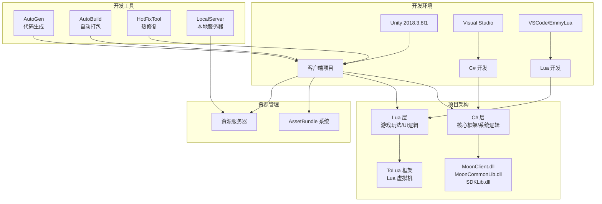
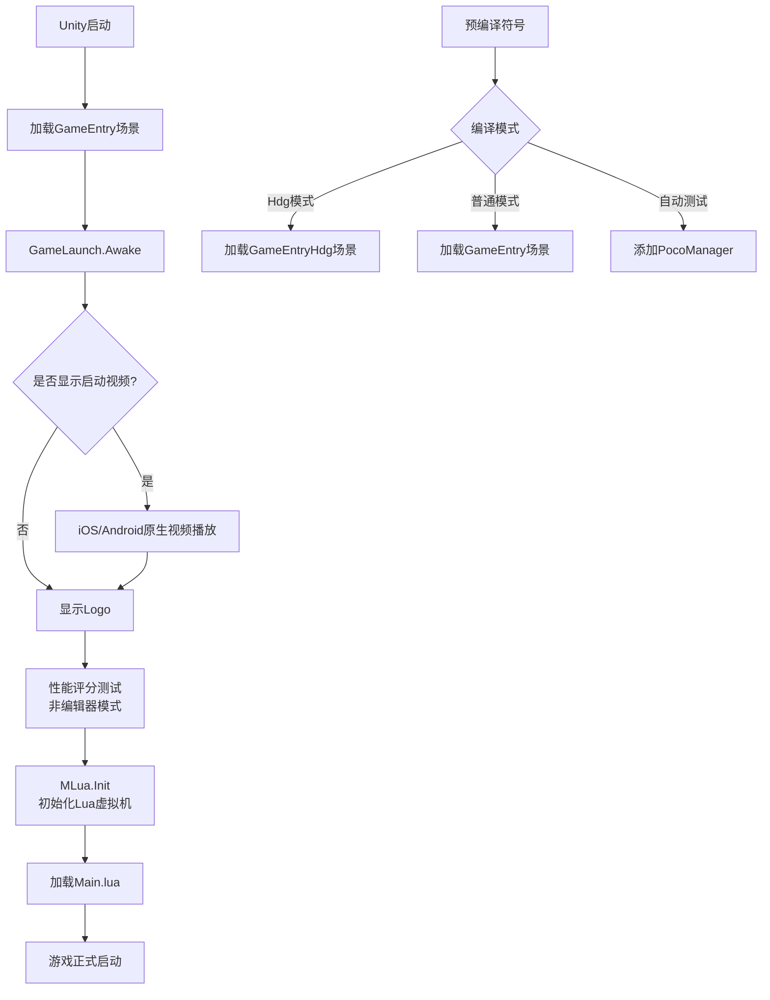

本文档将指导初学者开发者完成仙境传说：爱如初见的客户端开发环境搭建，包括软件安装、项目配置、依赖库设置和开发工具链配置。

## 环境概览与架构

本项目采用Unity 2018.3.8f1引擎，结合C#与Lua混合开发模式，实现了高效的开发与热更新机制。整体架构如下图所示：



## 系统要求

### 硬件配置

| 组件 | 最低配置 | 推荐配置 |
|------|---------|---------|
| 操作系统 | Windows 10 (64位) | Windows 10/11 (64位) |
| 处理器 | Intel i5-4代或同等性能 | Intel i7-7代或更高 |
| 内存 | 16GB RAM | 32GB RAM |
| 硬盘空间 | 50GB 可用空间（SSD推荐） | 100GB SSD |
| 显卡 | NVIDIA GTX 960或同等性能 | NVIDIA GTX 1060或更高 |

### 软件环境

| 软件 | 版本要求 | 用途 |
|------|---------|------|
| Unity Editor | 2018.3.8f1 | 游戏引擎开发环境 |
| Visual Studio | 2017/2019/2022 | C# 代码开发与调试 |
| Visual Studio Code | 最新版 | Lua 脚本编辑 |
| Git | 2.x | 版本控制 |
| Docker（可选） | 最新稳定版 | 本地服务器容器化 |

Sources: [../ProjectSettings/ProjectVersion.txt](../ProjectSettings/ProjectVersion.txt#L1-L2)

## Unity 安装与配置

### Unity 安装步骤

1. 从Unity官网下载Unity Hub
2. 安装Unity 2018.3.8f1版本
3. 在安装时勾选以下模块：
   - Windows Build Support (.NET)
   - Android Build Support (SDK, NDK, JDK)
   - iOS Build Support
   - WebGL Build Support

### 项目配置检查

打开项目后，检查以下关键配置：

**编译器响应文件** - 项目启用了不安全代码支持：
```
csc.rsp 内容: -unsafe
```

**IL2CPP代码裁剪保留配置** - 确保以下程序集不被裁剪：
- MoonClient, MoonCommonLib, MoonSerializable, SDKLib（核心游戏库）
- DOTween, DOTweenPro（动画库）
- Google.Protobuf（网络协议）
- CString, Debugger, enum2int（工具库）

Sources: [csc.rsp](csc.rsp#L1-L1), [link.xml](link.xml#L1-L14)

## 代码开发环境配置

### C# 开发环境

1. 安装Visual Studio 2017/2019/2022（Community或Professional版）
2. 在安装时选择以下工作负载：
   - .NET桌面开发
   - 使用Unity的游戏开发
3. 打开项目后，Unity会自动生成解决方案文件：
   - `Assembly-CSharp.csproj` - 主项目
   - `Assembly-CSharp-Editor.csproj` - 编辑器扩展项目

### Lua 开发环境

1. 安装Visual Studio Code
2. 安装EmmyLua插件以获得：
   - Lua语法高亮
   - 代码补全
   - 跳转定义
   - 类型推断
3. 配置Lua工作区：
   - 设置根目录为 `Scripts/Lua`
   - 配置Lua路径为 `Scripts/Lua/?.lua`

Lua虚拟机通过ToLua框架集成，支持以下第三方库：
- `pb` - Protobuf协议
- `lpeg` - 模式匹配
- `bit` - 位操作

Sources: [Scripts/LuaEngine/MLua.cs](Scripts/LuaEngine/MLua.cs#L1-L80), [Source/Generate/LuaBinderOfDefault.cs](Source/Generate/LuaBinderOfDefault.cs#L1-L100)

## 核心配置文件说明

### 游戏配置文件

**config.json** - 游戏运行时核心配置：
- `bundleId`: 应用包标识符（com.joyyou.ro）
- `channel`: 渠道代码（ro_inner）
- `apiDomain`: API服务器域名
- `mode`: 打包模式（packageMode, zipMode, abMode）
- `version`: 版本信息（渠道版本、程序版本、内部版本）
- `programUpdate` / `hotUpdate`: 强更与热更配置
- `sdkList`: SDK列表

**sys_env.json** - 开发环境路径配置，包含以下路径：
- `MoonGameLibPath`: 游戏公共库路径
- `MoonClientProjPath`: 客户端项目路径
- `MoonResPath`: 资源路径
- `MoonClientCodePath`: 客户端代码路径
- `MoonABPath`: AssetBundle输出路径

Sources: [Resources/config.json](Resources/config.json#L1-L33), [../sys_env.json](../sys_env.json#L1-L11)

### 资源配置文件

**ZipList.json** - 资源打包配置，定义：
- FMOD音频Bank文件（9个bank文件）
- BytesBlock数据块（5个分块）

**SDKConfig/*.json** - 各SDK配置文件：
- `MSDK.json` - 腾讯MSDK配置
- `GCloudSDK.json` - 腾讯云SDK配置（包含gameId和gameKey）

Sources: [Resources/ZipList.json](Resources/ZipList.json#L1-L23), [Resources/SDKConfig/GCloudSDK.json](Resources/SDKConfig/GCloudSDK.json#L1-L4)

## 依赖库管理

### 核心程序集

项目依赖以下核心DLL库，位于`Plugins/GameLibs/`目录：

| 程序集 | 版本 | 功能描述 |
|--------|------|---------|
| MoonClient.dll | - | 客户端核心逻辑 |
| MoonCommonLib.dll | - | 公共工具库 |
| MoonSerializable.dll | - | 序列化库 |
| SDKLib.dll | - | SDK接口库 |
| Google.Protobuf.dll | - | Protobuf协议支持 |

### 第三方插件

| 插件名称 | 目录位置 | 功能 |
|----------|---------|------|
| DOTween | Demigiant/DOTween | 动画补间 |
| DOTweenPro | Demigiant/DOTweenPro | 高级动画 |
| Cinemachine | Cinemachine | 摄像机控制 |
| FMOD | Plugins/FMOD | 音频系统 |
| AVProVideo | ThirdParty/AVProVideo | 视频播放 |
| Spine | Spine | 2D骨骼动画 |
| TextMesh Pro | TextMesh Pro | 文本渲染 |

Sources: [Plugins/GameLibs](Plugins/GameLibs), [Demigiant/DOTween](Demigiant/DOTween)

## 开发工具链配置

### 代码生成工具

**AutoGen目录**包含以下工具：
- `CsvGen` - CSV表格代码生成
- `ProjectFileGen` - 项目文件生成
- `ProtoGen` - Protobuf协议生成

**Protobuf工具**位于`Tools/Protobuf/`：
- `protoc.exe` - Protobuf编译器
- `generate_pb_code_lua.bat` - 生成Lua协议代码
- `generate_pb_code_client.bat` - 生成C#客户端代码

Sources: [../Tools/Protobuf](../Tools/Protobuf)

### 本地服务器配置

项目支持本地开发服务器，使用Docker容器化部署：

**配置步骤：**
1. 确保已安装Docker Desktop
2. 运行`Tools/LocalServer/安装服务器.bat`首次安装
3. 运行`Tools/LocalServer/开启服务器.bat`启动服务器
4. 服务器开启后会启动6个服务进程
5. 使用`Tools/LocalServer/关闭服务器.bat`关闭服务器

Sources: [../Tools/LocalServer/README.md](../Tools/LocalServer/README.md#L1-L14)

### 自动化构建工具

**AutoBuild系统**位于`Editor/AutoBuild/AutoBuild.cs`，支持：
- 多平台打包（Windows, Android, iOS）
- 多种打包模式（Debug, Release, Profiler, Uwa, Hdg）
- Android keystore配置
- 渠道和语言配置
- SDK符号定义（ENABLE_MSDK, ENABLE_GCLOUD等）

**打包模式说明：**
- `Debug` - 调试版本，包含详细日志
- `Release` - 发布版本，性能优化
- `Profiler` - 性能分析版本
- `Uwa` - UWA性能测试版本
- `Hdg` - 远程调试版本

Sources: [Editor/AutoBuild/AutoBuild.cs](Editor/AutoBuild/AutoBuild.cs#L1-L200)

## 项目启动流程

游戏启动流程如下：



**关键启动脚本：**
- `GameLaunch.cs` - 游戏启动控制器，处理Logo显示、性能测试
- `MLua.cs` - Lua虚拟机初始化，绑定C#与Lua接口
- `Main.lua` - Lua入口文件，启动Lua层逻辑

Sources: [Scripts/Launch/GameLaunch.cs](Scripts/Launch/GameLaunch.cs#L1-L100), [Scripts/LuaEngine/MLua.cs](Scripts/LuaEngine/MLua.cs#L1-L80)

## 环境验证清单

完成环境配置后，请验证以下项目：

- [ ] Unity 2018.3.8f1 能正常打开项目且无编译错误
- [ ] Visual Studio 能正确加载C#项目并支持断点调试
- [ ] VSCode 能正确识别Lua文件并提供代码补全
- [ ] 运行`GameEntry.unity`场景能正常启动游戏
- [ ] Lua虚拟机能正常初始化且能执行Main.lua
- [ ] 能正常连接本地服务器（如需）
- [ ] Android/iOS 构建目标切换无错误
- [ ] FMOD音频系统能正常播放音效
- [ ] AssetBundle 资源加载正常

## 常见问题排查

### Unity项目无法打开

**问题**：打开项目时出现错误或卡顿  
**解决方案**：
1. 删除`Library`文件夹让Unity重新导入
2. 检查Unity版本是否为2018.3.8f1
3. 确认磁盘空间充足

### C#代码无法调试

**问题**：Visual Studio无法附加Unity调试器  
**解决方案**：
1. 确认安装了"使用Unity的游戏开发"工作负载
2. 在Unity中设置`Edit > Preferences > External Tools > External Script Editor`为Visual Studio
3. 重启Unity和Visual Studio

### Lua代码无法运行

**问题**：游戏启动时Lua虚拟机报错  
**解决方案**：
1. 检查`Scripts/Lua/Main.lua`文件是否存在
2. 确认`MLua.cs`中的Lua库绑定是否正常
3. 查看Unity Console窗口中的具体错误信息

### 本地服务器无法启动

**问题**：运行服务器启动脚本失败  
**解决方案**：
1. 确认Docker Desktop正在运行
2. 检查端口是否被占用
3. 查看服务器日志文件定位具体问题

## 下一步学习

完成环境配置后，建议按以下顺序深入学习：

1. **[项目架构总览](5-xiang-mu-jia-gou-zong-lan)** - 了解整体架构设计
2. **[C#与Lua混合开发模式](6-c-yu-luahun-he-kai-fa-mo-shi)** - 掌握混合开发技巧
3. **[ToLua框架配置与使用](7-toluakuang-jia-pei-zhi-yu-shi-yong)** - 学习Lua集成细节
4. **[Lua虚拟机生命周期管理](8-luaxu-ni-ji-sheng-ming-zhou-qi-guan-li)** - 理解Lua运行机制
5. **[依赖库安装说明](4-yi-lai-ku-an-zhuang-shuo-ming)** - 了解各个依赖库的详细配置

## 参考资源

- **项目根目录**：`C:\temp\Unity3D_RO\clientproj\`
- **Assets目录**：`C:\temp\Unity3D_RO\clientproj\Assets\`
- **工具目录**：`C:\temp\Unity3D_RO\clientproj\Tools\`
- **Unity文档**：https://docs.unity3d.com/2018.3/Documentation/
- **ToLua框架**：位于`Scripts/LuaEngine/ToLua/`