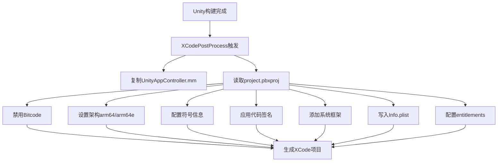
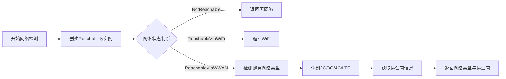

本文档详细阐述Unity3D仙境传说项目在iOS平台的特性实现与适配策略，涵盖构建配置、代码签名、权限管理、原生功能集成以及多地区发行版支持。

## 构建配置与XCode项目自动化

iOS构建过程通过Unity的PostProcessBuild回调自动修改XCode项目配置，确保符合Apple平台的严格要求。该自动化流程在 `[Editor/XUPorter/XCodePostProcess.cs](Editor/XUPorter/XCodePostProcess.cs#L19-L48)` 中实现，主要包括以下核心配置：

**编译与架构设置**：项目强制禁用Bitcode支持，设置目标架构为arm64和arm64e，以支持最新的iOS设备和性能优化。调试信息格式采用DWARF with dSYM File，便于崩溃符号化分析，同时启用符号剥离以减小最终包体大小。这些配置通过 `PBXProject` 的 `SetBuildProperty` 方法在构建后自动应用。

**系统框架与依赖库**：项目通过 `[Editor/XUPorter/Mods/RO.projmods](Editor/XUPorter/Mods/RO.projmods#L3-L33)` 配置文件声明所需的系统框架和链接库。包括但不限于：`SystemConfiguration`（网络检测）、`Security`（安全服务）、`Photos`（相册访问）、`AVFoundation`（音视频处理）、`StoreKit`（应用内购买）、`UserNotifications`（推送通知）、`LocalAuthentication`（生物识别）等。链接器标志包含 `-ObjC` 以确保Objective-C类别正确加载。

Sources: [Editor/XUPorter/XCodePostProcess.cs](Editor/XUPorter/XCodePostProcess.cs#L19-L48), [Editor/XUPorter/Mods/RO.projmods](Editor/XUPorter/Mods/RO.projmods#L1-L56)

## 代码签名与多地区发行版管理

项目支持通过Bundle ID区分不同地区和发行版本的代码签名策略，在 `[Editor/XUPorter/XCodePostProcess.cs](Editor/XUPorter/XCodePostProcess.cs#L49-L229)` 中实现了灵活的签名配置机制：

| Bundle ID | 发行地区 | 签名模式 | 开发团队ID | 独有功能 |
|-----------|---------|---------|-----------|---------|
| com.tencent.ro | 中国(腾讯) | Manual | 9TV4ZYSS4J | 推送通知、后台模式 |
| com.joyyou.ro | 中国(乐游) | Automatic | 8VLYWLCLEX | Facebook、Firebase、推送 |
| com.gravity.ragnarokorigin.ios | 韩国(正式) | Manual | W75HG47R5U | Facebook、GameCenter、IAP、Apple Sign In |
| com.gravity.roo.cbt.ios | 韩国(CBT) | Manual | W75HG47R5U | 同正式版 |

**签名策略差异**：腾讯版和韩国版采用手动签名模式，需要指定特定的Provisioning Profile和Development Team ID。乐游版使用自动签名模式，简化了证书管理流程。韩国版根据 `iOSDistribution` 静态标志动态选择开发者证书或发布证书。

**Entitlements配置**：项目使用两个entitlements文件配置特殊权限。`[ro.entitlements](ro.entitlements#L1-L9)` 用于中国版本，仅包含推送通知环境配置；`[ro_kor.entitlements](ro_kor.entitlements#L1-L13)` 用于韩国版本，额外包含Apple Sign In权限，支持Apple登录功能。

Sources: [Editor/XUPorter/XCodePostProcess.cs](Editor/XUPorter/XCodePostProcess.cs#L49-L229), [ro.entitlements](ro.entitlements#L1-L9), [ro_kor.entitlements](ro_kor.entitlements#L1-L13)

## 系统权限与Info.plist配置

iOS应用必须明确声明所需权限并提供使用说明，项目在 `[Editor/XUPorter/Mods/RO.projmods](Editor/XUPorter/Mods/RO.projmods#L34-L44)` 中集中配置了关键的隐私权限描述：

| 权限键名 | 用途描述 | 使用场景 |
|---------|---------|---------|
| NSPhotoLibraryUsageDescription | "需要访问相册权限" | 截图保存、头像上传 |
| NSCameraUsageDescription | "需要访问相机权限" | 实时拍照功能 |
| NSLocationWhenInUseUsageDescription | "需要使用期间访问位置权限" | 基于位置的服务 |
| NSMicrophoneUsageDescription | "需要访问麦克风权限" | 语音聊天、录音 |

**URL Scheme配置**：不同发行版本配置了不同的URL Scheme以支持第三方应用跳转。中国版（乐游）配置了Facebook（fb541607759680937）和Firebase（com.googleusercontent.apps.616946639310-o4vrkgnn5o9r3datm75ita3k6bn3u528）的Scheme；韩国版则使用各自的Facebook和Firebase ID。这些配置在构建时动态写入Info.plist的 `CFBundleURLTypes` 数组中。

**查询Scheme配置**：通过 `LSApplicationQueriesSchemes` 数组声明应用可以查询的其他应用，如Facebook的分享API（fb-messenger-share-api、fbshareextension）等，确保应用间交互正常工作。

Sources: [Editor/XUPorter/Mods/RO.projmods](Editor/XUPorter/Mods/RO.projmods#L34-L44), [Editor/XUPorter/XCodePostProcess.cs](Editor/XUPorter/XCodePostProcess.cs#L98-L150)

## 原生功能集成

项目通过Objective-C++插件扩展Unity功能，实现iOS平台特有的系统调用，主要集中在 `[Plugins/iOS/CommonFunctions.mm](Plugins/iOS/CommonFunctions.mm#L1-L200)` 文件中：

**网络检测**：使用Apple的Reachability类（源自 `[Plugins/iOS/Reachability.h](Plugins/iOS/Reachability.h#L1-L100)`）检测当前网络状态，区分无网络、WiFi和蜂窝网络（WWAN）三种情况。对于蜂窝网络，进一步识别具体类型（2G、3G、4G、LTE），并通过 `CTTelephonyNetworkInfo` 获取运营商信息（移动、联通、电信、铁通）。

**照片保存**：通过 `_SavePhotoToSystem` 函数使用 `PHPhotoLibrary` 的 `performChanges` 方法异步保存图片到系统相册，支持在后台线程执行，不影响游戏主线程性能。

**磁盘空间检测**：`_GetFreeDiskSpace` 函数通过 `statfs` 系统调用获取 `/var` 分区的可用磁盘空间，以字节为单位返回，用于下载前的空间检查。

**权限检查**：`_CheckPermission` 函数统一检查各种系统权限状态，包括位置服务、通知、相机、麦克风、相册等。对于每个权限，返回 `Authorized`、`Denied` 或 `NotDetermined` 三种状态之一，并通过Unity消息机制回调到C#层处理。

**系统版本检测**：`_AvailableSystemVersion` 函数提供iOS版本运行时检测，支持从iOS 9.0到iOS 14.0的版本判断，用于启用或禁用特定API的调用。

Sources: [Plugins/iOS/CommonFunctions.mm](Plugins/iOS/CommonFunctions.mm#L1-L200), [Plugins/iOS/Reachability.h](Plugins/iOS/Reachability.h#L1-L100)

## 音频系统适配

项目集成FMOD音频系统，并通过 `[Plugins/FMOD/platform_ios.mm](Plugins/FMOD/platform_ios.mm#L1-L28)` 实现音频会话中断处理。当接听电话或系统闹钟触发时，`AVAudioSessionInterruptionNotification` 通知会触发回调函数，通知游戏音频引擎暂停或恢复播放，确保音频管理符合iOS系统的音频会话规范。

 Sources: [Plugins/FMOD/platform_ios.mm](Plugins/FMOD/platform_ios.mm#L1-L28)

## 视频播放支持

iOS平台通过AVProVideo插件实现高性能视频播放，相关原生代码位于 `[Plugins/iOS/](Plugins/iOS/)` 目录。主要组件包括：

- `AVProVideoUnityRegisterRenderingPluginV5.c`：渲染插件注册代码
- `MoviePlayerViewController.h/.m`：视频播放器视图控制器
- `NativeTexture/` 目录：原生纹理处理库
- `libAVProVideoiOS.a`：预编译的iOS视频播放库

这些组件通过 `[Editor/XUPorter/XCodePostProcess.cs](Editor/XUPorter/XCodePostProcess.cs#L23)` 中配置的 `UnityAppController.mm` 集成到Unity主线程中。

Sources: [Editor/XUPorter/XCodePostProcess.cs](Editor/XUPorter/XCodePostProcess.cs#L20-L24)

## Toast提示组件

项目实现了自定义的Toast提示视图（`[Plugins/iOS/ToastView.h](Plugins/iOS/ToastView.h#L1-L21)`），用于在iOS原生层显示短暂的消息提示。支持两种显示时长：`TOAST_LONG`（2000ms）和 `TOAST_SHORT`（1000ms），配置了圆角、内边距、颜色等视觉属性，与Unity层的UI提示形成互补。

Sources: [Plugins/iOS/ToastView.h](Plugins/iOS/ToastView.h#L1-L21)

## 自动化构建系统

iOS平台的自动化构建在 `[Editor/AutoBuild/AutoBuild.cs](Editor/AutoBuild/AutoBuild.cs#L1-L200)` 中实现，集成了从构建参数配置到XCode项目生成的完整流程。关键特性包括：

**GameLibs编译**：`UpdateGameLibsXcodeProj` 函数自动配置游戏库的XCode项目，禁用Bitcode、添加LuaJIT库、设置库搜索路径，确保原生游戏库与Unity项目正确链接。

**构建目标切换**：`SwitchIOS` 方法自动将Unity编辑器切换到iOS构建目标，失败时通过退出码通知构建脚本。

**多SDK编译符号**：通过定义条件编译符号控制不同SDK的启用状态，包括 `ENABLE_MSDK`、`ENABLE_GCLOUD`、`ENABLE_KOREASDK` 等，实现多地区SDK的灵活切换。

Sources: [Editor/AutoBuild/AutoBuild.cs](Editor/AutoBuild/AutoBuild.cs#L1-L200)

## 平台配置管理

通过 `[Editor/Platform/MPlatformEditor.cs](Editor/Platform/MPlatformEditor.cs#L1-L100)` 和 `[Editor/Hotfix/PlatformConfigEditorWindow.cs](Editor/Hotfix/PlatformConfigEditorWindow.cs#L1-L51)` 提供的可视化编辑器，开发者可以配置：

- 游戏地区（`MGameArea`）：中国、韩国等
- 游戏语言（`MGameLanguage`）：中文、韩文等
- 打包模式（`EMPackageMode`）：Debug、Release、Profiler等
- 热更新配置（`MUpdateWay`）：热更和强更的策略与服务器地址

这些配置通过 `PlayerPrefs` 和本地JSON文件持久化，在构建时读取并应用到最终产品中。

Sources: [Editor/Platform/MPlatformEditor.cs](Editor/Platform/MPlatformEditor.cs#L1-L100), [Editor/Hotfix/PlatformConfigEditorWindow.cs](Editor/Hotfix/PlatformConfigEditorWindow.cs#L1-L51)

## 下一步学习

理解iOS平台特性后，建议继续学习以下相关内容：

- [Android平台特性与适配](29-androidping-tai-te-xing-yu-gua-pei) - 对比学习Android平台的适配策略
- [资源打包与热更新流程](15-zi-yuan-da-bao-yu-re-geng-xin-liu-cheng) - 了解跨平台的资源管理
- [网络层架构与消息处理](11-wang-luo-ceng-jia-gou-yu-xiao-xi-chu-li) - 网络适配的核心实现
- [FMOD音频系统集成](31-fmodyin-pin-xi-tong-ji-cheng) - 音频系统的跨平台集成