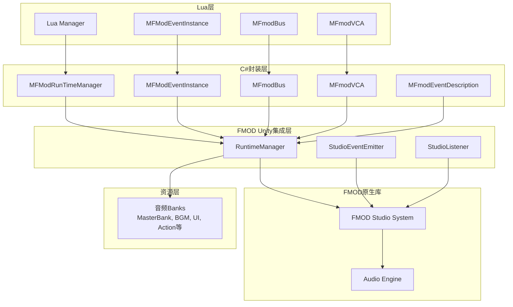
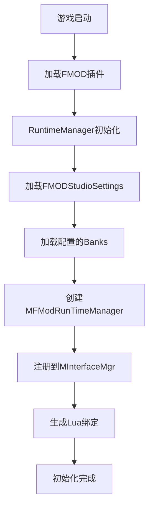

FMOD音频系统为项目提供了专业的音频管理解决方案，支持3D空间音频、事件驱动音效、动态混音等高级功能。系统采用分层架构，通过C#封装层与FMOD原生库交互，并通过ToLua框架为Lua提供完整的音频控制接口。

## 系统架构

FMOD集成系统采用多层架构设计，确保音频管理的高效性和可扩展性。



架构分为四个层次：**Lua层**提供业务逻辑接口，**C#封装层**处理具体实现并封装FMOD API，**FMOD Unity集成层**提供Unity专用的组件，**FMOD原生库**处理底层音频渲染。

Sources: [Scripts/FMod/MFModRunTimeManager.cs](Scripts/FMod/MFModRunTimeManager.cs#L1-L193)

## 核心组件

### 运行时管理器

`MFModRunTimeManager`是FMOD系统的核心管理器，采用单例模式，负责音频系统初始化、事件播放、Bank加载等核心功能。它实现了`IMFModRunTimeManager`接口，并通过`MInterfaceMgr`注册到全局接口管理器中。

**主要功能包括：**

- **事件播放**：支持一次性播放（PlayOneShot）和附加对象播放（PlayOneShotAttached）
- **实例管理**：创建和管理FMOD事件实例（CreateInstance）
- **Bank控制**：动态加载和卸载音频Bank（LoadBank/UnloadBank）
- **混音控制**：获取和操作Bus、VCA（GetBus/GetVCA）
- **全局控制**：暂停/静音所有事件、监听器管理等

Sources: [Scripts/FMod/MFModRunTimeManager.cs](Scripts/FMod/MFModRunTimeManager.cs#L16-L173)

### 事件实例管理

`MFModEventInstance`封装了FMOD的EventInstance，提供了对单个音频事件的完整控制能力。

**支持的属性控制：**
- 音量控制（getVolume/setVolume）
- 音高控制（getPitch/setPitch）
- 3D属性控制（get3DAttributes/set3DAttributes）
- 播放状态控制（getPaused/setPaused）
- 混响级别控制（getReverbLevel/setReverbLevel）
- 时间线位置控制（getTimelinePosition）

**生命周期管理：**
- start()：开始播放事件
- stop()：停止播放（支持立即停止或渐出停止）
- release()：释放事件实例

Sources: [Scripts/FMod/MFModEventInstance.cs](Scripts/FMod/MFModEventInstance.cs#L1-L200)

### 混音控制组件

**Bus总线控制（MFmodBus）：**
- 用于音频分组和批量控制
- 支持音量、暂停、静音等操作
- 可锁定/解锁通道组
- 支持停止所有事件（stopAllEvents）

**VCA控制（MFmodVCA）：**
- Volume Chain Audio，用于跨总线的音量控制
- 允许同时控制多个Bus的音量
- 常用于主音量、分类音量等场景

Sources: [Scripts/FMod/MFmodBus.cs](Scripts/FMod/MFmodBus.cs#L1-L75), [Scripts/FMod/MFmodVCA.cs](Scripts/FMod/MFmodVCA.cs#L1-L39)

## 音频资源组织

FMOD使用Bank（银行）来组织音频资源，项目中定义了多个功能明确的Bank：

| Bank名称 | 用途 | 说明 |
|---------|------|------|
| MasterBank | 主银行 | 包含所有事件定义和混音总线结构 |
| MasterBank.strings | 字符串资源 | 存储事件路径、参数名称等本地化字符串 |
| BGM | 背景音乐 | 场景BGM、环境音乐等 |
| UI | UI音效 | 按钮点击、界面交互音效 |
| Action | 动作音效 | 角色移动、技能释放等音效 |
| AMB | 环境音效 | 风声、水流等环境氛围音 |
| Monster | 怪物音效 | 怪物攻击、受击等音效 |
| VO | 语音 | 角色对话、系统提示语音 |
| VO_Korea | 韩语语音 | 韩语版本专用语音Bank |
| CutScene | 过场音效 | 剧情动画音效 |

**Bank配置：**
- 存储路径：`artres/_FMod/Mobile/`
- 在FMODStudioSettings.asset中配置加载列表
- 支持运行时动态加载和卸载

Sources: [Plugins/FMOD/Resources/FMODStudioSettings.asset](Plugins/FMOD/Resources/FMODStudioSettings.asset#L1-L86), [artres/_FMod/Mobile](artres/_FMod/Mobile)

## 特殊音频组件

### 碰撞器音频源

`MFModColliderAudioSource`实现了基于碰撞器的3D空间音频，支持音频源根据听者位置动态跟随最近的碰撞点移动。

**工作原理：**
1. 监听指定索引的FMOD Listener位置
2. 计算当前Listener到所有Collider的最接近点
3. 音频源以插值方式移动到目标位置
4. 支持运行时和编辑器两种模式

**配置参数：**
- ListenerIndex：要跟随的Listener索引
- ColliderList：计算最近点用的碰撞器列表
- AudioEvent：播放的FMOD事件路径
- speed：移动速度

Sources: [Scripts/FMod/MFModColliderAudioSource.cs](Scripts/FMod/MFModColliderAudioSource.cs#L9-L192)

### 动画音效控制器

`SimpleAnimationSoundController`为动画系统添加音效支持，通过AnimationEvent在动画指定时间点触发音效。

**工作流程：**
1. Start时为动画添加AnimationEvent
2. 动画播放到指定时间点时调用PlayEmitterSound
3. 自动创建或使用已有的StudioEventEmitter
4. 播放指定的FMOD事件

Sources: [Scripts/FMod/SimpleAnimationSoundController.cs](Scripts/FMod/SimpleAnimationSoundController.cs#L1-L59)

## Lua集成与使用

系统通过ToLua框架为Lua层提供完整的FMOD接口，所有核心组件都已导出到Lua环境。

### Lua接口注册

自动生成的Wrap文件实现了C#到Lua的接口绑定：

- **MFModRunTimeManagerWrap**：导出运行时管理器的所有方法
- **MFModEventInstanceWrap**：导出事件实例的所有控制方法
- **MFmodBusWrap**：导出Bus控制方法
- **MFmodVCAWrap**：导出VCA控制方法
- **MFmodEventDescriptionWrap**：导出事件描述查询方法

Sources: [Source/Generate/MFModRunTimeManagerWrap.cs](Source/Generate/MFModRunTimeManagerWrap.cs#L1-L200), [Source/Generate/MFModEventInstanceWrap.cs](Source/Generate/MFModEventInstanceWrap.cs#L1-L200)

### Lua使用示例

系统在Lua中通过全局接口管理器访问FMOD功能：

```lua
-- 获取FMOD运行时管理器
local fmodMgr = MInterfaceMgr:GetInterface("MFModRunTimeManager")

-- 播放一次性音效
fmodMgr:PlayOneShot("event:/UI/Button_Click")

-- 播放3D音效
fmodMgr:PlayOneShot("event:/Action/Skill_Fire", Vector3.new(x, y, z))

-- 创建并控制事件实例
local instance = fmodMgr:CreateInstance("event:/BGM/MainTheme")
if instance then
    instance:setVolume(0.8)
    instance:start()
end

-- 获取并控制Bus
local bus = fmodMgr:GetBus("bus:/Master")
if bus then
    bus:setVolume(0.5)
end
```

### Lua音频管理器示例

项目中包含专门的音频管理器模块，如`BGMHouseMgr`用于BGM播放管理，展示了Lua层如何使用FMOD接口：

```lua
module("ModuleMgr.BGMHouseMgr", package.seeall)

function OpenBGMHousePlayer(luatype, command, args)
    local idstrs = string.ro_split(args[1].Value, ",")
    local ids = {}
    for i, v in ipairs(idstrs) do
        table.insert(ids, tonumber(idstrs[i]))
    end
    game:ShowMainPanel()
    UIMgr:ActiveUI(UI.CtrlNames.BgmHouse, function(ctrl)
        ctrl:InitWithBGMId(ids)
    end)
end
```

Sources: [Scripts/Lua/ModuleMgr/BGMHouseMgr.lua](Scripts/Lua/ModuleMgr/BGMHouseMgr.lua#L1-L40)

## Unity编辑器集成

### StudioListener

`StudioListener`组件表示音频接收者，通常附加到摄像机或玩家对象上。

**关键特性：**
- 支持多Listener系统（最多8个）
- 自动同步Transform位置和旋转
- 支持Rigidbody和Rigidbody2D
- 自动注册到RuntimeManager

Sources: [Plugins/FMOD/src/Runtime/StudioListener.cs](Plugins/FMOD/src/Runtime/StudioListener.cs#L1-L54)

### StudioEventEmitter

`StudioEventEmitter`提供了基于组件的音频事件播放方式，适用于简单场景。

**触发模式：**
- None：手动控制
- ObjectStart：对象启动时播放
- ObjectDestroy：对象销毁时播放
- ObjectEnable：启用时播放
- ObjectDisable：禁用时播放
- TriggerEnter：碰撞触发

**参数支持：**
- 可预设多个参数值
- 支持实时参数更新
- 距离衰减覆盖

Sources: [Plugins/FMOD/src/Runtime/StudioEventEmitter.cs](Plugins/FMOD/src/Runtime/StudioEventEmitter.cs#L1-L100)

### 编辑器辅助工具

`EditorListenerHooker`用于编辑器环境下自动创建和管理Listener，方便音频预览和调试。

Sources: [Scripts/FMod/EditorListenerHooker.cs](Scripts/FMod/EditorListenerHooker.cs#L1-L34)

## 系统初始化流程



系统初始化遵循Unity生命周期，MFModRunTimeManager在Awake时初始化，确保在Lua系统之前就绪。

Sources: [Scripts/FMod/MFModRunTimeManager.cs](Scripts/FMod/MFModRunTimeManager.cs#L174-L193)

## 最佳实践

### Bank加载策略

1. **按需加载**：根据游戏进程动态加载所需Bank
2. **预加载关键资源**：场景切换前预加载场景相关BGM和音效
3. **及时释放**：离开场景时卸载不需要的Bank

```lua
-- 场景加载前
function OnSceneLoad(sceneId)
    local fmodMgr = MInterfaceMgr:GetInterface("MFModRunTimeManager")
    fmodMgr:LoadBank("BGM")
    fmodMgr:LoadBank("AMB")
    fmodMgr:WaitForAllLoads()
end

-- 场景卸载时
function OnSceneUnload()
    local fmodMgr = MInterfaceMgr:GetInterface("MFModRunTimeManager")
    fmodMgr:UnloadBank("BGM")
    fmodMgr:UnloadBank("AMB")
end
```

### 事件生命周期管理

始终确保正确释放FMOD事件实例，避免内存泄漏：

```lua
-- 创建、播放、释放
local instance = fmodMgr:CreateInstance("event:/UI/Window_Open")
if instance then
    instance:start()
    -- 等待播放完成
    instance:stop(false)  -- false表示允许渐出
    instance:release()
end
```

### 3D音频优化

- 合理设置最小/最大距离
- 使用MFModColliderAudioSource处理复杂空间音频
- 合理设置Listener数量，避免性能开销

Sources: [Scripts/FMod/MFModColliderAudioSource.cs](Scripts/FMod/MFModColliderAudioSource.cs#L33-L82)

### 错误处理

系统内置了完善的错误处理机制，事件不存在时会记录错误日志：

```csharp
public void PlayOneShot(string path, Vector3 position = new Vector3())
{
    if (!EventExist(path))
    {
        MDebug.singleton.AddErrorLog($"Fmod event: {path} not exist!");
        return;
    }
    try
    {
        RuntimeManager.PlayOneShot(path, position);
    }
    catch (Exception)
    {
        MDebug.singleton.AddErrorLog($"Fmod event: {path} not exist!");
    }
}
```

Sources: [Scripts/FMod/MFModRunTimeManager.cs](Scripts/FMod/MFModRunTimeManager.cs#L16-L31)

## 扩展阅读

了解FMOD音频系统后，建议继续学习以下相关内容：

- **[C#与Lua混合开发模式](6-c-yu-luahun-he-kai-fa-mo-shi)**：理解Lua与C#的交互机制
- **[AVProVideo视频播放](32-avprovideoshi-pin-bo-fang)**：多媒体内容管理
- **[Cinemachine摄像机控制](34-cinemachineshe-xiang-ji-kong-zhi)**：视听结合的体验设计
- **[DOTween动画补间](35-dotweendong-hua-bu-jian)**：动画与音效的同步