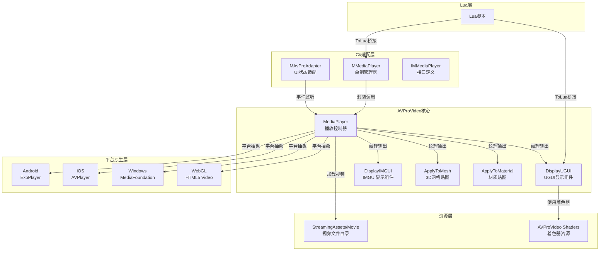

AVProVideo是本项目采用的Unity原生视频播放解决方案，提供跨平台的高性能视频播放能力，支持MP4、WebM等多种格式，并集成360°全景视频、立体声和字幕等功能。本文档面向中级开发者，详细介绍AVProVideo在本项目中的集成架构、使用方法和最佳实践。

## 架构概览

AVProVideo在本项目中采用分层架构设计，通过自定义适配器层与Lua引擎和C#业务逻辑深度集成。核心组件包括MediaPlayer（媒体播放控制器）、Display组件（视频渲染展示）以及自定义的MMediaPlayer管理器，形成完整的视频播放生态系统。



**核心组件职责划分**

| 组件 | 职责 | 生命周期 |
|------|------|----------|
| MediaPlayer | 视频加载、解码、播放控制、事件分发 | 组件生命周期 |
| MMediaPlayer | 全局单例、Lua接口暴露、事件桥接 | 游戏全程 |
| MAvProAdapter | 背景UI状态管理、播放状态响应 | 场景级 |
| DisplayUGUI | UGUI上的视频渲染 | UI组件生命周期 |
| DisplayIMGUI | 即时模式GUI视频渲染 | 编辑器/运行时 |

Sources: [MMediaPlayer.cs](Scripts/AVPro/MMediaPlayer.cs#L1-L50), [MAvProAdapter.cs](Scripts/AVPro/MAvProAdapter.cs#L1-L30), [MediaPlayer.cs](ThirdParty/AVProVideo/Scripts/Components/MediaPlayer.cs#L30-L100)

## 核心接口与Lua集成

项目通过ToLua框架将AVProVideo的核心能力暴露给Lua脚本，采用统一的IMediaPlayer接口定义，实现C#与Lua的无缝交互。MMediaPlayer作为单例管理器，在Awake时注册到MInterfaceMgr，提供完整的视频控制API。

**Lua可调用的核心方法**

```lua
-- 获取播放器单例
local mediaPlayer = MInterfaceMgr.singleton:GetInterface("MMediaPlayer")

-- 打开视频（从StreamingAssets）
local success = mediaPlayer:OpenVideoFromFile(EFileLocation.RelativeToStreamingAssetsFolder, "CG.mp4", true)

-- 播放控制
mediaPlayer:Play()
mediaPlayer:Pause()
mediaPlayer:Stop()

-- 播放属性
mediaPlayer.Loop = true  -- 循环播放
mediaPlayer:SetVolume(0.8)  -- 音量0.8
mediaPlayer:SetPlaybackRate(1.5)  -- 1.5倍速播放

-- 进度控制
local currentTime = mediaPlayer:GetCurrentTimeMs()  -- 获取当前时间（毫秒）
mediaPlayer:Seek(5000)  -- 跳转到5秒位置

-- 状态查询
local isPlaying = mediaPlayer:IsPlaying()
local isFinished = mediaPlayer:IsFinished()
local isBuffering = mediaPlayer:IsBuffering()
```

**事件系统**

视频播放事件通过MoonClientBridge桥接到Lua层，支持以下关键事件：

| 事件类型 | 触发时机 | 典型用途 |
|----------|----------|----------|
| ReadyToPlay | 视频加载完成，准备播放 | 显示播放按钮，初始化UI |
| FirstFrameReady | 首帧渲染完成 | 隐藏加载动画，显示视频 |
| Started | 开始播放 | 记录播放开始时间 |
| FinishedPlaying | 播放结束 | 触发下一剧情，关闭视频窗口 |
| Error | 播放出错 | 显示错误提示，重试或跳过 |
| MetaDataReady | 元数据解析完成 | 获取视频时长、分辨率信息 |

Sources: [MMediaPlayer.cs](Scripts/AVPro/MMediaPlayer.cs#L1-L299), [RenderHeads_Media_AVProVideo_MediaPlayerWrap.cs](Source/Generate/RenderHeads_Media_AVProVideo_MediaPlayerWrap.cs#L1-L100)

## 快速开始

### 基础视频播放流程

以下是使用AVProVideo播放视频的完整流程，涵盖从场景搭建到Lua调用的全过程。


**步骤1：创建播放器对象**

在场景中创建GameObject并配置必要组件。项目中已提供预制体`Resources/Prefabs/AvProAdapter.prefab`，可直接实例化使用。

Sources: [AvProAdapter.prefab](Resources/Prefabs/AvProAdapter.prefab)

**步骤2：配置MediaPlayer组件**

| 属性 | 说明 | 推荐值 |
|------|------|--------|
| m_VideoLocation | 视频文件位置 | RelativeToStreamingAssetsFolder |
| m_VideoPath | 视频文件路径 | 相对于StreamingAssets的路径 |
| m_AutoOpen | 是否自动打开 | false（通过Lua控制） |
| m_AutoStart | 是否自动播放 | false（通过Lua控制） |
| m_Loop | 是否循环播放 | 根据需求设置 |
| m_Volume | 初始音量 | 1.0 |
| m_Muted | 是否静音 | false |

**步骤3：配置DisplayUGUI组件**

DisplayUGUI继承自MaskableGraphic，可像普通RawImage一样使用。关键属性：

| 属性 | 说明 | 推荐值 |
|------|------|--------|
| _mediaPlayer | 绑定的MediaPlayer | 指向步骤1的播放器 |
| _scaleMode | 缩放模式 | ScaleToFit（适应显示区域） |
| _setNativeSize | 是否使用原始尺寸 | false |
| _defaultTexture | 默认显示纹理 | 加载占位图 |

**步骤4：Lua端调用示例**

```lua
-- 从资源加载预制体
local prefab = ResourceManager:LoadPrefab("AvProAdapter")
local gameObject = GameObject.Instantiate(prefab)

-- 获取MMediaPlayer接口
local mediaPlayer = MInterfaceMgr.singleton:GetInterface("MMediaPlayer")

-- 打开CG过场动画
local function PlayCG(cgName)
    if not mediaPlayer then
        Debug.LogError("MMediaPlayer not initialized")
        return
    end
    
    -- 监听播放完成事件
    local function OnMediaPlayerEvent(eventType, errorCode)
        if eventType == EEventType.FinishedPlaying then
            Debug.Log("CG播放完成，进入游戏")
            -- 关闭视频窗口
            UIManager:ClosePanel("CGPanel")
            -- 进入主场景
            SceneManager:LoadScene("MainScene")
        elseif eventType == EEventType.Error then
            Debug.LogError("CG播放失败: " .. tostring(errorCode))
            -- 错误处理：跳过CG
            UIManager:ClosePanel("CGPanel")
        end
    end
    
    -- 注册事件监听（通过Bridge）
    local bridge = MInterfaceMgr.singleton:GetInterface("MoonClientBridge")
    bridge:OnMediaPlayerEvent(EEventType.FinishedPlaying, OnMediaPlayerEvent)
    
    -- 打开并播放视频
    local success = mediaPlayer:OpenVideoFromFile(
        EFileLocation.RelativeToStreamingAssetsFolder,
        cgName,
        true  -- autoPlay
    )
    
    if not success then
        Debug.LogError("打开视频失败: " .. cgName)
    end
end

-- 播放开场CG
PlayCG("launch.mp4")
```

Sources: [MMediaPlayer.cs](Scripts/AVPro/MMediaPlayer.cs#L50-L100), [MAvProAdapter.cs](Scripts/AVPro/MAvProAdapter.cs#L1-L30)

### 绑定显示组件到播放器

MMediaPlayer提供了BindMediaPlayer方法，可动态将播放器绑定到任意显示组件，支持多种显示方式。

```lua
-- 绑定UGUI显示组件
local panel = UIManager:GetPanel("VideoPanel")
local rawImage = panel.transform:Find("VideoRawImage").gameObject
local success = mediaPlayer:BindMediaPlayer(rawImage, true)

-- 绑定3D网格显示（用于特效视频）
local effectMesh = GameObject.Find("EffectScreen").gameObject
local success = mediaPlayer:BindMediaPlayer(effectMesh, true)
```

Sources: [MMediaPlayer.cs](Scripts/AVPro/MMediaPlayer.cs#L233-L258)

## 高级功能

### 视频帧提取与截图

AVProVideo支持从视频中提取指定帧的截图，可用于生成缩略图或实现视频预览功能。

```lua
-- 异步提取视频帧
local texture = Texture2D(1920, 1080, TextureFormat.RGBA32, false)
mediaPlayer:ExtractFrameAsync(texture, function(extractedTexture, success)
    if success then
        -- 保存为图片文件
        local bytes = extractedTexture:EncodeToPNG()
        System.IO.File.WriteAllBytes("screenshot.png", bytes)
        Debug.Log("截图保存成功")
    end
end, 5.0, true)  -- 第5秒帧，精确寻址
```

Sources: [MMediaPlayer.cs](Scripts/AVPro/MMediaPlayer.cs#L283-L299)

### 字幕系统集成

MediaPlayer支持加载SRT格式字幕，并提供字幕索引和文本查询接口。

```lua
-- 启用字幕
mediaPlayer:EnableSubtitles(EFileLocation.RelativeToStreamingAssetsFolder, "CG_zh.srt")

-- 在Update中获取当前字幕
function Update()
    local mediaPlayer = MInterfaceMgr.singleton:GetInterface("MMediaPlayer")
    if mediaPlayer and mediaPlayer:IsPlaying() then
        local subtitleIndex = mediaPlayer.Control:GetSubtitleIndex()
        if subtitleIndex >= 0 then
            local subtitleText = mediaPlayer.Subtitles:GetSubtitleText()
            -- 更新UI显示字幕
            UIManager:SetText("SubtitleText", subtitleText)
        end
    end
end

-- 禁用字幕
mediaPlayer:DisableSubtitles()
```

### 视频进度控制与缓冲

网络视频播放时，缓冲进度监控和精确进度控制至关重要。

```lua
-- 检查缓冲状态
function Update()
    if mediaPlayer:IsBuffering() then
        local progress = mediaPlayer.Control:GetBufferingProgress()
        UIManager:SetProgress("BufferingBar", progress)
        
        -- 获取已缓冲的时间范围
        local rangeCount = mediaPlayer.Control:GetBufferedTimeRangeCount()
        for i = 0, rangeCount - 1 do
            local startTime = 0
            local endTime = 0
            local hasRange = mediaPlayer.Control:GetBufferedTimeRange(i, startTime, endTime)
            if hasRange then
                Debug.Log(string.format("缓冲范围: %.2fs - %.2fs", startTime / 1000, endTime / 1000))
            end
        end
    end
end

-- 带容错的快速跳转
mediaPlayer:SeekWithTolerance(30000, 2000, 2000)  -- 目标30秒，容差±2秒
```

Sources: [Interfaces.cs](ThirdParty/AVProVideo/Scripts/Internal/Interfaces.cs#L90-L150)

## 平台特性与适配

### Android平台

Android平台使用ExoPlayer作为底层播放引擎，通过ExoPlayer2实现HLS、DASH等流媒体协议支持。

**关键特性**
- 支持HLS（m3u8）和DASH流媒体
- 支持DRM加密视频
- 支持自适应码率
- Audio360空间音频支持

**平台特定配置**
```csharp
// Android平台选项
mediaPlayer.PlatformOptionsAndroid.useFastOesPath = true;  // 启用快速OES纹理路径
mediaPlayer.PlatformOptionsAndroid.useLowLatencyPath = true;  // 低延迟模式
```

Sources: [Plugins/Android](Plugins/Android)

### iOS平台

iOS平台使用原生AVPlayer框架，针对iOS设备进行了深度优化。

**关键特性**
- 硬件解码加速
- 支持AirPlay投屏
- 后台播放支持
- YpCbCr420纹理格式（内存优化）

**平台特定配置**
```csharp
// iOS平台选项
mediaPlayer.PlatformOptionsIOS.useYpCbCr420Textures = true;  // 启用YpCbCr420格式节省内存
mediaPlayer.PlatformOptionsIOS.allowBackgroundAudio = true;  -- 允许后台音频
```

**注意事项**：当DisplayUGUI配合Mask组件使用时，会自动禁用YpCbCr模式以兼容遮罩功能，但会增加内存消耗。Sources: [DisplayUGUI.cs](ThirdParty/AVProVideo/Scripts/Components/DisplayUGUI.cs#L85-L95)

### WebGL平台

WebGL平台使用HTML5 Video API，通过WebAssembly桥接。

**限制说明**
- 视频格式受浏览器限制（建议使用H.264编码的MP4）
- 不支持所有高级特性
- 自动播放需用户交互触发

Sources: [Plugins/WebGL/AVProVideo.jslib](Plugins/WebGL/AVProVideo.jslib)

## 性能优化建议

### 内存优化

视频播放是内存密集型操作，以下是优化建议：

| 优化策略 | 实现方式 | 预期收益 |
|----------|----------|----------|
| 使用YpCbCr420格式 | iOS平台启用`useYpCbCr420Textures` | 减少50%纹理内存 |
| 及时释放资源 | 播放完成后调用`CloseVideo()` | 释放解码器内存 |
| 控制并发播放数 | 避免同时播放多个视频 | 降低GPU压力 |
| 合理设置纹理过滤 | 使用Bilinear而非Trilinear | 减少显存占用 |

### 播放流畅度优化

```lua
-- 启用低延迟播放模式
mediaPlayer.Control:SetPlayWithoutBuffering(true)

-- 使用快速跳转代替精确跳转
mediaPlayer:SeekFast(targetTime)  -- 跳转到最近关键帧

-- 批量加载视频时预加载
function PreloadVideos(videoList)
    for i, videoPath in ipairs(videoList) do
        -- 创建后台播放器预加载
        local preloader = GameObject("VideoPreloader_" .. i)
        local mp = preloader:AddComponent(typeof(MediaPlayer))
        mp.m_AutoStart = false
        mp:OpenVideoFromFile(EFileLocation.RelativeToStreamingAssetsFolder, videoPath, false)
    end
end
```

### 调试与性能监控

MMediaPlayer提供了DebugOverlay方法，可在运行时显示详细的播放调试信息。

```lua
-- 开启调试覆盖层
mediaPlayer:DebugOverlay(true)

-- 调试信息包括：
-- - 播放状态（播放/暂停/缓冲/错误）
-- - 帧率和时间信息
-- - 缓冲进度
-- - 音频/视频轨道信息
-- - 纹理尺寸和格式
```

Sources: [MMediaPlayer.cs](Scripts/AVPro/MMediaPlayer.cs#L260-L273)

## 常见问题与故障排除

**问题1：视频播放黑屏**

- 检查`DisplayUGUI`的`_mediaPlayer`引用是否正确绑定
- 确认视频路径正确，文件存在于`StreamingAssets/Movie/`目录
- 查看Console是否有`EEventType.Error`事件触发
- 在编辑器中检查MediaPlayer的VideoOpened状态

**问题2：音频无声音**

- 检查`mediaPlayer.Control:IsMuted()`返回值
- 确认`mediaPlayer:GetVolume()`大于0
- 检查AudioListener是否存在于场景中
- Android平台需确认`Audio 360`权限已获取

**问题3：播放卡顿**

- 启用缓冲监控，检查缓冲进度
- 考虑降低视频码率或分辨率
- 使用`SeekFast`代替精确Seek
- 检查设备剩余内存，及时释放不用的资源

**问题4：Lua事件未触发**

- 确认MMediaPlayer单例已正确初始化
- 检查MoonClientBridge接口是否正常
- 验证事件类型枚举值匹配（使用`MoonCommonLib.EEventType`）
- 确认在`OnEnable`中注册了事件监听

Sources: [MMediaPlayer.cs](Scripts/AVPro/MMediaPlayer.cs#L39-L60), [MAvProAdapter.cs](Scripts/AVPro/MAvProAdapter.cs#L10-L25)

## 视频资源管理

项目中的视频文件统一存储在`StreamingAssets/Movie/`目录下，按功能分类组织。

**视频文件分类**

| 目录/前缀 | 用途 | 示例文件 |
|-----------|------|----------|
| `launch.mp4` | 启动Logo视频 | 游戏启动时播放 |
| `CG.mp4` | 剧情过场 | 主要剧情片段 |
| `CutBossBorn*.mp4` | Boss出场特效 | Boss战前播放 |
| `EffectMovie/` | 特效动画 | 技能、魔法特效 |
| `BattleVideo.mp4` | 战斗演示 | 战斗教程视频 |

**视频编码建议**
- 编码格式：H.264（AVC）
- 封装格式：MP4容器
- 音频编码：AAC
- 分辨率：根据目标设备调整（移动端建议720p或更低）
- 码率：1080p建议5-8Mbps，720p建议2-4Mbps

Sources: [StreamingAssets/Movie](StreamingAssets/Movie)

## 相关文档

要深入了解项目整体架构和其他系统集成，建议参考以下文档：

- [C#与Lua混合开发模式](6-c-yu-luahun-he-kai-fa-mo-shi) - 了解ToLua桥接机制
- [UI框架设计（Ctrl/Handler/Panel/Template）](12-uikuang-jia-she-ji-ctrl-handler-panel-template) - 了解视频UI在整体UI框架中的位置
- [资源管理](14-assetbundlexi-tong-jia-gou) - 了解视频资源的打包与加载流程
- [FMOD音频系统集成](31-fmodyin-pin-xi-tong-ji-cheng) - 了解音频系统与视频音频的协同

通过掌握AVProVideo的使用方法，您可以在游戏剧情过场、技能特效、教程演示等多种场景中实现高质量的视频播放体验。