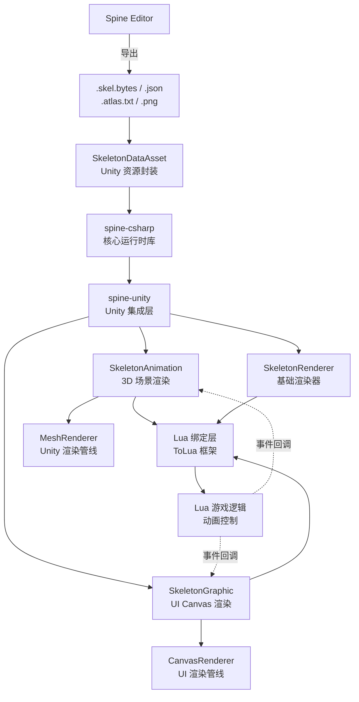
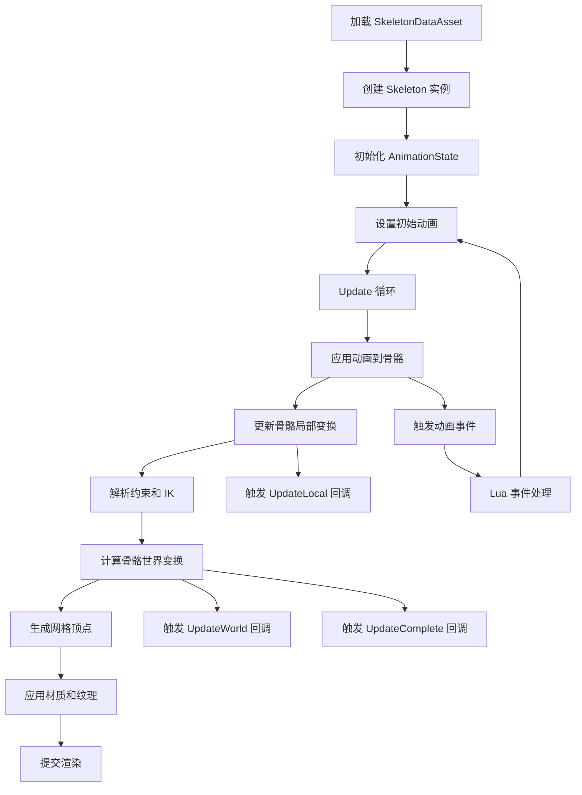

本文档详细介绍了项目中的 Spine 2D 骨骼动画系统集成与使用方法。Spine 是一款专业的 2D 骨骼动画工具，该项目使用 Spine 3.7.xx 运行时版本，提供了强大的 2D 角色动画和特效动画支持。项目中的 Spine 资源包括登录界面动画、特效动画、角色动画等多种类型，通过 C# 和 Lua 混合开发模式进行控制。

## 系统架构概览

Spine 系统在项目中采用分层架构设计，从底层的 spine-csharp 核心库到 Unity 集成层，再到 Lua 绑定层，形成了完整的动画控制链路。核心组件包括 SkeletonAnimation（用于 3D 场景渲染）、SkeletonRenderer（基础渲染器）和 SkeletonGraphic（用于 UI Canvas 渲染），所有组件都通过 ToLua 框架暴露给 Lua 脚本使用。



系统架构体现了清晰的职责分离：底层负责动画计算和骨骼变换，中间层负责 Unity 渲染集成，上层提供 Lua 脚本接口。这种设计使得动画数据可以在 C# 和 Lua 之间灵活传递，同时保持高性能的渲染效率。项目中的 Spine 资源库（如 `artres/_GameRes/Spine`）包含了大量预制的动画资源，可以直接在游戏中实例化和使用。

Sources: [Spine/spine-unity/Assets/Spine/version.txt](Spine/spine-unity/Assets/Spine/version.txt#L1-L1), [Spine/spine-csharp/src/SkeletonData.cs](Spine/spine-csharp/src/SkeletonData.cs#L1-L80), [Source/Generate/LuaBinderOfDefault.cs](Source/Generate/LuaBinderOfDefault.cs#L44-L52)

## 核心组件详解

### SkeletonAnimation

SkeletonAnimation 是用于 3D 场景中渲染 Spine 动画的主要组件，继承自 SkeletonRenderer 并实现了 ISkeletonAnimation 和 IAnimationStateComponent 接口。该组件通过 AnimationState 提供完整的动画控制能力，包括动画播放、混合、混合队列等功能。组件提供了 `AnimationName` 属性用于快速设置和获取当前播放的动画名称，`loop` 属性控制动画循环，`timeScale` 属性调整动画播放速率。这些属性可以方便地在 Inspector 中配置或通过代码动态修改。

SkeletonAnimation 提供了三个重要的骨骼更新回调事件：`UpdateLocal` 在动画应用后、世界空间值解析前触发，适合设置骨骼局部值；`UpdateWorld` 在骨骼世界空间值解析后触发，包括所有约束计算，适合读取和修改骨骼世界空间值；`UpdateComplete` 在所有计算完成后触发，适合仅需读取骨骼世界空间值的场景。组件还支持运行时动态创建，通过 `AddToGameObject` 静态方法可将 SkeletonAnimation 添加到指定 GameObject，通过 `NewSkeletonAnimationGameObject` 方法可创建新的 GameObject 并附加 SkeletonAnimation 组件。

Sources: [Spine/spine-unity/Assets/Spine/Runtime/spine-unity/Components/SkeletonAnimation.cs](Spine/spine-unity/Assets/Spine/Runtime/spine-unity/Components/SkeletonAnimation.cs#L1-L80), [Spine/spine-unity/Assets/Spine/Runtime/spine-unity/Components/SkeletonAnimation.cs](Spine/spine-unity/Assets/Spine/Runtime/spine-unity/Components/SkeletonAnimation.cs#L80-L140), [Spine/spine-unity/Assets/Spine/Runtime/spine-unity/ISkeletonAnimation.cs](Spine/spine-unity/Assets/Spine/Runtime/spine-unity/ISkeletonAnimation.cs#L1-L73)

### SkeletonRenderer

SkeletonRenderer 是所有 Spine 渲染组件的基类，负责管理和渲染骨骼实例。该组件需要 MeshFilter 和 MeshRenderer 组件支持，通过 `skeletonDataAsset` 字段引用动画数据资源。初始化配置包括 `initialSkinName`（初始皮肤名称）、`initialFlipX/Y`（初始翻转设置）等参数。高级渲染设置提供了丰富的优化选项：`zSpacing` 控制 Z 轴间距以避免深度冲突，`useClipping` 启用或禁用 Spine 的裁剪功能，`immutableTriangles` 在不使用附件交换或隐藏时优化三角形更新，`pmaVertexColors` 控制是否使用预乘 Alpha 顶点颜色。

SkeletonRenderer 支持子网格分离渲染功能，通过 `separatorSlotNames` 指定分离槽位，`separatorSlots` 存储实际的 Slot 对象，这对于需要将骨骼分割到不同渲染器的场景非常有用。遮罩交互功能通过 `maskInteraction` 枚举控制与 Unity SpriteMask 的交互方式，支持 None、VisibleInsideMask 和 VisibleOutsideMask 三种模式。材质切换功能通过 `maskMaterials` 提供不同遮罩模式下的材质引用。渲染覆盖功能允许外部代码接管渲染逻辑，通过 `GenerateMeshOverride` 事件和 `generateMeshOverride` 委托实现自定义渲染。

Sources: [Spine/spine-unity/Assets/Spine/Runtime/spine-unity/Components/SkeletonRenderer.cs](Spine/spine-unity/Assets/Spine/Runtime/spine-unity/Components/SkeletonRenderer.cs#L1-L80), [Spine/spine-unity/Assets/Spine/Runtime/spine-unity/Components/SkeletonRenderer.cs](Spine/spine-unity/Assets/Spine/Runtime/spine-unity/Components/SkeletonRenderer.cs#L80-L150)

### SkeletonGraphic

SkeletonGraphic 是专门为 Unity UI Canvas 设计的 Spine 渲染组件，继承自 MaskableGraphic 并实现了 ISkeletonComponent、IAnimationStateComponent、ISkeletonAnimation 和 IHasSkeletonDataAsset 接口。该组件需要 CanvasRenderer 和 RectTransform 组件支持，通过 `skeletonDataAsset` 引用动画数据，`initialSkinName` 设置初始皮肤，`initialFlipX/Y` 控制初始翻转。动画控制参数包括 `startingAnimation`（初始动画名称）、`startingLoop`（是否循环）、`timeScale`（时间缩放）和 `freeze`（冻结动画），`unscaledTime` 控制是否使用不受时间缩放影响的时间。

SkeletonGraphic 提供了与 SkeletonAnimation 类似的动画状态访问和骨骼更新回调机制，但其渲染集成在 Unity UI 系统中，可以与其他 UI 元素无缝协作。组件支持运行时动态创建，通过 `NewSkeletonGraphicGameObject` 静态方法可创建新的 UI GameObject 并附加 SkeletonGraphic 组件，通过 `AddSkeletonGraphicComponent` 方法可将 SkeletonGraphic 添加到已存在的 GameObject。该组件特别适合用于 UI 中的动态图标、按钮动画、界面特效等场景，如项目中的登录界面、结算界面等都使用了 SkeletonGraphic。

Sources: [Spine/spine-unity/Assets/Spine/Runtime/spine-unity/Modules/SkeletonGraphic/SkeletonGraphic.cs](Spine/spine-unity/Assets/Spine/Runtime/spine-unity/Modules/SkeletonGraphic/SkeletonGraphic.cs#L1-L80)

## 资源管理

### SkeletonDataAsset

SkeletonDataAsset 是 Unity 中的 ScriptableObject 资源，用于封装 Spine 骨骼数据和图集信息。核心字段包括 `atlasAssets`（图集资源数组）、`scale`（缩放比例，默认 0.01）和 `skeletonJSON`（骨骼数据文件，支持 .json 或 .skel.bytes 格式）。动画混合配置通过 `fromAnimation`、`toAnimation` 和 `duration` 数组定义动画之间的混合过渡时间，`defaultMix` 设置默认混合时间。`controller` 字段可引用 Unity AnimatorController，用于与 Mecanim 动画系统集成。`skeletonDataModifiers` 列表允许在加载后对 SkeletonData 应用修改，如为特殊混合模式的槽位应用材质。

SkeletonDataAsset 提供了运行时实例化方法 `CreateRuntimeInstance`，可以从 TextAsset 和 AtlasAsset 动态创建骨骼数据资源。`IsLoaded` 属性用于检查资源是否已加载，`skeletonData` 和 `stateData` 字段存储运行时的 SkeletonData 和 AnimationStateData 对象。项目中的 Spine 资源如 `CaiHongZhiYue_SkeletonData.asset`、`KV_SkeletonData.asset` 等都使用此格式封装，每个资源目录包含 .atlas.txt 图集文件、.png 纹理、.skel.bytes 或 .json 骨骼数据，以及对应的 Unity 资源文件（_Atlas.asset、_Material.mat、_SkeletonData.asset）。

Sources: [Spine/spine-unity/Assets/Spine/Runtime/spine-unity/Asset Types/SkeletonDataAsset.cs](Spine/spine-unity/Assets/Spine/Runtime/spine-unity/Asset Types/SkeletonDataAsset.cs#L1-L80), [artres/_GameRes/Spine/CaiHongZhiYue/CaiHongZhiYue_SkeletonData.asset](artres/_GameRes/Spine/CaiHongZhiYue/CaiHongZhiYue_SkeletonData.asset#L1-L25), [artres/_GameRes/Spine/DengLuJieMian_01/KV_SkeletonData.asset](artres/_GameRes/Spine/DengLuJieMian_01/KV_SkeletonData.asset#L1-L25)

### 资源目录结构

项目的 Spine 资源统一存放在 `artres/_GameRes/Spine` 目录下，按功能模块组织，包括登录界面动画（如 `DengLuJieMian_01`）、特效动画（如 `FX_Spine_Chuan_01`、`Fx_Mao_01`）、剧情动画（如 `Cutscene_BaoZhaDeJiYi_01`）、活动动画（如 `CaiHongZhiYue`、`MiaoMiaoGuoShi`）、角色动画（如 `MaoShouErQi01`）等多个类别。每个资源目录包含完整的 Spine 导出文件和 Unity 资源引用，形成自包含的资源单元。

资源命名遵循一定的规范，通常使用拼音或英文名称，如 `SuoPingJieMian`（锁屏界面）、`HuiGuiXinFeng`（回归信封）、`HuoQuSongBing`（获取送兵）等，便于识别和管理。部分复杂资源如 `Cutscene_BaoZhaDeJiYi_01`、`KaPuLa_YinDao` 包含多个纹理文件和材质，以支持更丰富的视觉效果。资源目录下的 `ReferenceAssets` 子目录通常存放参考资源或辅助资源。

Sources: [artres/_GameRes/Spine](artres/_GameRes/Spine)

## Lua 集成与使用

### Lua 绑定机制

项目通过 ToLua 框架将 Spine 组件暴露给 Lua 脚本使用，在 `LuaBinderOfDefault.cs` 中注册了三个核心组件的包装类：`Spine_Unity_SkeletonAnimationWrap`、`Spine_Unity_SkeletonGraphicWrap` 和 `Spine_Unity_SkeletonRendererWrap`。同时注册了两个重要的委托类型：`UpdateBonesDelegate`（骨骼更新回调）和 `MeshGeneratorDelegate`（网格生成回调），以及 SkeletonRenderer 相关的委托类型。这些绑定使得 Lua 脚本可以完全控制 Spine 组件的动画播放、骨骼操作、事件响应等功能。

Lua 绑定层自动生成的方法包括组件的公共属性、方法和事件，如 SkeletonAnimation 的 `AddToGameObject`、`NewSkeletonAnimationGameObject`、`ClearState`、`Initialize`、`Update` 等方法，以及 `state`、`loop`、`timeScale`、`AnimationName` 等属性。SkeletonGraphic 的 `NewSkeletonGraphicGameObject`、`AddSkeletonGraphicComponent`、`Rebuild`、`UpdateMesh` 等方法也被绑定，确保 Lua 脚本拥有与 C# 代码相同的功能访问能力。

Sources: [Source/Generate/Spine_Unity_SkeletonAnimationWrap.cs](Source/Generate/Spine_Unity_SkeletonAnimationWrap.cs#L1-L50), [Source/Generate/Spine_Unity_SkeletonRendererWrap.cs](Source/Generate/Spine_Unity_SkeletonRendererWrap.cs#L1-L50), [Source/Generate/Spine_Unity_SkeletonGraphicWrap.cs](Source/Generate/Spine_Unity_SkeletonGraphicWrap.cs#L1-L50), [Source/Generate/LuaBinderOfDefault.cs](Source/Generate/LuaBinderOfDefault.cs#L44-L52)

### Lua 使用示例

Lua 脚本可以通过以下方式创建和控制 Spine 动画：

```lua
-- 创建 SkeletonAnimation 对象
local skeletonData = -- 通过资源加载获取 SkeletonDataAsset
local skeletonAnim = Spine.Unity.SkeletonAnimation.NewSkeletonAnimationGameObject(skeletonData)

-- 设置动画
skeletonAnim.AnimationName = "idle"
skeletonAnim.loop = true
skeletonAnim.timeScale = 1.0

-- 注册骨骼更新回调
skeletonAnim.UpdateComplete = function(iskeletonAnimation)
    -- 在骨骼更新完成后执行自定义逻辑
    local skeleton = iskeletonAnimation.Skeleton
    local bone = skeleton:FindBone("root")
    -- 修改骨骼世界空间位置
end

-- 创建 SkeletonGraphic 用于 UI
local skeletonGraphic = Spine.Unity.SkeletonGraphic.NewSkeletonGraphicGameObject(skeletonData)
skeletonGraphic.startingAnimation = "open"
skeletonGraphic.startingLoop = false
```

Lua 脚本还可以访问 AnimationState 对象进行更复杂的动画控制，如混合队列、动画事件监听、轨道管理等。通过 Lua 绑定层，游戏逻辑可以完全在 Lua 中实现，保持 C# 和 Lua 之间的无缝协作。

Sources: [Source/Generate/Spine_Unity_SkeletonAnimationWrap.cs](Source/Generate/Spine_Unity_SkeletonAnimationWrap.cs#L1-L50)

## 动画系统

### AnimationState

AnimationState 是 Spine 动画系统的核心类，负责应用动画、管理动画队列、混合动画和分层动画。该类维护一个轨道列表（tracks），每个轨道可以播放一个动画，支持动画的混合过渡。AnimationState 提供了四个内部常量用于定义时间线混合策略：`Subsequent` 表示后续时间线混合到当前姿态，`First` 表示首次设置属性时从设置姿态混合，`Hold` 表示保持避免混合时的"下陷"效果，`HoldMix` 表示使用特定混合比例的保持策略。

AnimationState 通过委托机制提供丰富的事件回调：`Start` 在动画开始时触发，`Interrupt` 在动画被中断时触发，`End` 在动画结束时触发，`Complete` 在动画完成时触发，`Event` 在动画触发事件时触发。这些事件可以在 C# 或 Lua 中监听，实现动画驱动的游戏逻辑。AnimationState 支持动画的混合队列管理，通过 `SetAnimation` 方法设置当前动画，通过 `AddAnimation` 方法添加后续动画，通过 `ClearTracks` 清除所有轨道动画。

Sources: [Spine/spine-csharp/src/AnimationState.cs](Spine/spine-csharp/src/AnimationState.cs#L1-L80)

### 动画控制流程

动画控制遵循明确的执行流程，从数据加载到最终渲染经过多个阶段：



动画控制流程体现了 Spine 系统的模块化设计：数据层负责加载和解析动画数据，逻辑层负责动画应用和骨骼计算，渲染层负责网格生成和提交，事件层负责触发和处理动画事件。每个阶段都有明确的职责划分，便于扩展和优化。Lua 脚本可以在各个回调阶段插入自定义逻辑，如根据骨骼位置创建特效、同步其他对象动画等。

Sources: [Spine/spine-csharp/src/AnimationState.cs](Spine/spine-csharp/src/AnimationState.cs#L1-L80), [Spine/spine-unity/Assets/Spine/Runtime/spine-unity/ISkeletonAnimation.cs](Spine/spine-unity/Assets/Spine/Runtime/spine-unity/ISkeletonAnimation.cs#L1-L73)

## 与其他系统集成

### 与 DOTween 集成

项目中的特效动画系统（FxAnimation）通过 DOTween 提供了丰富的动画效果，可与 Spine 动画协同工作。FxAnimationHelper 组件管理多个 HelperData，每个 HelperData 定义一种动画控制类型，如位置、旋转、缩放、颜色、材质 UV、精灵动画、材质参数、Canvas 透明度等。虽然 ControlType 枚举中没有直接包含 Spine 动画控制，但可以通过 Visible 控制类型同步 Spine 组件的 GameObject 激活状态，或通过 Position、Rotation 等控制类型让 Spine 对象与其他对象同步运动。

FxAnimationHelper 支持动画序列、重复播放、延迟触发等高级功能，可以通过 Lua 控制其播放和停止。这种设计允许复杂的组合动画效果，如 Spine 角色播放待机动画的同时，整个角色对象通过 DOTween 进行浮动、旋转等效果。FxAnimation 系统的 Lua 绑定在 `FxAnimation_FxAnimationHelperWrap` 中提供，使得 Lua 脚本可以完全控制特效动画的播放。

Sources: [Scripts/Effects/FxAnimation/FxAnimationHelper.cs](Scripts/Effects/FxAnimation/FxAnimationHelper.cs#L1-L100), [Scripts/Effects/FxAnimation/HelperData.cs](Scripts/Effects/FxAnimation/HelperData.cs#L1-L150), [Scripts/Effects/FxAnimation/HelperData.cs](Scripts/Effects/FxAnimation/HelperData.cs#L580-L677)

### 与 Unity UI 集成

SkeletonGraphic 组件完美集成到 Unity UI 系统，可以与 Image、Text、RawImage 等 UI 元素在同一 Canvas 上渲染。作为 MaskableGraphic 的子类，SkeletonGraphic 支持遮罩、裁剪、排序等 UI 功能，可以放置在 ScrollRect、Grid Layout Group 等 UI 布局组件中。这种集成使得 Spine 动画可以直接作为 UI 元素使用，无需额外的 3D 相机和渲染层。

项目中的登录界面、结算界面、活动界面等都大量使用 SkeletonGraphic，如 `DengLuJieMian_01/KV_SkeletonData.asset` 用于登录界面的动态 Logo，`Spine_JieSuan_01/JieSuan_SkeletonData.asset` 用于战斗结算的特效动画。SkeletonGraphic 支持 `maskInteraction` 属性，可以与 Unity 的 SpriteMask 组件配合实现复杂的遮罩效果，如角色从门后走出、宝箱打开动画等。

Sources: [Spine/spine-unity/Assets/Spine/Runtime/spine-unity/Modules/SkeletonGraphic/SkeletonGraphic.cs](Spine/spine-unity/Assets/Spine/Runtime/spine-unity/Modules/SkeletonGraphic/SkeletonGraphic.cs#L1-L80), [artres/_GameRes/Spine/DengLuJieMian_01](artres/_GameRes/Spine/DengLuJieMian_01), [artres/_GameRes/Spine/Spine_JieSuan_01](artres/_GameRes/Spine/Spine_JieSuan_01)

### 与 FMOD 音频集成

Spine 动画可以与 FMOD 音频系统同步，通过动画事件触发音效播放。项目中的 MFModEventInstance 组件封装了 FMOD 事件实例，提供了播放、停止、暂停、设置参数等功能。Lua 绑定在 `MFModEventInstanceWrap` 中提供，可以在 Spine 动画的 Event 回调中调用 FMOD 播放相应的音效。

典型的使用场景包括：角色攻击动画触发攻击音效、技能动画触发技能音效、UI 点击动画触发点击音效等。通过动画事件驱动音效播放，可以确保音效与动画帧精确同步，提供更好的游戏体验。MFModRunTimeManager 提供了全局的 FMOD 事件管理功能，可以在 Lua 脚本中方便地创建和播放音效事件。

Sources: [Scripts/FMod/MFModEventInstance.cs](Scripts/FMod/MFModEventInstance.cs#L1-L50), [Source/Generate/MFModEventInstanceWrap.cs](Source/Generate/MFModEventInstanceWrap.cs#L1-L50), [Source/Generate/LuaBinderOfDefault.cs](Source/Generate/LuaBinderOfDefault.cs#L6-L10)

## 性能优化

### 渲染优化

SkeletonRenderer 提供了多项渲染优化选项以提升性能。`singleSubmesh` 属性在确定骨骼只使用一个材质和一个子网格时启用，可以跳过材质变化检查，但会禁用 SkeletonRenderSeparator 功能。`immutableTriangles` 在不使用附件交换、隐藏或绘制顺序键时启用，可以避免三角形更新，显著提升性能。`pmaVertexColors` 控制是否使用预乘 Alpha 顶点颜色，设置为 false 会禁用单批次加法槽位。

`addNormals` 和 `calculateTangents` 控制是否添加法线和切线到网格，对于不需要光照的 2D 动画，可以禁用这些选项以减少内存和计算开销。`zSpacing` 属性设置合理的 Z 轴间距可以避免深度冲突，同时保持正确的绘制顺序。`clearStateOnDisable` 在组件禁用时清除状态，对于对象池复用场景非常有用，可以避免状态污染。

Sources: [Spine/spine-unity/Assets/Spine/Runtime/spine-unity/Components/SkeletonRenderer.cs](Spine/spine-unity/Assets/Spine/Runtime/spine-unity/Components/SkeletonRenderer.cs#L80-L150)

### 资源优化

SkeletonDataAsset 的 `scale` 参数控制骨骼数据的缩放比例，项目默认使用 0.01，适合 Unity 的单位系统。合理的缩放可以减少浮点精度问题，提升动画质量。`skeletonDataModifiers` 列表允许在加载后对 SkeletonData 应用修改，如为特殊混合模式的槽位应用材质，避免运行时重复计算。

图集管理方面，项目中的 Spine 资源每个都有独立的图集文件（.atlas.txt）和纹理（.png），部分资源如 `Cutscene_BaoZhaDeJiYi_01`、`DengLuJieMian_01` 使用多个纹理文件以支持更高分辨率或更多细节。合理的图集打包和纹理压缩可以减少内存占用和加载时间。`defaultMix` 参数设置默认动画混合时间，合理的混合时间可以避免动画切换时的跳跃感，同时保持良好的性能。

Sources: [Spine/spine-unity/Assets/Spine/Runtime/spine-unity/Asset Types/SkeletonDataAsset.cs](Spine/spine-unity/Assets/Spine/Runtime/spine-unity/Asset Types/SkeletonDataAsset.cs#L1-L80), [artres/_GameRes/Spine/CaiHongZhiYue/CaiHongZhiYue_SkeletonData.asset](artres/_GameRes/Spine/CaiHongZhiYue/CaiHongZhiYue_SkeletonData.asset#L1-L25)

### 运行时优化

AnimationState 的 `timeScale` 参数可以全局控制动画播放速率，在需要慢动作或快进效果时非常有用。SkeletonAnimation 和 SkeletonGraphic 都支持 `timeScale` 属性，与 AnimationState 的 timeScale 相乘，实现更精细的速率控制。骨骼更新回调（UpdateLocal、UpdateWorld、UpdateComplete）只在有订阅者时才触发，避免不必要的性能开销。

对象池复用时，建议启用 `clearStateOnDisable` 并在对象回收时调用 `ClearState` 方法，确保下一次使用时从干净的状态开始。对于大量同时存在的 Spine 对象，可以考虑使用 LOD（Level of Detail）技术，在距离较远时切换到更低细节的动画或完全禁用动画更新。通过 `valid` 属性检查组件是否已正确初始化，避免在初始化前访问 skeleton 或 state 对象导致的错误。

Sources: [Spine/spine-unity/Assets/Spine/Runtime/spine-unity/Components/SkeletonAnimation.cs](Spine/spine-unity/Assets/Spine/Runtime/spine-unity/Components/SkeletonAnimation.cs#L80-L140), [Spine/spine-unity/Assets/Spine/Runtime/spine-unity/Components/SkeletonRenderer.cs](Spine/spine-unity/Assets/Spine/Runtime/spine-unity/Components/SkeletonRenderer.cs#L80-L150)

## 总结

项目中的 Spine 2D 骨骼动画系统提供了完整的动画解决方案，从资源管理、组件集成到 Lua 绑定，形成了完善的开发工作流。核心组件 SkeletonAnimation、SkeletonRenderer 和 SkeletonGraphic 满足了 3D 场景、基础渲染和 UI 界面的不同需求，通过 Lua 绑定实现了与游戏逻辑的无缝集成。与 DOTween、FMOD、Unity UI 等系统的协同工作，使得复杂的动画效果和音效同步成为可能。

丰富的 Spine 资源库涵盖了登录、结算、活动、剧情、角色等各个方面，为游戏提供了生动的视觉表现。通过合理的性能优化设置，可以在保证视觉效果的同时维持良好的运行性能。开发者可以根据实际需求选择合适的组件类型和优化策略，充分发挥 Spine 动画系统的潜力。

建议开发者在深入学习 Spine 动画系统后，进一步了解 [DOTween动画补间](35-dotweendong-hua-bu-jian) 和 [FMOD音频系统集成](31-fmodyin-pin-xi-tong-ji-cheng)，掌握这些系统的协同使用技巧，以创建更丰富的游戏体验。对于 UI 开发，还可以参考 [UI框架设计](12-uikuang-jia-she-ji-ctrl-handler-panel-template) 了解 Spine 动画在 UI 系统中的集成模式。