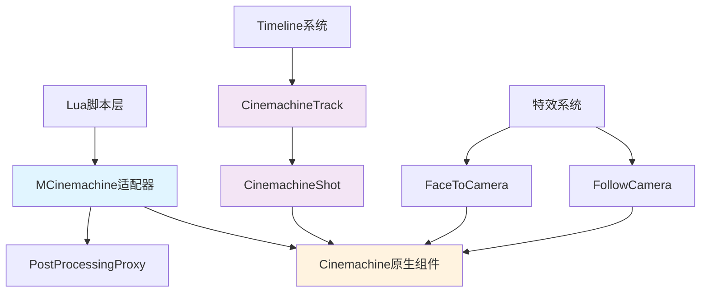
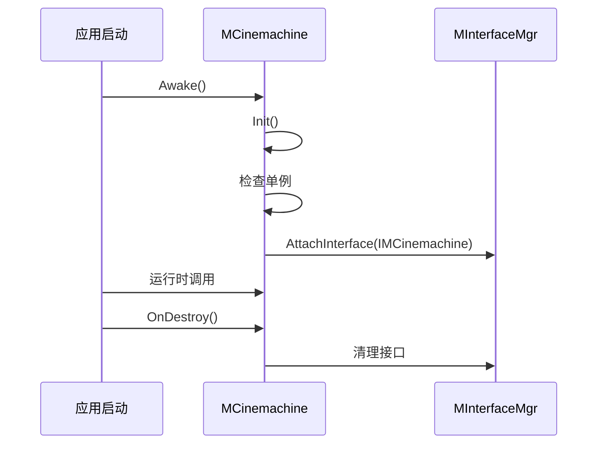
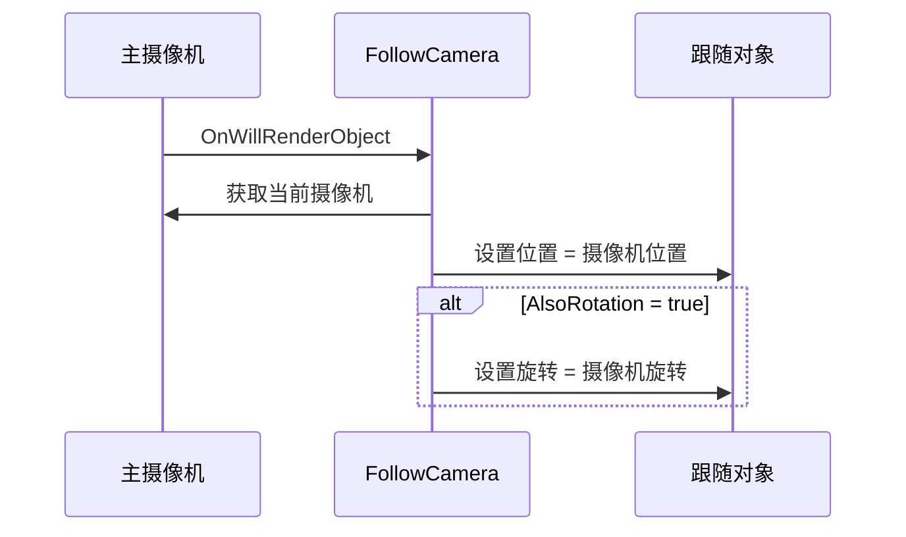
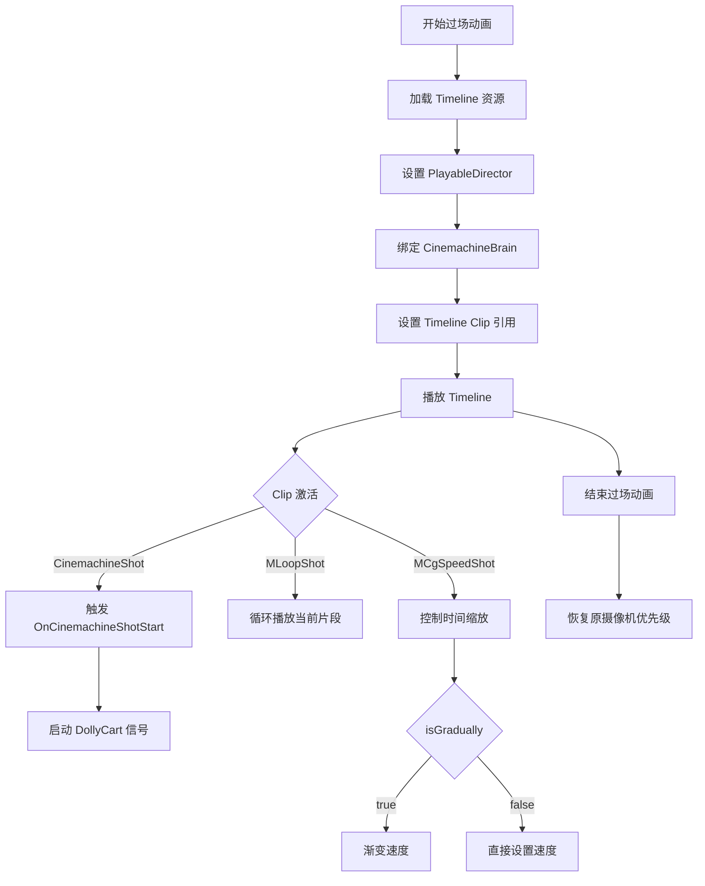
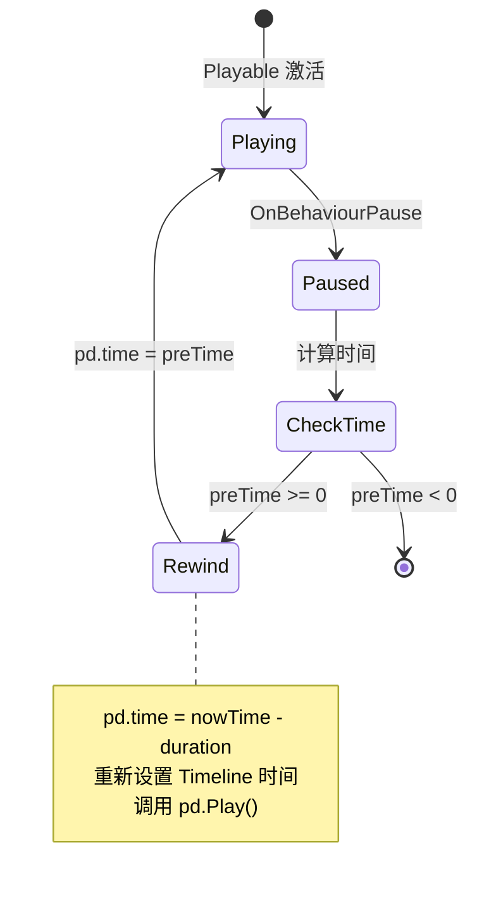

本文档详细介绍了 Unity3D RO 项目中 Cinemachine 摄像机系统的架构、API 使用方法以及与 Timeline 的集成方式。该项目通过 MCinemachine 适配器层封装了 Cinemachine 的核心功能，为 Lua 脚本和 C# 代码提供了统一的摄像机控制接口。

## 系统架构概览

Cinemachine 摄像机系统采用分层架构设计，核心包括 Cinemachine 原生组件、项目封装层（MCinemachine）和 Timeline 集成层。这种设计实现了游戏逻辑与摄像机控制的解耦，同时支持过场动画和实时游戏场景的摄像机切换。

Sources: [MCinemachine.cs](Scripts/Cinemachine/MCinemachine.cs#L1-L50)

### 架构层次关系



### 核心组件职责

| 组件 | 职责 | 文件位置 |
|------|------|----------|
| **MCinemachine** | Cinemachine API 适配器，提供 C# 和 Lua 接口 | [Scripts/Cinemachine/MCinemachine.cs](Scripts/Cinemachine/MCinemachine.cs) |
| **CinemachineBrain** | 摄像机大脑，负责管理和切换虚拟摄像机 | [Cinemachine/Base/Runtime/Behaviours/CinemachineBrain.cs](Cinemachine/Base/Runtime/Behaviours/CinemachineBrain.cs) |
| **CinemachineVirtualCamera** | 虚拟摄像机，定义摄像机行为 | [Cinemachine/Base/Runtime/Behaviours/CinemachineVirtualCamera.cs](Cinemachine/Base/Runtime/Behaviours/CinemachineVirtualCamera.cs) |
| **PostProcessingProxy** | 后处理效果代理，处理临时后处理效果 | [Scripts/PostProcessing/PostProcessingProxy.cs](Scripts/PostProcessing/PostProcessingProxy.cs) |
| **CinemachineTrack** | Timeline 轨道，用于过场动画摄像机控制 | [Cinemachine/Timeline/CinemachineTrack.cs](Cinemachine/Timeline/CinemachineTrack.cs) |

## MCinemachine 适配器核心 API

MCinemachine 采用单例模式，通过 MInterfaceMgr 注册为 IMCinemachine 接口，提供了完整的摄像机管理功能。

Sources: [MCinemachine.cs](Scripts/Cinemachine/MCinemachine.cs#L15-L30)

### 初始化与生命周期



### 基础摄像机管理

**添加/删除 CinemachineBrain**

CinemachineBrain 是物理摄像机上的核心组件，负责接收所有虚拟摄像机的输入并计算出最终的摄像机状态。

Sources: [MCinemachine.cs](Scripts/Cinemachine/MCinemachine.cs#L42-L58)

```csharp
// 添加 CinemachineBrain 到指定 GameObject
public void AddCinemachineBrain(GameObject go)
{
    if (!go.GetComponent<CinemachineBrain>())
    {
        go.AddComponent<CinemachineBrain>();
    }
}

// 删除 CinemachineBrain
public void DeleteCinemachineBrain(GameObject go)
{
    CinemachineBrain comp = go.GetComponent<CinemachineBrain>();
    if (comp)
    {
        GameObject.DestroyImmediate(comp);
    }
}
```

**添加/删除虚拟摄像机**

虚拟摄像机定义了不同的镜头视角和行为，通过优先级（Priority）系统进行自动切换。

Sources: [MCinemachine.cs](Scripts/Cinemachine/MCinemachine.cs#L60-L75)

```csharp
// 添加虚拟摄像机
public void AddCinemachineVirtualCamera(GameObject go)
{
    if (!go.GetComponent<CinemachineVirtualCamera>())
    {
        go.AddComponent<CinemachineVirtualCamera>();
    }
}

// 设置虚拟摄像机优先级（数值越高优先级越高）
public void SetCinemachinePriority(GameObject camGo, int priority)
{
    if (camGo == null) return;
    var virCam = camGo.GetComponent<CinemachineVirtualCamera>();
    if (virCam == null) return;
    virCam.Priority = priority;
}
```

**设置跟随与注视目标**

虚拟摄像机可以跟随目标对象移动，或者始终注视目标对象，这是游戏摄像机系统的核心功能。

Sources: [MCinemachine.cs](Scripts/Cinemachine/MCinemachine.cs#L688-L710)

```csharp
// 设置摄像机跟随目标
public void AddCinemachineFollow(GameObject camGo, GameObject followGo)
{
    if (camGo == null || followGo == null) return;
    var virCam = camGo.GetComponent<CinemachineVirtualCamera>();
    if (virCam == null) return;
    virCam.Follow = followGo.transform;
}

// 设置摄像机注视目标
public void AddCinemachineLook(GameObject camGo, GameObject lookGo)
{
    if (camGo == null || lookGo == null) return;
    var virCam = camGo.GetComponent<CinemachineVirtualCamera>();
    if (virCam == null) return;
    virCam.LookAt = lookGo.transform;
}
```

### 路径摄像机系统

项目支持基于路径的摄像机运动，通过 CinemachinePath 和 CinemachineDollyCart 实现平滑的镜头移动效果，常用于过场动画和电影级运镜。

Sources: [MCinemachine.cs](Scripts/Cinemachine/MCinemachine.cs#L542-L580)


**创建路径摄像机**

Sources: [MCinemachine.cs](Scripts/Cinemachine/MCinemachine.cs#L542-L580)

```csharp
// 根据配置创建路径
public Component CreateCinemachinePathByConfig(
    GameObject go, 
    Vector3[] positions, 
    Vector3[] tangents, 
    float[] rolls, 
    int resolution)
{
    var path = go.AddComponent<CinemachinePath>();
    var length = positions.Length;
    path.m_Waypoints = new CinemachinePath.Waypoint[length];
    
    for (int i = 0; i < length; i++)
    {
        path.m_Waypoints[i].position = positions[i];
        path.m_Waypoints[i].tangent = tangents[i];
        path.m_Waypoints[i].roll = rolls[i];
    }
    path.m_Looped = false;
    path.m_Resolution = Mathf.Max(resolution, 1);
    
    return path;
}

// 将路径绑定到虚拟摄像机
public void AddCinemachinePath(GameObject camGo, GameObject pathGo)
{
    if (camGo == null || pathGo == null) return;
    CinemachineVirtualCamera virCam = camGo.GetComponent<CinemachineVirtualCamera>();
    if (virCam == null) return;
    CinemachineTrackedDolly dolly = virCam.GetCinemachineComponent<CinemachineTrackedDolly>();
    if (dolly)
    {
        CinemachinePath cPath = pathGo.GetComponent<CinemachinePath>();
        if (cPath)
        {
            dolly.m_Path = cPath;
        }
    }
}
```

**DollyCart 运动控制**

Sources: [MCinemachine.cs](Scripts/Cinemachine/MCinemachine.cs#L526-L541)

```csharp
// 添加 DollyCart 到对象
public void AddCinemachineDollyCart(
    GameObject go, 
    int updateMethod, 
    int positionUnits, 
    float speed, 
    AnimationCurve curve,
    float totalTime)
{
    var com = go.AddComponent<CinemachineDollyCart>();
    com.m_PositionUnits = (CinemachinePathBase.PositionUnits)positionUnits;
    com.m_UpdateMethod = (CinemachineDollyCart.UpdateMethod)updateMethod;
    com.m_Speed = speed;
    com.ActiveCurveCtrl = curve != null;
    
    com.Signal = true;
    if (!com.ActiveCurveCtrl) return;
    
    com.CurveCtrl = new CinemachineDollyCartCtrlCurve()
    {
        Curve = curve,
        TotalTime = totalTime
    };
    com.Signal = false;
}
```

### Timeline 集成

项目通过自定义的 Timeline 轨道和剪辑实现了过场动画中的摄像机控制，支持与动画、Spine 动画等其他 Timeline 轨道的协同工作。

Sources: [MCinemachine.cs](Scripts/Cinemachine/MCinemachine.cs#L134-L148)

**轨道类型识别**

```csharp
public enum TrackType
{
    Animation,
    Cinemachine,
    MAnimation,
    SpineAnimation,
    SpineFlip,
}

// 判断是否为 Cinemachine 轨道
public bool IsCinemachineTrack(TrackAsset ta)
{
    return (ta is CinemachineTrack);
}
```

**Timeline 绑定设置**

Sources: [MCinemachine.cs](Scripts/Cinemachine/MCinemachine.cs#L150-L170)

```csharp
// 设置 CinemachineBrain 绑定到 Timeline
public void SetGenericBinding(PlayableDirector pd, TrackAsset track, GameObject mainCam)
{
    pd.SetGenericBinding(track, mainCam.GetComponent<CinemachineBrain>());
}

// 设置不同类型轨道的绑定对象
public void SetGenericBinding(PlayableDirector pd, TrackAsset track, GameObject go, int trackType)
{
    TrackType type = (TrackType)trackType;
    if (type == TrackType.SpineAnimation)
    {
        pd.SetGenericBinding(track, go.GetComponent<SkeletonAnimation>());
    }
    else if (type == TrackType.SpineFlip)
    {
        pd.SetGenericBinding(track, go.GetComponent<SkeletonAnimationPlayableHandle>());
    }
}

// 设置 Timeline Clip 的引用值
public void SetReferenceValue(PlayableDirector pd, TimelineClip tlc, GameObject go)
{
    CinemachineShot cms = tlc.asset as CinemachineShot;
    pd.SetReferenceValue(cms.VirtualCamera.exposedName, go.GetComponent<CinemachineVirtualCamera>());
}
```

**自定义 Shot 类型**

项目扩展了 CinemachineShot 以支持特殊效果，如循环播放和速度控制。

Sources: [MLoopShot.cs](Scripts/RoTimeline/Shot/MLoopShot.cs#L1-L37)

| Shot 类型 | 功能 | 文件位置 |
|-----------|------|----------|
| **CinemachineShot** | 基础摄像机镜头，支持虚拟摄像机切换 | [Cinemachine/Timeline/CinemachineShot.cs](Cinemachine/Timeline/CinemachineShot.cs) |
| **MLoopShot** | 循环播放镜头 | [Scripts/RoTimeline/Shot/MLoopShot.cs](Scripts/RoTimeline/Shot/MLoopShot.cs) |
| **MCgSpeedShot** | 过场动画速度控制镜头 | [Scripts/RoTimeline/Shot/MCgSpeedShot.cs](Scripts/RoTimeline/Shot/MCgSpeedShot.cs) |

### 后处理效果集成

项目使用 PostProcessingProxy 作为后处理效果的统一入口，支持灰度、径向模糊、波浪扭曲等多种效果，这些效果与 Cinemachine 摄像机系统紧密集成。

Sources: [PostProcessingProxy.cs](Scripts/PostProcessing/PostProcessingProxy.cs#L1-L50)

**灰度效果**

Sources: [MCinemachine.cs](Scripts/Cinemachine/MCinemachine.cs#L295-L335)

```csharp
// 设置灰度强度
public void SetRoGrayScaleStrength(GameObject go, float val)
{
    var ppp = go.GetComponent<PostProcessingProxy>();
    if (!ppp)
    {
        ppp = go.AddComponent<PostProcessingProxy>();
    }
    ppp.Desaturate(val);
}

// 设置灰度曝光
public void SetRoGrayScaleExposure(GameObject go, float val)
{
    var ppp = go.GetComponent<PostProcessingProxy>();
    if (!ppp)
    {
        ppp = go.AddComponent<PostProcessingProxy>();
    }
    ppp.Exposure(val);
}
```

**径向模糊效果**

Sources: [MCinemachine.cs](Scripts/Cinemachine/MCinemachine.cs#L375-L415)

```csharp
// 设置径向模糊强度
public void SetRoRadialBlurStrength(GameObject go, float val)
{
    var ppp = go.GetComponent<PostProcessingProxy>();
    if (!ppp)
    {
        ppp = go.AddComponent<PostProcessingProxy>();
    }
    ppp._rbStrength = val;
    ppp.RadialBlur();
}

// 设置径向模糊扩散距离
public void SetRoRadialBlurSpread(GameObject go, float val)
{
    var ppp = go.GetComponent<PostProcessingProxy>();
    if (!ppp)
    {
        ppp = go.AddComponent<PostProcessingProxy>();
    }
    ppp._rbDistance = val;
    ppp.RadialBlur();
}
```

**波浪扭曲效果**

Sources: [MCinemachine.cs](Scripts/Cinemachine/MCinemachine.cs#L337-L373)

```csharp
// 设置波浪扭曲强度
public void SetRoWaveDistortStrength(GameObject go, float val)
{
    var ppp = go.GetComponent<PostProcessingProxy>();
    if (!ppp)
    {
        ppp = go.AddComponent<PostProcessingProxy>();
    }
    ppp.WaveDistort(val);
}

// 设置波浪扭曲密度
public void SetRoWaveDistortDensity(GameObject go, float val)
{
    var ppp = go.GetComponent<PostProcessingProxy>();
    if (!ppp)
    {
        ppp = go.AddComponent<PostProcessingProxy>();
    }
    ppp._wvDensity = val;
    ppp.WaveDistort();
}
```

### 摄像机特效组件

项目提供了多种摄像机特效组件，用于实现跟随摄像机、面向摄像机等常见效果。

Sources: [FollowCamera.cs](Scripts/Effects/FollowCamera.cs#L1-L54)

**FollowCamera 组件**

使游戏对象跟随主摄像机移动，适用于 UI 元素、HUD 显示等需要与摄像机同步的场景。

| 属性 | 类型 | 说明 |
|------|------|------|
| **AlsoRotation** | bool | 是否同步旋转 |

**实现原理**



Sources: [FollowCamera.cs](Scripts/Effects/FollowCamera.cs#L1-L54)

**FollowCameraObj 组件**

使用 MEffectUpdater 更新机制实现的跟随摄像机组件，与 FollowCamera 类似但使用不同的更新策略。

Sources: [FollowCameraObj.cs](Scripts/Effects/FollowCameraObj.cs#L1-L62)

**FaceToCamera 组件**

使游戏对象始终面向或对齐摄像机方向，适用于 Billboard 效果、提示文本等需要始终面向玩家的对象。

Sources: [FaceToCamera.cs](Scripts/Effects/FaceToCamera.cs#L1-L65)

| 模式 | 说明 |
|------|------|
| **Align** | 对齐摄像机的前方方向 |
| **FaceTo** | 面向摄像机位置 |

```csharp
public enum Mode : byte
{
    Align = 0,
    FaceTo = 1
}

public Mode mode = Mode.Align;
public bool lockYUp = false;  // 锁定 Y 轴向上
```

## 过场动画摄像机工作流

过场动画使用 Timeline 系统，通过 CinemachineTrack 控制摄像机切换和运动，配合其他轨道实现复杂的电影级效果。

Sources: [CinemachineShot.cs](Cinemachine/Timeline/CinemachineShot.cs#L1-L76)

### Timeline 摄像机控制流程



### 自定义 Shot 实现

**CinemachineShot 扩展**

项目扩展了原生的 CinemachineShot，添加了对 DollyCart 的自动控制支持。

Sources: [CinemachineShot.cs](Cinemachine/Timeline/CinemachineShot.cs#L17-L45)

```csharp
internal sealed class CinemachineShotPlayable : PlayableBehaviour
{
    public CinemachineVirtualCameraBase VirtualCamera;
    private ICutSceneShotHelper _helper;
    private IMCinemachine _proxy;

    public override void OnBehaviourPlay(Playable playable, FrameData info)
    {
        base.OnBehaviourPlay(playable, info);
        
        _proxy = MInterfaceMgr.singleton.GetInterface<IMCinemachine>(
            MCommonFunctions.GetHash("MCinemachine"));

        if (Application.isPlaying)
        {
            // 运行时触发 DollyCart
            _proxy.OnCinemachineShotStart(VirtualCamera.gameObject);
        }
        else
        {
            // 编辑器模式下更新预览
            _helper = MInterfaceMgr.singleton.GetInterface<ICutSceneShotHelper>(
                MCommonFunctions.GetHash("MCutSceneShotHelper"));
            _helper?.ResetCinemachineDollyCart(VirtualCamera.transform, 
                (float)(playable.GetTime()));
        }
    }
}
```

**循环 Shot (MLoopShot)**

实现 Timeline 片段的循环播放功能，当播放结束时自动回到片段开始位置。

Sources: [MLoopShot.cs](Scripts/RoTimeline/Shot/MLoopShot.cs#L1-L37)



## 编辑器工具与调试

项目提供了摄像机调试工具，方便开发者在编辑器中调整和测试摄像机参数。

Sources: [CameraDebugToolsEditor.cs](artres/Editor/Camera/CameraDebugToolsEditor.cs#L1-L100)

### CameraDebugTools 功能

| 功能 | 说明 |
|------|------|
| **RotX/RotY** | 当前摄像机旋转角度 |
| **DesRotX/DesRotY** | 目标旋转角度 |
| **Dis/DesDis** | 当前距离和目标距离 |
| **Min/MaxCameraRot** | 旋转角度限制范围 |
| **Min/MaxCameraDis** | 距离限制范围 |
| **SpeedDis/SpeedRot** | 移动和旋转速度配置 |

### 视口检查工具

Viewport 检查工具用于记录和验证摄像机视口内的对象，帮助优化摄像机角度和遮挡处理。

Sources: [Viewport](artres/Editor/Camera/Viewport/ViewPortInfo.json)

## 最佳实践与注意事项

### 摄像机优先级管理

在多个虚拟摄像机共存时，通过优先级控制当前激活的摄像机。优先级数值越高，摄像机权重越大。

```csharp
// 过场动画时提升过场摄像机优先级
public void EnableCutSceneCamera(GameObject cutSceneCam)
{
    SetCinemachinePriority(cutSceneCam, 100);
}

// 过场动画结束后恢复游戏摄像机
public void RestoreGameCamera(GameObject gameCam)
{
    SetCinemachinePriority(gameCam, 10);
    SetCinemachinePriority(cutSceneCam, 0);
}
```

### 性能优化建议

1. **避免频繁切换摄像机**：使用 CinemachineBlendListCamera 或 CinemachineStateDrivenCamera 管理多摄像机切换
2. **合理设置路径分辨率**：CinemachinePath 的 Resolution 参数影响性能，根据实际需要设置
3. **后处理效果按需开启**：PostProcessingProxy 设计为临时效果，使用后及时清理
4. **编辑器预览优化**：使用 CutSceneShotHelper 的预览功能在编辑器中提前验证摄像机运动

### 与其他系统的集成

Cinemachine 系统需要与项目的其他核心系统配合使用：

Sources: [MCutSceneShotHelper.cs](Scripts/CutScene/MCutSceneShotHelper.cs#L1-L200)

| 系统 | 集成点 | 说明 |
|------|--------|------|
| **过场动画系统** | MCutSceneShotHelper | 协调摄像机与角色动画、特效的同步 |
| **特效系统** | FollowCamera, FaceToCamera | 特效对象需要与摄像机同步 |
| **后处理系统** | PostProcessingProxy | 摄像机切换时的过渡效果 |
| **Timeline 系统** | CinemachineTrack | 过场动画的时间轴控制 |

## 扩展与自定义

### 添加新的后处理效果

通过扩展 PostProcessingProxy 可以添加项目特定的后处理效果。

Sources: [PostProcessingProxy.cs](Scripts/PostProcessing/PostProcessingProxy.cs#L1-L129)

```csharp
// 在 PostProcessingProxy 中添加新效果参数
public float _customStrength = 0;
public Vector2 _customCenter = new Vector2(0.5f, 0.5f);

public void CustomEffect(float strength, Vector2 center)
{
    _customStrength = strength;
    _customCenter = center;
    RoPost?.CustomEffect(strength, center.x, center.y);
}
```

### 自定义 Timeline Shot

继承 PlayableAsset 创建自定义 Shot，在 MCinemachine 中添加对应的识别和控制方法。

Sources: [MCgSpeedShot.cs](Scripts/RoTimeline/Shot/MCgSpeedShot.cs#L1-L76)

```csharp
// 创建自定义 Shot
public class MCustomShot : PlayableAsset
{
    public float customParameter;
    
    public override Playable CreatePlayable(PlayableGraph graph, GameObject go)
    {
        var playable = ScriptPlayable<MCustomShotPlayable>.Create(graph);
        var behav = playable.GetBehaviour();
        behav.customParameter = customParameter;
        return playable;
    }
}

// 在 MCinemachine 中添加识别方法
public bool IsCustomShot(TimelineClip tlc)
{
    return (tlc.asset is MCustomShot);
}
```

## 相关文档

要深入了解项目的其他系统，可以参考以下文档：

- **Timeline 与过场动画**：了解 Timeline 系统的完整架构和使用方法
- **DOTween 动画补间**：学习与摄像机动画配合的补间动画系统
- **PostProcessing 后处理**：深入了解后处理效果的实现细节
- **FMOD 音频系统**：了解摄像机与音频监听器的集成

通过合理使用 Cinemachine 摄像机系统，可以为玩家提供流畅、电影级的游戏体验。在实际开发中，建议根据具体场景选择合适的摄像机类型和配置，充分利用 Cinemachine 的自动智能功能来减少手动调整的工作量。