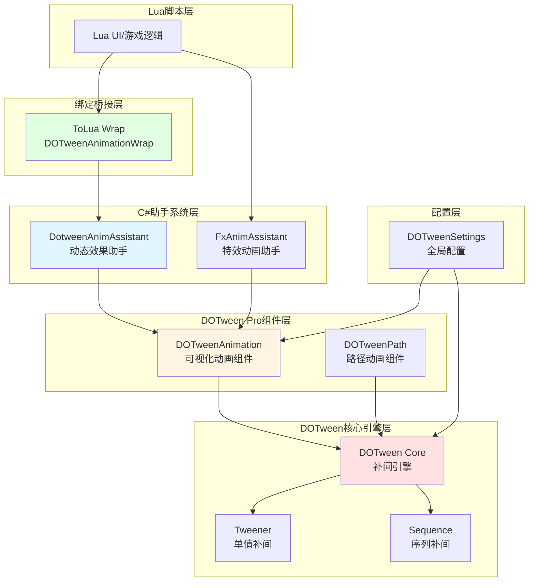
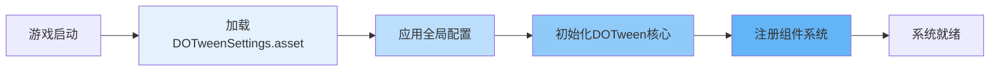
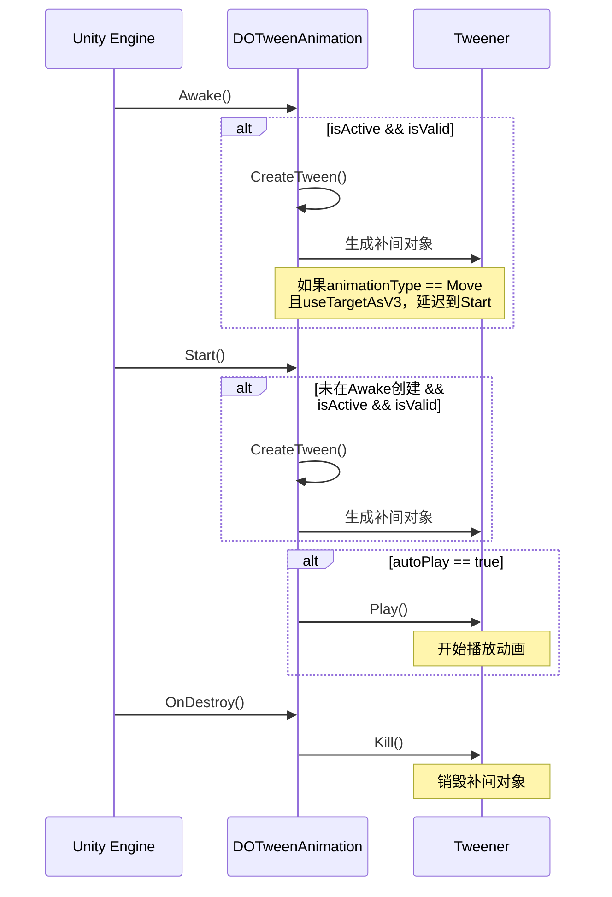
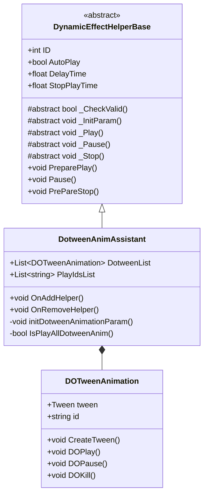

DOTween（Demigiant Tween）是一个高效、类型安全的Unity补间动画引擎，该项目中集成了DOTween核心库和DOTween Pro扩展，通过自定义的助手系统实现了与Lua脚本引擎的深度集成。本页涵盖DOTween在项目中的架构设计、配置机制、助手系统以及C#与Lua混合开发的最佳实践。

Sources: [DOTweenSettings.asset](Resources/DOTweenSettings.asset#L1-L32), [readme.txt](Demigiant/DOTween/readme.txt#L1-L18)

## 架构概览

项目中的DOTween采用了分层架构设计，核心补间引擎与项目特定的助手系统相结合，实现了灵活的动画管理和Lua跨语言调用能力。架构从底层的DOTween引擎，到中间层的DOTweenAnimation组件，再到上层的DotweenAnimAssistant助手，形成了一个完整的动画解决方案。



**核心层次说明**：
- **配置层**：通过 `DOTweenSettings.asset` 管理全局行为，包括时间缩放、自动播放、缓动类型等默认设置
- **DOTween核心引擎层**：提供基础的Tweener（单值补间）和Sequence（序列补间）能力，支持高性能的属性插值
- **DOTween Pro组件层**：`DOTweenAnimation` 提供可视化编辑器配置，支持Inspector中直接设置动画参数
- **助手系统层**：`DotweenAnimAssistant` 封装了多个DOTweenAnimation的协同播放、参数传递和生命周期管理
- **Lua绑定桥接层**：通过ToLua自动生成的Wrap代码，使Lua脚本能够调用DOTweenAnimation的所有公开API

Sources: [readme.txt](Demigiant/DOTweenPro/readme.txt#L1-L25), [DOTweenAnimation.cs](Demigiant/DOTweenPro/DOTweenAnimation.cs#L1-L56)

## 全局配置

项目中的DOTween全局配置存储在 `Resources/DOTweenSettings.asset` 中，该配置在游戏启动时自动加载，影响所有补间动画的默认行为。

### 配置参数详解

| 配置项 | 值 | 说明 | 影响 |
|--------|-----|------|------|
| useSafeMode | 1 | 启用安全模式 | 防止非法操作导致崩溃，添加运行时检查 |
| timeScale | 1 | 时间缩放系数 | 全局控制动画播放速度，1为正常速度 |
| useSmoothDeltaTime | 0 | 是否使用平滑DeltaTime | 0表示使用标准Time.deltaTime |
| logBehaviour | 2 | 日志行为 | 2表示仅错误和警告 |
| drawGizmos | 1 | 绘制Gizmos | 在Scene视图中显示动画路径 |
| defaultRecyclable | 0 | 默认可回收性 | 0表示补间对象不自动回收 |
| defaultAutoPlay | 3 | 默认自动播放 | 3表示All（所有补间自动播放） |
| defaultUpdateType | 0 | 更新类型 | 0表示Normal（跟随Time.timeScale） |
| defaultEaseType | 6 | 默认缓动类型 | 6表示OutQuad（二次缓出） |
| defaultAutoKill | 1 | 默认自动结束 | 1表示动画完成后自动销毁 |
| defaultLoopType | 0 | 默认循环类型 | 0表示Restart（重新开始） |
| storeSettingsLocation | 0 | 设置存储位置 | 0表示Resources |

Sources: [DOTweenSettings.asset](Resources/DOTweenSettings.asset#L1-L32)

### 配置初始化流程



配置文件中的 `defaultEaseType: 6` 对应 `Ease.OutQuad`，这是一个常用的缓动函数，使动画在开始时快速移动，在结束时平滑减速。`defaultAutoPlay: 3` 表示所有补间动画创建后立即自动播放，无需手动调用 `Play()` 方法。

Sources: [DOTweenSettings.asset](Resources/DOTweenSettings.asset#L15-L28), [DOTween.XML](Demigiant/DOTween/DOTween.XML#L8-L31)

## DOTweenAnimation组件

`DOTweenAnimation` 是DOTween Pro提供的可视化动画组件，可直接挂载在GameObject上，通过Inspector面板配置动画参数。这是项目中最常用的动画配置方式，无需编写代码即可创建复杂的补间动画。

### 组件核心属性

| 属性 | 类型 | 说明 | 示例值 |
|------|------|------|--------|
| delay | float | 延迟播放时间（秒） | 0.5f |
| duration | float | 动画持续时间（秒） | 1.0f |
| easeType | Ease | 缓动类型 | OutQuad |
| loopType | LoopType | 循环类型 | Restart |
| loops | int | 循环次数 | 1 |
| id | string | 动画唯一标识符 | "openAnim" |
| isRelative | bool | 是否相对值 | false |
| isFrom | bool | 是否从目标值开始 | false |
| autoKill | bool | 播放完成是否自动销毁 | true |
| animationType | DOTweenAnimationType | 动画类型 | Move |
| targetType | TargetType | 目标类型 | Transform |

### 支持的动画类型

`DOTweenAnimation` 支持多种目标类型和动画类型的组合，覆盖了Unity开发中的常见需求：

| 动画类型 | TargetType | 应用场景 |
|----------|-----------|----------|
| Move | Transform, RectTransform, Rigidbody2D, Rigidbody | 对象位置移动 |
| LocalMove | Transform | 局部坐标移动 |
| Rotate | Transform, Rigidbody2D | 对象旋转 |
| Scale | Transform, RectTransform | 对象缩放 |
| Color | Material, SpriteRenderer, Light, Image, Text | 颜色渐变 |
| Fade | CanvasGroup, Image, Text, SpriteRenderer | 透明度渐变 |
| Text | Text, TextMeshPro | 文本内容打字机效果 |
| Punch | Transform | 位置/旋转/缩放冲击效果 |
| Shake | Transform, Camera | 震动效果 |

Sources: [DOTweenAnimation.cs](Demigiant/DOTweenPro/DOTweenAnimation.cs#L26-L87)

### 组件生命周期

DOTweenAnimation组件遵循Unity标准生命周期，但增加了补间动画特有的初始化和管理逻辑：



在 `CreateTween()` 方法中，根据 `animationType` 和 `targetType` 调用相应的DOTween扩展方法创建补间。例如，`Move` 类型会根据目标类型调用 `DOMove()`、`DOAnchorPos3D()` 或 `DOMove()` 针对Rigidbody的方法。

Sources: [DOTweenAnimation.cs](Demigiant/DOTweenPro/DOTweenAnimation.cs#L90-L150)

## DotweenAnimAssistant助手系统

`DotweenAnimAssistant` 是项目自定义的动画管理助手，继承自 `DynamicEffectHelperBase` 基类。它封装了一个或多个 `DOTweenAnimation` 组件，提供了统一的播放控制接口和Lua参数传递能力。

### 助手系统架构



助手系统通过反射和特性标记，自动将Lua传递的参数映射到DOTweenAnimation组件的属性上，实现了灵活的动态配置。

Sources: [DotweenAnimAssistant.cs](Scripts/DynamicEffectHelps/DotweenAnimAssistant.cs#L1-L35), [DynamicEffectHelperBase.cs](Scripts/DynamicEffectHelps/DynamicEffect/DynamicEffectHelperBase.cs#L1-L70)

### Lua参数映射机制

DotweenAnimAssistant使用 `[ExtendField]` 特性定义可从Lua传递的参数，参数命名规则为 `属性名_动画ID`，支持对单个GameObject上的多个DOTweenAnimation组件分别配置。

| Lua参数 | 类型 | 对应DOTweenAnimation属性 | 说明 |
|---------|------|-------------------------|------|
| playDotweenIds | string | - | 逗号分隔的动画ID列表，如 "1,2" |
| isFrom_{id} | bool | isFrom | From/To模式切换 |
| endValueFloat_{id} | float | endValueFloat | float类型动画的最终值 |
| endValueV3_{id} | Vector3 | endValueV3 | 位置/缩放等Vector3动画的最终值 |
| endValueV2_{id} | Vector2 | endValueV2 | RectTransform锚点等Vector2动画的最终值 |
| endValueColor_{id} | Color | endValueColor | 颜色动画的最终值 |
| endValueString_{id} | string | endValueString | 文本动画的最终值 |
| endValueRect_{id} | Rect | endValueRect | Rect类型动画的最终值 |
| endValueTransform_{id} | Transform | endValueTransform | Move动画的目标Transform |
| optionalBool0_{id} | bool | optionalBool0 | 布尔型可选参数 |
| optionalFloat0_{id} | float | optionalFloat0 | 浮点型可选参数 |
| optionalInt0_{id} | int | optionalInt0 | 整型可选参数 |
| optionalString_{id} | string | optionalString | 字符串型可选参数 |
| completeCallback_{id} | LuaFunction | tween.onComplete | 动画完成回调 |
| autoRewind_{id} | bool | - | 参数变更时是否自动恢复初始位置 |

Sources: [DotweenAnimAssistant.cs](Scripts/DynamicEffectHelps/DotweenAnimAssistant.cs#L1-L33)

### 参数初始化流程

```mermaid
flowchart TD
    Start[Lua调用PreparePlay] --> ParseParams[解析playDotweenIds参数]
    ParseParams --> SplitIds[拆分为ID列表]
    SplitIds --> Loop{遍历DotweenList}
    
    Loop --> CheckID{ID在PlayIdsList中?}
    CheckID -->|是| InitSingle[初始化单个DOTweenAnimation]
    CheckID -->|否| NextAnim[下一个动画]
    
    InitSingle --> TryIsFrom[尝试获取isFrom_{id}]
    InitSingle --> TryEndFloat[尝试获取endValueFloat_{id}]
    InitSingle --> TryEndV3[尝试获取endValueV3_{id}]
    InitSingle --> TryEndColor[尝试获取endValueColor_{id}]
    InitSingle --> TryOther[尝试获取其他参数]
    InitSingle --> TryCallback[尝试获取completeCallback_{id}]
    
    TryIsFrom --> CheckChange{参数有变化?}
    TryEndFloat --> CheckChange
    TryEndV3 --> CheckChange
    TryEndColor --> CheckChange
    TryOther --> CheckChange
    TryCallback --> CheckChange
    
    CheckChange -->|是| Rewind[调用Rewind恢复初始位置]
    Rewind --> KillOld[调用Kill销毁旧补间]
    KillOld --> CreateNew[调用CreateTween创建新补间]
    CreateNew --> SetCallback[设置onComplete回调]
    SetCallback --> NextAnim
    
    CheckChange -->|否| NextAnim
    NextAnim --> Loop
    
    Loop -->|完成| PlayAll[调用Play播放所有动画]
    
    style InitSingle fill:#e3f2fd
    style CreateNew fill:#c8e6c9
    style PlayAll fill:#fff9c4
```

当Lua传递的参数与DOTweenAnimation的当前值不一致时，助手会自动执行 `Rewind()` 恢复初始状态，然后销毁旧补间并重新创建，最后设置新的回调函数。这确保了运行时修改动画参数后的正确行为。

Sources: [DotweenAnimAssistant.cs](Scripts/DynamicEffectHelps/DotweenAnimAssistant.cs#L40-L120)

### 播放控制方法

助手系统继承自 `DynamicEffectHelperBase`，提供了完整的播放控制接口：

| 方法 | 说明 | 实现逻辑 |
|------|------|----------|
| `_Play()` | 播放动画 | 遍历DotweenList，对匹配ID的动画调用 `tween.Restart()` |
| `_Pause()` | 暂停动画 | 遍历DotweenList，对匹配ID的动画调用 `tween.Pause()` |
| `_Stop()` | 停止动画 | 遍历DotweenList，对匹配ID的动画调用 `tween.Complete(true)` |
| `_CheckValid()` | 验证数据 | 检查DotweenList是否为空 |
| `_InitParam()` | 初始化参数 | 解析Lua参数并应用到各个DOTweenAnimation |

`IsPlayAllDotweenAnim()` 方法用于判断是否播放所有动画：当 `PlayIdsList` 为空或null时返回true，否则只播放ID列表中指定的动画。这提供了灵活的动画组合控制能力。

Sources: [DotweenAnimAssistant.cs](Scripts/DynamicEffectHelps/DotweenAnimAssistant.cs#L200-L260)

## Lua集成

项目使用ToLua框架实现C#与Lua的互操作，DOTweenAnimation的所有公开方法和属性都已自动绑定，Lua脚本可以直接调用。

### ToLua绑定结构

`DG_Tweening_DOTweenAnimationWrap.cs` 是由ToLua自动生成的绑定代码，暴露了DOTweenAnimation的完整API：

```csharp
L.BeginClass(typeof(DG.Tweening.DOTweenAnimation), typeof(DG.Tweening.Core.ABSAnimationComponent));
L.RegFunction("CreateTween", CreateTween);
L.RegFunction("DOPlay", DOPlay);
L.RegFunction("DOPause", DOPause);
L.RegFunction("DORewind", DORewind);
L.RegFunction("DORestart", DORestart);
L.RegFunction("DOComplete", DOComplete);
L.RegVar("delay", get_delay, set_delay);
L.RegVar("duration", get_duration, set_duration);
L.RegVar("easeType", get_easeType, set_easeType);
L.EndClass();
```

绑定的方法包括播放控制、属性访问和参数设置等完整功能集。

Sources: [DG_Tweening_DOTweenAnimationWrap.cs](Source/Generate/DG_Tweening_DOTweenAnimationWrap.cs#L1-L60)

### Lua调用示例

#### 基础动画播放

```lua
-- 获取DOTweenAnimation组件
local dotweenAnim = gameObject:GetComponent("DOTweenAnimation")

-- 直接播放
dotweenAnim:DOPlay()

-- 暂停
dotweenAnim:DOPause()

-- 重播
dotweenAnim:DORestart()

-- 立即完成
dotweenAnim:DOComplete()
```

#### 通过助手系统播放

```lua
-- 获取DotweenAnimAssistant组件
local assistant = gameObject:GetComponent("DotweenAnimAssistant")

-- 构建参数表
local params = {
    -- 播放ID为1和2的动画
    playDotweenIds = "1,2",
    
    -- 设置动画1的参数
    isFrom_1 = true,
    endValueFloat_1 = 1.0,
    
    -- 设置动画2的参数
    endValueV3_2 = Vector3(100, 0, 0),
    autoRewind_2 = true,
    
    -- 完成回调
    completeCallback_2 = function()
        print("动画2播放完成")
    end,
    
    -- 延迟播放0.5秒
    delayTime = 0.5
}

-- 准备并播放
assistant:PreparePlay(params)
```

#### 动态修改动画参数

```lua
-- 运行时修改动画参数
local params = {
    playDotweenIds = "fadeAnim",
    endValueFloat_fadeAnim = 0.0,  -- 渐变到透明
    duration = 0.5
}

assistant:PreparePlay(params)
```

Sources: [DG_Tweening_DOTweenAnimationWrap.cs](Source/Generate/DG_Tweening_DOTweenAnimationWrap.cs#L61-L100)

## 使用场景与最佳实践

### UI界面过渡动画

DOTween在项目中主要用于UI界面的过渡效果，通过DotweenAnimAssistant实现灵活的动画配置和播放。

```lua
-- 窗口打开动画
local panel = gameObject.transform:Find("Panel")
local assistant = panel:GetComponent("DotweenAnimAssistant")

if assistant then
    assistant:PreparePlay({
        playDotweenIds = "open",
        endValueV3_open = Vector3(1, 1, 1),  -- 缩放到正常大小
        completeCallback_open = function()
            print("窗口打开完成")
        end
    })
end
```

### 参数传递规范

通过助手系统传递参数时，应遵循以下规范：

| 规范 | 说明 | 示例 |
|------|------|------|
| ID命名 | DOTweenAnimation的id属性应简洁明了 | "fadeAnim", "moveAnim", "scaleAnim" |
| 参数后缀 | 所有参数必须附加_{id}后缀 | `endValueFloat_fadeAnim` |
| 类型匹配 | 确保Lua传递的类型与C#属性类型一致 | Vector3使用Vector3类型 |
| 回调处理 | completeCallback应为LuaFunction类型 | `function() ... end` |
| 默认值 | 未传递的参数使用DOTweenAnimation的Inspector配置 | 不传递则使用默认值 |

### 性能优化建议

1. **启用自动结束**：设置 `defaultAutoKill = 1`，动画完成后自动销毁补间对象，释放内存
2. **使用相对值**：对于重复使用的动画，设置 `isRelative = true`，避免绝对值计算
3. **控制循环次数**：避免使用无限循环（loops = -1），除非必要
4. **批量管理**：使用DotweenAnimAssistant统一管理多个动画，减少分散的补间对象
5. **延迟初始化**：对于不常用的动画，延迟到首次播放时再创建补间对象

### 调试技巧

项目提供了多种调试DOTween动画的方法：

1. **Gizmos可视化**：在 `DOTweenSettings` 中启用 `drawGizmos = 1`，在Scene视图中显示动画路径
2. **日志控制**：通过 `logBehaviour` 控制日志输出级别，生产环境设置为仅错误
3. **Inspector实时编辑**：运行时修改DOTweenAnimation属性并立即生效
4. **安全模式**：启用 `useSafeMode = 1`，在非法操作时抛出明确的错误信息

Sources: [DOTweenSettings.asset](artres/Resources/DOTweenSettings.asset#L1-L32), [DotweenAnimAssistant.cs](Scripts/DynamicEffectHelps/DotweenAnimAssistant.cs#L40-L120)

## 常见问题

### Q: 动画参数修改后没有生效？

A: 检查以下几点：
1. 确保参数名称正确，包含正确的 `{id}` 后缀
2. 验证 `playDotweenIds` 中包含目标动画的ID
3. 确认 `autoRewind_{id}` 设置为true，使参数修改时自动恢复初始状态
4. 检查DOTweenAnimation组件的 `isActive` 和 `isValid` 属性是否为true

### Q: Lua回调函数没有被调用？

A: 可能的原因：
1. 回调函数类型应为 `LuaFunction`，确保传递的是函数对象
2. 参数名应为 `completeCallback_{id}`，格式正确
3. 如果动画被 `autoKill` 自动销毁，回调可能在销毁前未被触发
4. 检查动画是否真正播放完成，而不是被中途停止

### Q: 多个动画如何同步播放？

A: 使用DotweenAnimAssistant的 `playDotweenIds` 参数：
```lua
assistant:PreparePlay({
    playDotweenIds = "1,2,3",  -- 逗号分隔的ID列表
    -- ... 各个动画的参数
})
```

### Q: 如何实现动画链式播放？

A: 使用DOTween的Sequence功能或通过回调依次触发：
```lua
-- 方式1：使用回调链
assistant:PreparePlay({
    playDotweenIds = "anim1",
    completeCallback_anim1 = function()
        assistant:PreparePlay({
            playDotweenIds = "anim2"
        })
    end
})
```