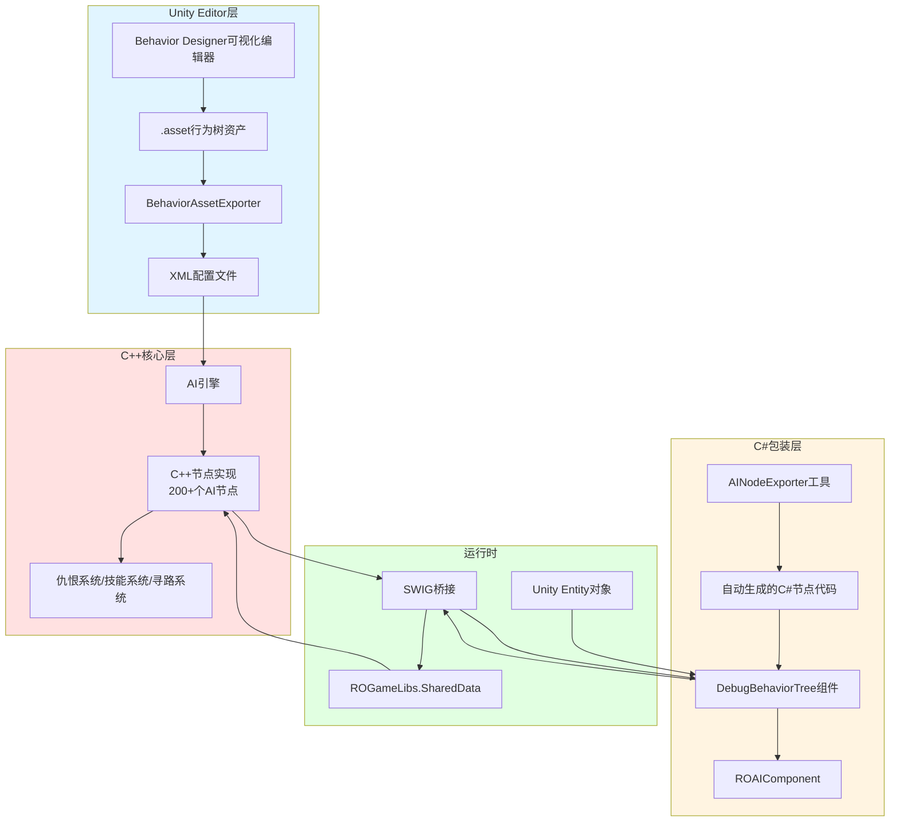

Behavior Designer是该项目的核心AI决策系统，采用商业行为树框架并通过深度定制实现复杂的游戏逻辑。该项目构建了**C++核心引擎 + C#包装层**的混合架构，通过自动化工具链实现了跨语言节点生成和数据导出，为MMORPG场景下的怪物AI、NPC行为、玩家挂机、副本脚本等提供统一的决策框架。本文档面向高级开发者，深入解析该系统的架构设计、节点类型、工作流程和扩展机制。

## 架构总览

该项目将Behavior Designer从纯粹的Unity C#插件扩展为连接底层C++游戏引擎的桥梁，形成三层架构：**Unity表现层**（Behavior Designer插件）、**C#包装层**（自动生成的节点代码）、**C++核心层**（AI逻辑实现）。这种设计既利用了Unity Editor的可视化编辑优势，又保留了C++引擎的性能优势。

行为树系统的核心流程是：策划在Unity Editor中使用Behavior Designer的可视化界面编辑行为树资产（.asset文件），这些资产通过BehaviorAssetExporter导出为XML配置；C++核心AI引擎读取XML配置并执行逻辑；C#包装层通过SWIG自动生成，作为Unity和C++之间的数据桥梁。游戏运行时，DebugBehaviorTree组件负责将Unity的Entity对象与C++的AI组件连接，通过回调机制实现C++驱动的行为树Tick。



该架构的关键优势在于**分层解耦**和**自动化生成**。策划可以专注于行为树逻辑的设计而无需了解底层实现；C++开发者可以独立于Unity修改AI逻辑，通过重新生成C#包装即可同步；节点数量的扩展（当前200+个）通过统一的工具链管理，避免了手动维护的复杂性。Sources: [artres/Behavior Designer/Custom/Editor/AINodeExporter.cs](artres/Behavior Designer/Custom/Editor/AINodeExporter.cs#L1-L50), [artres/Behavior Designer/Custom/RunTime/Common/DebugBehaviorTree.cs](artres/Behavior Designer/Custom/RunTime/Common/DebugBehaviorTree.cs#L1-L50)

## 核心组件详解

### BehaviorTree与ExternalBehaviorTree

`BehaviorTree`是运行在GameObject上的组件，继承自`Behavior`基类，是行为树的运行时容器。`ExternalBehaviorTree`则是一个可序列化的ScriptableObject资产，用于存储行为树的节点结构和变量配置，可以被多个`BehaviorTree`实例引用复用。这种分离设计允许同一个行为树配置应用于不同的GameObject，同时支持运行时的动态切换。

项目中对这两个类进行了轻量级封装，主要的扩展逻辑集中在`DebugBehaviorTree`类中。`DebugBehaviorTree`继承自`BehaviorTree`，实现了Unity的MEntity系统与C++的ROObject系统之间的桥接。它在Awake时通过Entity名称（存储在GameObject.name中）获取对应的MEntity，并从中提取C++的ROObject指针；在RefreshData中配置ROAIComponent的编辑器Tick回调，通过委托转换为SWIG兼容的函数指针；在OnDisappear中清理事件监听并销毁自身。这种设计确保了Unity对象生命周期与C++对象生命周期的同步。Sources: [artres/Behavior Designer/Runtime/BehaviorTree.cs](artres/Behavior Designer/Runtime/BehaviorTree.cs#L1-L11), [artres/Behavior Designer/Runtime/ExternalBehaviorTree.cs](artres/Behavior Designer/Runtime/ExternalBehaviorTree.cs#L1-L8), [artres/Behavior Designer/Custom/RunTime/Common/DebugBehaviorTree.cs](artres/Behavior Designer/Custom/RunTime/Common/DebugBehaviorTree.cs#L15-L70)

### SharedVariables共享变量系统

SharedVariables是Behavior Designer的核心数据传递机制，实现了变量在行为树节点间的共享和与外部系统的交互。项目中的SharedVariables类型包括基础类型（SharedBool、SharedInt、SharedFloat、SharedString）、Unity对象类型（SharedTransform、SharedGameObject）以及游戏特定类型（SharedVector3用于ROGameLibs.Vector3）。

所有SharedVariable都继承自`SharedVariable<T>`基类，提供了Value属性访问实际数据，以及Name属性用于序列化和跨语言引用。特别值得注意的是`SharedFloat`类中添加了`swigValue`属性，专门用于C++ SWIG绑定的值访问，这体现了C#包装层对C++底层的数据适配。共享变量在行为树中既可以通过节点参数传递，也可以存储在全局变量资产（BehaviorDesignerGlobalVariables.asset）中，实现跨树的数据共享。Sources: [artres/Behavior Designer/Runtime/Variables/SharedFloat.cs](artres/Behavior Designer/Runtime/Variables/SharedFloat.cs#L1-L9), [artres/Behavior Designer/Resources](artres/Behavior Designer/Resources)

### 节点类型体系

Behavior Designer的节点分为四大类，项目针对每类都进行了大量扩展：

| 节点类型 | 功能描述 | 项目扩展数量 | 典型示例 |
|---------|---------|------------|---------|
| **Actions** | 执行具体动作，返回Success/Failure/Running | 200+ | AIDoCastSkill（释放技能）、AIFindTargetByHatred（仇恨目标） |
| **Composites** | 控制子节点的执行流程 | 11种标准 | Selector（选择器）、Sequence（序列器）、ParallelSelector |
| **Decorators** | 修饰单个子节点的行为 | 12种标准 | Inverter（反转）、Repeater（重复）、TimeInterval（时间间隔） |
| **Conditionals** | 执行条件判断，不修改游戏状态 | 多个自定义 | AICheckCanSkill（检查技能可用性）、AIIntComparison（数值比较） |

**Selector（选择器）**实现逻辑或操作：依次执行子节点，任一子节点返回Success则立即停止并返回Success；所有子节点都返回Failure才返回Failure。这在AI决策中用于"尝试多种方案"的场景，如：攻击->逃跑->巡逻，只要有一个成功即完成。

**Sequence（序列器）**实现逻辑与操作：依次执行子节点，任一子节点返回Failure则立即停止并返回Failure；所有子节点都返回Success才返回Success。这用于"按步骤完成所有操作"的场景，如：找到目标->移动到攻击范围->释放技能。

这两种组合节点的核心区别在于**短路策略**：Selector在第一个Success处短路，Sequence在第一个Failure处短路。它们都维护`currentChildIndex`跟踪当前执行的子节点索引，在`CanExecute()`中判断是否继续执行，在`OnChildExecuted()`中更新索引和状态，在`OnEnd()`中重置状态。Sources: [artres/Behavior Designer/Runtime/Composites/Selector.cs](artres/Behavior Designer/Runtime/Composites/Selector.cs#L1-L46), [artres/Behavior Designer/Runtime/Composites/Sequence.cs](artres/Behavior Designer/Runtime/Composites/Sequence.cs#L1-L46)

## 自定义节点实现机制

### C++到C#的自动生成流程

项目中的200+个自定义节点并非手动编写，而是通过`AINodeExporter`工具从C++代码自动生成。这个流程保证了C++核心逻辑与C#包装层的同步一致性，避免了手动维护的易错性。

生成流程分为以下步骤：

1. **扫描C++节点定义**：工具读取`MoonGameLibPath/ai/nodes`目录下的C++节点源文件，提取节点类名（如`AIDoCastSkill`、`AIFindTargetByHatred`）及其参数信息。
2. **类型映射**：通过`typeRemapDict`字典将C++类型映射到Behavior Designer的SharedVariable类型，例如`int`映射到`SharedInt`，`ROGameLibs.Vector3`映射到`SharedVector3`。
3. **代码生成**：使用CodeDom库动态生成C#类代码，每个生成的类继承自`Action`，标记`[TaskCategory("A_Server")]`属性，自动添加`OnAwake()`和`OnUpdate()`方法。
4. **SWIG桥接**：生成的`OnAwake()`方法中创建C++节点实例（`new ROGameLibs.AIDoCastSkill()`），通过`SetShareData()`设置共享数据，将C#参数转换为C++的NodeArgs结构；`OnUpdate()`方法调用C++节点的`Update(entity)`方法并将返回值映射到TaskStatus。

生成的节点代码具有统一的模式：

```csharp
[TaskCategory("A_Server")]
[TaskDescription("释放技能")]
public class AIDoCastSkill : Action
{
    [Tooltip("目标")]
    public SharedTransform target;
    [Tooltip("释放方式")]
    public ROGameLibs.AIDoCastSkill.CastSkillType cast_type;
    
    private ROGameLibs.AIDoCastSkill node;
    private ROGameLibs.ROObject entity;
    private ROGameLibs.AIDoCastSkill.NodeArgs args;
    
    public override void OnAwake()
    {
        entity = Owner.gameObject.GetComponent<DebugBehaviorTree>()?.CppEntity;
        if(entity == null) return;
        node = new ROGameLibs.AIDoCastSkill();
        node.SetShareData(Owner.gameObject.GetComponent<DebugBehaviorTree>()?.GetShared());
        args = new ROGameLibs.AIDoCastSkill.NodeArgs();
        args.target_NAME = target.Name ?? "";
        args.cast_type = cast_type;
        node.SetNodeArgs(args.ConvertTo<ROGameLibs.SWIGTYPE_p_void>(true));
    }
    
    public override TaskStatus OnUpdate()
    {
        if(entity == null) return TaskStatus.Failure;
        return node.Update(entity) ? TaskStatus.Success : TaskStatus.Failure;
    }
}
```

这种自动生成机制确保了节点接口的一致性，同时将C++的实现细节对C#完全隐藏，实现了真正的分层架构。Sources: [artres/Behavior Designer/Custom/Editor/AINodeExporter.cs](artres/Behavior Designer/Custom/Editor/AINodeExporter.cs#L1-L100), [artres/Behavior Designer/Custom/RunTime/Nodes/AIDoCastSkill.cs](artres/Behavior Designer/Custom/RunTime/Nodes/AIDoCastSkill.cs#L1-L54), [artres/Behavior Designer/Custom/RunTime/Nodes/AIFindTargetByHatred.cs](artres/Behavior Designer/Custom/RunTime/Nodes/AIFindTargetByHatred.cs#L1-L55)

### 节点分类与功能覆盖

项目的自定义节点按功能场景分为多个类别，存储在`BehaviorAssetData`目录的子文件夹中：

| 类别 | 路径 | 节点数量 | 应用场景 |
|-----|------|---------|---------|
| **Player** | BehaviorAssetData/Player/ | 10+ | 玩家挂机、自动战斗、跟随系统 |
| **AutoBattle** | BehaviorAssetData/AutoBattle/ | 多个 | 自动战斗技能选择、目标选择 |
| **Common** | BehaviorAssetData/Common/ | 100+ | 怪物通用AI、NPC行为、场景AI |
| **Dungeons** | BehaviorAssetData/Dungeons/ | 多个 | 副本特定AI、波次控制、MVP逻辑 |
| **Mercenary** | BehaviorAssetData/Mercenary/ | 多个 | 佣兵AI、宠物系统 |
| **PVP** | BehaviorAssetData/PVP/ | 多个 | PVP战斗AI |
| **XinShouFuBen** | BehaviorAssetData/XinShouFuBen/ | 多个 | 新手副本引导 |

Common类别进一步细分为：
- **Monster**：野外怪物、任务怪物、BOSS的AI（如Common_Monster_Default、Common_Monster_Patrol）
- **NPC**：NPC的巡逻、跟随、对话AI（如Common_NPC_Follow、Common_NPC_XunLuo）
- **MVP**：特殊BOSS的战斗逻辑（如Common_MVP_BaFengTe、Common_MVP_DeGuLaNanJue）
- **SceneAI**：场景级别的AI控制（如Common_SceneAI_Default、Dungeons特定场景AI）
- **Story**：剧情脚本AI（如Common_Story_XiongMengHuanShou_SceneAI）

这种分类使得行为树资产的管理更加清晰，便于策划根据场景快速定位和修改相关AI逻辑。Sources: [artres/Behavior Designer/Custom/BehaviorAssetData](artres/Behavior Designer/Custom/BehaviorAssetData), [artres/Behavior Designer/Custom/BehaviorAssetData/Player](artres/Behavior Designer/Custom/BehaviorAssetData/Player), [artres/Behavior Designer/Custom/BehaviorAssetData/Common](artres/Behavior Designer/Custom/BehaviorAssetData/Common)

## 行为树资产导出机制

### XML格式转换

`BehaviorAssetExporter`工具负责将Unity的`.asset`格式行为树资产转换为引擎可读的XML格式。转换过程基于JSON序列化数据，使用MiniJSON库解析，然后构建XmlDocument对象。

转换的核心步骤如下：

1. **解析JSON数据**：从`_behaviorTree.BehaviorSource.TaskData.JSONSerialization`反序列化JSON为Hashtable，提取EntryTask（入口任务）、RootTask（根任务）、Variables（变量列表）。
2. **构建XML结构**：创建XML文档，以行为树名称为根元素，创建EntryTask元素添加全局变量，创建根任务元素并迭代添加子树。
3. **处理Unity对象引用**：Unity对象的引用通过`fieldSerializationData.unityObjects`列表存储，导出为`<pointer fileName="ObjectName">`元素，引擎加载时重新解析。
4. **添加子节点**：递归调用`AddChildren()`方法，将每个节点的类型、属性、子节点转换为XML元素。

导出的XML结构示例：

```xml
<Player_Auto_Battle>
  <EntryTask>
    <Variables>...</Variables>
    <Selector>
      <AIFindTargetByHatred store_target_NAME="target" />
      <Sequence>
        <AIDistanceTo store_distance_NAME="distance" />
        <AICheckCanSkill />
        <AIDoCastSkill target_NAME="target" />
      </Sequence>
    </Selector>
  </EntryTask>
  <UnityObjects>
    <pointer fileName="MonsterPrefab" />
  </UnityObjects>
</Player_Auto_Battle>
```

这种XML格式具有**可读性**（便于人工检查和调试）和**解析效率**（引擎可以直接解析为内存对象）的双重优势。Sources: [artres/Behavior Designer/Custom/Editor/BehaviorAssetExporter.cs](artres/Behavior Designer/Custom/Editor/BehaviorAssetExporter.cs#L1-L100)

### 数据流向与运行时加载

行为树数据的完整流向如下：

1. **编辑阶段**：策划在Unity Editor中使用Behavior Designer可视化工具编辑行为树，保存为`.asset`文件。
2. **导出阶段**：通过`BehaviorAssetExporter`将`.asset`导出为XML文件，放入引擎的资源目录。
3. **打包阶段**：XML文件随游戏资源打包，可能经过加密或压缩。
4. **运行阶段**：
   - Unity场景加载时，GameObject上的`DebugBehaviorTree`组件初始化，连接到对应的C++ Entity。
   - C++ AI引擎根据EntityID或配置加载对应的XML行为树文件。
   - 引擎解析XML，创建节点树结构，初始化变量。
   - 游戏循环中，C++引擎Tick行为树，通过SWIG回调到C#的`ForceFireBehaviorCallback`方法。
   - C++节点的`Update()`方法被调用，执行具体AI逻辑，返回Success/Failure。
   - 结果通过SWIG传回C#，更新行为树状态，触发节点跳转。

这种数据流确保了**编辑器数据**与**运行时数据**的分离，支持运行时动态加载和热更新行为树配置。Sources: [artres/Behavior Designer/Custom/RunTime/Common/DebugBehaviorTree.cs](artres/Behavior Designer/Custom/RunTime/Common/DebugBehaviorTree.cs#L70-L100)

## 开发工作流与最佳实践

### 创建新的AI节点

当需要添加新的AI逻辑时，推荐遵循以下步骤：

1. **C++实现**：在`ai/nodes`目录下创建新的C++节点类，继承自基础节点类，实现`Update()`方法，定义NodeArgs结构体存储参数。例如：

```cpp
// AINewSkillCast.h
class AINewSkillCast : public AINode {
public:
    struct NodeArgs {
        int skill_id;
        float min_distance;
    };
    
    bool Update(ROObject* entity) override {
        // 实现技能释放逻辑
        auto target = entity->GetTarget();
        if (!target) return false;
        float dist = entity->GetDistance(target);
        if (dist < args.min_distance) {
            entity->CastSkill(args.skill_id, target);
            return true;
        }
        return false;
    }
};
```

2. **重新生成C#包装**：在Unity Editor中执行`ROTools/BehaivorTools/导出AI节点C++`菜单命令，自动生成`AINewSkillCast.cs`文件。

3. **在行为树中使用**：在Behavior Designer编辑器中找到新生成的节点，拖拽到行为树中，配置参数（skill_id、min_distance）。

4. **测试调试**：使用DebugBehaviorTree的ForceFireBehaviorCallback机制，在编辑器中单步调试节点执行。

### 行为树调试技巧

项目提供了多种调试手段：

- **视觉调试**：Behavior Designer编辑器实时显示节点执行状态（绿色表示Success，红色表示Failure，蓝色表示Running）。
- **日志输出**：使用`AILog.cs`节点输出调试信息，`AIPrintLog.cs`输出仇恨列表等复杂信息。
- **断点调试**：在C++节点代码中设置断点，通过Visual Studio Attach到Unity进程调试。
- **热重载**：修改C++代码后重新编译，在Unity中点击"导出AI节点C++"，无需重启游戏即可生效。

### 性能优化建议

- **避免频繁节点创建**：节点的初始化放在`OnAwake()`中，避免在`OnUpdate()`中重复分配。
- **共享变量复用**：尽量使用行为树的变量而非节点内部变量，减少GC压力。
- **条件节点前置**：将条件判断节点放在组合节点的前面，利用短路特性减少不必要的执行。
- **缓存引用**：在`OnAwake()`中缓存Component引用（如Transform、CharacterController），避免每帧`GetComponent()`。
- **使用Decorator控制频率**：对于需要周期性检查的逻辑，使用`TimeInterval`或`Repeater`装饰器控制执行频率。

## 与其他系统的集成

### 战斗系统集成

行为树通过以下方式与战斗系统交互：

- **技能系统**：`AIDoCastSkill`、`AICastSkillByList`节点调用`ROAIComponent`的技能释放接口，支持技能ID、技能类型、目标选择等多种参数。
- **仇恨系统**：`AIFindTargetByHatred`、`AIHatredTopTarget`、`AIHatredRandomTarget`节点从仇恨列表中获取目标，`AIClearMonsterHatred`、`AISetHatredStatus`节点修改仇恨值。
- **属性系统**：`AIGetAttrFloat`、`AIGetAttrInt`节点读取实体属性，`AIAttrCompare`、`AIFloatComparison`节点进行属性比较。
- **Buff系统**：`AIGetBuffInfo`、`AIBuffNormal`、`AIBuffOperator`节点查询和操作Buff状态。

### 寻路与移动系统

移动相关节点：

- `AIActionMove`、`AIReturnBackMove`：控制实体移动到目标位置
- `MAINavigationTo`：使用NavMeshAgent进行寻路
- `AIFollowOthers`、`MAIAutoFollow`：跟随目标移动
- `AIPatrolWhthPath`、`AIPatrolChangePath`：沿路径巡逻

这些节点底层调用`ROMovementComponent`或`NavMeshAgent`，行为树只负责决策何时移动、移动到哪，具体的移动执行由底层系统处理，保持了职责分离。

### 场景与副本系统

场景级别的AI控制：

- `AISceneDeleteNPC`：删除场景中的NPC
- `AICreateCollection`、`AICleanCollection`：创建和清理采集物
- `AIWaveEvent`、`AICheckWaveFinish`：波次控制
- `AIDungeonsTeleport`：副本内传送
- `AISendSceneEvent`、`AISendMazeEvent`：触发场景事件

这些节点通常在SceneAI类型的行为树中使用，由场景控制器管理整个场景的AI流程。

## 总结

Behavior Designer在该项目中不仅仅是一个AI决策工具，更是一个**连接Unity编辑器与C++游戏引擎的桥梁**。通过自动化的代码生成和资产导出工具链，项目成功构建了分层清晰的AI架构：策划专注于行为树逻辑设计，C++开发者专注于高性能AI实现，Unity开发者负责桥接和调试。200+个自定义节点覆盖了怪物、NPC、玩家、副本、PVP等各种场景，展现了行为树在复杂MMORPG AI系统中的强大表达能力。

对于新加入的开发者，建议从理解**DebugBehaviorTree的桥接机制**和**节点自动生成流程**开始，然后通过阅读少量典型节点（如`AIDoCastSkill`、`AIFindTargetByHatred`）的实现，逐步掌握整个系统的运作方式。在实际开发中，优先使用现有节点组合实现逻辑，避免频繁新增节点，保持节点库的精简和高复用性。

下一阶段的学习建议：深入了解[Protobuf协议集成](10-protobufxie-yi-ji-cheng)以理解行为树数据如何通过网络同步，以及[网络层架构与消息处理](11-wang-luo-ceng-jia-gou-yu-xiao-xi-chu-li)来掌握AI状态的多玩家同步机制。