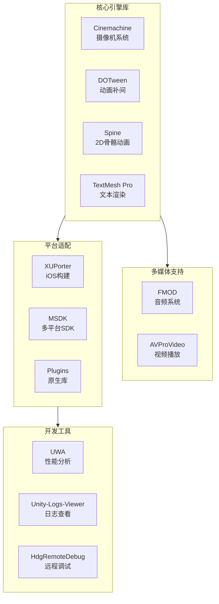

本文档详细介绍了Unity3D RO客户端项目中所集成的各类第三方依赖库的安装、配置和基本使用方法。这些依赖库涵盖了动画系统、音频系统、视频播放、性能分析、UI渲染等多个领域，是项目正常运行的基础支撑。

## 依赖库架构总览

项目采用模块化方式管理依赖库，按功能划分为核心引擎、多媒体支持、平台适配和开发工具四大类。下图展示了主要依赖库的分类和层级关系：

Sources: [目录结构](.) [目录结构](.)

## 核心引擎依赖库

### Cinemachine 摄像机系统

Cinemachine是Unity官方的智能摄像机系统，本项目使用版本为2.1.09，位于`Cinemachine`目录。该库提供了强大的摄像机控制功能，包括虚拟摄像机、混合摄像机、路径跟随等。

主要特性包括：
- **PostProcessing V2支持**：可与后处理效果无缝集成
- **智能碰撞检测**：改进的Collider算法，支持保留摄像机高度或距离
- **CinemachineConfiner**：将虚拟摄像机限制在边界体积或2D多边形碰撞器内
- **Framing Transposer**：遵循构图规则移动摄像机而不旋转
- **CinemachinePOV**：完全由用户控制的瞄准组件
- **路径系统**：CinemachineSmoothPath和CinemachineDollyCart实现平滑路径运动

安装状态：已集成在项目中，无需额外配置。Runtime代码位于`Cinemachine/Base/Runtime`，Editor扩展位于`Cinemachine/Base/Editor`。

Sources: [Cinemachine/ReleaseNotes.txt](Cinemachine/ReleaseNotes.txt#L1-L50)

### DOTween 动画补间库

DOTween是由Demigiant开发的高效动画补间引擎，包含DOTween和DOTween Pro两个组件，位于`Demigiant`目录。该项目包含多个Unity版本兼容的DLL文件（DOTween43.dll、DOTween46.dll、DOTween50.dll）。

**安装和配置步骤：**
1. 导入DOTween包后，从Unity的Tools菜单选择"DOTween Utility Panel"
2. 点击"Setup DOTween..."按钮，根据Unity版本设置额外功能
3. 在需要使用DOTween的类中添加命名空间：`using DG.Tweening`

**Pro版本功能：**
- **视觉脚本**：通过Component菜单添加"DOTween Animation"或"DOTween Path"
- **路径动画**：沿预定义路径移动物体
- **高级动画**：支持复杂的动画序列和控制

安装状态：已完整集成，配置文件位于`Resources/DOTweenSettings.asset`。相关包装代码已生成在`Source/Generate/DG_Tweening_*Wrap.cs`。

Sources: [Demigiant/DOTween/readme.txt](Demigiant/DOTween/readme.txt#L1-L18) [Demigiant/readme_DOTweenPro.txt](Demigiant/readme_DOTweenPro.txt#L1-L24)

### Spine 2D骨骼动画

Spine是专业的2D骨骼动画系统，本项目使用Spine 3.7.xx版本，位于`Spine`目录。包含spine-csharp核心库和spine-unity运行时。

**核心特性：**
- 支持所有Spine功能，包括网格变形、混合模式、反向动力学等
- 可直接通过Unity的MeshRenderer渲染
- 支持Premultiplied Alpha的图集图像
- 提供SkeletonAnimation、SkeletonGraphic等多个组件

**许可证要求：**
- 评估和集成免费
- 分发给最终用户需要Spine许可证
- 需要在游戏中注明使用"FMOD Studio"和"Firelight Technologies Pty Ltd"

安装状态：已集成，包含示例场景和完整文档。C#运行时位于`Spine/spine-csharp/src`，Unity运行时位于`Spine/spine-unity`。

Sources: [Spine/spine-csharp/README.md](Spine/spine-csharp/README.md#L1-L34) [Spine/spine-unity/README.md](Spine/spine-unity/README.md#L1-L52)

### TextMesh Pro 文本渲染

TextMesh Pro是Unity的高性能文本渲染解决方案，位于`TextMesh Pro`目录。支持富文本、文字效果、多语言等功能。

安装状态：已完整集成，包含32位和64位插件、编辑器资源和运行时DLL。设置文件位于`TextMesh Pro/Resources/TMP Settings.asset`，项目配置位于`Resources/TMPSetting/`。

Sources: [TextMesh Pro目录结构](TextMesh Pro)

## 多媒体支持库

### FMOD 音频系统

FMOD是专业的音频中间件，本项目使用FMOD Studio Engine，位于`Plugins/FMOD`目录。提供跨平台的高级音频功能。

**许可证类型：**
- **个人/教育用途**：免费用于个人、学生和教师
- **非商业用途**：免费用于非商业项目
- **商业用途**：需要单独许可，需要包含游戏内署名

**集成要求：**
- 产品必须包含署名"FMOD Studio"和"Firelight Technologies Pty Ltd"
- 音频资源位于`Plugins/FMOD/Resources`和`Plugins/FMOD/addons`
- 平台特定库位于`Plugins/FMOD/lib`

项目封装层位于`Scripts/FMod/`，包括MFModRunTimeManager、MFModEventInstance、MFmodBus等管理类。

Sources: [Plugins/FMOD/LICENSE.TXT](Plugins/FMOD/LICENSE.TXT#L1-L50)

### AVProVideo 视频播放

AVProVideo是跨平台的视频播放解决方案，位于`ThirdParty/AVProVideo`和`Plugins`相关目录。支持多种视频格式和平台。

**平台支持：**
- **Android**：ExoPlayer集成，位于`Plugins/Android/`
- **iOS**：原生库支持，位于`Plugins/iOS/`
- **WebGL**：JavaScript接口，位于`Plugins/WebGL/`
- **Windows**：x86和x86_64原生DLL，位于`Plugins/x86/`和`Plugins/x86_64/`

**项目集成：**
- 适配器脚本位于`Scripts/AVPro/MAvProAdapter.cs`和`MMediaPlayer.cs`
- 预制体位于`Resources/Prefabs/AvProAdapter.prefab`
- 材质和着色器位于`ThirdParty/AVProVideo/Materials/`和`Resources/Shader/RO/`

Sources: [ThirdParty/AVProVideo目录结构](ThirdParty/AVProVideo) [Scripts/AVPro目录](Scripts/AVPro)

## 平台适配库

### XUPorter iOS构建工具

XUPorter是Unity iOS项目的自动化修改工具，位于`Editor/XUPorter`目录。用于在Unity构建后自动修改Xcode项目文件。

**主要功能：**
- 自动添加文件到Xcode项目组
- 添加库和框架到Build Phases
- 配置Header Search Paths
- 修改Info.plist文件
- 支持Embed Frameworks（Xcode 6+）

**配置方式：**
- 使用.projmods文件（JSON格式）定义修改规则
- 配置文件位于`Editor/XUPorter/Mods/`目录
- 在XCodePostProcess.cs的OnPostProcessBuild回调中自动执行

安装要求：Unity 3.5+和Xcode 4+。

Sources: [Editor/XUPorter/Readme.mdown](Editor/XUPorter/Readme.mdown#L1-L50)

### MSDK 多平台SDK

MSDK是移动平台SDK集成层，位于`Msdk`目录。负责统一管理各个平台的SDK接入。

**目录结构：**
- `Msdk/Editor/`：编辑器工具和配置
- `Msdk/Editor/Librarys/`：SDK依赖库
- `Msdk/Editor/Resources/`：SDK资源
- `Msdk/Editor/Scripts/`：SDK脚本

**平台支持：**
- Android原生SDK集成
- iOS原生SDK集成
- 配置文件位于`Resources/SDKConfig/MSDK.json`

Sources: [Msdk目录结构](Msdk) [Resources/SDKConfig/MSDK.json](Resources/SDKConfig/MSDK.json)

### Plugins 原生库集合

Plugins目录包含各平台的原生库和插件，是跨平台支持的基础。

**关键原生库：**

| 平台 | 路径 | 主要内容 |
|------|------|----------|
| Android | `Plugins/Android/` | AVProVideo.jar、ExoPlayer、Gradle模板、签名文件 |
| iOS | `Plugins/iOS/` | AVProVideo原生库、protobuf-lite.a、Objective-C源码 |
| Mac | `Plugins/Mac/` | rocommongamelibs.bundle |
| WebGL | `Plugins/WebGL/` | AVProVideo.jslib |
| Windows x86 | `Plugins/x86/` | AVProVideo.dll、Audio360.dll |
| Windows x86_64 | `Plugins/x86_64/` | 完整原生库（AVProVideo、GCloud、GVoice等） |

**游戏核心库：**
`Plugins/GameLibs/`包含核心游戏逻辑DLL：
- MoonClient.dll：客户端核心逻辑
- MoonCommonLib.dll：公共库
- MoonSerializable.dll：序列化支持
- SDKLib.dll：SDK接口
- Google.Protobuf.dll：Protobuf协议支持

Sources: [Plugins目录结构](Plugins)

## 开发工具库

### UWA 性能分析工具

UWA是Unity性能优化分析工具，位于`UWA`和`ThirdParty/UWA`目录。用于检测和优化游戏性能。

**集成组件：**
- **Editor工具**：`ThirdParty/UWA/Editor/`包含UWAEditor.dll和UWALib.dll
- **Android包装器**：`ThirdParty/UWA/Libs/UWAWrapper_Android.dll`
- **预制体**：`UWA/Prefabs/UWA_Launcher.prefab`和`ThirdParty/UWA/Prefabs/UWA_Android.prefab`
- **启动脚本**：`UWA/Libs/UWA_Launcher.cs`

**配置文件：**
- 规则配置：`Editor/uwascan_ruleconfig.json`
- 服务器IP：`UWA/UWALib/serverip.txt`

Sources: [UWA目录结构](UWA) [ThirdParty/UWA目录结构](ThirdParty/UWA)

### Unity-Logs-Viewer 日志查看器

Unity-Logs-Viewer是在游戏内查看Unity控制台日志的工具，位于`Unity-Logs-Viewer`目录。

**设置步骤：**
1. 在游戏启动的第一个场景中，从菜单"Reporter -> Create"创建Reporter对象
2. 在Edit → Project Settings中，将Reporter.cs的脚本执行顺序设置为最高
3. 在Reporter.cs和TestReporter.cs的第一行选择匹配Unity版本的#define：
   - `#define UNITY_CHANGE1`：Unity 5以下版本
   - `#define UNITY_CHANGE2`：Unity 5.0-5.3
   - `#define UNITY_CHANGE3`：Unity 5.3+（修复新SceneManager系统）

**使用方式：**
在移动设备屏幕上画圆（鼠标点击拖动或手指触摸拖动）即可显示日志窗口。

Sources: [Unity-Logs-Viewer/README.md](Unity-Logs-Viewer/README.md#L1-L23)

### HdgRemoteDebug 远程调试工具

HdgRemoteDebug是远程调试工具，允许在Unity编辑器中实时查看和修改运行在设备上的游戏对象属性，版本2.3.3573，位于`Plugins/HdgRemoteDebug/`。

**使用流程：**
1. 将`Plugins/HdgRemoteDebug/RemoteDebugServer.prefab`预制体添加到场景中
2. 从Unity的Window菜单打开"Hdg Remote Debug"窗口
3. 构建并运行游戏到设备
4. 在Hdg Remote Debug窗口中点击"Active Player"，选择设备进行连接
5. 连接后可以实时修改游戏对象的属性并观察变化

**注意事项：**
- 默认启用Automatic Refresh，会自动发送场景中GameObject列表
- 如果GameObject数量较多（数千个），建议关闭自动刷新，手动点击Refresh

Sources: [Plugins/HdgRemoteDebug/README.md](Plugins/HdgRemoteDebug/README.md#L1-L50)

## 依赖库配置验证

### 依赖库清单表

下表总结了项目中的主要依赖库及其安装状态：

| 依赖库 | 版本 | 目录位置 | 安装状态 | 核心功能 |
|--------|------|----------|----------|----------|
| Cinemachine | 2.1.09 | `Cinemachine/` | ✓ 已安装 | 智能摄像机控制 |
| DOTween | 多版本兼容 | `Demigiant/DOTween/` | ✓ 已安装 | 动画补间系统 |
| DOTween Pro | - | `Demigiant/DOTweenPro/` | ✓ 已安装 | 高级动画功能 |
| Spine | 3.7.xx | `Spine/` | ✓ 已安装 | 2D骨骼动画 |
| TextMesh Pro | - | `TextMesh Pro/` | ✓ 已安装 | 高级文本渲染 |
| FMOD | Studio | `Plugins/FMOD/` | ✓ 已安装 | 专业音频系统 |
| AVProVideo | - | `ThirdParty/AVProVideo/` | ✓ 已安装 | 跨平台视频播放 |
| XUPorter | - | `Editor/XUPorter/` | ✓ 已安装 | iOS构建自动化 |
| MSDK | - | `Msdk/` | ✓ 已安装 | 多平台SDK集成 |
| UWA | - | `UWA/`, `ThirdParty/UWA/` | ✓ 已安装 | 性能分析优化 |
| Unity-Logs-Viewer | - | `Unity-Logs-Viewer/` | ✓ 已安装 | 游戏内日志查看 |
| HdgRemoteDebug | 2.3.3573 | `Plugins/HdgRemoteDebug/` | ✓ 已安装 | 远程调试 |
| SQLite | - | `ThirdParty/Sqlite/` | ✓ 已安装 | 本地数据库 |
| Poco-SDK | - | `Plugins/Poco-SDK/` | ✓ 已安装 | C++网络库 |

### 配置文件检查清单

以下是关键配置文件的位置和用途：

| 配置文件 | 位置 | 用途 |
|----------|------|------|
| config.json | `Resources/config.json` | 全局配置（BundleID、渠道、服务器地址等） |
| DOTweenSettings.asset | `Resources/DOTweenSettings.asset` | DOTween全局设置 |
| TMP Settings.asset | `TextMesh Pro/Resources/TMP Settings.asset` | TextMesh Pro设置 |
| FMODStudioCache.asset | `FMODStudioCache.asset` | FMOD Studio缓存 |
| link.xml | `link.xml` | 代码裁剪保留配置 |
| uwascan_ruleconfig.json | `Editor/uwascan_ruleconfig.json` | UWA扫描规则配置 |
| serverip.txt | `UWA/UWALib/serverip.txt` | UWA服务器IP配置 |

Sources: [Resources/config.json](Resources/config.json#L1-L33)

### 常见问题排查

**问题1：DOTween未正确初始化**
- 检查是否运行了"Setup DOTween"
- 确认`using DG.Tweening`命名空间已添加
- 验证`Resources/DOTweenSettings.asset`存在

**问题2：FMOD音频无法播放**
- 确认平台对应的库文件存在于`Plugins/FMOD/lib/`
- 检查`Scripts/FMod/MFModRunTimeManager.cs`是否正确初始化
- 验证音频Bank文件已加载

**问题3：iOS构建失败**
- 检查`Editor/XUPorter/Mods/`中的.projmods配置
- 确认`ro.entitlements`文件配置正确
- 验证`Plugins/iOS/`中的原生库完整

**问题4：AVProVideo播放黑屏**
- 检查平台对应的原生插件是否已安装
- 确认`Scripts/AVPro/MAvProAdapter.cs`配置正确
- 验证视频文件路径和格式支持

## 下一步学习路径

完成依赖库安装说明后，建议按照以下顺序继续学习：

1. **[开发环境配置](3-kai-fa-huan-jing-pei-zhi)**：了解完整的开发环境搭建，包括Unity版本要求、IDE配置等
2. **[项目架构总览](5-xiang-mu-jia-gou-zong-lan)**：深入理解项目的整体架构设计，包括Lua与C#的混合开发模式
3. **[Cinemachine摄像机控制](34-cinemachineshe-xiang-ji-kong-zhi)**：学习Cinemachine的具体使用方法和摄像机控制技巧
4. **[DOTween动画补间](35-dotweendong-hua-bu-jian)**：掌握DOTween的API和动画制作流程

这些文档将帮助您从依赖库的安装逐步过渡到项目的实际开发使用。