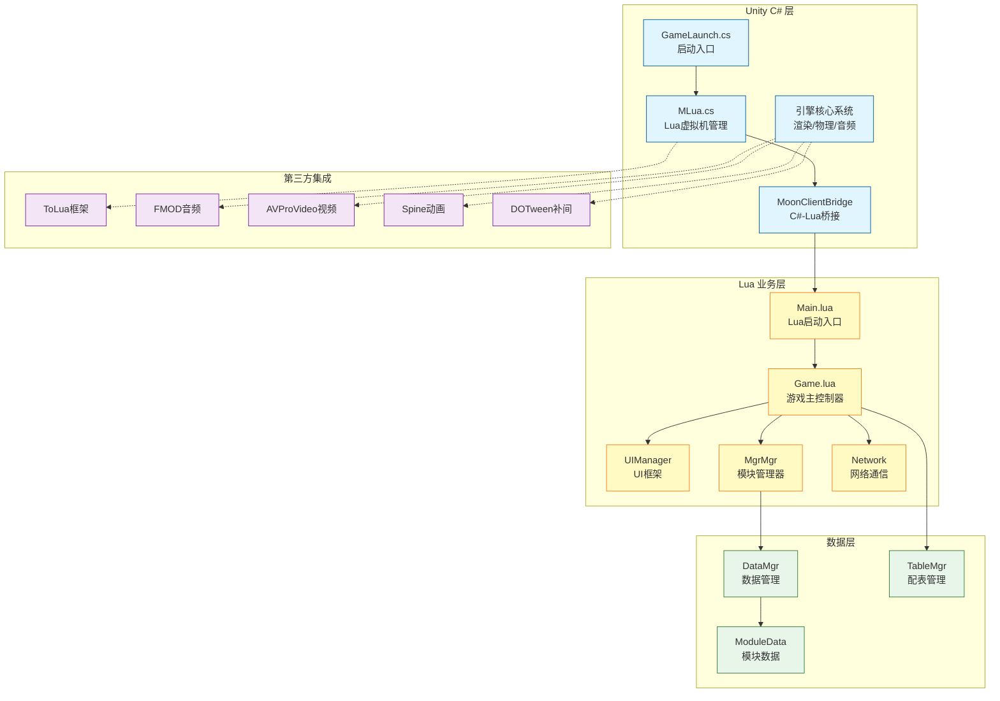
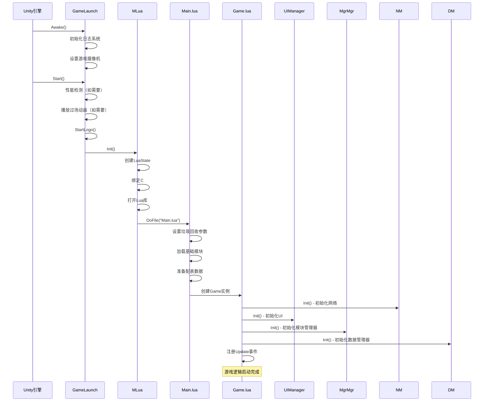
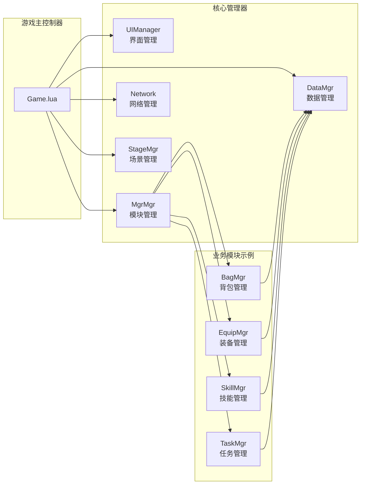
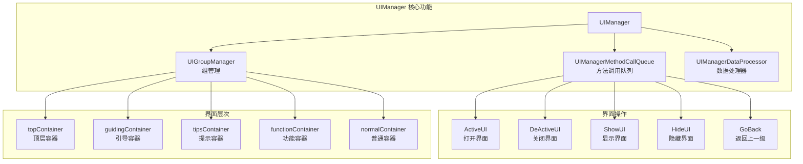

本文档从宏观视角介绍Unity3D RO客户端项目的技术架构，帮助初学者快速理解项目整体结构和各组件之间的关系。通过阅读本文，你将掌握项目的核心设计理念和技术选型，为后续深入学习打下坚实基础。

## 架构概览

项目采用 **C# 与 Lua 混合开发** 的架构模式，以Unity3D引擎为基础，通过Lua脚本实现主要业务逻辑，兼顾了开发效率和运行性能。这种架构允许快速迭代游戏逻辑，同时利用C#处理性能敏感的操作。



从架构图中可以看出，整个项目分为四个主要层次：Unity C# 层负责引擎底层的核心功能和Lua虚拟机管理，Lua 业务层实现游戏的主要逻辑，数据层统一管理游戏数据，第三方集成层提供各种专业功能支持。各层之间通过清晰的接口进行通信，形成了松耦合、高内聚的架构设计。

## 目录结构组织

项目的资源组织遵循 Unity 标准规范，同时针对项目特点进行了合理的模块化划分。了解目录结构有助于快速定位代码和资源。

| 目录/文件 | 功能说明 | 主要内容 |
|---------|---------|---------|
| `Scripts/` | C# 脚本目录 | 启动逻辑、Lua引擎、桥接层、特效系统等 |
| `Scripts/Lua/` | Lua 脚本目录 | 游戏业务逻辑、UI系统、网络通信、数据管理 |
| `Plugins/` | 原生插件库 | 平台特定的动态库、FMOD、视频播放器等 |
| `Resources/` | 运行时资源 | 配置文件、着色器、预制体、材质等 |
| `StreamingAssets/` | 流式资源 | 视频、图片等大文件 |
| `artres/` | 美术资源 | 模型、贴图、动画、UI资源等 |
| `_Scenes/` | 场景文件 | GameEntry 场景等 |

**Scripts 目录**是项目的核心代码区域，其中`Lua`子目录包含了大部分游戏逻辑代码。这种分离设计使得 C# 代码专注于底层框架和性能优化，Lua 代码专注于业务逻辑和快速迭代。

## 核心启动流程

游戏启动遵循明确的初始化序列，确保各组件按正确的顺序初始化和启动。



启动流程从 Unity 的 `Awake()` 和 `Start()` 生命周期方法开始，逐步初始化 Lua 虚拟机、加载 Lua 模块、初始化各个管理器，最终进入游戏主循环。这种分阶段的启动方式确保了依赖关系的正确处理和初始化顺序的可靠性。

Sources: [Scripts/Launch/GameLaunch.cs](Scripts/Launch/GameLaunch.cs#L1-L100), [Scripts/LuaEngine/MLua.cs](Scripts/LuaEngine/MLua.cs#L1-L100), [Scripts/Lua/Main.lua](Scripts/Lua/Main.lua#L1-L100), [Scripts/Lua/Game.lua](Scripts/Lua/Game.lua#L1-L100)

## C# 与 Lua 交互架构

项目采用 **ToLua 框架**实现 C# 与 Lua 之间的双向交互，这是整个架构的技术基石。ToLua 框架通过自动生成的绑定代码，将 C# 类和方法暴露给 Lua，实现了高效的跨语言调用。

### Lua 虚拟机管理

`MLua.cs` 是 Lua 虚拟机的核心管理类，负责：

- **虚拟机生命周期**：创建、启动、关闭 Lua 虚拟机
- **类绑定**：通过 `LuaBinderOfDefault.Bind()` 和 `MoonClientBridge.Bridge.BindLua()` 将 C# 类绑定到 Lua
- **库加载**：打开 Protobuf、JSON、Socket 等第三方 Lua 库
- **脚本执行**：通过 `DoFile()` 执行 Lua 脚本文件
- **协程支持**：通过 `LuaCoroutine.Register()` 注册协程支持

Sources: [Scripts/LuaEngine/MLua.cs](Scripts/LuaEngine/MLua.cs#L1-L100)

### 桥接层设计

`MoonClientBridge.cs` 提供了统一的桥接接口，通过接口管理器 `MInterfaceMgr` 获取桥接实例，实现了 C# 和 Lua 之间的松耦合通信。这种设计便于测试和模块替换。

Sources: [Scripts/Bridge/MoonClientBridge.cs](Scripts/Bridge/MoonClientBridge.cs#L1-L21)

### 交互方式

C# 与 Lua 的交互主要通过以下几种方式实现：

| 交互方向 | 实现方式 | 使用场景 |
|---------|---------|---------|
| C# 调用 Lua | LuaState.DoString() / LuaFunction.Call() | 框架层调用业务逻辑 |
| Lua 调用 C# | ToLua 自动生成的绑定类 | 业务逻辑调用引擎API |
| 事件回调 | Lua 委托绑定 | UI 事件、网络回调等 |
| 数据共享 | 共享内存/序列化传递 | 大数据量的高效传递 |

## Lua 业务架构

Lua 层是游戏逻辑的主要实现场所，采用了模块化和分层的设计思想。所有 Lua 代码都组织在 `Scripts/Lua/` 目录下，按照功能模块进行分类。

### 核心框架

Lua 层的核心框架由几个关键的管理器组成：



**Game.lua** 是 Lua 层的主控制器，负责协调各个管理器的初始化、更新和销毁。它实现了统一的生命周期管理，确保所有模块按照正确的顺序启动和关闭。

Sources: [Scripts/Lua/Game.lua](Scripts/Lua/Game.lua#L1-L100)

### 模块管理器

**MgrMgr** 是所有业务模块管理器的容器，采用单例模式提供全局访问。每个管理器负责特定领域的业务逻辑，例如：

- `BagMgr`：背包物品管理
- `EquipMgr`：装备系统管理
- `SkillMgr`：技能系统管理
- `TaskMgr`：任务系统管理
- `TeamMgr`：队伍系统管理

这种按职责划分的管理器模式，使得代码结构清晰，便于维护和扩展。

Sources: [Scripts/Lua/ModuleMgr/](Scripts/Lua/ModuleMgr/)

### 数据管理

**DataMgr** 负责统一管理所有模块数据，采用懒加载机制，只在需要时才初始化和加载数据模块。每个数据模块继承自 `BaseModel`，提供统一的接口：

- `Init()`：初始化数据
- `Logout()`：登出时清理数据
- 数据持久化和加载接口

Sources: [Scripts/Lua/Framework/DataMgr.lua](Scripts/Lua/Framework/DataMgr.lua#L1-L69)

## UI 系统架构

UI 系统采用 **Ctrl/Handler/Panel/Template** 四层架构，实现了界面逻辑、数据处理、视图展示和组件复用的清晰分离。

### UI 框架组成

UI 框架的核心是 **UIManager**，它提供了完整的界面生命周期管理功能：



Sources: [Scripts/Lua/Framework/UIManager/UIManager.lua](Scripts/Lua/Framework/UIManager/UIManager.lua#L1-L100)

### 四层架构详解

| 层级 | 命名规范 | 职责描述 | 示例 |
|-----|---------|---------|------|
| **Ctrl 层** | `*Ctrl.lua` | 界面逻辑控制器，处理用户交互和业务逻辑 | `BagCtrl.lua` |
| **Handler 层** | `*Handler.lua` | 事件处理器，封装UI事件和回调逻辑 | `EquipHandler.lua` |
| **Panel 层** | `*Panel.lua` | 界面视图，管理UI组件的显示和隐藏 | `BagPanel.lua` |
| **Template 层** | `*Template.lua` | 可复用组件，如列表项、按钮等 | `ItemTemplate.lua` |

### 界面组和堆栈

UIManager 支持界面组的概念，可以将相关界面组织在一起进行统一管理。界面堆栈机制确保了界面打开和关闭的正确顺序，支持类似浏览器的历史记录功能。

- **ActiveGroup**：激活一个界面组，组内界面按照配置打开
- **DeActiveGroup**：关闭一个界面组
- **GoBack**：返回到上一个界面状态

Sources: [Scripts/Lua/UI/](Scripts/Lua/UI/)

## 网络通信架构

网络通信采用 **Protobuf 协议**进行数据序列化，支持高效的二进制数据传输。网络层的设计支持协议的灵活注册和覆盖，允许 Lua 层动态处理网络消息。

### 协议注册机制

网络协议的注册在 `Network_Init.lua` 中完成，采用表驱动的方式定义协议处理器：

```lua
local l_rpcHandlers = {
    [Network.Define.Rpc.ResolveItem] = {
        func = function(msg)
            MgrMgr:GetMgr("ItemResolveMgr").OnResolveRsp(msg)
        end,
        override = true -- 是否覆盖 C# 协议
    },
    [Network.Define.Rpc.SyncTime] = {
        func = function(msg)
            MgrMgr:GetMgr("RoleInfoMgr").OnReceiveSyncTime(msg)
        end,
        override = false
    }
}
```

Sources: [Scripts/Lua/Network/Network_Init.lua](Scripts/Lua/Network/Network_Init.lua#L1-L100)

### 网络层特点

- **协议覆盖**：通过 `override` 标志，Lua 层可以覆盖 C# 层的默认协议处理
- **模块化处理**：每个模块管理器负责处理自己的网络协议
- **异步回调**：支持异步网络请求和响应处理
- **错误处理**：统一的网络错误处理和重连机制

## 第三方库集成

项目集成了多个专业级的第三方库，提供了音频、视频、动画、补间等功能支持。

| 库名 | 功能 | 集成位置 | 用途 |
|-----|------|---------|------|
| **ToLua** | C#-Lua 桥接 | `Scripts/LuaEngine/` | 核心交互框架 |
| **FMOD** | 音频系统 | `Plugins/FMOD/`, `Scripts/FMod/` | 游戏音效和音乐 |
| **AVProVideo** | 视频播放 | `Plugins/AVProVideo/`, `Scripts/AVPro/` | 过场动画和视频播放 |
| **Spine** | 2D 骨骼动画 | `Spine/` | 角色和 UI 动画 |
| **DOTween** | 补间动画 | `Demigiant/DOTween/` | UI 和场景动画效果 |
| **Cinemachine** | 摄像机控制 | `Cinemachine/` | 游戏摄像机系统 |
| **TextMesh Pro** | 文本渲染 | `TextMesh Pro/` | 高质量文本显示 |

这些第三方库的选择基于稳定性、性能和社区支持，为项目提供了专业的功能支持，同时保持了架构的清晰性。

## 开发建议与学习路径

对于初学者，建议按照以下顺序学习和探索项目架构：

1. **理解启动流程**：从 `GameLaunch.cs` 开始，理解游戏如何从 Unity 启动到 Lua 主逻辑
2. **学习 Lua 框架**：阅读 `Main.lua` 和 `Game.lua`，理解 Lua 层的初始化和主循环
3. **研究 UI 系统**：选择一个简单的 UI 模块（如 `BagCtrl`），理解 Ctrl/Handler/Panel/Template 架构
4. **探索模块管理**：查看 `MgrMgr` 和各个业务管理器，理解模块化设计
5. **了解网络通信**：学习协议注册机制，理解消息的发送和接收流程
6. **实践开发**：尝试添加简单的功能，如新的 UI 界面或网络消息处理

## 下一步学习

理解了项目整体架构后，你可以继续深入学习以下内容：

- **[C#与Lua混合开发模式](6-c-yu-luahun-he-kai-fa-mo-shi)**：详细了解两种语言的交互细节和最佳实践
- **[ToLua框架配置与使用](7-toluakuang-jia-pei-zhi-yu-shi-yong)**：深入掌握 ToLua 框架的配置和使用技巧
- **[UI框架设计（Ctrl/Handler/Panel/Template）](12-uikuang-jia-she-ji-ctrl-handler-panel-template)**：深入学习 UI 系统的设计理念和实现细节
- **[网络层架构与消息处理](11-wang-luo-ceng-jia-gou-yu-xiao-xi-chu-li)**：理解网络通信的完整流程和优化策略

通过系统学习这些内容，你将能够全面掌握项目架构，并具备独立开发和扩展功能的能力。