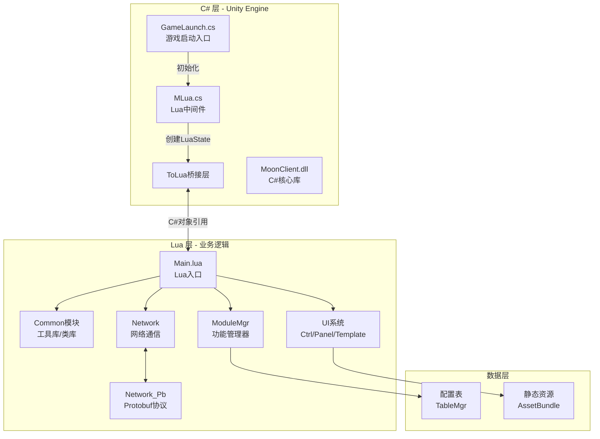
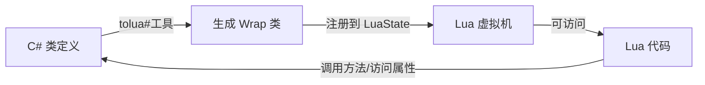
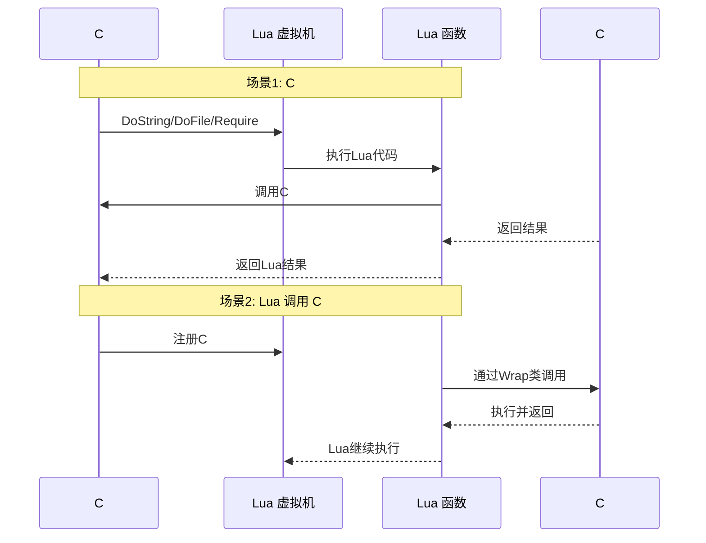
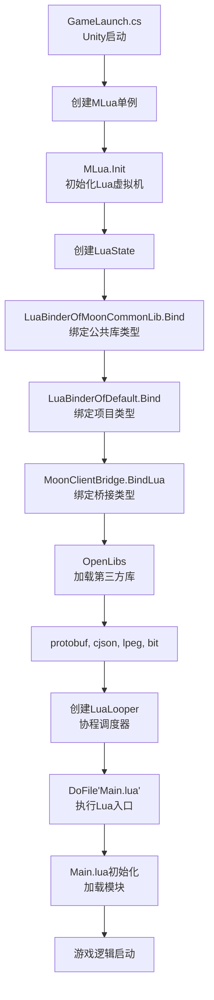

本页面介绍项目中C#与Lua混合开发模式的架构设计、实现原理和使用方法，帮助初学者快速理解这种开发模式的核心概念和实际应用。

## 混合开发模式概览

C#与Lua混合开发模式是指在一个Unity项目中同时使用C#和Lua两种语言进行开发，C#负责底层引擎调用和性能敏感的操作，Lua负责业务逻辑和UI交互。项目采用**ToLua框架**作为桥接层，实现了两者之间的无缝交互。

混合开发模式的核心优势在于：

| 优势 | 说明 | 典型应用场景 |
|------|------|--------------|
| **热更新** | Lua代码可动态加载，无需重新编译打包 | Bug修复、功能迭代、活动配置 |
| **开发效率** | Lua语法简洁，编译快速，开发迭代周期短 | UI逻辑、业务规则、配置管理 |
| **性能平衡** | C#处理底层计算，Lua处理业务逻辑 | 渲染、物理、音频 vs 游戏玩法 |
| **动态性** | 支持运行时加载和卸载Lua模块 | 插件系统、脚本化编辑器工具 |

## 架构设计

整体架构采用分层设计，C#层和Lua层通过ToLua桥接层进行通信：



### C#层核心组件

C#层主要负责Lua虚拟机的创建、初始化和C#类型的绑定注册：

| 组件 | 职责 | 关键文件 |
|------|------|----------|
| **MLua** | Lua虚拟机管理器，提供DoFile/DoString等接口 | [Scripts/LuaEngine/MLua.cs](Scripts/LuaEngine/MLua.cs#L1-L150) |
| **LuaBinderOfDefault** | 自动生成的C#类型绑定类，注册到Lua虚拟机 | [Source/Generate/LuaBinderOfDefault.cs](Source/Generate/LuaBinderOfDefault.cs#L1-L100) |
| **LuaLooper** | 协程调度器，处理Lua的协程更新 | Scripts/LuaEngine/LuaLooper.cs |
| **IMLuaLoader** | Lua文件加载器，支持从文件系统或AssetBundle加载 | Scripts/LuaEngine/IMLuaLoader.cs |

### Lua层目录结构

Lua层采用模块化组织，每个模块负责特定的功能领域：

```
Scripts/Lua/
├── Main.lua              # Lua入口文件
├── Common/               # 基础工具库
│   ├── define.lua        # 全局定义
│   ├── Log.lua           # 日志系统
│   ├── class.lua         # 面向对象类库
│   └── Functions.lua     # 通用函数
├── UI/                   # UI系统
│   ├── Ctrl/             # 控制器（300+个）
│   ├── Panel/            # 面板（300+个）
│   ├── Template/         # 模板（300+个）
│   └── UIBase.lua        # UI基类
├── ModuleMgr/            # 功能管理器（300+个）
├── Network/              # 网络层
│   ├── Network_Pb.lua    # Protobuf协议封装
│   └── Network_Handler.lua # 消息处理器
├── Data/                 # 数据模型
├── Event/                # 事件系统
└── UnityLuaAPI/          # C# API Lua封装（200+个文件）
```

Sources: [Scripts/Lua/Main.lua](Scripts/Lua/Main.lua#L1-L100)

## C#与Lua交互机制

### 类型绑定

ToLua框架通过Wrap类将C#类型导出到Lua。每个需要暴露给Lua的C#类型都会生成对应的Wrap类：



Wrap类注册示例（来自`LuaBinderOfDefault.cs`）：

```csharp
public static void Bind(LuaState L)
{
    float t = Time.realtimeSinceStartup;
    L.BeginModule(null);
    MFModEventInstanceWrap.Register(L);      // 注册FMOD音频事件
    MFmodVCAWrap.Register(L);                 // 注册FMOD VCA
    TMPro_TextMeshProUGUIWrap.Register(L);    // 注册TMP文本组件
    // ... 更多类型注册
    Debugger.Log("Register lua type cost time: {0}", Time.realtimeSinceStartup - t);
}
```

Sources: [Source/Generate/LuaBinderOfDefault.cs](Source/Generate/LuaBinderOfDefault.cs#L1-L60)

### 数据类型映射

C#与Lua之间的数据类型自动转换：

| C# 类型 | Lua 类型 | 说明 |
|---------|----------|------|
| int, float, double, bool | number, boolean | 基本类型直接映射 |
| string | string | 字符串 |
| UnityEngine.Object | userdata | Unity对象作为userdata传递 |
| Array, List<T> | table | 数组转换为table |
| Delegate | function | C#委托转换为Lua函数 |
| Enum | number/string | 枚举可以数字或字符串访问 |

### 调用流程

C#调用Lua和Lua调用C#的典型流程：



## 实际使用示例

### 示例1：C#调用Lua函数

```csharp
// C# 代码中执行Lua字符串
MLua lua = MInterfaceMgr.singleton.GetInterface<IMLua>("MLua");
string luaCode = @"
    function Add(a, b)
        return a + b
    end
    return Add(10, 20)
";
int result = lua.DoString<int>(luaCode);
// result = 30
```

### 示例2：Lua调用C# API

```lua
-- Lua 代码中使用Unity API
local gameObject = UnityEngine.GameObject("TestObject")
local transform = gameObject.transform
transform.position = UnityEngine.Vector3(1, 2, 3)

-- 使用C#组件
local text = gameObject:AddComponent(typeof(TMPro.TextMeshProUGUI))
text.text = "Hello from Lua!"
```

Sources: [Scripts/Lua/UnityLuaAPI/UnityEngine_GameObject.lua](Scripts/Lua/UnityLuaAPI/UnityEngine_GameObject.lua)

### 示例3：C#对象传递给Lua

```csharp
// C# 代码：创建对象并传递给Lua
public class PlayerData : MonoBehaviour
{
    public string playerName;
    public int level;
    
    public void LevelUp()
    {
        level++;
    }
}

// 在MLua中初始化时注册
public void Init()
{
    PlayerData player = new PlayerData { playerName = "Hero", level = 1 };
    _lua["currentPlayer"] = player;  // 传递给Lua
    
    // Lua中可以访问
    // _lua.DoString("print(currentPlayer.playerName)");
    // _lua.DoString("currentPlayer:LevelUp()");
}
```

## 初始化流程

游戏启动时，C#到Lua的完整初始化流程：



初始化关键代码（来自`MLua.cs`）：

```csharp
public void Init()
{
    _lua = new LuaState();
    
    // 绑定C#类型到Lua
    LuaBinderOfMoonCommonLib.Bind(_lua);
    LuaBinderOfDefault.Bind(_lua);
    MoonClientBridge.Bridge.BindLua(_lua);
    
    // 打开Lua标准库和第三方库
    this.OpenLibs();
    _lua.LuaSetTop(0);
    
    // 注册协程系统
    LuaCoroutine.Register(_lua, this);
    _loader.Init(_lua);
    _lua.Start();
    
    // 启动协程调度器
    StartLooper();
    
    // 执行Lua入口文件
    DoFile("Main.lua");
    Inited = true;
}
```

Sources: [Scripts/LuaEngine/MLua.cs](Scripts/LuaEngine/MLua.cs#L30-L60)

## Lua模块加载机制

Lua使用`require`函数加载模块，支持自定义加载器：

```lua
-- Main.lua 中的模块加载示例
require "Common/define"       -- 基础定义
require "Common/Log"          -- 日志系统
require "Common/class"        -- 面向对象类库
require "Network/Network_Pb"  -- Protobuf协议
require "Table/TableMgr"      -- 配置表管理器

-- 配置表准备
function PrepairTable()
    local l_tables = {
        "GlobalTable",
        "SceneTable",
        "SkillTable",
        -- ... 200+个配置表
    }
    -- 批量加载配置表
    for _, tableName in ipairs(l_tables) do
        require("Table/" .. tableName)
    end
end
```

Sources: [Scripts/Lua/Main.lua](Scripts/Lua/Main.lua#L1-L50)

## 第三方库集成

项目在Lua中集成了多个第三方库，通过`OpenLibs()`方法加载：

| 库名 | 用途 | C#函数 |
|------|------|--------|
| **protobuf** | Protocol Buffers序列化 | `luaopen_pb` |
| **cjson** | JSON编解码 | `luaopen_cjson` |
| **lpeg** | 模式匹配 | `luaopen_lpeg` |
| **bit** | 位操作 | `luaopen_bit` |
| **socket** | 网络通信 | `luaopen_socket_core` |
| **mime** | MIME编码 | `luaopen_mime_core` |

```csharp
void OpenLibs()
{
    // 加载Protobuf相关库
    _lua.OpenLibs(LuaDLL.luaopen_pb);
    _lua.OpenLibs(LuaDLL.luaopen_pb_io);
    _lua.OpenLibs(LuaDLL.luaopen_pb_conv);
    
    // 加载JSON库
    _lua.LuaGetField(LuaIndexes.LUA_REGISTRYINDEX, "_LOADED");
    _lua.OpenLibs(LuaDLL.luaopen_cjson);
    _lua.LuaSetField(-2, "cjson");
    
    // 加载网络库
    _lua.BeginPreLoad();
    _lua.RegFunction("socket.core", LuaDLL.luaopen_socket_core);
    _lua.EndPreLoad();
}
```

Sources: [Scripts/LuaEngine/MLua.cs](Scripts/LuaEngine/MLua.cs#L70-L100)

## 性能优化建议

### 1. 减少跨语言调用

C#与Lua之间的调用有性能开销，应尽量减少：

```lua
-- 不推荐：频繁调用C#
for i = 1, 1000 do
    transform.position = transform.position + Vector3(1, 0, 0)
end

-- 推荐：批量处理
local pos = transform.position
pos.x = pos.x + 1000
transform.position = pos
```

### 2. 缓存C#对象引用

```lua
-- 推荐：缓存对象引用
local cachedTransform = self.transform
local cachedText = self.textComponent

-- 使用缓存的对象
cachedTransform.position = newPos
cachedText.text = "Updated"
```

### 3. 使用Lua表而非频繁创建

```lua
-- 推荐：重用table
local tempTable = {}

function ProcessData(data)
    for k, v in pairs(data) do
        tempTable[k] = v * 2  -- 重用临时表
    end
    return tempTable
end
```

### 4. 合理使用协程

```lua
-- 使用协程处理耗时操作
coroutine.start(function()
    for i = 1, 10 do
        ProcessStep(i)
        coroutine.wait(0.1)  -- 每帧等待，避免卡顿
    end
end)
```

## 调试技巧

### C#端调试

```csharp
// 在MLua中添加日志
public void DoFile(string filename)
{
    if (_lua != null)
    {
        Debug.Log($"[Lua] Loading file: {filename}");
        _lua.DoFile(filename);
        Debug.Log($"[Lua] Loaded file: {filename}");
    }
}
```

### Lua端调试

```lua
-- 使用Lua的print和Log模块
require "Common/Log"

Log.Debug("调试信息")
Log.Info("普通信息")
Log.Warning("警告信息")
Log.Error("错误信息")

-- 使用Lua的debug库获取调用栈
local info = debug.getinfo(2)
print("调用来自: " .. info.short_src .. ":" .. info.currentline)
```

## 常见问题

**Q: 如何在C#中获取Lua的全局变量？**

```csharp
// 获取Lua全局变量
object value = _lua["globalVariableName"];
int intValue = (int)_lua["intValue"];
string strValue = (string)_lua["strValue"];
```

**Q: 如何在Lua中调用Unity的协程？**

```lua
-- 使用LuaCoroutine
coroutine.start(function()
    while true do
        print("Coroutine running...")
        coroutine.wait(1.0)  -- 等待1秒
    end
end)
```

**Q: 如何处理C#委托回调？**

```csharp
// C# 定义委托事件
public class ButtonHandler : MonoBehaviour
{
    public event Action OnClick;
    
    void OnMouseClick()
    {
        if (OnClick != null)
            OnClick();
    }
}

// Lua 中订阅事件
local handler = gameObject:GetComponent(typeof(ButtonHandler))
handler.OnClick = function()
    print("Button clicked from Lua!")
end
```

**Q: 如何处理C# null和Lua nil的转换？**

```lua
-- C# null 在Lua中会转换为nil
if gameObject == nil then
    print("GameObject is null or destroyed")
end

-- Lua nil 传递给C#会转换为null
-- C#代码需要检查null
if (obj != null) {
    // 安全访问
}
```

## 学习路径建议

为了更好地掌握C#与Lua混合开发，建议按照以下顺序学习：

1. **基础概念** → 阅读 [项目架构总览](5-xiang-mu-jia-gou-zong-lan)，了解整体架构
2. **Lua引擎** → 深入学习 [ToLua框架配置与使用](7-toluakuang-jia-pei-zhi-yu-shi-yong)
3. **生命周期** → 理解 [Lua虚拟机生命周期管理](8-luaxu-ni-ji-sheng-ming-zhou-qi-guan-li)
4. **交互桥接** → 掌握 [Lua与C#交互桥接](9-luayu-c-jiao-hu-qiao-jie)
5. **实际应用** → 通过UI系统和网络系统学习实际应用场景

掌握C#与Lua混合开发模式，能够充分发挥两种语言的优势，在保证性能的同时实现快速迭代和热更新，是现代游戏开发中的重要技能。