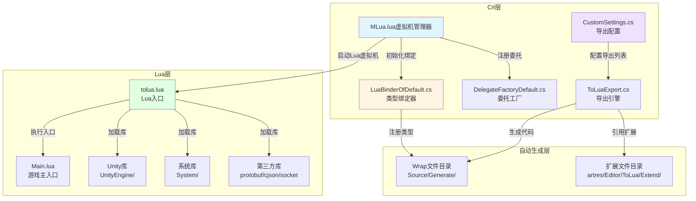

ToLua框架是本项目实现C#与Lua混合开发的核心桥梁，通过自动生成Wrap层代码实现Lua对Unity API和业务代码的无缝调用。本文档将系统阐述ToLua框架的配置原理、类型绑定机制、扩展开发规范以及最佳实践，帮助开发者高效构建跨语言交互系统。

## 架构概览

ToLua框架采用分层架构设计，通过类型绑定器将C#类型映射到Lua虚拟机，使Lua脚本能够直接操作Unity对象和自定义业务类。框架核心由Lua虚拟机管理层、类型绑定层、委托转换层和Lua运行时库四个核心模块组成。



框架的初始化流程由MLua类统一管理，该类在Awake时注册到接口管理器，Init方法中完成LuaState创建、类型绑定、第三方库加载和Lua脚本执行。MLua通过调用LuaBinderOfDefault.Bind方法注册所有Wrap类型，调用DelegateFactoryDefault.Init方法建立委托转换映射，最终通过DoFile("Main.lua")启动Lua业务逻辑[Scripts/LuaEngine/MLua.cs#L1-L100]。

## 核心组件

### MLua虚拟机管理器

MLua作为Lua虚拟机的单例管理器，封装了LuaState的生命周期和跨语言调用接口。该类实现了IMLua接口，提供DoFile、DoString、Require等Lua执行方法，以及SendMessageToLua系列重载方法用于C#向Lua发送事件消息。MLua还通过LuaLooper组件集成到Unity主循环，确保Lua协程和垃圾回收正常工作[Scripts/LuaEngine/MLua.cs#L100-L200]。

MLua在Init方法中按照固定顺序初始化Lua环境：首先创建LuaState实例，然后依次绑定MoonCommonLib、Default、MoonClient三个程序集的Wrap类型和委托工厂，接着调用OpenLibs方法加载protobuf、lpeg、cjson、socket等第三方Lua库，最后通过LuaCoroutine.Register注册协程支持并执行Main.lua脚本[Scripts/LuaEngine/MLua.cs#L100-L150]。

### 类型绑定系统

类型绑定系统由配置类、导出引擎和生成代码三部分组成。CustomSettings.cs作为核心配置文件，定义了Default、MoonClient、MoonCommonLib三个程序集的导出设置，每个ExportSetting包含类型列表、委托列表和静态类类型等配置信息。通过ExportSettings字典可以访问不同程序集的导出配置，通过TypeMapAssemblies指定类型映射的源程序集[artres/Editor/ToLua/CustomSettings.cs#L1-L150]。

ToLuaExport.cs是自动生成Wrap代码的引擎，它通过反射分析Type的成员信息，生成对应Wrap类的Register方法、属性访问器和方法包装函数。生成的Wrap文件命名规则为"完整类名_Wrap.cs"，如TMPro_TextMeshProUGUIWrap.cs，每个Wrap类包含静态Register方法用于将C#类型注册到Lua虚拟机[artres/Editor/ToLua/ToLuaExport.cs#L1-L100]。

LuaBinderOfDefault.cs是自动生成的类型绑定器，在Bind方法中按命名空间顺序调用所有Wrap类的Register方法，并使用RegFunction注册委托类型。该方法会记录注册耗时并输出到控制台，便于性能分析[Source/Generate/LuaBinderOfDefault.cs#L1-L100]。

### 委托转换系统

委托转换系统解决了Lua函数作为C#回调参数的问题。DelegateFactoryDefault.cs维护了Type到DelegateCreate的字典映射，在Init方法中注册所有需要支持的委托类型，包括System.Action、UnityAction、TMPro.TMP_InputField.OnValidateInput等常用委托。每种委托都实现三个方法：委托创建方法（如System_Action）、类型检查方法（如Check_System_Action）和栈操作方法（如Push_System_Action）[Source/Generate/DelegateFactoryDefault.cs#L1-L80]。

当C#代码需要将Lua函数转换为委托时，通过DelegateFactoryOfDefault.dict[type]获取对应的创建方法，传入LuaFunction对象即可生成C#委托实例。这种机制使得Lua代码能够无缝订阅Unity事件和回调。

## 配置方法

### 基础类型导出配置

要导出一个C#类型到Lua，需要在CustomSettings.cs中对应的ExportSetting的customTypeList中添加LuaBindType实例。LuaBindType封装了类型信息、基类型、命名空间、Wrap类名等配置。例如导出TextMeshProUGUI类型的配置：

```csharp
new LuaBindType(typeof(TMPro.TextMeshProUGUI))
{
    NameSpace = "TMPro",
    WrapName = "TMPro_TextMeshProUGUI",
    BaseType = typeof(TMPro.TMP_Text)
}
```

配置完成后，通过Unity编辑器菜单"Lua → Gen Lua Wrap Files"触发ToLuaMenu.GenerateAll方法，ToLuaExport引擎会自动分析类型成员并生成对应的Wrap文件到Source/Generate目录[artres/Editor/ToLua/ToLuaMenu.cs#L800-L900]。

### 委托类型导出配置

导出委托类型需要在ExportSetting的delegateList中添加LuaDelegateType实例。LuaDelegateType包含SelfType（委托类型）和Abr（简称）两个属性。简称用于在Lua中注册的函数名，可以简化复杂的泛型委托名称。例如配置OnValidateInput委托：

```csharp
new LuaDelegateType(typeof(TMPro.TMP_InputField.OnValidateInput))
{
    Abr = "OnValidateInput"
}
```

委托导出后会自动在DelegateFactoryDefault.cs中生成对应的转换方法和类型检查代码。配置完成后同样需要重新生成Wrap文件。

### 扩展方法配置

对于Unity内置类型或需要特殊处理的类型，可以通过手写扩展文件来自定义行为。扩展文件位于artres/Editor/ToLua/Extend/目录，命名规则为"ToLua_完整类名.cs"。例如ToLua_UnityEngine_GameObject.cs扩展了GameObject的SendMessage方法，提供了错误处理和性能统计功能[artres/Editor/ToLua/Extend/ToLua_UnityEngine_GameObject.cs#L1-L80]。

扩展文件通过静态方法和字符串模板定义自定义实现，导出引擎会优先使用扩展定义覆盖自动生成逻辑。这种方式适合处理Unity的变长参数方法、异步调用等复杂场景。

### 第三方库配置

MLua在OpenLibs方法中集成了多个第三方Lua库，包括protobuf（协议序列化）、lpeg（模式匹配）、cjson（JSON处理）、socket（网络通信）等。每个库通过LuaDLL.luaopen_xxx函数加载并注册到Lua全局表[Scripts/LuaEngine/MLua.cs#L150-L180]。

cjson库的特殊处理在于它只创建了table对象，需要手动注册到_LOADED表中。socket库通过BeginPreLoad/RegFunction/EndPreLoad机制实现延迟加载，避免在不需要网络功能的平台加载不必要的代码。

## 使用规范

### Lua端调用C#方法

Lua端通过require加载对应的Wrap模块后，即可直接调用C#实例的方法和访问属性。例如调用TextMeshProUGUI的方法：

```lua
local textMeshPro = self.gameObject:GetComponent("TMPro.TextMeshProUGUI")
textMeshPro:ForceMeshUpdate()
textMeshPro.text = "Hello ToLua"
```

所有C#方法在Lua中都使用冒号语法（obj:method()）调用，这样Lua会自动将obj作为第一个参数传递，符合面向对象的调用习惯。静态方法使用点语法（Class.method()）调用。

### C#端调用Lua函数

C#端通过MLua的SendMessageToLua系列方法向Lua发送事件，消息统一路由到MUIEvent.ReceiveCSharpMessage处理。例如发送无参数事件：

```csharp
MLua.instance.SendMessageToLua("OnGameStart");
```

发送带参数事件：

```csharp
MLua.instance.SendMessageToLua("OnPlayerLevelUp", level, exp);
```

Lua端需要在MUIEvent模块中实现ReceiveCSharpMessage方法，根据eventName分发到具体的处理函数。这种事件驱动机制实现了C#到Lua的单向通信。

### 委托和回调处理

当需要将Lua函数作为回调传递给C#时，可以通过委托工厂自动转换。例如设置按钮点击回调：

```lua
local btn = self.transform:Find("Button"):GetComponent("UnityEngine.UI.Button")
btn.onClick:AddListener(function()
    print("Button clicked")
end)
```

系统会自动识别UnityAction委托类型，将Lua函数包装为C#委托。对于自定义委托，需要确保在CustomSettings中配置了对应的LuaDelegateType。

### 协程使用

ToLua框架通过LuaCoroutine注册了协程支持，Lua代码可以使用coroutine.create、coroutine.resume等标准协程API。协程在LuaLooper组件的Update中驱动，与Unity主循环保持同步。例如延迟执行：

```lua
coroutine.start(function()
    coroutine.wait(1.0)
    print("1 second later")
end)
```

注意Lua协程不能直接yield Unity的YieldInstruction，需要通过封装的wait系列方法实现。

## 性能优化建议

### 类型绑定优化

类型绑定过程在LuaBinderOfDefault.Bind中执行，会记录注册耗时。对于类型数量较多的项目，建议将不常用的类型按需加载，减少启动时间。可以通过ExportSetting的DynamicList实现延迟加载，只在首次使用时生成Wrap代码[artres/Editor/ToLua/ToLuaMenu.cs#L800-L850]。

避免导出Unity内部使用但Lua不需要的类型，如Component基类在CustomSettings中被排除在导出列表之外[artres/Editor/ToLua/CustomSettings.cs#L35-L40]。合理使用ToLuaMenu的dropType列表过滤不必要导出的类型。

### 内存管理优化

Lua垃圾回收参数在Main.lua中配置为setpause=100、setstepmul=5000，平衡了回收频率和性能[Scripts/Lua/Main.lua#L1-L10]。频繁创建销毁C#对象时，建议在Lua端使用对象池模式，减少GC压力。

通过MLua.GetMemorySize()可以监控Lua虚拟机的内存使用量，建议在开发阶段定期检查内存泄漏。LuaProfiler工具提供了采样分析功能，可以在Unity Profiler中查看Lua函数的调用栈和耗时[Scripts/LuaEngine/LuaProfiler.cs#L1-L51]。

### 跨语言调用优化

C#到Lua的调用通过SendMessageToLua实现，字符串事件名需要经过哈希查找。高频调用的场景建议改用直接的LuaFunction调用，避免消息路由开销。缓存频繁使用的LuaTable和LuaFunction对象，减少GetTable和GetFunction的调用次数。

Lua到C#的调用通过Wrap层的静态方法实现，方法查找和类型转换有一定开销。将性能敏感的逻辑保持在C#层，Lua层主要负责流程控制和UI表现。

## 常见问题排查

### Wrap生成失败

Wrap生成失败通常由类型依赖问题引起。错误信息会提示缺少的基类型或委托类型，确保所有依赖类型都在CustomSettings中正确配置。对于Unity内置类型，检查是否在ToLuaMenu.baseType中定义[artres/Editor/ToLua/ToLuaMenu.cs#L60-L90]。

生成的Wrap文件位于Source/Generate目录，手动检查代码是否完整。如有编译错误，可能是类型成员在生成后发生了变化，需要重新导出。

### 类型查找失败

Lua端报错"attempt to index a nil value"通常是因为类型未正确注册。检查LuaBinderOfDefault.Bind是否被调用，对应的Wrap文件是否生成。使用tolua.typeof可以验证类型是否成功注册。

对于嵌套类型或泛型类型，Lua中的完整路径需要使用下划线分隔命名空间，如"TMPro.TMP_InputField"在Lua中访问为"TMPro.TMP_InputField"。

### 委托转换失败

委托转换失败报错"no matching overload"通常是因为未在CustomSettings中配置对应的LuaDelegateType。检查DelegateFactoryDefault.cs中是否生成了对应的注册代码，确保委托的参数类型完全匹配。

对于变长参数委托，需要通过扩展文件手写实现，自动生成的Wrap代码不支持params参数。

## 进阶主题

### 自定义导出设置

项目支持多程序集导出配置，每个ExportSetting可以独立配置类型列表和导出路径。通过继承BaseExportSetting可以创建自定义配置类，如MoonClientExportSettings和CommonLibExportSetting。这种方式支持模块化开发，不同团队维护各自程序集的导出配置。

配置类需要重写GetCustomTypeList方法返回LuaBindType列表，重写GetDelegateList方法返回LuaDelegateType列表。ExportSettings字典将配置名映射到配置实例，ToLuaMenu通过配置名批量生成Wrap文件。

### JIT编译控制

tolua.lua在启动时会检查LuaJIT版本并根据条件关闭JIT编译[Scripts/LuaEngine/ToLua/Lua/tolua.lua#L1-L20]。关闭JIT是为了避免JIT编译器与Unity IL2CPP等代码裁剪技术的兼容性问题。对于纯Lua平台（如移动设备），可以在条件编译中启用JIT以提升性能。

jit.off()和jit.flush()会完全禁用JIT并清除所有已编译的代码。如果需要启用JIT，需要注释掉这两行代码并根据平台调整jit.opt.start参数。

### 调试支持

框架集成了LuaInterface.Debugger，通过设置DebugServerIp变量可以启用远程调试。调试器需要ZeroBrane Studio或其他兼容的Lua IDE配合使用。调试模式下，Lua虚拟机会暂停等待IDE连接，便于断点调试和变量检查。

LuaProfiler提供了Unity Profiler集成，通过BeginSample和EndSample方法将Lua执行过程纳入Unity性能分析。这对定位Lua代码的性能瓶颈非常有帮助。

## 下一步学习

掌握ToLua框架的基础配置和使用后，建议继续学习以下相关主题以深入理解整个混合开发架构：

- [Lua虚拟机生命周期管理](8-luaxu-ni-ji-sheng-ming-zhou-qi-guan-li) - 了解Lua虚拟机的创建、初始化、销毁完整流程，以及内存管理和垃圾回收机制
- [Lua与C#交互桥接](9-luayu-c-jiao-hu-qiao-jie) - 深入学习跨语言调用的底层实现，包括参数传递、返回值处理、异常传播等细节
- [项目架构总览](5-xiang-mu-jia-gou-zong-lan) - 从全局视角理解ToLua框架在整个项目架构中的定位和作用
- [C#与Lua混合开发模式](6-c-yu-luahun-he-kai-fa-mo-shi) - 掌握混合开发的最佳实践，包括职责划分、性能优化、调试技巧等

通过系统学习这些主题，你将能够充分发挥ToLua框架的优势，构建高效、可维护的混合开发项目。