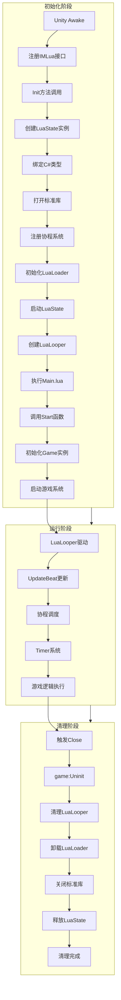
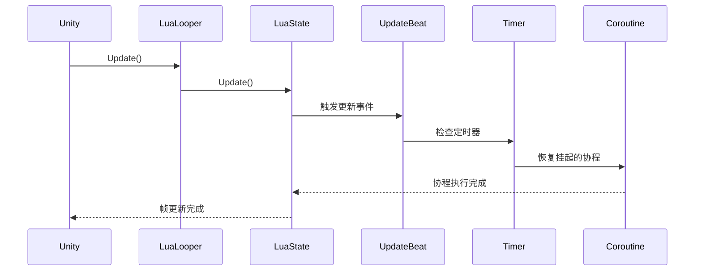

本文档详细阐述了项目中Lua虚拟机的完整生命周期管理机制，包括初始化、运行时维护和清理三个核心阶段。Lua虚拟机作为游戏逻辑的执行环境，其生命周期管理直接影响游戏性能和稳定性。通过深入分析MLua.cs和Main.lua的实现，本页将帮助您理解C#与Lua的协同工作方式，以及虚拟机在游戏运行过程中的状态转换。

## 生命周期概览

Lua虚拟机的生命周期分为三个明确阶段：**初始化阶段**、**运行阶段**和**清理阶段**。整个过程由C#的MLua组件统一管理，Lua脚本通过Main.lua的Start()和Close()函数配合完成初始化和清理工作。下图展示了完整的生命周期流程及其关键组件交互关系。



Sources: [MLua.cs](Scripts/LuaEngine/MLua.cs#L26-L30), [Main.lua](Scripts/Lua/Main.lua#L421-L424)

## 初始化阶段

### C#层初始化流程

MLua组件作为Lua虚拟机的C#封装，在Unity的Awake阶段完成接口注册，并通过Init()方法执行完整的初始化流程。初始化步骤具有严格的依赖关系，必须按照特定顺序执行。

**步骤1：创建LuaState实例**  
LuaState是ToLua框架提供的核心类，代表一个独立的Lua虚拟机实例。创建时，系统会分配Lua堆栈内存并初始化基础运行时环境。

**步骤2：绑定C#类型**  
通过LuaBinder将C#类型和方法注册到Lua虚拟机中，使Lua脚本能够调用C#功能。项目中使用三个主要的Binder：LuaBinderOfMoonCommonLib、LuaBinderOfDefault和MoonClientBridge。

**步骤3：打开标准库和第三方库**  
初始化阶段会加载多个Lua库以满足游戏需求：

| 库名称 | 功能描述 | 平台依赖 |
|--------|----------|----------|
| protobuf | Protobuf协议编解码 | 全平台 |
| cjson | JSON序列化/反序列化 | 全平台 |
| lpeg | 模式匹配库 | 全平台 |
| bit | 位运算库 | 全平台 |
| socket.core | 网络通信库 | 编辑器/Android |
| mime.core | MIME编码库 | 编辑器/Android |

**步骤4：注册协程系统**  
LuaCoroutine.Register()将C#的协程管理机制注册到Lua中，支持协程的创建、挂起和恢复操作。

**步骤5：启动LuaLooper**  
LuaLooper是Unity的MonoBehaviour组件，负责每帧调用Lua虚拟机的更新函数，确保协程和定时器正常工作。

Sources: [MLua.cs](Scripts/LuaEngine/MLua.cs#L33-L61), [MLua.cs](Scripts/LuaEngine/MLua.cs#L63-L87)

### Lua层初始化流程

Main.lua是Lua逻辑的入口文件，通过Start()函数执行Lua层的初始化工作。

**预加载配表**  
PrepairTable()函数声明了数百个配表名称，通过MPreloadConfig:PreloadTables()批量加载游戏配表数据。

**预加载Lua模块**  
PreloadCommonLua()和PreloadBigLua()函数分别预加载通用模块和大体积模块，避免运行时的性能峰值。这些模块包括：

- 核心框架：Game、GameEnum、Event系统
- 管理器：UIMgr、MgrMgr、DataMgr
- 网络层：Network_Init
- 系统模块：RoleInfoMgr、TaskMgr、ChatMgr等

**初始化Game实例**  
创建全局的game实例并调用Init()方法，该方法依次初始化网络、UI、管理器等核心系统，最后将Update方法注册到UpdateBeat事件中，实现每帧更新。

Sources: [Main.lua](Scripts/Lua/Main.lua#L427-L470), [Game.lua](Scripts/Lua/Game.lua#L13-L21)

## 运行阶段

### LuaLooper驱动机制

LuaLooper组件在每一帧都会调用Lua虚拟机的Update方法，驱动协程调度和定时器系统。这是Lua虚拟机能够持续运行的基础。



Sources: [MLua.cs](Scripts/LuaEngine/MLua.cs#L89-L91)

### 定时器系统

项目实现了三种定时器类型，满足不同的时间控制需求：

| 定时器类型 | 基准时间 | 典型用途 |
|------------|----------|----------|
| Timer | Time.deltaTime/unscaledDeltaTime | UI动画、延时操作 |
| FrameTimer | 帧计数 | 帧同步操作、分帧处理 |
| CoTimer | Time.deltaTime（协程专用） | 协程中的等待逻辑 |

定时器通过UpdateBeat事件系统驱动，Start()方法将Update函数注册到事件中，Stop()方法移除注册。这种设计避免了每帧遍历所有定时器的性能开销。

Sources: [Timer.lua](Scripts/LuaEngine/ToLua/Lua/System/Timer.lua#L13-L193)

### 协程系统

Lua协程系统通过扩展标准coroutine库实现，提供了与Unity协程类似的API：

- **coroutine.start(f, ...)**：创建并启动新协程
- **coroutine.wait(t, co, ...)**：等待指定秒数
- **coroutine.step(t, co, ...)**：等待指定帧数
- **coroutine.www(www, co)**：等待WWW异步操作
- **coroutine.stop(co)**：停止指定协程

协程的挂起通过yield()实现，恢复则通过FrameTimer或CoTimer触发。comap弱引用表用于维护协程与定时器的映射关系，确保协程停止时能正确清理定时器资源。

Sources: [coroutine.lua](Scripts/LuaEngine/ToLua/Lua/System/coroutine.lua#L13-L123)

### 垃圾回收配置

Main.lua在启动时配置了Lua垃圾回收器参数：

```lua
collectgarbage("setpause", 100)   -- 垃圾回收器暂停倍率
collectgarbage("setstepmul", 5000) -- 垃圾回收器步进倍率
```

这些参数决定了垃圾回收器的触发频率和回收强度，需要在内存占用和CPU开销之间取得平衡。

Sources: [Main.lua](Scripts/Lua/Main.lua#L1-L2)

## 清理阶段

### 清理流程

当游戏退出或需要重建Lua环境时，MLua.Uninit()方法执行清理操作。清理顺序与初始化顺序相反，确保资源正确释放。

**步骤1：调用Lua层Close函数**  
通过CallFunc("Close")触发Main.lua中定义的Close函数，该函数调用game:Uninit()清理Lua层的管理器和系统。

**步骤2：销毁LuaLooper**  
_looper.Destroy()停止并移除LuaLooper组件，中断帧更新循环。

**步骤3：卸载LuaLoader**  
_loader.Uninit()清理Lua加载器相关资源。

**步骤4：关闭标准库**  
通过LuaDLL.toluas_closeint64和toluas_closeuint64关闭64位整数类型支持，释放相关内存。

**步骤5：释放LuaState**  
_lua.Dispose()彻底销毁Lua虚拟机实例，回收所有Lua堆栈内存。

Sources: [MLua.cs](Scripts/LuaEngine/MLua.cs#L1071-L1098), [Main.lua](Scripts/Lua/Main.lua#L490-L494)

### Lua层清理

Game:Uninit()方法负责清理Lua层的管理器系统：

- UIMgr:Uninit() - 清理UI管理器
- MgrMgr:Uninit() - 清理模块管理器
- self.authMgr:OnUninit() - 清理认证管理器

这些管理器会依次清理各自的子模块和资源，确保没有遗留的引用。

Sources: [Game.lua](Scripts/Lua/Game.lua#L23-L30)

## 性能优化要点

### 内存管理

Lua虚拟机的内存占用需要持续监控。MLua.GetMemorySize()方法可以获取当前Lua堆栈的内存使用量，建议在关键节点调用LuaGC()手动触发垃圾回收。

```csharp
// 获取内存大小
int memorySize = _lua.GetMemorySize();

// 手动触发垃圾回收
_lua.LuaGC(LuaGCOptions.LUA_GCCOLLECT);
```

Sources: [MLua.cs](Scripts/LuaEngine/MLua.cs#L1026-L1033)

### 性能分析

LuaProfiler为编辑器环境提供了性能分析工具，通过Unity Profiler集成Lua函数的执行时间统计。使用Conditional("UNITY_EDITOR")特性确保发布版本中不包含性能分析代码。

Sources: [LuaProfiler.cs](Scripts/LuaEngine/LuaProfiler.cs#L1-L51)

### 协程管理

协程使用完毕后必须调用coroutine.stop()显式停止，否则定时器会持续运行导致内存泄漏。建议使用MgrMgr中的CoroutineMgr统一管理协程生命周期。

Sources: [Main.lua](Scripts/Lua/Main.lua#L554-L559)

## 常见问题与排查

### 问题：Lua虚拟机未初始化

**现象**：调用Lua函数时出现null引用异常  
**原因**：Init()方法未被调用或调用失败  
**解决**：检查MLua.Inited标志，确保在调用Lua代码前初始化完成

### 问题：协程不执行

**现象**：使用coroutine.start()或coroutine.wait()后协程没有响应  
**原因**：LuaLooper未正确启动或已销毁  
**解决**：确认_looper组件存在且未调用Destroy()，检查StartLooper()是否被调用

### 问题：内存持续增长

**现象**：Lua堆栈内存持续增加，GC后不释放  
**原因**：协程未停止、定时器未清理、全局引用未释放  
**解决**：使用coroutine.stop()停止所有协程，检查UpdateBeat事件是否正确移除

### 问题：场景切换后Lua状态异常

**现象**：场景切换后Lua变量丢失或行为异常  
**原因**：OnLevelWasLoaded()中调用了collectgarbage("collect")，过度回收  
**解决**：调整垃圾回收策略，避免在场景切换时强制GC

Sources: [Main.lua](Scripts/Lua/Main.lua#L486-L490)

## 最佳实践

1. **初始化顺序**：确保C#层完全初始化后再执行Lua层代码，通过Inited标志检查初始化状态

2. **资源释放**：创建的LuaFunction、LuaTable等对象使用后及时Dispose，避免内存泄漏

3. **协程管理**：使用CoroutineMgr统一管理协程，避免直接操作底层协程API

4. **垃圾回收**：在场景切换、UI关闭等关键节点手动触发GC，避免内存峰值

5. **错误处理**：在Lua代码中使用pcall包裹可能出错的操作，C#层使用try-catch捕获Lua异常

Sources: [MLua.cs](Scripts/LuaEngine/MLua.cs#L1077-L1084)

## 扩展阅读

理解Lua虚拟机生命周期后，您可以进一步学习以下内容：

- [Lua与C#交互桥接](9-luayu-c-jiao-hu-qiao-jie) - 了解C#与Lua之间的数据交换和函数调用机制
- [ToLua框架配置与使用](7-toluakuang-jia-pei-zhi-yu-shi-yong) - 深入学习ToLua框架的配置和高级特性
- [网络层架构与消息处理](11-wang-luo-ceng-jia-gou-yu-xiao-xi-chu-li) - 了解网络消息如何在Lua中处理和分发
- [UI框架设计](12-uikuang-jia-she-ji-ctrl-handler-panel-template) - 学习Lua驱动的UI系统架构