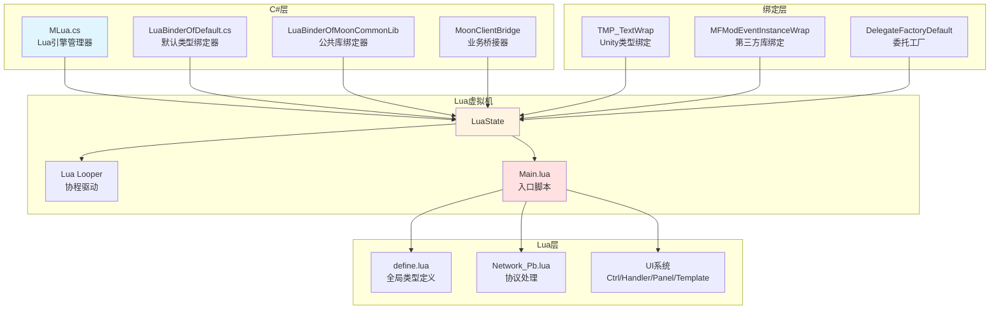
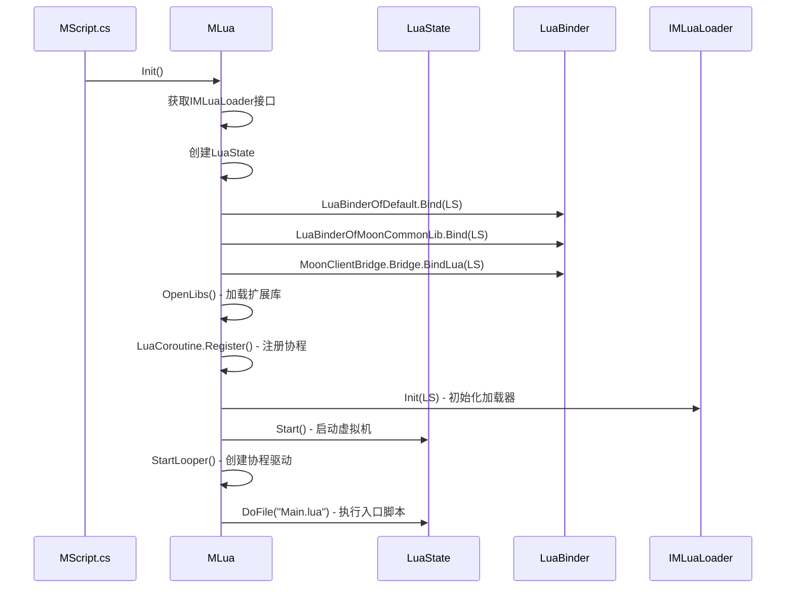

本页面详细阐述项目基于ToLua框架实现的Lua与C#混合编程架构，涵盖类型绑定机制、双向通信模式、扩展库集成及性能优化策略。

## 架构概览

项目采用ToLua框架作为Lua与C#交互的核心桥接层，通过自动生成的Wrap类实现C#类型到Lua虚拟机的注册，同时提供灵活的双向通信接口。该架构支持Unity引擎类型、第三方库类型及自定义业务类型的完整绑定，为热更新和快速迭代提供坚实基础。



### 核心组件职责

| 组件 | 职责 | 关键文件 |
|------|------|----------|
| **Lua引擎管理器** | LuaState生命周期管理、扩展库加载、协程注册 | [MLua.cs](Scripts/LuaEngine/MLua.cs#L1-L50) |
| **类型绑定器** | 批量注册C#类型到Lua虚拟机 | [LuaBinderOfDefault.cs](Source/Generate/LuaBinderOfDefault.cs#L1-L50) |
| **Wrap类** | 单个C#类的Lua封装，提供方法和属性访问 | [TMPro_TMP_TextWrap.cs](Source/Generate/TMPro_TMP_TextWrap.cs#L1-L50) |
| **委托工厂** | C#委托类型与Lua函数的转换桥梁 | [DelegateFactoryDefault.cs](Source/Generate/DelegateFactoryDefault.cs) |
| **Lua加载器** | Lua文件的加载和require机制 | IMLuaLoader接口实现 |

Sources: [MLua.cs](Scripts/LuaEngine/MLua.cs#L30-L50), [LuaBinderOfDefault.cs](Source/Generate/LuaBinderOfDefault.cs#L1-L50)

## ToLua绑定机制

ToLua框架通过代码生成技术，自动将C#类、结构体、枚举、方法、属性、委托等元素映射为Lua可访问的API。

### 类型注册流程

Wrap类的`Register`方法是类型注册的核心入口，它按层次结构组织Lua命名空间并注册类成员。

```csharp
public static void Register(LuaState L)
{
    L.BeginClass(typeof(TMPro.TMP_Text), typeof(UnityEngine.UI.MaskableGraphic));
    L.RegFunction("ForceMeshUpdate", ForceMeshUpdate);
    L.RegFunction("UpdateGeometry", UpdateGeometry);
    L.RegVar("text", get_text, set_text);
    L.RegVar("fontSize", get_fontSize, set_fontSize);
    L.RegFunction("__tostring", ToLua.op_ToString);
    L.EndClass();
}
```

**绑定层次示例**：
- `UnityEngine.GameObject` → Lua全局表`GameObject`
- `TMPro.TMP_Text` → `TMPro.TMP_Text`（嵌套在TMPro命名空间）
- `MoonClient.MPlayerInfo` → `MPlayerInfo`（通过define.lua简化访问）

Sources: [TMPro_TMP_TextWrap.cs](Source/Generate/TMPro_TMP_TextWrap.cs#L8-L111), [define.lua](Scripts/Lua/Common/define.lua#L1-L100)

### 方法绑定与参数转换

每个C#方法都对应一个静态的C#函数，使用`[MonoPInvokeCallback]`特性标记，通过P/Invoke机制被Lua调用。

```csharp
[MonoPInvokeCallbackAttribute(typeof(LuaCSFunction))]
static int ForceMeshUpdate(IntPtr L)
{
    try
    {
        int count = LuaDLL.lua_gettop(L);
        
        if (count == 1)
        {
            TMP_Text obj = (TMP_Text)ToLua.CheckObject<TMP_Text>(L, 1);
            obj.ForceMeshUpdate();
            return 0;
        }
        else if (count == 2)
        {
            TMP_Text obj = (TMP_Text)ToLua.CheckObject<TMP_Text>(L, 1);
            bool arg0 = LuaDLL.luaL_checkboolean(L, 2);
            obj.ForceMeshUpdate(arg0);
            return 0;
        }
        // ...更多重载处理
    }
    catch (Exception e)
    {
        return LuaDLL.toluaL_exception(L, e);
    }
}
```

**参数类型映射规则**：
- `bool` ↔ Lua布尔值
- `int/float/double` ↔ Lua数字
- `string` ↔ Lua字符串
- `UnityEngine.Object`子类 ↔ Lua userdata（通过ToLua.CheckObject获取）
- `enum` ↔ Lua数字（自动转换）
- `System.Action`/`Func` ↔ Lua函数（通过委托工厂转换）

Sources: [TMPro_TMP_TextWrap.cs](Source/Generate/TMPro_TMP_TextWrap.cs#L115-L143), [LuaBinderOfDefault.cs](Source/Generate/LuaBinderOfDefault.cs#L35-L80)

### 委托与事件绑定

C#委托类型通过委托工厂实现与Lua函数的双向绑定，支持回调机制的完整映射。

```csharp
[MonoPInvokeCallbackAttribute(typeof(LuaCSFunction))]
static int DG_Tweening_TweenCallback(IntPtr L)
{
    try
    {
        int count = LuaDLL.lua_gettop(L);
        LuaFunction func = ToLua.CheckLuaFunction(L, 1);

        if (count == 1)
        {
            Delegate arg1 = DelegateTraits<DG.Tweening.TweenCallback>.Create(func);
            ToLua.Push(L, arg1);
        }
        else
        {
            LuaTable self = ToLua.CheckLuaTable(L, 2);
            Delegate arg1 = DelegateTraits<DG.Tweening.TweenCallback>.Create(func, self);
            ToLua.Push(L, arg1);
        }
        return 1;
    }
    catch(Exception e)
    {
        return LuaDLL.toluaL_exception(L, e);
    }
}
```

这种机制允许Lua代码将函数作为参数传递给C# API，例如DOTween动画回调、Unity事件等。

Sources: [LuaBinderOfDefault.cs](Source/Generate/LuaBinderOfDefault.cs#L35-L80), [MFModEventInstanceWrap.cs](Source/Generate/MFModEventInstanceWrap.cs#L1-L50)

## 双向通信机制

架构提供完整的C#到Lua和Lua到C#的双向通信能力，支持方法调用、属性访问、消息传递等多种交互模式。

### C#调用Lua

MLua类封装了多种C#调用Lua的接口，适应不同的使用场景。

| 方法 | 用途 | 示例 |
|------|------|------|
| `DoFile(filename)` | 执行Lua文件 | `DoFile("Main.lua")` |
| `DoString<T>(script, chunkName)` | 执行Lua字符串并返回结果 | `DoString<int>("return 1 + 1")` |
| `Require(filename)` | 模块化加载（仅执行一次） | `Require("Common/Utils")` |
| `GetTable(fullPath)` | 获取Lua表 | `GetTable("MUIEvent", false)` |

```csharp
// 执行Lua文件
DoFile("Main.lua");

// 执行Lua字符串
string result = DoString<string>("return Lang('PLAYER_NAME')");

// 调用Lua表方法
CallTableFunc<string>(null, "MUIEvent.ReceiveCSharpMessage", "OnBattleEnd");
```

Sources: [MLua.cs](Scripts/LuaEngine/MLua.cs#L100-L140), [Main.lua](Scripts/Lua/Main.lua#L1-L50)

### C#向Lua发送消息

MLua提供了重载的`SendMessageToLua`方法系列，支持最多7个参数的传递，统一通过`MUIEvent.ReceiveCSharpMessage`路由。

```csharp
// 无参消息
SendMessageToLua("OnGamePause");

// 单参消息
SendMessageToLua("OnPlayerLevelUp", 50);

// 多参消息
SendMessageToLua("OnItemGain", itemId, count, quality);

// 带返回值的消息
bool result = SendMessageToLua<bool, string>("CanEnterDungeon", dungeonId);
```

**Lua端处理**：
```lua
function MUIEvent.ReceiveCSharpMessage(eventName, ...)
    if eventName == "OnPlayerLevelUp" then
        local level = ...
        MEventMgr:DispatchEvent(MEventType.LevelUp, level)
    elseif eventName == "OnItemGain" then
        local itemId, count, quality = ...
        -- 处理物品获得
    end
end
```

Sources: [MLua.cs](Scripts/LuaEngine/MLua.cs#L145-L220), [Utils.lua](Scripts/Lua/Common/Utils.lua#L1-L100)

### Lua调用C#

Lua代码通过已绑定的类型直接调用C# API，使用方式与原生Lua代码无差异。

```lua
-- 调用Unity API
local go = GameObject.Find("Player")
go.transform.position = Vector3(0, 1, 0)

-- 调用自定义C#类
MUIManager:OpenPanel("BagPanel")
MResLoader:LoadAssetAsync("UI/Prefab/BagPanel.prefab", function(obj)
    -- 加载完成回调
end)

-- 访问C#属性
local text = MPlayerInfo.PlayerName
MPlayerInfo.Gold = MPlayerInfo.Gold + 100
```

**define.lua全局别名**：
为简化Lua代码访问，define.lua将常用C#类型映射为简短的全局变量。

```lua
-- Unity类型
GameObject = UnityEngine.GameObject
Vector3 = UnityEngine.Vector3
Time = UnityEngine.Time

-- 业务单例
MUIManager = MoonClient.MUIManager.singleton
MPlayerInfo = MoonClient.MPlayerInfo.singleton
MNetClient = MoonClient.MNetClient.singleton
```

Sources: [define.lua](Scripts/Lua/Common/define.lua#L1-L100), [MLua.cs](Scripts/LuaEngine/MLua.cs#L50-L100)

## Lua虚拟机生命周期管理

Lua虚拟机的生命周期由MLua组件统一管理，遵循Unity的游戏生命周期模式。

### 初始化流程



### 扩展库集成

Lua虚拟机初始化时会加载多个扩展库，增强Lua功能。

| 库名称 | 功能 | 平台支持 |
|--------|------|----------|
| **pb/pb_new** | Protobuf协议编解码 | 全平台 |
| **lpeg** | 模式匹配库 | 全平台 |
| **bit** | 位运算库 | 全平台 |
| **cjson/cjson_safe** | JSON编解码 | 全平台 |
| **socket.core/mime.core** | TCP/UDP网络通信 | Editor、Android |

```csharp
void OpenLibs()
{
    _lua.OpenLibs(LuaDLL.luaopen_pb);
    _lua.OpenLibs(LuaDLL.luaopen_lpeg);
    _lua.OpenLibs(LuaDLL.luaopen_bit);
    _lua.OpenLibs(LuaDLL.luaopen_cjson);
    
#if (UNITY_EDITOR && UNITY_STANDALONE) || UNITY_ANDROID
    OpenLuaSocket();
#endif
}
```

Sources: [MLua.cs](Scripts/LuaEngine/MLua.cs#L50-L90), [Network_Pb.lua](Scripts/Lua/Network/Network_Pb.lua#L1-L62)

### 协程支持

Lua协程通过LuaLooper组件与Unity的主循环集成，支持`coroutine.yield`等标准Lua协程操作。

```csharp
void StartLooper()
{
    _looper = gameObject.AddComponent<LuaLooper>();
    _looper.luaState = _lua;
}

// LuaCoroutine.Register()注册协程函数到Lua虚拟机
```

**Lua端协程使用**：
```lua
coroutine.start(function()
    while true do
        coroutine.wait(1.0) -- 等待1秒
        MEventMgr:DispatchEvent(MEventType.Tick)
    end
end)
```

Sources: [MLua.cs](Scripts/LuaEngine/MLua.cs#L90-L100), [Main.lua](Scripts/Lua/Main.lua#L1-L10)

## Protobuf协议集成

项目集成了轻量级Protobuf Lua库，实现高效的二进制协议编解码。

### 协议编解码机制

```lua
local pb = require "pb_new"
pb.option "enum_as_value"
pb.option "int64_as_string"
pb.option "use_default_values"

-- 加载协议定义
pb.loadfile(PathEx.GetBankPath("PB"))

-- 解码服务器消息
function ParseProtoBufToTable(msgName, datas)
    local pbTb = pb.decode("KKSG." .. msgName, datas)
    setmetatable(pbTb, closeNewIndexMetaTable)
    return pbTb
end

-- 创建发送消息
function GetProtoBufSendTable(msgName)
    local result = pb.decode("KKSG." .. msgName, "", {})
    result.___MSG_NAME = msgName
    setmetatable(result, sendProtoBufMT)
    return result
end

-- 序列化发送
local msg = GetProtoBufSendTable("LoginReq")
msg.account = "player1"
msg.password = "123456"
local data = msg:SerializeToString()
```

**元表保护**：
使用`closeNewIndexMetaTable`防止误修改已解码的协议数据。

Sources: [Network_Pb.lua](Scripts/Lua/Network/Network_Pb.lua#L1-L62)

## 性能优化策略

### 对象池管理

Protobuf协议对象使用对象池复用，减少GC压力。

```lua
local cache = {}

function RecycleProtoBuf(msgData)
    if not msgData then return end
    -- 清空字段
    for k, _ in pairs(msgData) do
        msgData[k] = nil
    end
    setmetatable(msgData, nil)
    -- 回收到缓存池
    cache[#cache + 1] = msgData
end
```

### Lua垃圾回收调优

Main.lua中配置了合理的GC参数，平衡内存占用和性能。

```lua
-- 设置GC参数
collectgarbage("setpause", 100)  -- 内存增长100%后触发GC
collectgarbage("setstepmul", 5000)  -- GC步进倍率5000%
```

### 绑定代码生成优化

Wrap类使用`[MonoPInvokeCallback]`和静态函数，避免反射调用，提升调用性能。

```csharp
[MonoPInvokeCallbackAttribute(typeof(LuaCSFunction))]
static int UpdateGeometry(IntPtr L)
{
    // 直接调用，无反射开销
    ToLua.CheckArgsCount(L, 3);
    TMP_Text obj = (TMP_Text)ToLua.CheckObject<TMP_Text>(L, 1);
    // ...参数处理
}
```

Sources: [Main.lua](Scripts/Lua/Main.lua#L1-L10), [Network_Pb.lua](Scripts/Lua/Network/Network_Pb.lua#L45-L62), [TMPro_TMP_TextWrap.cs](Source/Generate/TMPro_TMP_TextWrap.cs#L146-L161)

## 类型映射表

完整的C#类型到Lua类型的映射规则。

| C#类型 | Lua类型 | 转换方法 | 示例 |
|--------|---------|----------|------|
| `bool` | `boolean` | LuaDLL.luaL_checkboolean | `arg0 = LuaDLL.luaL_checkboolean(L, 2)` |
| `byte/sbyte/short/ushort` | `number` | LuaDLL.luaL_checknumber | `arg0 = (int)LuaDLL.luaL_checknumber(L, 2)` |
| `int/uint/long/ulong` | `number/string` | LuaDLL.luaL_checknumber/ToLua.ToNumber | `arg0 = ToLua.CheckNumber(L, 2)` |
| `float/double` | `number` | LuaDLL.luaL_checknumber | `arg0 = (float)LuaDLL.luaL_checknumber(L, 2)` |
| `string` | `string` | ToLua.ToString | `arg0 = ToLua.ToString(L, 2)` |
| `enum` | `number` | ToLua.ToEnum | `arg0 = (MyEnum)ToLua.CheckObject(L, 2, typeof(MyEnum))` |
| `UnityEngine.Object` | `userdata` | ToLua.CheckObject | `obj = (GameObject)ToLua.CheckObject<GameObject>(L, 1)` |
| `Array` | `table` | ToLua.CheckObject | `arr = (int[])ToLua.CheckObject(L, 2, typeof(int[]))` |
| `List<T>` | `table` | ToLua.CheckObject | `list = ToLua.CheckObject(L, 2, typeof(List<int>))` |
| `delegate` | `function` | DelegateTraits.Create | `del = DelegateTraits<Action>.Create(func)` |

Sources: [TMPro_TMP_TextWrap.cs](Source/Generate/TMPro_TMP_TextWrap.cs#L115-L200), [LuaBinderOfDefault.cs](Source/Generate/LuaBinderOfDefault.cs#L35-L100)

## 调试与错误处理

### 异常捕获机制

所有Wrap方法都使用try-catch包裹，异常通过Lua的异常机制传递。

```csharp
[MonoPInvokeCallbackAttribute(typeof(LuaCSFunction))]
static int ForceMeshUpdate(IntPtr L)
{
    try
    {
        // 正常逻辑
        return 0;
    }
    catch (Exception e)
    {
        return LuaDLL.toluaL_exception(L, e);
    }
}
```

### 参数验证

Wrap类提供严格的参数数量和类型检查。

```csharp
// 检查参数数量
ToLua.CheckArgsCount(L, 3);

// 检查对象类型
TMP_Text obj = (TMP_Text)ToLua.CheckObject<TMP_Text>(L, 1);

// 检查可选参数
if (count == 2)
{
    bool arg0 = LuaDLL.luaL_checkboolean(L, 2);
    obj.ForceMeshUpdate(arg0);
}
```

Sources: [TMPro_TMP_TextWrap.cs](Source/Generate/TMPro_TMP_TextWrap.cs#L115-L143), [TMPro_TMP_TextWrap.cs](Source/Generate/TMPro_TMP_TextWrap.cs#L146-L161)

## 扩展与自定义

### 添加新的C#类型绑定

1. 在ToLua生成配置中添加类型
2. 运行代码生成工具
3. 在`LuaBinderOfDefault.Bind()`中注册

```csharp
public static void Bind(LuaState L)
{
    float t = Time.realtimeSinceStartup;
    L.BeginModule(null);
    // ...现有类型
    MyCustomTypeWrap.Register(L);  // 添加新类型
    L.EndModule();
    Debugger.Log("Register lua type cost time: {0}", Time.realtimeSinceStartup - t);
}
```

### 自定义Lua加载器

实现`IMLuaLoader`接口可自定义Lua文件加载逻辑，支持加密、远程加载等。

```csharp
public interface IMLuaLoader
{
    void Init(LuaState lua);
    byte[] LoadFile(string fileName);
}
```

Sources: [LuaBinderOfDefault.cs](Source/Generate/LuaBinderOfDefault.cs#L1-L50), [MLua.cs](Scripts/LuaEngine/MLua.cs#L30-L60)

## 最佳实践

### 内存管理

- 避免在Lua中频繁创建C#对象
- 使用对象池复用Protobuf消息对象
- 及时回收LuaTable和LuaFunction引用

### 性能优化

- 缓存常用的LuaTable引用，避免重复`GetTable`
- 批量操作减少跨边界调用次数
- 使用Lua的local变量缓存C#对象

### 代码组织

- Lua代码按功能模块化（UI/Network/Common等）
- 通过define.lua统一管理全局类型别名
- 使用MUIEvent系统统一处理C#到Lua的消息

```lua
-- 推荐：缓存引用
local MUIManager = MoonClient.MUIManager.singleton

-- 不推荐：每次都获取
function SomeMethod()
    local uiMgr = MoonClient.MUIManager.singleton  -- 避免重复获取
    uiMgr:OpenPanel("TestPanel")
end
```

Sources: [Main.lua](Scripts/Lua/Main.lua#L1-L50), [define.lua](Scripts/Lua/Common/define.lua#L1-L100), [Utils.lua](Scripts/Lua/Common/Utils.lua#L1-L100)

## 相关文档

要深入了解混合开发的其他方面，请参阅以下文档：

- [ToLua框架配置与使用](7-toluakuang-jia-pei-zhi-yu-shi-yong) - ToLua框架的详细配置和使用方法
- [Lua虚拟机生命周期管理](8-luaxu-ni-ji-sheng-ming-zhou-qi-guan-li) - Lua虚拟机的创建、销毁和状态管理
- [C#与Lua混合开发模式](6-c-yu-luahun-he-kai-fa-mo-shi) - 混合开发的整体架构和设计理念
- [Protobuf协议集成](10-protobufxie-yi-ji-cheng) - 网络协议的定义、生成和使用
- [UI框架设计](12-uikuang-jia-she-ji-ctrl-handler-panel-template) - 基于Lua的UI系统架构